# 用 WordPress 和盖茨比创建博客——第二部分

> 原文：<https://javascript.plainenglish.io/create-a-blog-with-wordpress-and-gatsby-part-2-6e6f121bc232?source=collection_archive---------5----------------------->

# 第 2 部分-连接

现在让我们回到我们在[第一部分](https://medium.com/@kaleighscruggs/create-a-blog-with-wordpress-and-gatsby-part-1-a4d78a93a28d)建立的盖茨比网站，把它连接到我们的 WordPress 网站上，并拉一些博客帖子！

# 盖茨比插件

在文本编辑器中打开 gatsby-config.js。

首先，我将编辑默认的`siteMetadata`使网站成为我自己的网站:

有这么多了不起的盖茨比插件，但是为了这个教程，我们将只安装我们需要连接 WordPress 的东西。

通常我会安装 [gatsby-source-wordpress 插件](https://www.gatsbyjs.org/packages/gatsby-source-wordpress/)，但是因为它很快就会更新，让我们[试试新的](https://www.gatsbyjs.org/docs/sourcing-from-wordpress/)。

运行:
`npm install gatsby-source-wordpress-experimental`

接下来，我们将返回并编辑我们的 gatsby-config.js 文件，并将. env 文件添加到项目中。它将被 gitignore 忽略。

这是我的样子，减去我的 WordPress 网站的登录信息。

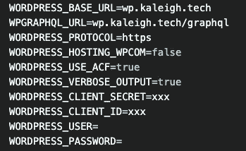

以下是我们将添加到 gatsby-config 中的内容:

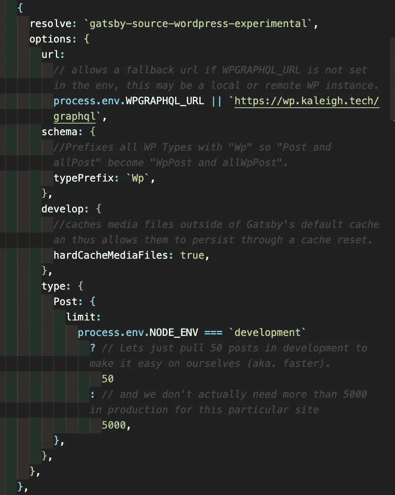

确保你添加了 WordPress 网站的 graphql 链接:`[https://wp.kaleigh.tech/graphql](https://wp.kaleigh.tech/graphql)`

接下来，我们需要编辑 gatsby-node.js 文件。[我按照医嘱使用](https://github.com/gatsbyjs/gatsby-source-wordpress-experimental/blob/master/docs/tutorials/building-a-new-site-wordpress-and-gatsby.md):

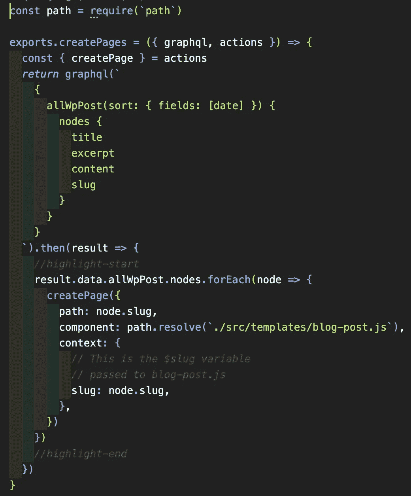

现在我们的网站已经连接到了 WordPress 网站，但是没有真正的方法去验证和查看任何东西。所以我们需要创建一个博客帖子模板，这样我们就可以收集信息。

# 博客帖子模板

接下来，我们需要在 src 下建立一个名为“模板”的新文件夹，并添加 blog-post.js

以下是 blog-post.js 的内容:

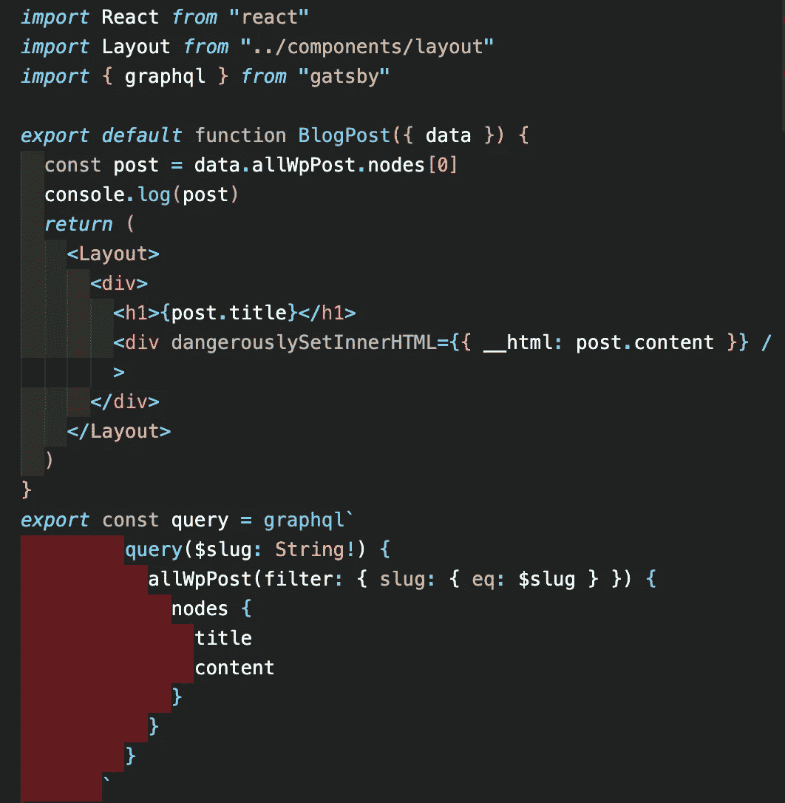

所以有了这些新的变化，我们可以从 WordPress 网站上获取博客文章并展示出来。运行`gatsby develop`进行检查。

当网站加载时，我们不会在主页上看到任何差异。我们还没有定好路线。如果您访问这样一个 URL:[http://localhost:8000/哎呀](http://localhost:8000/oops)您会看到所有页面的列表，并且应该会看到您在 WordPress 上的一些帖子:

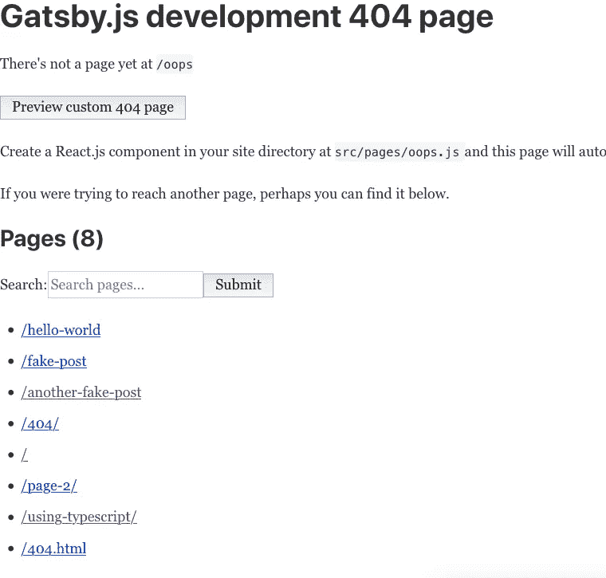

看到那些“假”帖子了吗？那些是来自 WordPress 的！

点击它们以确保它们正常工作。我的是这样的:

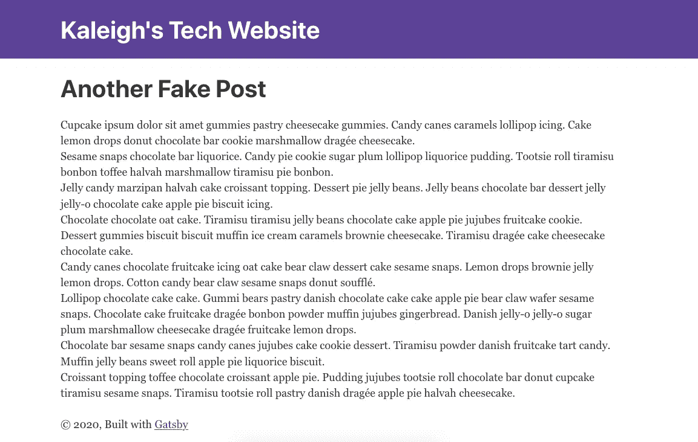

它只是引入了标题和内容，这是我们在 blog-post.js 文件中设置的。

让我们把日期添加到我们的帖子中。如果你去本地的 GraphQL，[http://localhost:8000/_ _ _ graph QL](http://localhost:8000/___graphql)你可以看到我们可以从 WordPress 博客文章中获取的所有选项:

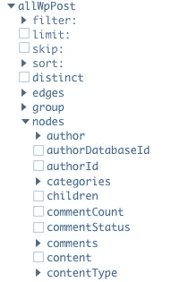

检查日期框，您会看到:

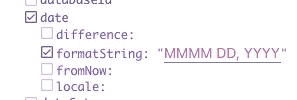

我在“MMMM DD，YYYY”中添加了，现在我看到了这个:

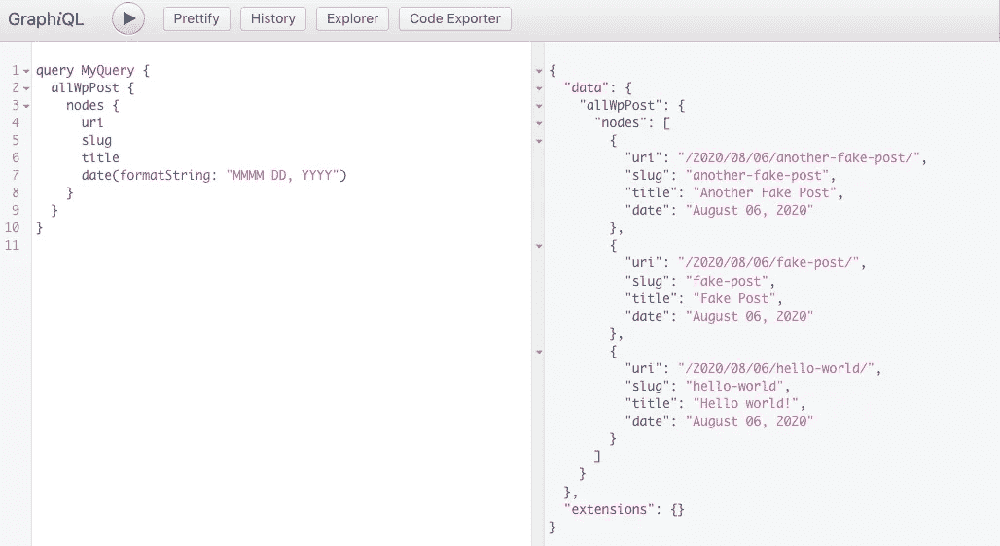

让我们把它添加到我们的站点，看看会发生什么:

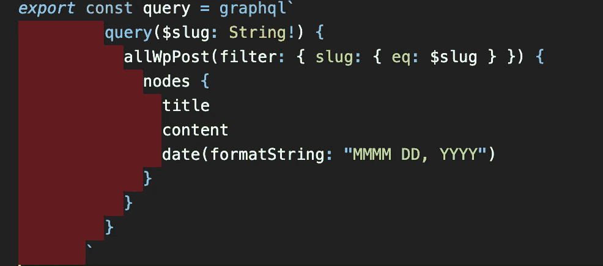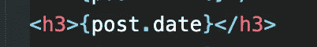

您可能需要重新启动服务器才能看到结果:

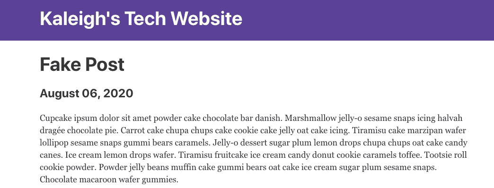

厉害！

接下来，我们将创建一个页面，列出我们所有的博客文章。

# 博客文章页面

在你的 pages 文件夹下，创建一个名为 blog.js 的新文件。现在，我们只需引入博客标题、日期，并使用 slug 创建一个到文章的链接。

以下是 graphql 查询的外观:

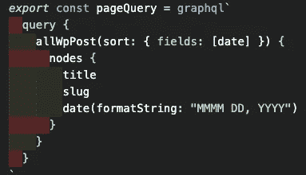

这将是一个已发布帖子的列表，为此我们将使用一个[地图功能](https://reactjs.org/docs/lists-and-keys.html)，这样我们就不必担心在将来发布帖子时更新页面。

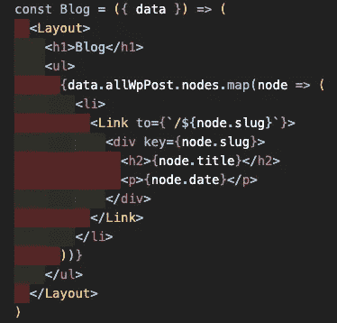

有了这几行，看看[http://localhost:8000/blog/](http://localhost:8000/blog/)看看有什么:

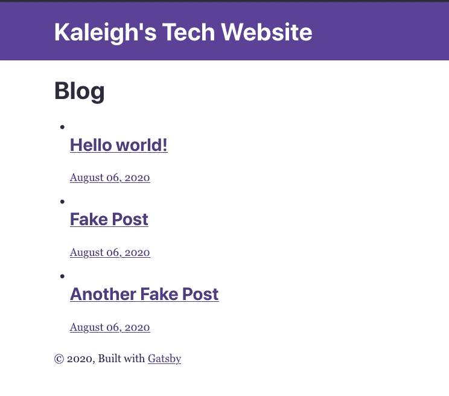

单击链接以确保它们正在工作。现在让我们清理一下，去掉子弹。

为简单起见，我们将在名为 style.css 的组件文件夹中创建一个新的 CSS 文件，并添加:

`ul {
list-style-type: none;
}`

我们还需要在 layout.js 文件中导入样式表:

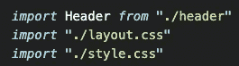

现在它应该看起来好多了:

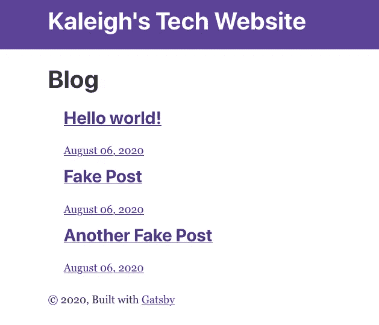

最后，让我们在主页上添加一个到这个页面的链接。我只是加了这一行:

`<Link to="/blog">Like this blog</Link>`

现在我们开始做生意了！

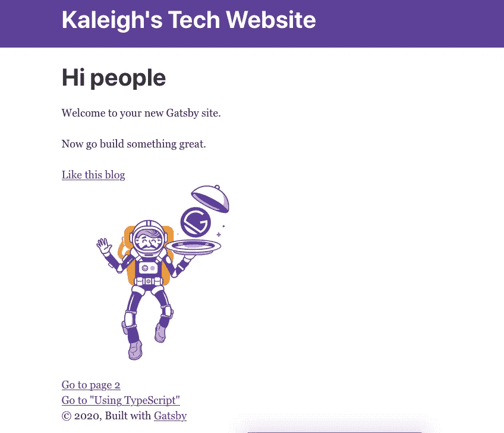

希望你的看起来一样，[如果不一样，请让我知道](mailto:hi@kaleigh.dev?subject=WordPress Gatsby Tutorial)！你也可以看看我的这个系列的 [GitHub 回购。](https://github.com/klgh/kaleigh-tech-tutorial)[现在开始第 3 部分](https://medium.com/@kaleighscruggs/create-a-blog-with-wordpress-and-gatsby-part-3-664e4967d54)！

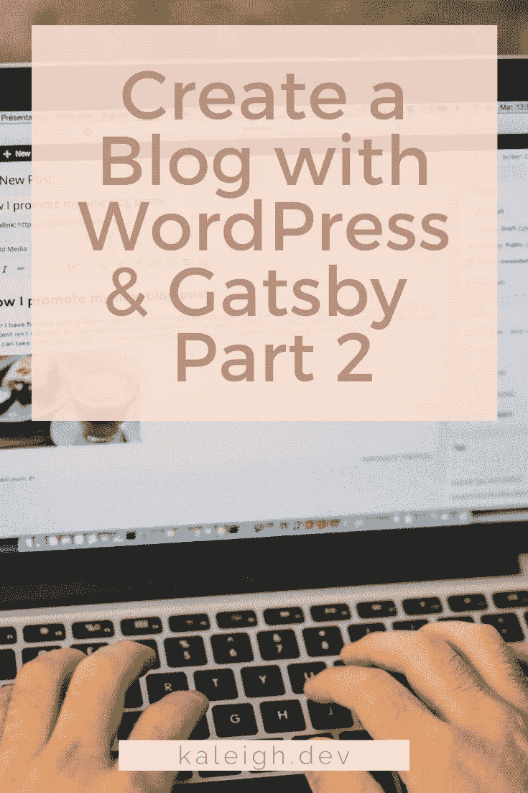