# 用 WordPress 和 Gatsby 创建一个博客——第 3 部分

> 原文：<https://javascript.plainenglish.io/create-a-blog-with-wordpress-and-gatsby-part-3-664e4967d54?source=collection_archive---------11----------------------->

## 好吧！所以你已经通过了[第一部](https://medium.com/@kaleighscruggs/create-a-blog-with-wordpress-and-gatsby-part-1-a4d78a93a28d)和[第二部](https://medium.com/@kaleighscruggs/create-a-blog-with-wordpress-and-gatsby-part-2-6e6f121bc232)，现在是这个系列的最后一章！

# 第 3 部分—真正的交易

既然我们已经成功地将 WordPress 博客中的帖子放入了我们的 Gatsby 应用程序，那么让我们配置 [Netlify](https://app.netlify.com/) ，这样我们的域名看起来就更正式了。我们将使用`kaleigh.tech`作为域名，而不是使用`kaleigh-tech-tutorial.netlify.app`。

# 域管理

前往 Netlify，打开你的站点设置，向下滚动到“域管理”

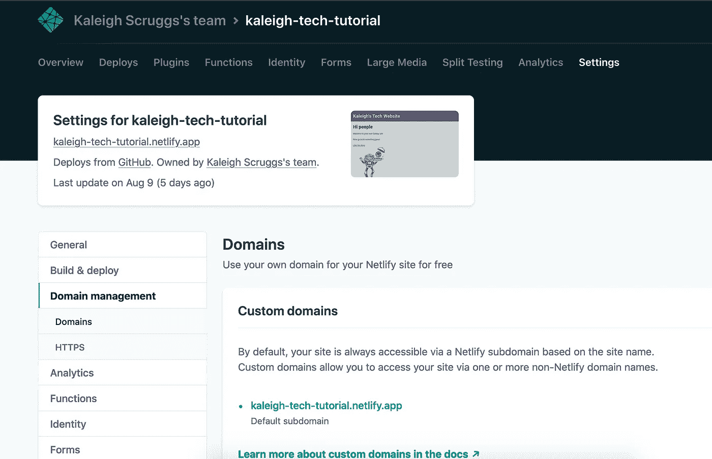

点击“添加自定义域名”按钮，输入您的域名，并验证您确实是所有者。

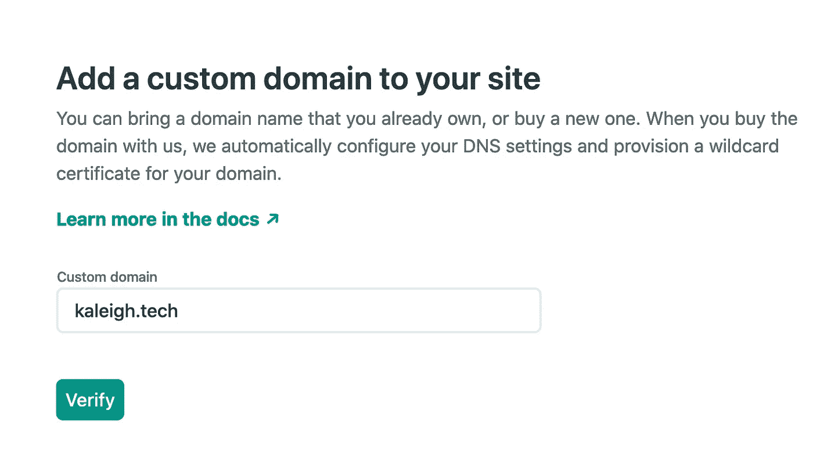

当它将我带回到我的设置时，我看到了这个错误…别担心，我们会修复它:

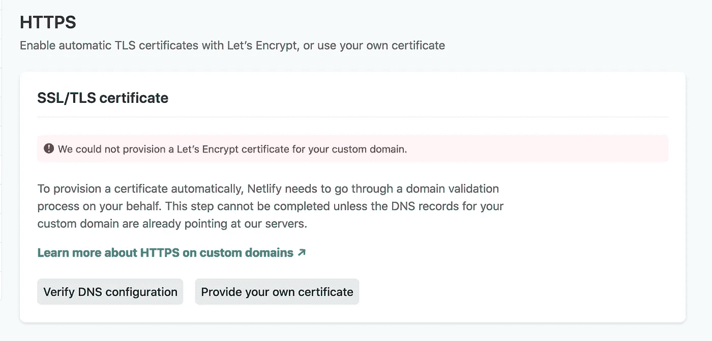

向上滚动到自定义域名，然后单击您的域名下拉列表:

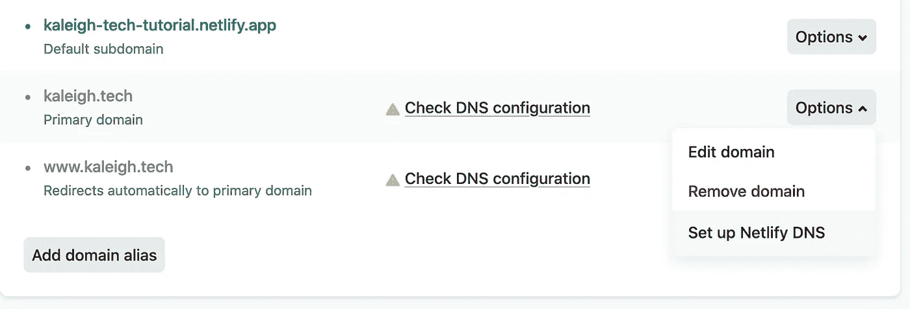

我们需要设置网络域名系统，所以点击那个选项。

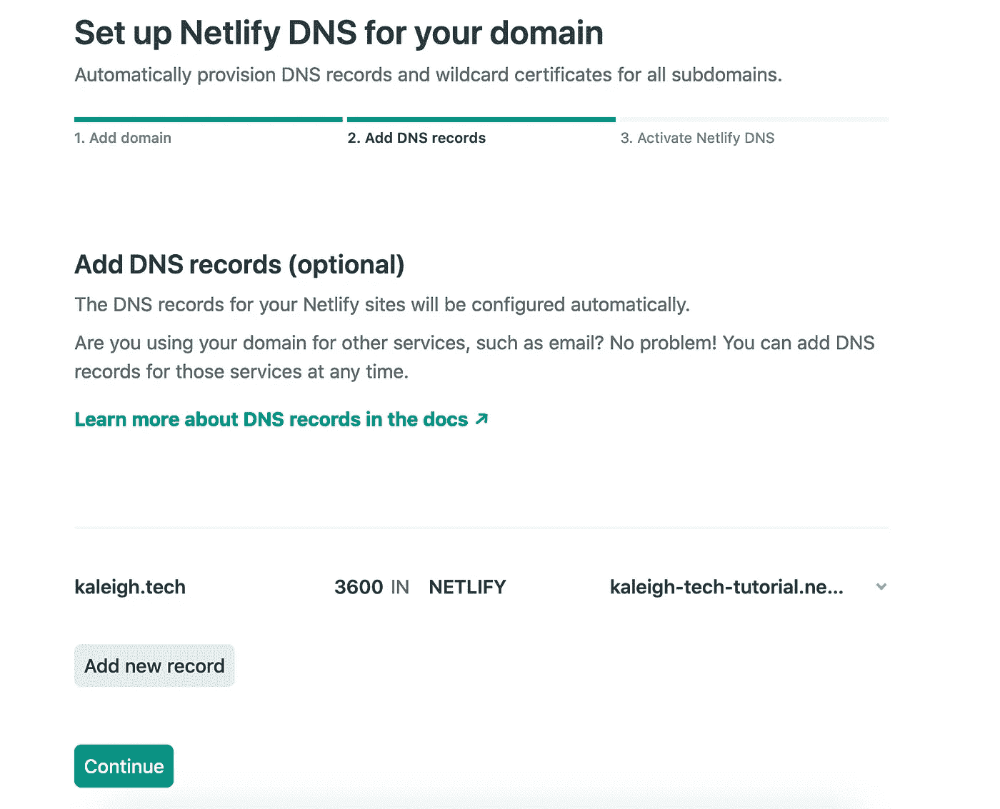

点击继续，然后你会得到一个域名服务器列表。

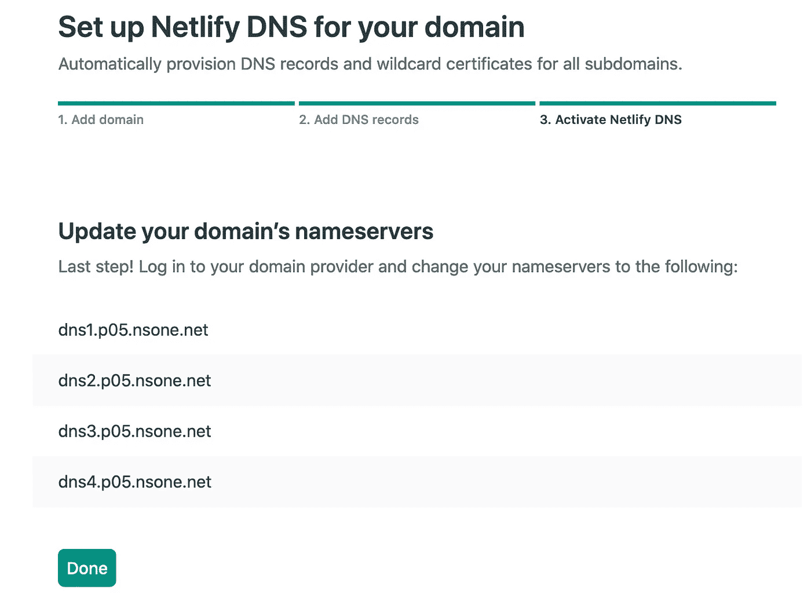

你必须到购买你的域名的地方去修改域名。万一你遇到困难，Netlify 有一些好的文件。[本文](https://david.darn.es/tutorial/2020/07/28/switching-to-netlify-dns/)也有帮助。

我有一个便宜的名字，我的名字很容易设定:

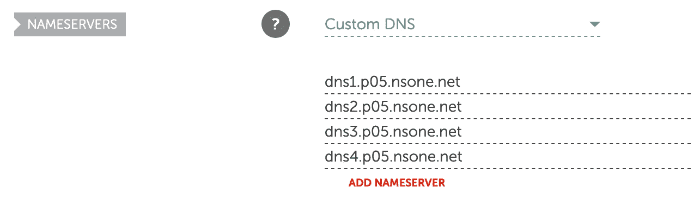

一旦你这样做了，你必须等到一切都切换过来。有时候很快，有时候不太快。我的花了大约 20 分钟。所以去泡些茶或咖啡，然后回来！

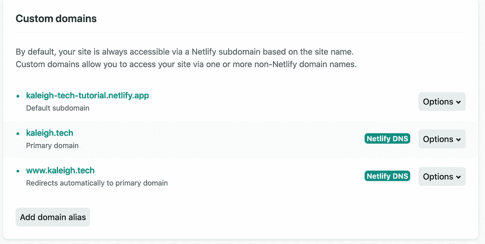

如果你看到那个…那么你应该看到这个:

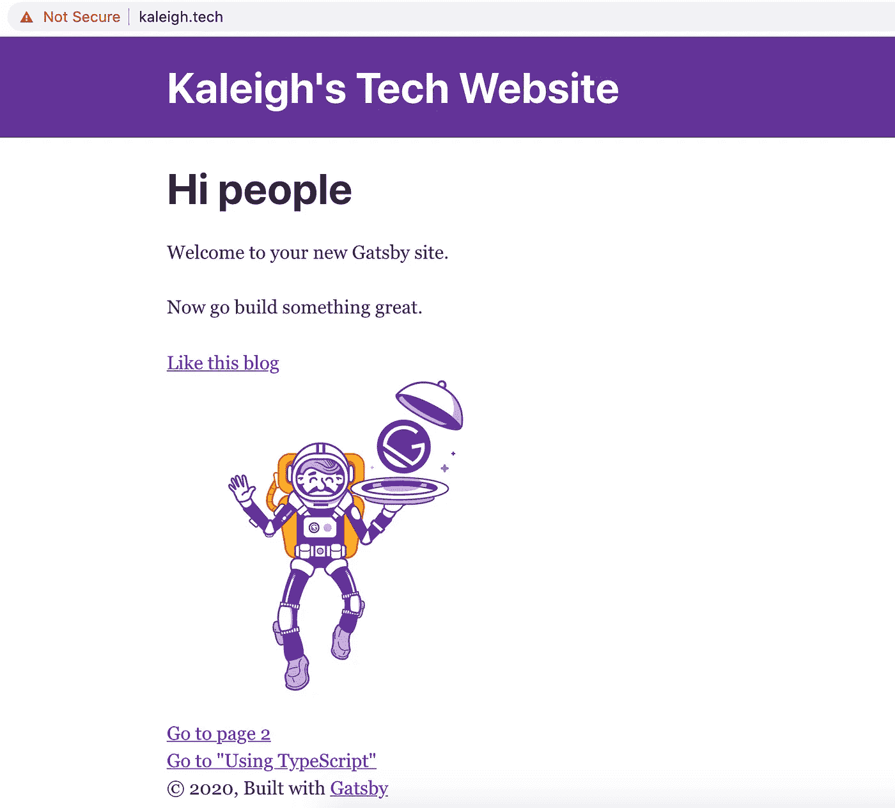

呜！都起作用了！担心 HTTPS 吗？向下滚动回到您的 Netlify 域设置，然后单击按钮验证配置:

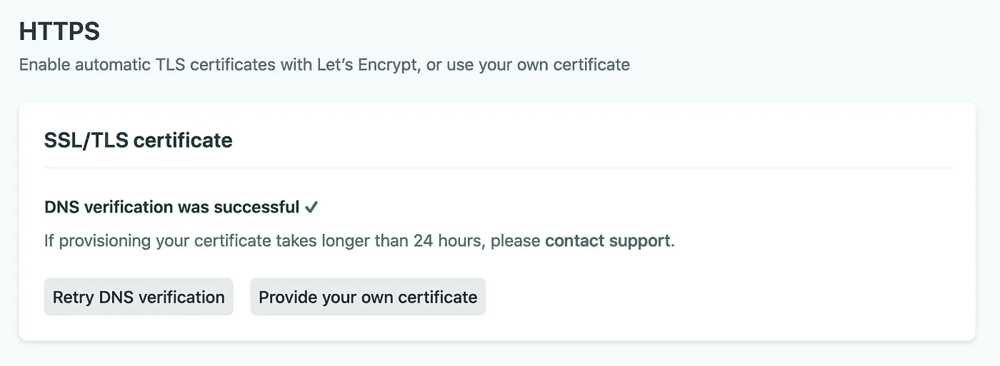

现在你应该可以走了(几分钟后)。这个过程的这一部分需要一些时间，所以你做得越早，如果你想交付一个网站或者展示它，就越好。

希望你已经喜欢我用 WordPress 和 Gatsby 创建博客的系列文章！如果你有，请告诉我，与朋友分享，并在 [Twitter](https://twitter.com/kaleighscruggs/status/1292808208206225409) 、 [Dev.to](https://dev.to/kaleigh/series/8220) 、 [Medium](https://medium.com/@kaleighscruggs) 或任何你喜欢分享的地方分享！

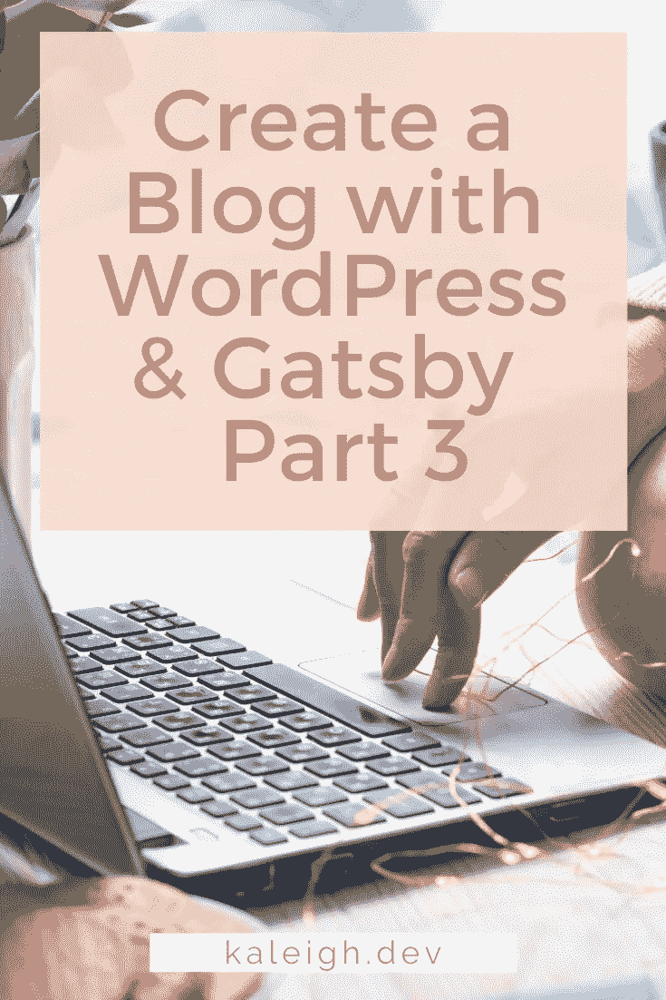