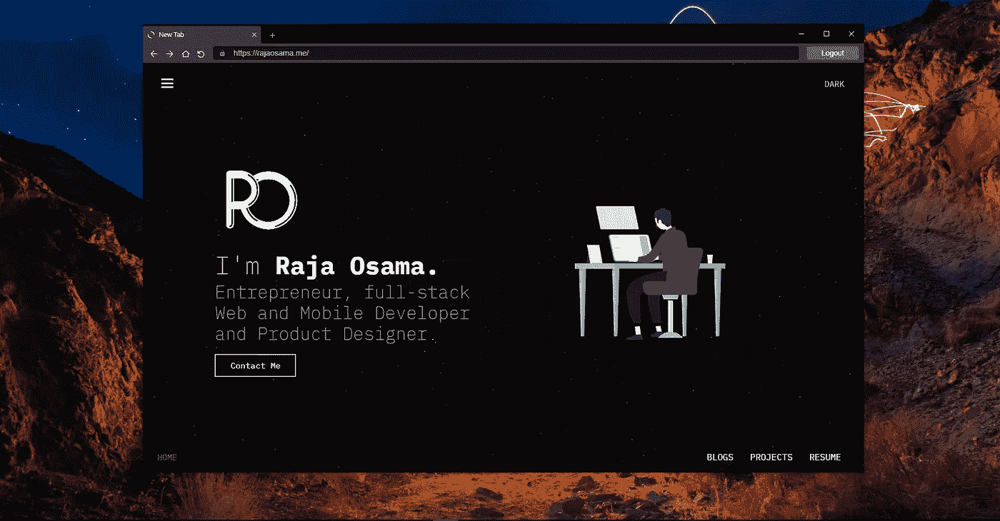

# 用 React.js 和 Electron 创建浏览器

> 原文：<https://javascript.plainenglish.io/create-a-browser-with-react-js-and-electron-d75f30b6bcec?source=collection_archive---------1----------------------->

你有没有想象过浏览器是如何工作的，你如何能自己创建一个浏览器，并让它做几乎所有你想做的事情？好吧，我将分享我用 Javascript 和电子学知识从头开始编写浏览器的故事，以及我在这个过程中遇到的所有困难。

# Java Script 语言

JavaScript 通常缩写为 JS，是一种符合 ECMAScript 规范的编程语言。JavaScript 是高级的，通常是即时编译的，并且是多范例的。它有花括号语法、动态类型、基于原型的面向对象和一流的功能。

# 电子

**电子**是由 GitHub 开发和维护的开源软件框架。它允许使用 web 技术开发桌面 GUI 应用程序:它结合了 Chromium 渲染引擎和 Node.js 运行时。

# 故事

最近，我的公司给了我一个设计浏览器的项目。它的一些功能是浏览器应该是跨平台的，它将有一个内置的代理，所以所有的导航和要打开的路线都应该通过代理服务器，它将有自动认证以及一些网站；此外，它将具有基本的浏览器功能，包括前进、后退、刷新、停止等。

因此，让我们快速了解一下什么是浏览器，以及浏览器中的工作原理。网络**浏览器**，或**简称****浏览器**，是用来访问和浏览网站的应用。

需求现在已经很清楚了，我有一周的研究时间，并且可以自由选择我的堆栈。最近微软发布了新版本的 Microsoft Edge，它是基于 Chrome 的，就像 Chrome 一样。所以我开始研究 chromium，并意识到这是一片汪洋，要开始使用 Chromium，我需要的时间比给我的时间多得多，所以我不得不转向一些我可以快速上手的东西。

几年前，我为一家公司设计了这个基于电子的仪表板桌面应用程序，它也是基于 Chromium 的，那么为什么是电子呢？我很快开始深入研究 electronic，我发现 electronic 应用程序基本上是运行 HTML 的浏览器窗口，不仅仅是因为我发现 electronic 还支持 WEBVIEW 标签，可以在其中运行网站，并具有广泛的 API。

经过几个小时的研究和试验，我能够创建一个简单的电子应用程序，将 webview 呈现为 HTML，并让这个 webview 在里面运行 www.google.com[的](http://www.google.com)。我还发现，electron 将 webview 视为一个独立的窗口，这样你就可以访问所有浏览器窗口的 API。因此，基本上你可以加载，重新加载，向后和向前移动，以及一个简单的浏览器窗口可以执行的所有操作。

现在，几乎一切都很清楚了，因为我已经能够用普通的 HTML 创建一个浏览器 UI 了。在过去的 2 年里，我一直全职使用 react，使用 React 和 react native，所以使用 HTML 似乎效率不高。所以我快速克隆了这个 repo[https://github . com/pbar biero/basic-electronic-react-boilerplate](https://github.com/pbarbiero/basic-electron-react-boilerplate)开始使用。

我在使用 electron 和 react 时发现的第一件事是，electron 有一个不受 react 支持的 webview 组件，因此要注入一个受 electron 而非 react 支持的 webview，您必须通过 javascript 手动将 webview 注入到一个容器中。

这就是如何将元素注入到 dom 中，在我的例子中是 webview 标签。

因此，我为 webview 注入创建了一个基本的 API，并创建了所有常用的操作，如向后移动、向前移动、加载 URL、刷新页面和停止页面加载。

这样，我们就有了一个包含 id 为`webviewContainer`的元素的电子窗口，我们在其中注入了 webview，我们能够在浏览器中执行基本的操作。

现在棘手的部分来了，我们不需要在一个窗口上有一个网站，但是我们需要多个标签，每个标签运行一个网站的实例，并且完全独立。这就是我使用 React 的原因；这使得前端管理变得更加容易。

我使用[https://ant.design/components/tabs/](https://ant.design/components/tabs/)蚂蚁设计标签进行前端设计。我将所有基本的浏览器功能移到了另一个组件上，并在根页面上创建了选项卡。

每个选项卡都由自己的内容区域组成，在该区域中，我们有子组件。但是根据我们创建的 webview API，我们只针对`webviewContainer`，所以 API 的动作会影响第一个`webviewContainer` webview，因为我们有和标签一样多的`webviewContainer`，为了解决这个问题，我们给浏览器窗口一个自定义的父 id，就像这样

并修改我们的 API，如下所示:

这将做的是，它将只针对基于 webview 的特定选项卡，您需要做的只是将我们从选项卡发送的 parentid 的引用发送到浏览器组件。

✌To 总结这一点，我们现在有一个应用浏览器，可以浏览网站和多个网站在同一时间。

这些资源将帮助您扩展浏览器的功能。
- [为电子网络视图设置自定义代理](https://medium.com/@SuperSami/setting-up-custom-proxy-for-electron-webview-109d78ce5e17)🐱‍🚀
- [React 和电子多窗口设置](https://supersami.medium.com/react-and-electron-multi-window-setup-f1750a1500e7)
-操纵 Webview 渲染的 dom(即将到来)
-为两个平台构建电子 app 并打包。(马上就来)