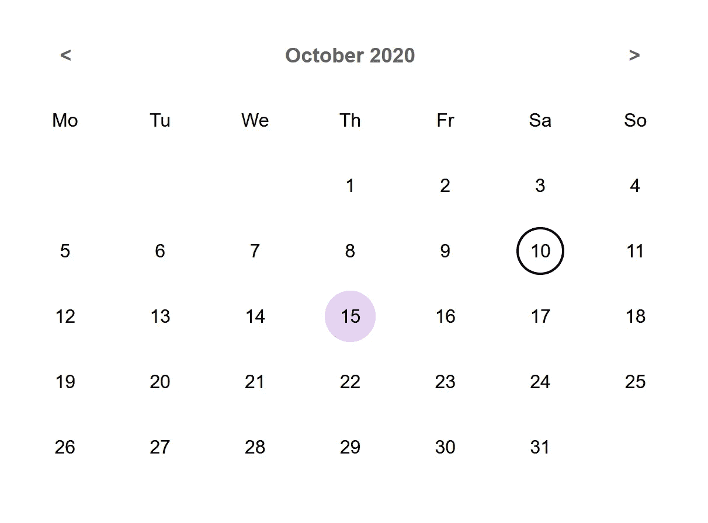

# 用 Stencil.js 创建一个日历 Web 组件

> 原文：<https://javascript.plainenglish.io/create-a-calendar-with-stencil-js-web-component-deb091456df3?source=collection_archive---------4----------------------->



Calendar built with Stencil.js, with a material like design

为什么与 Angular、React 或其他框架相比，Stencil (Web 组件)可能是您项目的理想选择？

看你想实现什么了。我喜欢和 Angular 一起工作，但是有些情况下 Stencil 是更好的选择或者理想的伴侣。

例如，我在一家公司工作，该公司与另一家公司共享他们的一些组件，他们使用 Angular，如果你有类似的需求，你可以考虑对你想要共享的组件使用 Stencil，因为组件会小得多，使用 HTML 标准，在任何地方集成它们都会容易得多。

对于本教程，我假设您已经熟悉:

*   Javascript(类型脚本)
*   命令行
*   半铸钢ˌ钢性铸铁(Cast Semi-Steel)
*   NPM

在这里你可以阅读更多关于你为什么想要使用 Stencil 的信息。

在这篇文章中，我想和你一起用模板实现一个简单的日历。它将有一个简单的设计，几个事件，和公开暴露的属性。

首先，我们从命令行生成一个新的模板项目:

```
npm init stencil
```

命令行提示将询问您希望如何初始化您的模板项目选择>**组件**，项目名称**模板日历**，或者您喜欢的任何名称，并用 y 确认

```
# switch into the new project folder
cd stencil-calendar# install the dependencies
npm install
```

我们现在有了一个新的文件夹模板日历，其中包含了新组件的基本结构。我们删除了 utils 文件夹中的文件、my-component 文件夹中以 e2e.ts 和 spec.ts 结尾的用于测试的文件以及 readme.md 文件，这样就可以更容易地专注于我们将要处理的部分。在 my-component.tsx 文件中，我们还需要删除 utils 文件的用法。

```
# delete
import { format } from '../../utils/utils';private getText(): string {
  return format(this.first, this.middle, this.last);
}*/**
 * The first name
 */* @Prop() first: string;

*/**
 * The middle name
 */* @Prop() middle: string;

*/**
 * The last name
 */* @Prop() last: string;# replace following in the render function 
<div>Hello, World! I'm {this.getText()}</div># by just a div
<div></div>
```

对于本教程，有三个感兴趣的文件:index.html、my-webcomponent.tsx 和 my-webcomponent.css

首先，我们快速查看一下 index.html 文件，在文件头中有两个脚本导入，用于加载 src/components 文件夹中的组件，在文件体中，我们使用了组件(您可以删除这两个属性):

```
<my-component></my-component>
```

现在，我们来看看 my-component.tsx，它的结尾是 tsx，而不是 ts，因为在渲染函数中，我们使用 JSX 来声明 HTML 结构。这是将 HTML 写入 javascript 文件的好方法。你可以在这里阅读更多相关信息[。](https://stenciljs.com/docs/templating-jsx)

Stencil 使用 Typescript Decorators @Component()，我们向它传递一个 config 对象。在模板[中阅读更多关于装饰者的内容。我们定义了标签名“我的组件”，你可以选择任何你喜欢的，但不要忘记改变它也在 index.html 文件中。我们将 styleUrl 和参数 shadow 设置为 true，这意味着组件的结构和样式是从“普通”DOM 封装的。你可以在这里阅读更多关于影子王国](https://stenciljs.com/docs/decorators)[的信息。](https://developer.mozilla.org/en-US/docs/Web/Web_Components/Using_shadow_DOM)

在渲染函数中，我们为组件定义 HTML 结构，你可以使用 HTML 标签，也可以使用你在模板项目中定义的其他组件。

```
**@Component**({
  tag: 'my-component',
  styleUrl: 'my-component.css',
  shadow: true,
})
export class MyComponent {
  **render**() {
    return <div></div>;
  }
}
```

最后一个文件是 my-component.css 文件，它将保存组件的样式。

我们现在用逻辑一步一步地填充 my-webcomponent.tsx 文件。

首先，我们定义属性。稍后，您可以将标签上的这些属性传递给组件，例如<my-component show-fill-days="”false”">。在组件中，使用 camelcase 定义属性，在标记上使用 dash-case 设置属性。[模版文件属性](https://stenciljs.com/docs/properties)。</my-component>

```
**@Prop**() dayNames = [
  'Mo', 'Di', 'Mi', 'Do', 'Fr', 'Sa', 'So'
];
**@Prop**() monthNames = [
  'Januar', 'Februar', 'März', 'April', 'Mai', 'Juni', 'Juli', 'August', 'September', 'Oktober', 'November', 'Dezember'
];
**@Prop**() showFillDays = true;
```

然后，我们定义几个状态变量，当一个变量有这样的修饰时，这个类变量的每次变化都会调用 render 方法。[模版对接状态](https://stenciljs.com/docs/state)。

```
**@State**() date = Calendar.*getToday*(); **@State**() daysInMonth: number[];
**@State**() selectedDate: CalendarEntry;
**@State**() eventDates = [];
```

然后，我们定义了两个事件，当日历中的某一天或某个月发生变化时，这两个事件将被触发。[模版文件事件](https://stenciljs.com/docs/events)。

```
**@Event**({
  eventName: 'dayChanged',
  composed: true,
  cancelable: true,
  bubbles: true,
}) dayChanged: EventEmitter<CalendarEntry>;
**@Event**({
  eventName: 'monthChanged',
  composed: true,
  cancelable: true,
  bubbles: true,
}) monthChanged: EventEmitter<CalendarEntry>;
```

最后一个变量我们稍后会用到一些内部的东西:

```
private fillStartCount: number;
private fillEndCount: number;
readonly today: CalendarEntry;
```

在构造函数中，我们今天用一个类的函数进行初始化，这个类我们后来放入 utils 文件夹:

```
constructor() {
  this.today = Calendar.*getToday*();
}
```

我们在日期属性中添加了一个观察器，这个函数在日期改变时被调用，观察日期将改变所选择的日期并赋予它另一种样式。

```
**@Watch**('date')
watchDate(date: CalendarEntry): void {
  if ('month' in date && 'year' in date) {
    this.selectedDate = date;
  }
}
```

我们使用一个生命周期方法来初始化日历，它在渲染函数之前被触发，在这里看到模板[的完整生命周期](https://stenciljs.com/docs/component-lifecycle)。

```
**componentWillLoad**() {
  this.setCalendarDetails();
}
```

接下来，我们定义一些内部函数，我希望方法和变量的命名足够清楚，这样你就可以很容易地读懂每一行的目的。如果有什么不清楚的地方，欢迎在下面的评论中提问。

```
setCalendarDetails(): void {
  const date = this.getValidDate();
  const calendar = new Calendar(date.year, date.month);
  this.daysInMonth = calendar.getCalendarDays();

  this.fillStartCount = calendar.getFillStartCount();
  this.fillEndCount = (calendar.daysInCalendar - calendar.getFillEndCount());
}

getValidDate(): CalendarEntry {
  let date = this.date;
  if (!('month' in this.date && 'year' in this.date)) {
    date = this.today;
  }

  return date;
}

dayChangedHandler(calendarEntry: CalendarEntry): void {
  this.dayChanged.emit(calendarEntry);
}

daySelectedHandler = (day): void => {
  this.selectedDate = {
    day,
    month: this.date.month,
    year: this.date.year
  };
  this.dayChangedHandler(this.selectedDate);
}

monthChangedHandler(calendarEntry: CalendarEntry): void {
  this.monthChanged.emit(calendarEntry);
}

switchToPreviousMonth = (): void => {
  if (this.date.month !== 1) {
    this.date.month -= 1;
  } else {
    this.date.month = 12;
    this.date.year -= 1;
  }

  if (typeof this.date !== 'undefined') {
    delete this.date.day;
  }

  this.setCalendarDetails();
  this.monthChangedHandler(this.date);
}

switchToNextMonth = (): void => {
  if (this.date.month !== 12) {
    this.date.month += 1;
  } else {
    this.date.month = 1;
    this.date.year += 1;
  }

  delete this.date.day;

  this.setCalendarDetails();
  this.monthChangedHandler(this.date);
}

getDigitClassNames = (day: number, month: number, year: number, index: number): string => {
  let classNameDigit = [];
  if (day.toString().length === 1) {
    classNameDigit.push('padding-single-digit');
  }

  if (this.isToday(day, month, year, index)) {
    classNameDigit.push('active');
  }

  if (this.isSelectedDay(day, index)) {
    classNameDigit.push('selected');
  }

  if (this.eventDates.includes(day)) {
    classNameDigit.push('has-event');
  }

  return classNameDigit.join(' ');
}

isToday(day: number, month: number, year: number, index: number): boolean {
  return this.today.day === day
    && this.today.month === month
    && this.today.year === year
    && this.today.year === year
    && !(index < this.fillStartCount || index >= this.fillEndCount);
}

isSelectedDay(day: number, index: number) {
  return typeof this.selectedDate !== 'undefined'
    && this.selectedDate.day === day
    && this.selectedDate.month === this.date.month
    && this.selectedDate.year === this.date.year
    && !(index < this.fillStartCount || index >= this.fillEndCount);
}
```

组件类的最后一部分是 render 函数。我们利用三个点击事件来改变月份和设置选定的日期。

```
render() {
  const date = this.getValidDate();

  return (
    <div class="calendar material">
      <header>
        <span **onClick**={this.switchToPreviousMonth}>
          {'<'}
        </span>
        <span>{this.monthNames[date.month - 1]} {date.year}</span>
        <span **onClick**={this.switchToNextMonth}>
           {'>'}
        </span>
      </header>
      <div class="day-names">
        {this.dayNames.map(dayName => <span>{dayName}</span>)}
      </div>
      <div class="days-in-month">
        {this.daysInMonth.map((day, index) => {
          const classNameDigit = this.getDigitClassNames(day, date.month, date.year, index);
          if (index < this.fillStartCount || index >= this.fillEndCount) {
            return (
              <span class="disabled">{this.showFillDays ? day : ''}</span>
            );
          } else {
            return (
              <span **onClick**={() => this.daySelectedHandler(day)}>
                <i class={classNameDigit}>
                  {day}
                </i>
              </span>
            );
          }
        })}
      </div>
    </div>
  );
}
```

我们组件的样式:

```
// src/components/my-component/my-component.css.calendar {
  width: 50%;
  font-family: Arial, sans-serif;
  padding: 1rem;
}

.calendar > * {
  line-height: 3.5rem;
}

header {
  display: flex;
  justify-content: space-between;
  color: #666;
  font-weight: bold;
  font-size: 1.1rem;
}

.calendar span {
  flex-grow: 30;
  width: calc(100% / 7);
  text-align: center;
}

.calendar header span:first-child,
.calendar header span:last-child{
  flex-grow: .1;
  cursor: pointer;
}

.day-names {
  display: flex;
}

.days-in-month {
  display: flex;
  flex-wrap: wrap;
}

.days-in-month span {
  cursor: pointer;
  position: relative;
}

.days-in-month i {
  padding: .8rem;
  font-style: normal;
  position: relative;
  width: 100%;
}

.days-in-month i.padding-single-digit {
  padding: .8rem 1.1rem;
}

.days-in-month span.disabled {
  color: #ccc;
  cursor: default;
}

/** Material style **/
.material .days-in-month span:hover:not(.disabled) i:not(.selected) {
  background: #e6d2f1;
  border-radius: 50%;
}

.material .days-in-month i.active {
  border: 2px solid #000;
  border-radius: 50%;
  padding: .6rem;
}

.material .days-in-month i.selected {
  background: #902dc6;
  color: #fff;
  border-radius: 50%;
}

.material .days-in-month i.has-event:before {
  content: ' \25CF';
  font-size: .7rem;
  position: absolute;
  top: .4rem;
  left: 1.18rem;
  color: #902dc6;
}

.material .days-in-month i.selected.has-event:before {
  color: #fff;
}

.material .days-in-month i.active.has-event:before {
  top: .1rem;
  left: 1.1rem;
}
```

在 utils 文件夹中，我们添加了两个文件:

```
// utils/calendar-entry.tsexport class CalendarEntry {
  day?: number;
  month: number;
  year: number;
}
```

一些用于处理日历的助手方法，捆绑到一个类中:

```
// utils/calendar.tsimport { CalendarEntry } from './calendar-entry';

export class Calendar {
  readonly year: number;
  readonly month: number;
  readonly daysInCalendarWithFiveRows = 42;
  readonly daysInCalendarWithFourRows = 35;
  readonly daysInCalendarWithThreeRows = 28;

  public daysInCalendar = this.daysInCalendarWithFourRows;

  private fillStartCount = 0;
  private fillEndCount = 0;
  private currentMonthCount: number;
  private fillCount = [6, 0, 1, 2, 3, 4, 5];

  constructor(year: number, month: number) {
    this.year = year;
    this.month = month;
  }

  public getCalendarDays(): number[] {
    const daysOfCurrentMonth = this.getDaysOfCurrentMonth();
    const fillStartCount = this.fillCount[this.getFirstDayOfMonth()];
    const fillEndCount = this.daysInCalendarWithFourRows - (daysOfCurrentMonth.length + fillStartCount);

    this.currentMonthCount = daysOfCurrentMonth.length;
    this.fillStartCount = fillStartCount;
    this.fillEndCount = fillEndCount;

    const fillStart = fillStartCount > 0 ? this.getDaysOfLastMonth(fillStartCount) : [];
    const fillEnd = this.getDaysOfNextMonth(fillEndCount);

    return fillStart.concat(daysOfCurrentMonth).concat(fillEnd);
  }

  private getDaysOfCurrentMonth(): number[] {
    return this.getDaysOfMonth(this.month);
  }

  private getDaysOfLastMonth(fillStartCount: number): number[] {
    const daysOfMonth = this.getDaysOfMonth(this.month - 1);

    return daysOfMonth.slice(-fillStartCount);
  }

  private getDaysOfNextMonth(endCount: number): number[] {
    const daysOfMonth = this.getDaysOfMonth(this.month + 1);

    let slicedDays;
    if (endCount <= -1) {
      endCount = this.daysInCalendarWithFiveRows - (this.currentMonthCount + this.fillStartCount);
      slicedDays = daysOfMonth.slice(0, endCount);
      this.daysInCalendar = this.daysInCalendarWithFiveRows;
      this.fillEndCount = endCount;
    } else if (endCount === 7 && (this.currentMonthCount + this.fillStartCount) === 28) {
      endCount = this.daysInCalendarWithThreeRows - (this.currentMonthCount + this.fillStartCount);
      slicedDays = daysOfMonth.slice(0, endCount);
      this.daysInCalendar = this.daysInCalendarWithThreeRows;
      this.fillEndCount = endCount;
    } else {
      slicedDays = daysOfMonth.slice(0, endCount);
    }

    return slicedDays;
  }

  private getDaysOfMonth(month: number): number[] {
    const daysOfMonth = new ***Date***(this.year, month, 0).getDate();

    return ***Array***.from({length: daysOfMonth}, (_, i) => i + 1);
  }

  public getFirstDayOfMonth(): number {
    return new ***Date***(this.year, this.month - 1, 1).getDay();
  }

  public getFillStartCount(): number {
    return this.fillStartCount;
  }

  public getFillEndCount(): number {
    return this.fillEndCount;
  }

  public static *getToday*(): CalendarEntry {
    return {
      day: new ***Date***().getDate(),
      month: new ***Date***().getMonth() + 1,
      year: new ***Date***().getFullYear()
    };
  }
}
```

最后，我们可以运行我们的实现，看看它是如何工作的，在项目文件夹中的命令行上运行:

```
npm start
```

在 index.html 文件中，您可以设置我们定义的属性。

```
<my-component **show-fill-days**="false"></my-component><script>
  const calendar = document.querySelector('my-component');
  calendar.**dayNames** = [
    'Mo', 'Tu', 'We', 'Th', 'Fr', 'Sa', 'So'
  ];
  calendar.**monthNames** = [
    'January', 'February', 'March', 'April', 'May', 'June', 'July', 'August', 'September', 'October', 'November', 'December'
  ];
</script>
```

你可以在不同的月份之间切换，选择一天，它就会高亮显示。它有一个非常基本的样式，如果你喜欢玩日历，你可以添加更多的逻辑到日历中，如果你想实现你的想法，分享它们会很好。

点击这里访问 Github 上的项目资源库[。](https://github.com/pguso/stencil-calendar)

我希望你喜欢这个教程，非常欢迎你的反馈。

*更多内容尽在*[plain English . io](http://plainenglish.io/)