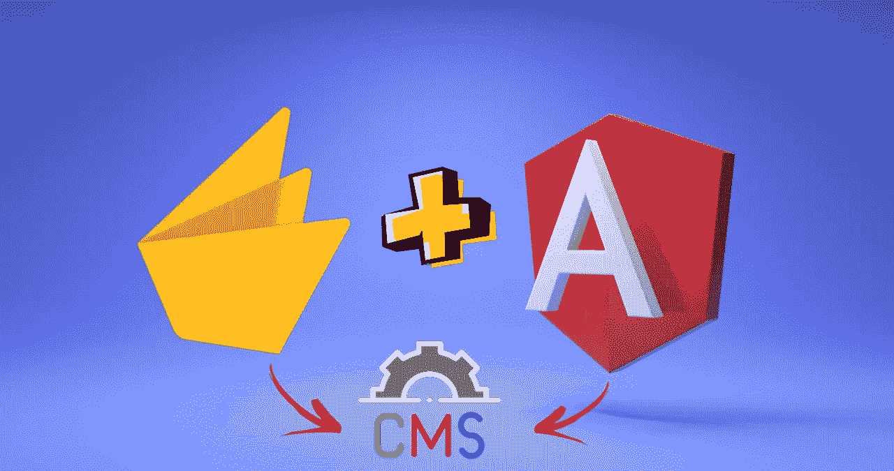
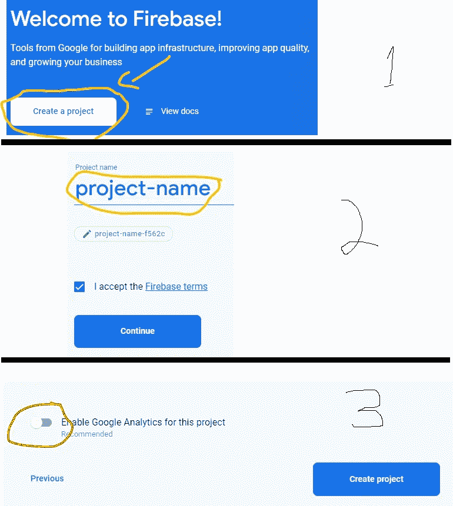
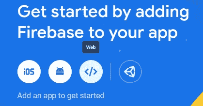
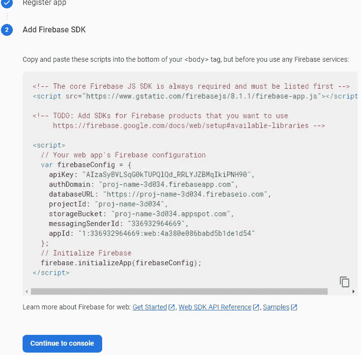
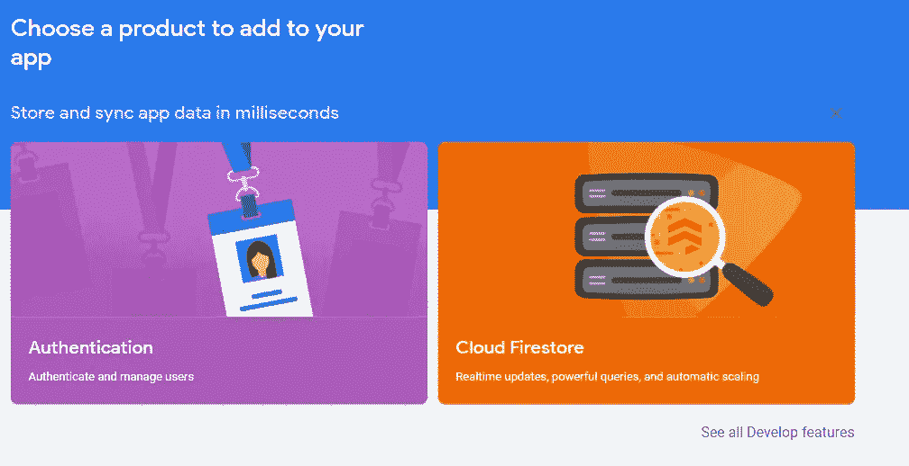
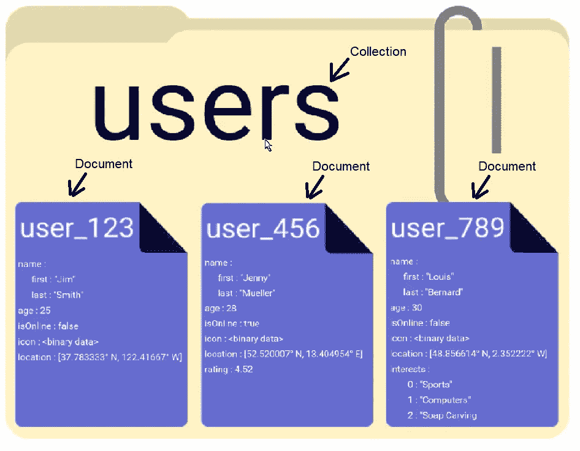
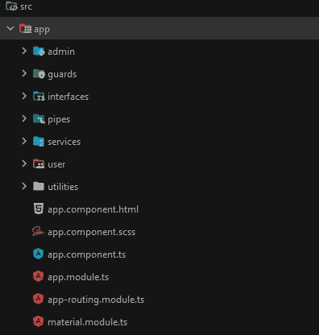

# 用 Angular + Firebase 创建一个 CMS 第 1 部分

> 原文：<https://javascript.plainenglish.io/create-a-cms-with-angular-firebase-8ecdf0dd63d9?source=collection_archive---------0----------------------->

## ANGULAR — FIREBASE CMS 系列—第 1 部分

## 使用 Firebase 系列构建 Angular 11 CMS



Angular + Firebase = CMS

你首先要问自己为什么？当你有免费且易于使用的 WordPress 时，你为什么想要建立你自己的内容管理系统呢？

> 因为我们可以。

这个项目的目标是:

*   管理面板。
*   用户面板。

管理面板将包括添加新页面，编辑页面，添加新帖子，将它们连接到特定页面，以及编辑帖子。

用户面板将显示所有的页面和文章。

在我们开始之前，记住这只是一个 MVP。什么是 MVP？

> 一个**最小可行产品** ( **MVP** )是一个产品的版本，其功能刚好足够早期客户使用，他们可以为未来的[产品开发](https://en.wikipedia.org/wiki/New_product_development)提供反馈。

这意味着我们将只构建一个基本的 CMS，你可以随意改进自己并添加你想要的功能。我将只做基本的事情来理解如何让它自己继续下去，所以像 WYSIWYG 编辑器这样的东西在这里不会实现。

> 顺便说一下，如果你想看一个关于构建你自己的所见即所得编辑器的故事，那么只需在评论部分写下“我想要一个自定义的所见即所得编辑器”。

为了保存本教程，simple 打算将它分成 4 个部分:

1.  设置东西——firebase、数据库和项目结构。
2.  创建布线、服务、防护、管道和公用设施。
3.  管理面板。
4.  用户面板。

那么我们如何开始呢？我们正在使用 firebase——所以我们需要转到 google 的 firebase 并创建一个帐户。去吧；我等着呢。

好了，等够了！。转到火焰基座[控制台](https://console.firebase.google.com/u/2/)。现在执行以下操作:



new project instructions — amazing paint skills :)

1.  创建一个项目。
2.  说出它的名字，同意条款。
3.  禁用谷歌分析

太好了。现在我们可以像往常一样创建我们的角度项目。

```
ng new project-name
// select scss
// enable routing
```

现在我们需要再添加两个 npm 包。[角材](https://material.angular.io/guide/getting-started)和[角材](https://www.npmjs.com/package/@angular/fire):

```
ng add [@angular/material](http://twitter.com/angular/material) // chose what theme you want
ng add [@angular/fire](http://twitter.com/angular/fire) // will allow us to work with firebase
```

现在回到 firebase 控制台，选择 Web 图标:



Select web icon

选择应用程序昵称(随便什么)，然后单击下一步。您将看到以下屏幕:



firebase configuration

由于我们使用的是 angular，我们将把所有的配置放在环境文件中。您可以为测试、生产和开发创建不同的配置文件，但是出于本教程的目的，我们将对所有内容使用相同的配置。注意，在环境文件夹下有两个文件. prod.ts 和. ts，它们看起来像这样:

[https://gist.github.com/blakazulu/9b003d3f07d4e37067c1881a09f10c91](https://gist.github.com/blakazulu/9b003d3f07d4e37067c1881a09f10c91)

[https://gist.github.com/blakazulu/d0128d090c9236a34b5c0e99d0c60dbf](https://gist.github.com/blakazulu/d0128d090c9236a34b5c0e99d0c60dbf)

请务必在里面复制您自己的凭据。

现在回到 Firebase 控制台。我们需要添加一个数据库到我们的项目中。Firebase 有 2 个不同的数据库，云 Firestore 或实时数据库；如果你不知道你的项目需要哪一个，他们有一个很好的工具来帮助你解决这个问题。

对于这个项目，我们将使用云 Firestore。我们还需要身份验证，因此选择这两个选项:



add products to our project

先说认证。点击它，并在里面点击开始。如你所见，他们有很多选择。我们将只选择谷歌。启用它并填写里面的表格。你所要做的就是选择一个好的面向公众的项目名称。当要求用户向您的应用程序验证其电子邮件时，会向用户显示此名称。现在选择你的电子邮件。点击保存。就是这样。你已经得到了认证。

现在转到 Cloud Firestore 并单击创建数据库，选择在生产模式下启动(我们稍后将编辑规则)，然后单击下一步。现在您需要选择数据库的位置(服务器的物理位置)。选择您想要的，然后点按“启用”。我们现在有了一个数据库。

转到规则部分。规则是什么？所以规则基本上告诉我们哪些用户被授权读写我们的数据库。有很多[文档](https://firebase.google.com/docs/firestore/security/get-started?hl=en)。它们有自己的语法，你可以允许任何事情，甚至有函数。请随意阅读更多相关内容。对我们来说，这就足够了:

[https://gist.github.com/blakazulu/f1a1e8c0aa8fa7d7dbb7893cc49a32fd](https://gist.github.com/blakazulu/f1a1e8c0aa8fa7d7dbb7893cc49a32fd)

在这里，我们将读取权限授予所有用户，但是写入权限只授予具有管理员角色的用户。这有利于开发，但是如果你要发布，我建议你多读一些关于云 Firestore 规则的内容。如果你想了解更多关于公共表达语言的信息，比如评论，你可以在这里找到。

如果你从未使用过云 Firestore，它非常简单。Firestore 是一个 NoSQL 数据库；这意味着数据不像 SQLite 那样存储在表中；它存储在“收藏”中——你可以把它们想象成文件夹。每个集合都有包含键值对的“文档”——它们被称为字段。这是数据结构的一个例子:



[firebase data structure](https://www.youtube.com/watch?v=vMnCU6KKHd4&vl=en)

你可以看看这个关于云火商店的视频。

就是这样。我们的燃烧基地准备好了。

现在让我们回到我们的 angular 应用程序。我们将创建应用程序的结构。基本上，这意味着创建所有使用的组件和模块。

首先，在 app 目录中添加一些目录。

*   **管理** —这是我们的管理面板
*   **安全措施** —保护我们的管理员和用户路由
*   **接口**——我们所有的数据模型都在这里
*   **管道**
*   **服务**
*   **用户** —这是我们的用户面板
*   **实用程序** —帮助功能

如果您已经启用了路由，那么您还应该有一个 app-routing.module.ts 文件；如果没有—创建一个。创建另一个名为 material.module.ts 的模块。

您的应用程序树现在应该是这样的:



app tree

现在，我们将进行一些常规更改，因此转到 index.html 文件，并在其中添加一些链接，这样它将看起来像这样:

[https://gist.github.com/blakazulu/9d15a7e9074aece688c96d787ced54c4](https://gist.github.com/blakazulu/9d15a7e9074aece688c96d787ced54c4)

转到 styles.scss 文件:

[https://gist.github.com/blakazulu/18f07461fffa14fd5c3ef1ac023a5e05](https://gist.github.com/blakazulu/18f07461fffa14fd5c3ef1ac023a5e05)

这些只是我们将在应用程序中使用的一些通用样式。

转到 app.module.ts 文件:

[https://gist.github.com/blakazulu/e37b8183fc1aaf72a6f0a2da1abb747f](https://gist.github.com/blakazulu/e37b8183fc1aaf72a6f0a2da1abb747f)

如您所见，我们正在导入 AngularFireModule，并使用来自环境文件的 firebase 配置对其进行初始化。我们也利用我们的警卫作为供应者。为什么我们需要警卫？我们需要确保任何人“**意外地**”去了他不应该去的地方；警卫检查那个人是否应该在那里。

你可能会问自己，管理和用户面板等所有其他组件在哪里。好吧，我们将使用延迟加载。为什么？为什么不呢？延迟加载的最大优点是保持我们的初始包较小，并且不是一开始就加载所有的东西，而是只在被访问时才加载——因此称为延迟加载。

现在，转到 app-routing.module.ts 文件:

[https://gist.github.com/blakazulu/261a4ffaa37278fcef64863d23fe65ba](https://gist.github.com/blakazulu/261a4ffaa37278fcef64863d23fe65ba)

等等……什么？？？如果你是懒惰加载模块的新手，我真的推荐在这里阅读它[并且可能看到一些教程，因为这对你们中的一些人来说是相当高级的(就像我一样)。让我试着为你简化路线。当我们到达管理路径时，我们调用 loadChildren 函数，而不是声明应该加载什么组件。](https://angular.io/guide/lazy-loading-ngmodules)

> load children——返回一组要加载的路径的函数。

这意味着当您到达 admin 路径时，我们加载 AdminModule 文件(这不是我们创建的——这将在后面介绍),这就是我们创建延迟加载的方式。这同样适用于我们的 home path(这是我们的用户面板)。最后，我们有自己的百搭牌(**)，它将我们重新引向回家的路。

最后一件事—请注意，我们有:

```
RouterModule.forRoot(routes, { relativeLinkResolution: 'legacy' })
```

这是因为我们使用角度 11，这是默认值。您也可以选择“已纠正”状态。但是我会让你在这里继续探索。

我们的 app.component.html 文件是一行程序(所以不需要[要点](https://gist.github.com/)):

```
<router-outlet></router-outlet>
```

继续我们的 material.module.ts 文件:

[https://gist.github.com/blakazulu/5fba7b4a1134ccc00a54764b678e1f37](https://gist.github.com/blakazulu/5fba7b4a1134ccc00a54764b678e1f37)

仅此而已。我们已经完成了 Angular CMS 教程的第一部分。

请务必查看下一部分(将于下周发布),以填补我们所有空目录的空白，如管道、防护、服务等。…

以下是本教程其他部分的链接(所有链接将在我发布后添加):

*   第 1 部分——不需要链接，对吗？你已经在里面了！
*   [第二部分](https://medium.com/javascript-in-plain-english/create-a-cms-with-angular-firebase-153e48d911a1)
*   第 3 部分—即将添加:)
*   第 4 部分—即将添加:)

下次见！


Photo by [Reuben Juarez](https://unsplash.com/@sunnystate?utm_source=medium&utm_medium=referral) on [Unsplash](https://unsplash.com?utm_source=medium&utm_medium=referral)