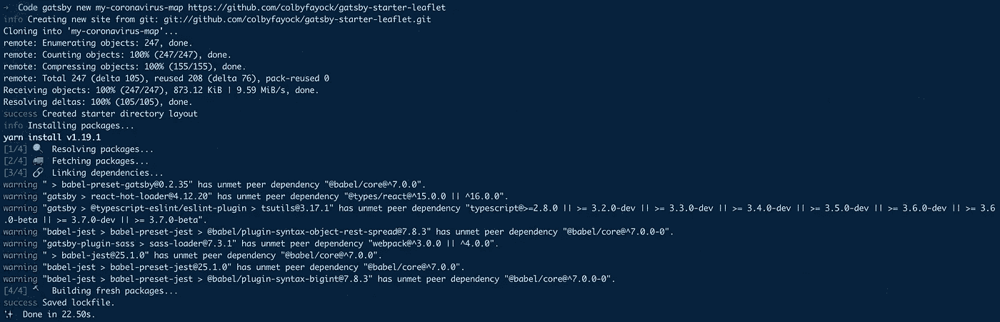
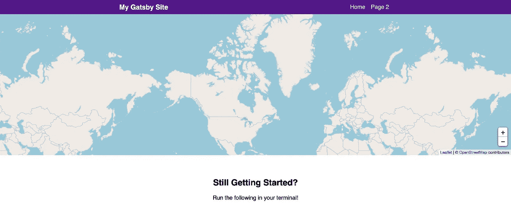
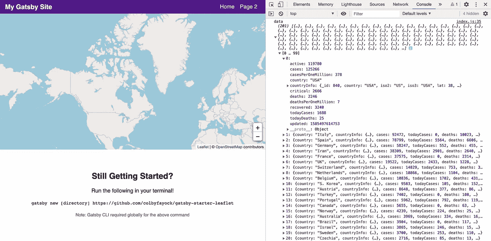
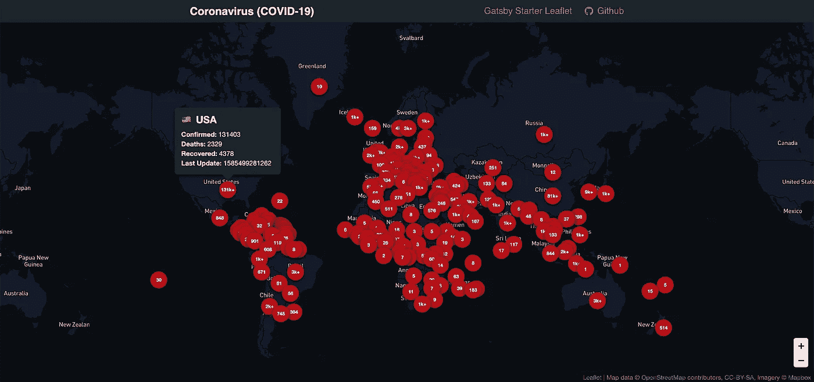

# 在 React 中创建冠状病毒(新冠肺炎)应用程序

> 原文：<https://javascript.plainenglish.io/create-a-coronavirus-covid-19-app-in-react-c83f4082c6db?source=collection_archive---------9----------------------->

## 了解如何使用 React、Gatsby 和传单创建冠状病毒地图和仪表板。


Photo by [Markus Spiske](https://unsplash.com/@markusspiske?utm_source=medium&utm_medium=referral) on [Unsplash](https://unsplash.com?utm_source=medium&utm_medium=referral)

今天在这篇文章中，我们将看到如何创建一个冠状病毒仪表板使用反应与盖茨比和传单。

在进入正题之前，让我们看看我们要遵循的步骤是什么:

*   传单入门。
*   正在获取 API 数据。
*   将数据转换成地理数据格式。
*   将数据添加到地图。

让我们进入主题。

# 传单入门

我们将创建一个应用程序，该应用程序使用一个包含冠状病毒统计数据的 API，该数据是国家实时面临的。

该地图将显示每个国家的标记和确诊病例数。然后，我们将包括一个小的弹出工具提示，显示详细信息。我们使用 OpenStreetMap 公共 tileserver。要开始使用，请遵循以下命令:

*   节点或纱线
*   盖茨比的 CLI - **纱全球添加盖茨比的 cli**

首先，我们必须为我们的地图建立一个基础。我们可以通过使用带有 React 的小册子 Gatsby starter 来做到这一点。

```
gatsby new my-coronavirus-map https://github.com/colbyfayock/gatsby-starter-leaflet
```



To create Gatsby map

然后导航到您的新项目并启动开发服务器。

```
cd my-coronavirus-map
yarn develop
```

现在，您将在浏览器中看到基本的地图应用程序。


Basic initial map

一般来说，地图是和微调器一起提供的，为了方便起见，我们想清理一些代码。文件 **src/pages/index.js** 是我们 app 的首页。删除 mapEffect 函数中的所有内容。

```
async function mapEffect({ leafletElement } = {}) {
}
```

然后为了更好的理解，为了方便起见，更改我们的 **LeafletElement** 的变量名。

```
async function mapEffect({ leafletElement: map } = {}) {
}
```

然后我们现在不需要标记，所以从**地图**组件中移除**标记**组件。

```
<Map {...mapSettings} />
```

我们必须删除文件中的以下所有导入和变量:

*   useRef
*   标记
*   承诺飞翔
*   getCurrentLocation
*   盖茨比 _ 宇航员
*   时间工作室
*   timeToOpenPopupAfterZoom
*   timeToUpdatePopupAfterZoom
*   嗡嗡声
*   popupContentHello
*   popupContentGatsby
*   马克里夫

现在让我们看看我们的地图是什么样子的。



New Map

# 获取 API 数据

在我们的应用程序中，我们将使用 **NOVELCOVID API** 。特别是，我们将使用 countries 端点来获取与之相关的所有国家的统计数据列表。

对于提出请求，我们将使用 axios。这是一个很好的 API，可以一直使用。如果您想使用 fetch 或您自己的请求库，请在您的代码中实现它。

运行代码开始安装 axios:

```
yarn add axios
```

安装后，再次重启您的服务器。

将 axios 包导入到 **pages/index.js** 文件中:

```
import axios from 'axios';
```

现在，在我们的 **mapEffect** 函数中，向 API 端点发出一个请求。

```
async function mapEffect({ leafletElement: map } = {}) {
    let response;

    try {
      response = await axios.get('https://corona.lmao.ninja/v2/countries');
    } catch(e) {
      console.log(`Failed to fetch countries: ${e.message}`, e);
      return;
    }

    const { data = [] } = response;
}
```

现在导航到控制台日志以查看数据对象，我们已经看到我们的数据成功提取！



After fetched the data

# 将数据转换成地理数据格式

现在我们有了数据，我们必须将它转换成地理数据格式，尤其是 [GeoJSON](https://geojson.org/) 格式。

让我们首先将这段代码添加到我们的项目中:

```
const { data = [] } = response;
const hasData = Array.isArray(data) && data.length > 0;

if ( !hasData ) return;

const geoJson = {
  type: 'FeatureCollection',
  features: data.map((country = {}) => {
    const { countryInfo = {} } = country;
    const { lat, long: lng } = countryInfo;
    return {
      type: 'Feature',
      properties: {
       ...country,
      },
      geometry: {
        type: 'Point',
        coordinates: [ lng, lat ]
      }
    }
  })
}
```

*   我们已经创建了一个名为 **hasData** 的新常量，用于检查我们的数据变量是一个数组并且有数据。
*   如果我们没有数据，我们希望将它返回到函数中，因为我们不想尝试添加我们没有的数据。
*   我们创建了一个 geoJson 对象，这是我们的 GeoJSON 文档。
*   我们正在使用的文档是类型 **FeatureCollection** ，因此特征将在我们的数据集中循环。
*   对于每个国家，我们以**纬度**和**液化天然气**的形式获取数据，为我们的地图创建一个点。

现在在我们的项目中添加 GeoJSON 文档。让我们看看它在 **geojson.io** 的 **console.log** 中是什么样子的。


geojson.io

# 将数据添加到地图

现在我们将 GeoJSON 文档添加到地图中。

```
const geoJsonLayers = new L.GeoJSON(geoJson, {
  pointToLayer: (feature = {}, latlng) => {
    const { properties = {} } = feature;
    let updatedFormatted;
    let casesString;

    const {
      country,
      updated,
      cases,
      deaths,
      recovered
    } = properties

    casesString = `${cases}`;

    if ( cases > 1000 ) {
      casesString = `${casesString.slice(0, -3)}k+`
    }

    if ( updated ) {
      updatedFormatted = new Date(updated).toLocaleString();
    }

    const html = `
      <span class="icon-marker">
        <span class="icon-marker-tooltip">
          <h2>${country}</h2>
          <ul>
            <li><strong>Confirmed:</strong> ${cases}</li>
            <li><strong>Deaths:</strong> ${deaths}</li>
            <li><strong>Recovered:</strong> ${recovered}</li>
            <li><strong>Last Update:</strong> ${updatedFormatted}</li>
          </ul>
        </span>
        ${ casesString }
      </span>
    `;

    return L.marker( latlng, {
      icon: L.divIcon({
        className: 'icon',
        html
      }),
      riseOnHover: true
    });
  }
});
```

*   我们已经创建了一个新的实例 **L.GeoJSON** ，它将 GeoJSON 文档转换成传单。
*   我们在实例中定义的自定义 **pointToLayer** 将允许我们自定义传单在地图中创建的地图层。
*   **L.marker** 将返回我们的自定义配置，其中包含一类容器图标和自定义 HTML。

我们必须在这里向我们的**assets/样式表/components/_map.scss** 文件添加一个 CSS 代码，以使它更具交互性:

```
.icon-marker {

  display: flex;
  position: relative;
  justify-content: center;
  align-items: center;
  color: white;
  width: 3.6em;
  height: 3.6em;
  font-size: .7em;
  font-weight: bold;
  background-color: $red-800;
  border-radius: 100%;
  box-shadow: 0 2px 5px rgba(black, .9);

  &:hover {

    .icon-marker-tooltip {
      display: block;
    }

  }

}

.icon-marker-tooltip {

  display: none;
  position: absolute;
  bottom: 100%;
  width: 16em;
  font-size: 1.4em;
  padding: 1em;
  background-color: $blue-grey-900;
  border-radius: .4em;
  margin-bottom: 1em;
  box-shadow: 0 3px 5px rgba(black, .9);

  &:before {
    display: block;
    position: absolute;
    bottom: -.6em;
    left: 50%;
    content: '';
    width: 1.4em;
    height: 1.4em;
    background-color: $blue-grey-900;
    transform: rotate(45deg);
    margin-left: -.7em;
  }

  h2 {
    font-size: 1.5em;
    line-height: 1.2;
    margin-bottom: .1em;
    margin-top: 0;
  }

  h3 {
    font-size: 1.2em;
    margin: .1em 0;
    font-weight: normal;
    color: $blue-grey-100;
  }

  ul,
  p {
    font-weight: normal;
  }

  ul {
    list-style: none;
    padding: 0;
    margin: .6em 0 0;
  }

}
```

现在我们已经创建了我们的 geoJson 图层，将其添加到我们的应用程序中。

```
geoJsonLayers.addTo(map)
```

它不会自动调整到中间。务必在 **index.js** 中添加以下代码，使其适合中心位置。

```
const LOCATION = {
  lat: 0,
  lng: 0
};
```

现在让我们看看我们的最终应用程序。



Final Coronavirus dashboard

# 结论

我希望你能喜欢，这个仪表板给出了世界各地案件的统计数据。您还可以在此应用程序中添加更多样式和功能。

感谢阅读！

## **简单英语的 JavaScript**

喜欢这篇文章吗？如果有，通过 [**订阅获取更多类似内容解码，我们的 YouTube 频道**](https://www.youtube.com/channel/UCtipWUghju290NWcn8jhyAw) **！**