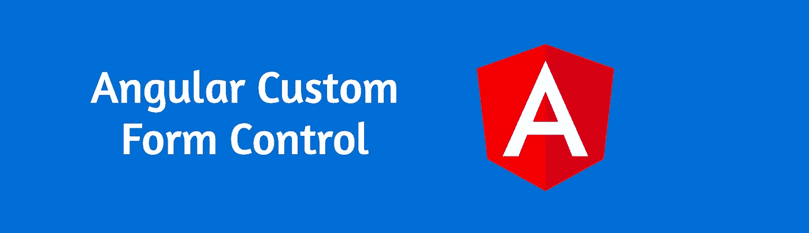

# 使用控件值访问器在 Angular 中创建自定义窗体控件组件

> 原文：<https://javascript.plainenglish.io/create-a-custom-form-control-component-in-angular-with-control-value-accessor-807f1304bcd7?source=collection_archive---------1----------------------->



> “食谱什么也没告诉你。学习技巧是关键”——汤姆·库里其奥

O 我如此喜欢 angular 的原因之一是它的开箱即用特性。Angular 提供了设置典型 web 应用程序所需的几乎所有现成的东西。Angular team 还提供了 [material](https://material.angular.io/) library，其中包含经过良好测试并随时可用的有用组件。作为一个 angular 开发者，我们享受着如此多的便利。太好了！但是，我们的应用并不总是典型的！我们可能需要在应用程序中实现非常复杂的行为来满足业务逻辑。

这种满足业务逻辑的过程有时可能包括拥有一个自定义的表单控件。例如，您可能需要创建一个漂亮的定制搜索组件，以便在整个应用程序中重用。在不同的应用程序中，您可能需要一个测验组件，该组件可以与表单控件连接起来，以提高可重用性和可扩展性。可能是这样的👇


Quiz component

上述组件就是我们今天关注的内容！

你会如何建造它？

天真的做法是根本不使用定制组件。我们可以重复构建它所需的代码，使用`*ngFor`进行循环，并对其使用`ngModel`或`formControl`。可以给你一个工作代码。但是，如果您想在应用程序的其他地方重用它，该怎么办呢？是的，你必须重复密码。我们都知道重复代码不是解决问题的方法，不是吗？

我最初的一个更好的想法是创建一个自定义组件，将其命名为`quiz.component.ts`，使用`@[Output](https://angular.io/api/core/Output),` 为父组件上的事件添加一个事件监听器，并手动更改父组件上的答案。那可能行得通。但是嘿，如果我想用`[[(ngModel)]](https://angular.io/api/forms/NgModel)`绑定它呢？或者我想和`[formControl](https://angular.io/api/forms/FormControl)?`一起用呢

这似乎不是直截了当的，不是吗？

但是幸运的是，angular 提供了一种方便的方法来做到这一点。
**我们来看看如何！**

# 引入控制值访问器接口！

角度 [**控制值访问器**](https://angular.io/api/forms/ControlValueAccessor) 可用于自定义与角度表单集成的表单控制指令。让我们看看医生怎么说

> 定义一个接口，作为 Angular forms API 和 DOM 中的本地元素之间的桥梁。

那听起来正是我们所需要的！

我们可以创建自定义的测验组件，并利用`ControlValueAccessor`在组件和表单 API 之间架起桥梁！

退出！我们开始吧。在我们跳到代码之前，我们需要创建我们的 angular 应用程序。

```
ng new ng-quiz
```

现在我们已经准备好了我们的应用程序，继续创建我们的*测验组件。*

```
ng g c quiz
```

此时，我们的应用程序中有两个组件。即`app.component`(通篇称为‘父组件’)`quiz.component`(称为‘测验组件’或‘自定义组件’)。

现在让我们来看看`ControlValueAccessor` 接口和实现相同。通过实现`ControlValueAccessor`接口并将自己注册为`NG_VALUE_ACCESSOR`提供者，任何组件都可以变成`ControlValueAccessor`。

`ControlValueAccessor`实现以下方法

1.  **registerOnChange —** 注册一个回调函数，当控件的值在 UI 中改变时调用这个函数。
2.  **writeValue —** 向元素写入一个值。
3.  **registerOnTouched —** 注册一个回调函数，该函数由表单 API 在初始化时调用，以在模糊时更新表单模型。
4.  **setDisabledState —** 当控件状态变为“禁用”或从“禁用”变为“禁用”时，由表单 API 调用的函数。根据状态，它启用或禁用适当的 DOM 元素。

当涉及到表单实现和验证时，上述所有方法都很有用。让我们看看如何利用这些方法并实现我们的`quiz component`。

我们的模板文件将如下所示👇

> 您需要导入*模板驱动表单*或*反应表单*模块，以便在您的模板中使用`ngModel`。您可以在本文后面看到如何做到这一点。

请注意，我在这里使用了[材料组件](https://material.angular.io/)以获得更好的风格，这完全是可选的。

代码是自我解释的。我们有一个将`ngModel`绑定到名为`value`的属性的单选按钮。相当主流的东西在这里，让我们来看看控制器的实现。

在上面的代码中，以下内容值得注意。

1.  我们的自定义表单组件，`QuizComponent`，现在的`implements` `ControlValueAccessor`，是从`@angular/forms`导入的。
2.  我们已经从`@angular/forms`导入了`NG_VALUE_ACCESSOR`并提供给了组件。
3.  `formwardRef`是必需的，因为当提供者注册时，我们的类还没有被定义，我们需要告诉**提供者构造函数**，这样它可以等待类被定义。

角度窗体控件不同于 DOM 窗体控件。angular 所做的是绑定到 DOM 元素的输入/输出，并为您提供结果。通过提供`NG_VALUE_ACCESSOR`,我们告诉 Angular 的表单 API 它如何从/向你的自定义表单控件读取和写入值。

我们在这里使用了`@Input`将特定的问题从父组件传递给我们的测验组件。另外，由`ControlValueAccessor`实现的方法也被连接起来。您可以在这里使用这些未使用的方法(onChange、onTouch)来实现验证和禁用/启用表单元素状态等功能。

差不多就是这样！现在，您拥有了一个全功能的自定义组件，可以在整个应用程序中与表单一起使用！

Usage with ngModel

这是我如何利用它的👆。或者，您可以将与表单控件一起使用，作为

Usage form form control

你可以在我的 [github](https://github.com/BharathRavi27/angular-custom-form-value-accessor) 上找到完整的项目供参考。

更多类似的文章👇

[](https://bharathravi.com/) [## Bharath Ravi | javaScript 文章

### 有能力的文章来提升你的网络技能。javaScript 全栈开发者 Bharath Ravi 的个人博客

bharathravi.com](https://bharathravi.com/) 

你可以在 twitter [这里](https://twitter.com/_bharath_ravi)找到我。

黑客快乐！