# 使用 React 创建全栈银行应用程序

> 原文：<https://javascript.plainenglish.io/create-a-full-stack-banking-application-using-react-23d0ef2f5bd2?source=collection_archive---------2----------------------->

## 第 3 部分:通过避免使用本地存储来存储 JWT 令牌，使应用程序免受 XSS 和 CSRF 攻击


Photo by [John Schnobrich](https://unsplash.com/@johnschno?utm_source=medium&utm_medium=referral) on [Unsplash](https://unsplash.com?utm_source=medium&utm_medium=referral)

这是构建全栈银行应用程序系列的第三部分。
你可以在这里查看第一部分[，在这里](https://medium.com/javascript-in-plain-english/create-a-fullstack-banking-application-using-react-e8c96d74cd39?source=friends_link&sk=5038dbe0d06acec7fdeed694690cb91a)查看第二部分

在本文中，我们将了解如何避免在本地存储中存储 JWT 令牌，以使应用程序更加安全，并防止 XSS 和 CSRF 攻击

## 我们开始吧

从这里的[克隆初始存储库代码](https://github.com/myogeshchavan97/fullstack_banking_app)，它是我们在本系列的第一部分[本文](https://medium.com/javascript-in-plain-english/create-a-fullstack-banking-application-using-react-e8c96d74cd39)中创建的

通过运行以下命令启动应用程序

```
cd server
yarn install
yarn start
```

这将启动`Express`服务器。

现在，在同一个项目文件夹中打开另一个终端，并执行以下命令

```
yarn install
yarn start
```

这将启动`React`应用程序。

现在，您可以在 [http://localhost:3000/](http://localhost:3000/) 访问应用程序

如果您还记得，我们将 JWT 令牌存储在登录时生成的本地存储中

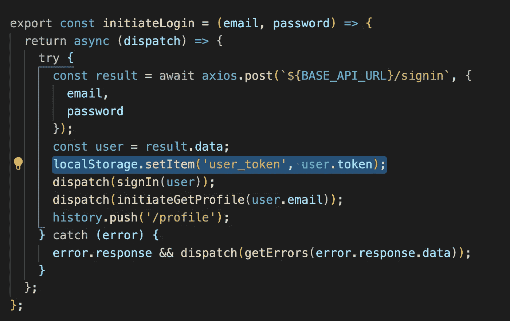

adding token to local storage

并且使用本地存储中的这个 JWT 令牌，我们在`src/utils/common.js`文件中的`maintainSession`函数中维护会话。

但是在本地存储中存储会话是不安全的，因为任何人都可以通过读取本地存储数据来窃取你的 JWT 令牌。在这里阅读这将如何产生安全问题。

所以要解决这个问题，我们需要使用由服务器创建的`HttpOnly` cookie，当我们使用`document.cookie`访问 cookie 时，它是不可访问的。

因此，让我们用`HttpOnly` cookie 替换本地存储功能。

打开`server/routes/auth.js`，在将令牌添加到`/signin` route 中的用户对象之前，通过添加以下代码创建一个 cookie:

```
res.cookie('token', token, {
 httpOnly: true
});
```

cookie 函数接受以下参数:

*   cookie 的名称
*   要存储在 cookie 中的值
*   附加选项


sign in route code

现在，重新启动服务器，注销并重新登录到应用程序。登录后，您将在`/signin`路由的响应头中看到`set-cookie`头。

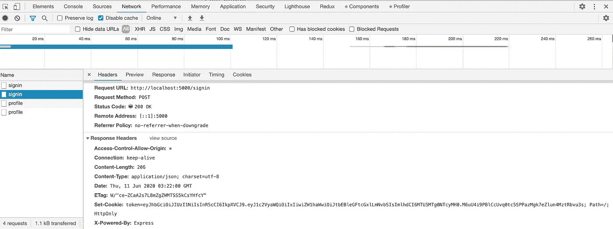

Set-Cookie header added in response

但是如果你检查 chrome 开发者工具上的应用程序标签，你会看到 cookie 没有显示在我们的应用程序的`cookie`部分，我们的应用程序运行在 [http://localhost:3000](http://localhost:3000) 。

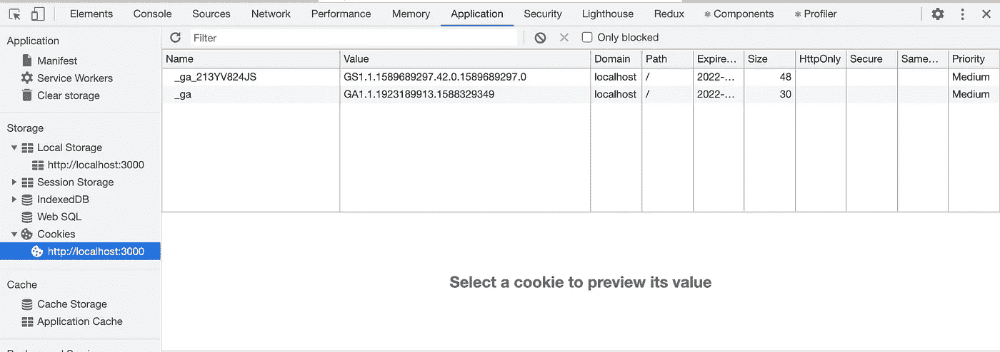

List of cookies

这是因为我们的`Express`服务器运行在端口`5000`上，你可以在`server/index.js`文件中验证，我们的`React`应用程序运行在端口`3000`上。检查下面的 API `Request URL`:

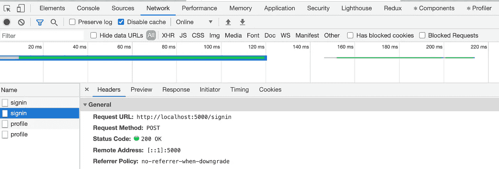

Server APIs running on port 5000

cookies 是`domain and port specific`的，所以如果它们是在端口`3000`上创建的，它们只在端口`3000`上可用，在`5000`上不可用。

那么我们如何解决这个问题呢？

`Create-react-app`提供了解决这个问题的简单方法。

打开我们的`React`应用程序的主`package.json`文件，并在文件末尾添加另一个带有关键字`proxy`的属性:

```
"proxy": "http://localhost:5000/"
```

现在，打开`src/utils/constants.js`文件并更改:

```
export const BASE_API_URL = 'http://localhost:5000';
```

收件人:

```
export const BASE_API_URL = '';
```

现在将`app.use(cors())`从`server/index.js`中移除，因为不再需要它，现在通过再次运行`yarn start`命令重启`Express`服务器和`React`应用程序，这样这些更改就会生效。

现在注销并重新登录到您的应用程序，这一次，您将看到 cookie 令牌值显示在`application`选项卡中。

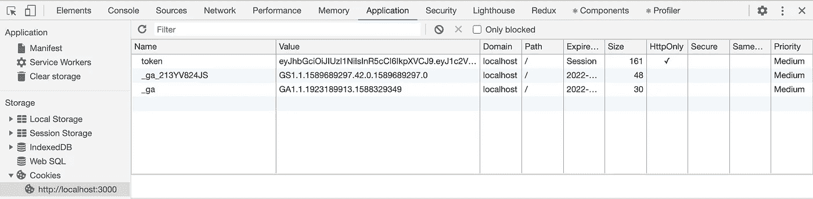

token in cookie

您还会看到`HttpOnly`列的复选标记，指明它是`HttpOnly`并且不能通过`document.cookie.`访问，因此我们的 jwt 令牌现在是安全的。

另外，如果您现在查看服务器 API 的请求 URL，它是 [http://localhost:3000/](http://localhost:3000/) 和**而不是**[http://localhost:5000/](http://localhost:5000/)。

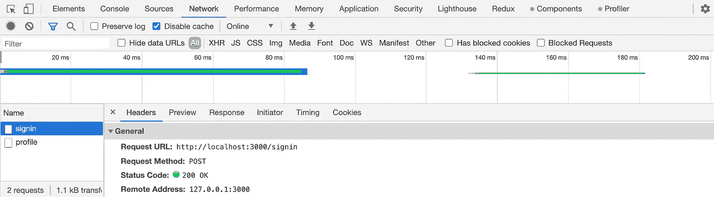

Server APIs running served on port 3000

因此`React`充当服务器的代理，并在端口`3000`上路由我们所有的应用编程接口请求，所以服务器上的 cookie 是在端口`3000`上创建的，并且可以在同样在端口`3000`上运行的`React`应用程序中访问。所以我们可以走了。

现在，如前所述，我们已经在`/signin`路由内的 cookie 中添加了令牌，但是为了在`auth middleware`中获取该令牌以便验证身份验证，我们需要安装`cookie-parser` npm 包。

从`server`文件夹安装`cookie-parser` npm 包:

```
yarn add cookie-parser@1.4.5
```

现在，我们将配置`Express`服务器来使用这个中间件。

打开`server/index.js`并在`app.use(express.json());`语句后增加另一个`app.use`调用:

```
app.use(cookieParser());
```

同时，导入顶部的`cookie-parser`:

```
const cookieParser = require('cookie-parser');
```

您的`index.js`现在会变成这样:

现在我们将使用`cookie`而不是`local storage`的令牌来维护会话。

打开`server/middleware/auth.js`，出现以下代码:

```
const token = req.header('Authorization').split(' ')[1];
```

添加以下代码:

```
const token = req.cookies.token;
```

**注意:**该令牌在`request.cookies`才有，因为我们在`server/index.js`文件中增加了`cookie-parser`，在增加回复的同时将其命名为`token`。

现在，重新启动服务器，注销并重新登录应用程序。登录后，您会在`/signin`路由的响应报头中看到`set-cookie`报头，也可以在`cookie`报头中的请求报头中看到。

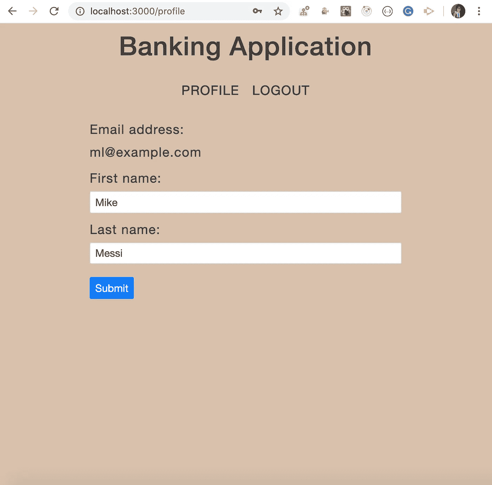

Profile page

因此`Express`正确地发送回了 cookie 中的令牌值，并且它也作为请求的一部分在每个服务器 API 中发送，因为我们登录了该 API，并且我们的配置文件信息也被显示出来。


Cookie in response header


Cookie in request header

但是，当您刷新页面时，您将退出应用程序。

这是因为我们需要添加代码来维护我们的`React`应用程序中的会话。

所以打开`actions/auth.js`文件和里面的`initiateLogin`功能，替换:

```
localStorage.setItem('user_token', user.token);
```

使用:

```
user.isAuthenticated = true;
```

这是有一个标志，所以我们可以使用它来识别任何文件是否登录。

现在，在`src/router`文件夹中创建一个新文件`PrivateRoute.js`，内容如下:

在`src/router`文件夹中新建一个文件`PublicRoute.js`，内容如下:

将`router/AppRouter.js`替换为以下内容:

用以下内容替换`utils/api.js`的内容:

在这里，我们通过调度一个动作将 redux 状态的 auth 对象中的`isAuthenticated`设置为 true，这样我们就可以限制对页面的公共访问，这些页面只有在登录后才能访问。

现在在`src/actions/auth.js`内部，用`post`替换`axios.post`的所有引用，并将`initiateLogout`功能代码更改为以下代码:

```
export const initiateLogout = () => {
  return async (dispatch) => {
    try {
      await post(`${BASE_API_URL}/logout`);
      return dispatch(signOut());
    } catch (error) {
      error.response && dispatch(getErrors(error.response.data));
    }
  };
};
```

现在，用以下代码替换`src/utils/common.js`中的`maintainSession`功能:

```
export const maintainSession = () => {
  const currentPath = window.location.pathname;
  if (currentPath === '/profile') {
    store.dispatch(initiateGetProfile());
  }
};
```

此外，移除定义在`maintainSession`功能下的`updateStore`功能。您也可以从`common.js`文件中删除`removeAuthHeader`功能:

现在，通过运行`yarn start`重启`Express`服务器和`React`应用程序，您可以看到应用程序工作正常，我们只使用`HttpOnly` cookie 来存储令牌。因此，本地存储的安全问题现在已经解决。

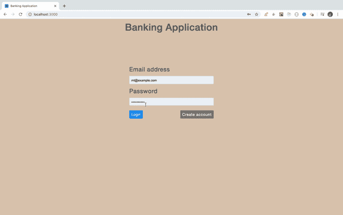

Application

你可以在这里找到 Github 的源代码直到这个点[。](https://github.com/myogeshchavan97/jwt-authentication-security/tree/using-httponly-cookie)

所以现在，使用`HttpOnly` cookie 我们已经保护了我们的应用免受`XSS(Cross Site Scripting)`攻击，但是我们的应用仍然不是完全安全的，因为`HttpOnly`cookie 仍然容易受到`CSRF(Cross Site Request Forgery)`攻击。

因此，让我们也为 CSRF 增加安全保障。

从`server`文件夹安装`csurf` npm 包:

```
yarn add csurf@1.11.0
```

打开`server/index.js`文件，进行如下修改:

```
const csrf = require('csurf');
const csrfProtection = csrf({ cookie: true });// before all the middlewares in app.use add following middleware
app.use(csrfProtection);app.get('/csrf-token', (req, res) => {
  res.send({ csrfToken: req.csrfToken() });
});
```

这里，我们通过设置`cookie: true`启用了`csrf`保护，然后添加了`csrf`保护作为中间件。

*注意:请确保在所有其他路由之前添加* `*csrfProtection*` *中间件，否则将无法正常工作。*

然后我们创建了一个`/csrf-token`路由，它发送回一个通过调用`csrfToken`函数生成的`csrf`令牌。

完整的`index.js`文件将如下所示:

现在，通过运行`yarn start`重启`Express`服务器和`React`应用程序，并尝试再次登录。

您将得到如下所示的`forbidden`错误:

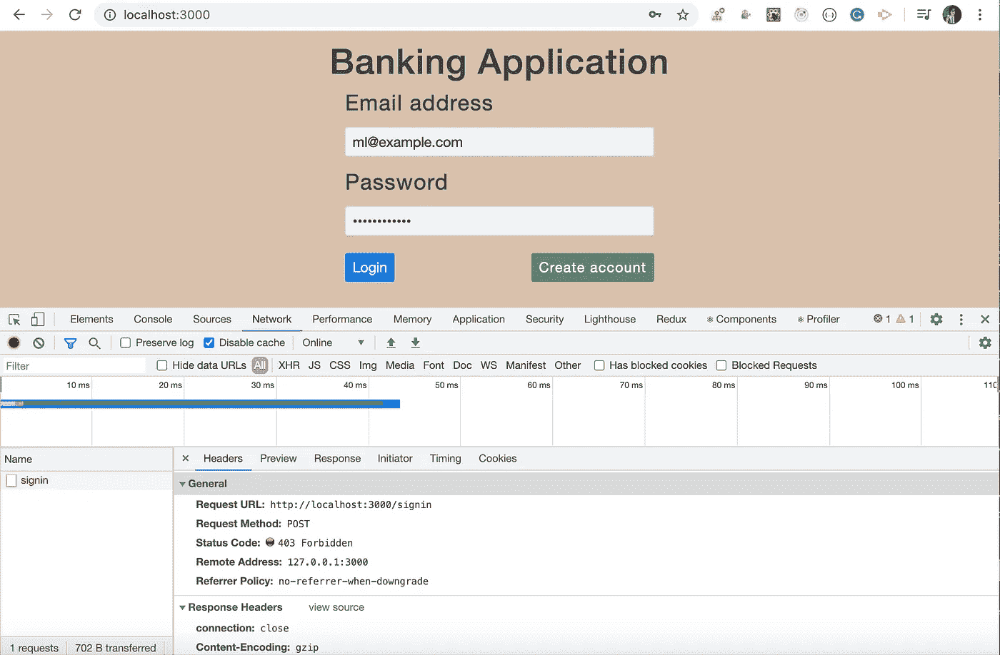

403 Forbidden error

如果您检查响应中的错误，您将看到`“invalid csrf token”`错误:

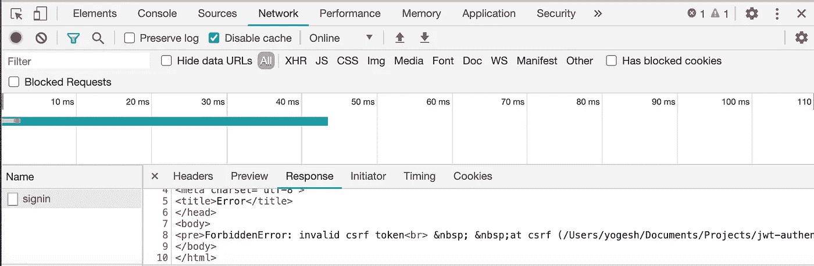

Invalid csrf token error

这是因为我们已经添加了 CSRF 保护，对于每个`not-get`请求，如`post`、`patch`、`delete`等，`csurf`库将期望为每个传入服务器的请求提供一个`_csrf` cookie。因此，我们需要确保对服务器的每个请求都添加了`_csrf` cookie。

为此，在`src/utils/common.js`文件中添加一个新函数`addCSRFToken`:

```
export const addCSRFToken = async () => {
  try {
    const result = await axios.get(`${BASE_API_URL}/csrf-token`);
    return result.data.csrfToken;
  } catch (error) {
    console.log(error);
  }
};
```

并用以下代码替换`utils/api.js`的内容:

我们在这里所做的是，对于我们发送到服务器的每个请求，我们都添加了一个`X-CSRF-Token`头以及包含从`server/index.js`文件的`/csrf-token`路由生成的`csrf`令牌的请求。

所以现在，如果您重启`Express`服务器和`React`应用程序并尝试登录，您将会看到，所有的 API 都在工作，我们的应用程序也在增加了`CSRF`安全性的情况下工作得很好。

你也可以在 Chrome 开发者工具的`applications`标签中看到`_csrf` cookie:

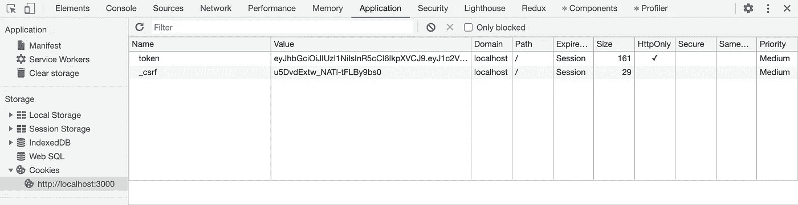

_csrf cookie

现在，我们已经完成了保护我们的应用程序所需的更改。


Working app with CSRF security

你可以找到 Github 的源代码，直到此时[这里](https://github.com/myogeshchavan97/jwt-authentication-security/tree/adding-csrf-security)

今天到此为止。我希望你学到了新东西。

**别忘了直接在你的收件箱** [**订阅我的每周简讯，里面有惊人的技巧、窍门和文章。**](https://yogeshchavan.dev/)