# 使用 React 创建全栈银行应用程序

> 原文：<https://javascript.plainenglish.io/create-a-full-stack-banking-application-using-react-part-2-6fb21200613a?source=collection_archive---------0----------------------->

## 第 2 部分:使用 PostgreSQL、Express、React 和 Node.js 堆栈创建应用程序


Photo by [Christin Hume](https://unsplash.com/@christinhumephoto?utm_source=medium&utm_medium=referral) on [Unsplash](https://unsplash.com?utm_source=medium&utm_medium=referral)

这是构建全栈银行应用程序系列的第二部分。如果你错过了第一部分，请点击这里查看

在本文中，我们将继续构建银行应用程序，通过添加选项来创建新的银行帐户，允许用户从帐户中存款和取款，并允许用户生成和下载 pdf 格式的交易报告。

## 我们开始吧

打开`server/scripts.sql`，添加`account`和`transactions`表格脚本:

在`components`文件夹下新建一个文件`Summary.js`，添加以下内容:

在`components`文件夹下新建一个文件`AccountForm.js`，添加以下内容:

在`components`文件夹下新建一个文件`Account.js`，添加以下内容:

这里，我们显示了`deposit`、`withdraw`和`summary`页面的按钮。

在`AppRouter.js`文件中为`/account`添加一条路径:

```
<Route path="/account" component={Account} />
```

现在，在`Header.js`内为`Account`组件添加链接:

现在，您的帐户页面将如下所示:

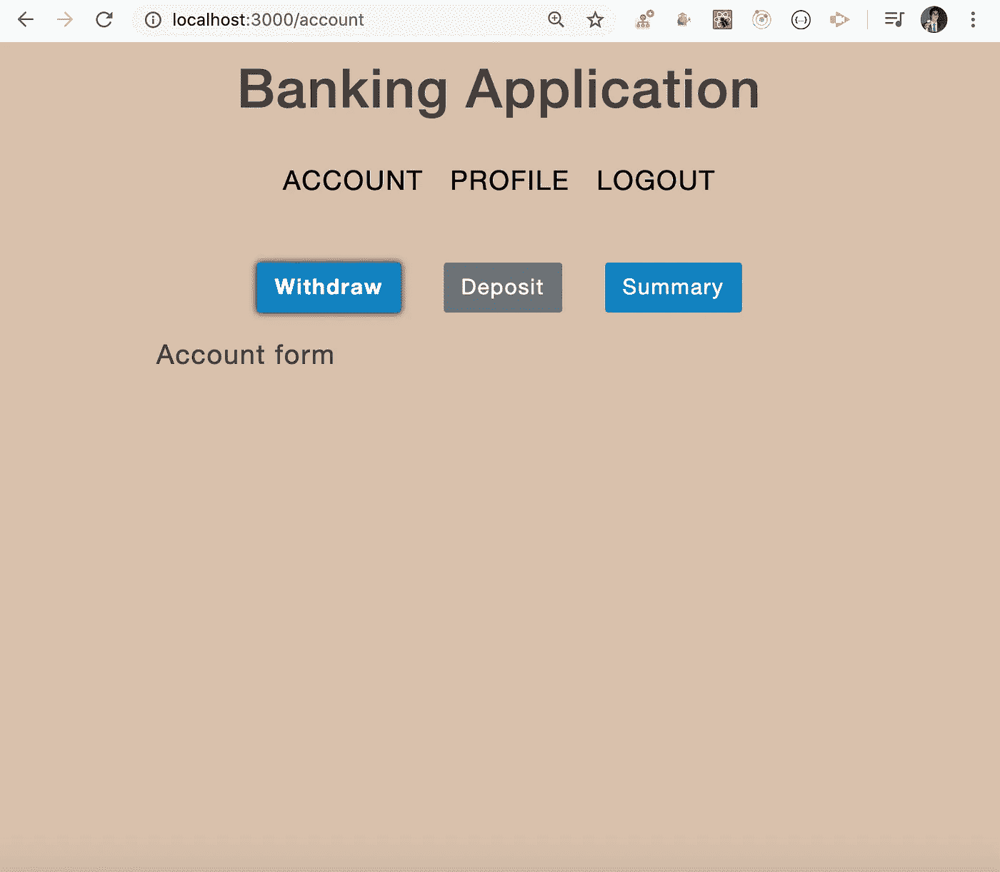

initial account page

现在，让我们在`AccountForm.js`文件中添加取款和存款金额以及更新账户详细信息的表单:

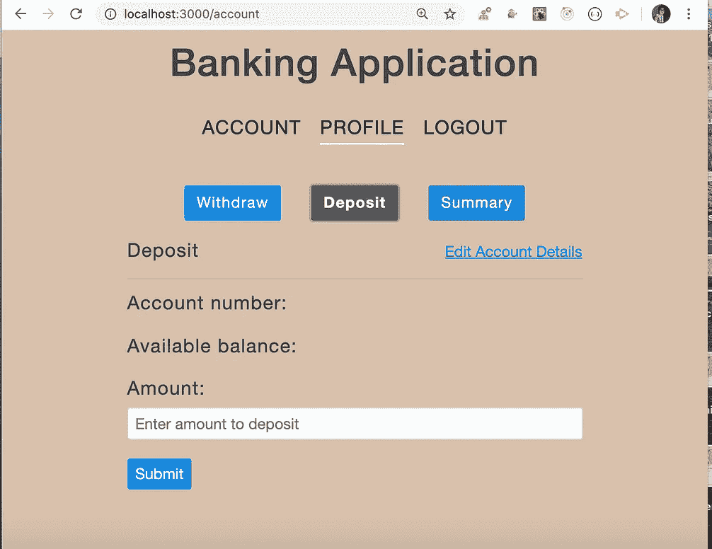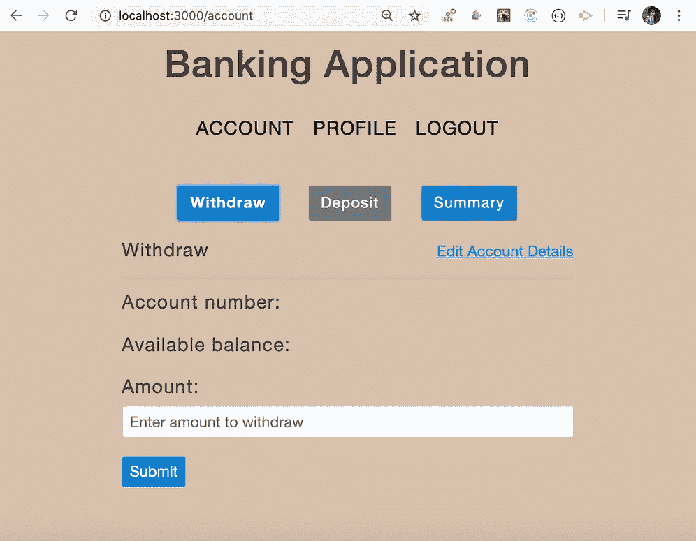

Withdraw and deposit amount forms

现在，我们有了取款或存款金额的表单，但我们没有添加银行帐户的选项，因此我们先添加一个表单来添加一个新的银行帐户。

在`components`文件夹下新建一个文件`AddAccountForm.js`，添加以下内容:

现在，我们将检查帐号是否存在，然后显示取款或存款的表单，否则我们将显示添加帐户的表单。

将`AccountForm.js`的内容替换为以下内容:

在`src/actions`文件夹下新建一个文件`account.js`，内容如下:

在`src/utils`文件夹下新建一个文件`mask.js`，内容如下:

该代码将仅显示账号的最后 4 位数字，其他数字将显示*。

在`server/routes`文件夹下新建一个文件`account.js`，添加以下内容:

注意，我们在这里导出了，`Router`和`getAccountByAccountId`函数，所以我们可以在另一个路由文件中使用它，而不需要重新编写相同的代码。这是因为我们需要在获取交易时调用`getAccountByAccountId`一次，在下载 pdf 报告时调用另一次。

将`account`路线添加到`server/index.js`文件中:

在`src/reducers`文件夹中创建一个新文件`account.js`，内容如下:

打开`store/store.js`并在里面加入`account`减速器；

现在，通过运行`yarn start`重新启动您的应用程序，当您转到帐户页面并单击取款或存款按钮时，您将能够看到添加帐户表单:

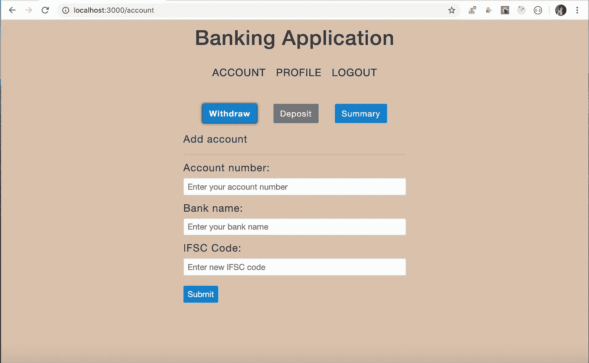

Add bank account form

当用户点击`Submit`按钮添加账户时，我们需要调用`initiateGetAccntDetails`函数，这样用户就可以看到取款或存款金额的表单。

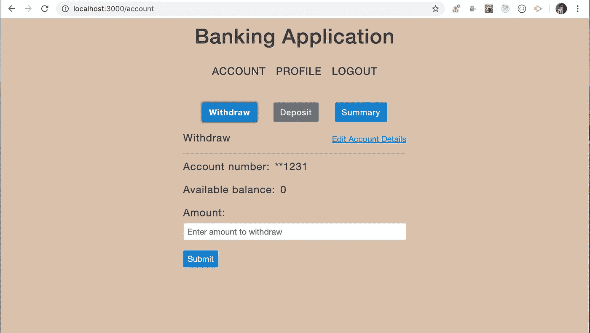

added account details

因此，我们在上面的`actions/account.js`文件的 try 块中为`initiateAddAccntDetails`函数添加了一个`return`语句:

```
return await post(`${BASE_API_URL}/account`, {
```

由于`initiateAddAccntDetails`被声明为`async`函数，`return`关键字将`return a promise`从函数中取出，在`AccountForm.js`中，在`handleAddAccount`函数内部，我们增加了一个`.then`处理程序来调用`initiateGetAccntDetails`函数:

```
handleAddAccount = (account) => {
  const { account_no, bank_name, ifsc } = account;
  this.props
    .dispatch(initiateAddAccntDetails(account_no, bank_name, ifsc))
    .then(() => this.props.dispatch(initiateGetAccntDetails()));
};
```

现在，尝试添加一个新帐户，并验证它是否按预期工作。

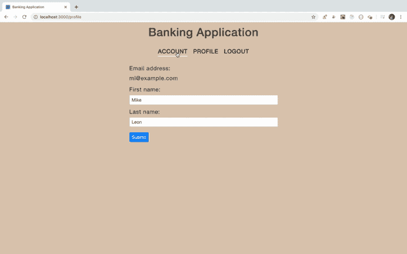

Add and edit account demo

您还可以通过点击`“Edit Account Details”`链接并输入新的`ifsc`代码来更新账户`ifsc`代码。

现在，在`server/routes`文件夹中创建一个新文件`transactions.js`，内容如下:

在这里，每当我们为`depositing`或`withdrawing`任何金额时，我们就在`transactions`表中添加细节，并从`account`表中更新`total_balance`列。所以我们在这里做两件事。

如果其中一个失败了，那么另一个也不会发生。如果`transactions`表被更新，但是`total_balance`列的值由于某种错误没有被更新，那么我们需要恢复添加到`transactions`表中的新数据，反之亦然。因此，我们将这两件事作为一个事务来执行，因此我们在这里使用的是`client.query`，而不是`pool.query,`，需要一起执行的语句将被添加到`await client.query('begin')`和`await client.query('commit')`之间。如果这些调用之间的任何查询失败，我们从 catch 块内部调用`await client.query('rollback')`,因此另一个事务将被恢复，这意味着要么两个都成功，要么都不成功。

这将确保表中的数据保持一致。

打开`server/db/connect.js`,在里面添加`getClient`功能，从文件中导出

将`transactions`路线添加到`server/index.js`文件中:

现在，在`src/actions`文件夹中创建一个新文件`transactions.js`，内容如下:

在`src/reducers`文件夹中新建一个文件`transactions.js`，内容如下

在`utils/constants.js`内添加以下常量

```
export const SET_TRANSACTIONS = 'SET_TRANSACTIONS';
export const ADD_TRANSACTION = 'ADD_TRANSACTION';
export const SET_ACCOUNT = 'SET_ACCOUNT';
export const UPDATE_ACCOUNT = 'UPDATE_ACCOUNT';
```

在`store/store.js`内增加`transactions`减速器

现在，您可以将`withdraw`或`deposit`金额存入银行账户。

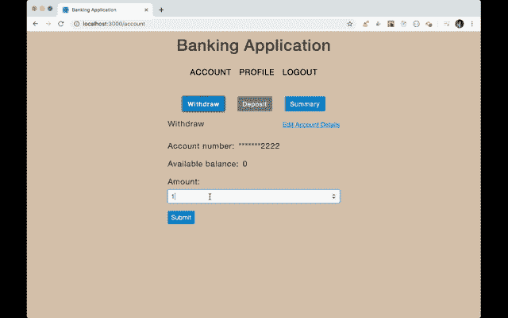

Withdraw and deposit amount demo

厉害！

但是有一个问题，当我们使用一个用户的电子邮件地址登录应用程序时，Redux 存储将包含这个特定的用户信息。现在，当我们使用另一个电子邮件地址执行`logout`和`login`操作时，我们将看到显示相同的先前用户帐户详细信息，因为一旦用户从应用程序注销，我们不会从 Redux 存储中清除帐户信息。

为了更好地理解它，请看下面的 gif:


Wrong account information

因此，要解决这个问题，我们需要在用户退出应用程序后清除帐户信息。

为此，打开`src/utils/constants.js`并添加另一个常数:

```
export const RESET_ACCOUNT = 'RESET_ACCOUNT';
```

在`actions/account.js`内，增加`resetAccount`功能:

```
export const resetAccount = () => ({
  type: RESET_ACCOUNT
});
```

在`reducers/account.js`内增加另一个开关盒

```
case RESET_ACCOUNT:
 return {};
```

现在，打开`actions/auth.js`，在`initiateLogout`函数内，调用`return dispatch(signOut());`之前，调用`resetAccount`动作创建函数。

```
export const initiateLogout = () => {
return async (dispatch) => {
  try {
    await post(`${BASE_API_URL}/logout`, true, true);
    localStorage.removeItem('user_token');
    dispatch(resetAccount());
    return dispatch(signOut());
  } catch (error) {
    error.response && dispatch(getErrors(error.response.data));
  }
};
};
```

现在，这将清除 Redux 存储数据，我们将获得正确登录的用户帐户详细信息。

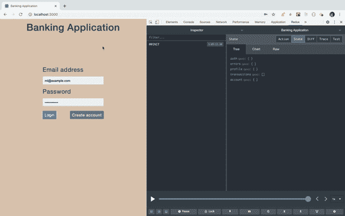

Correct account information

正如您所看到的，Redux 中的帐户信息被清除，因为第二个用户没有任何帐户信息，所以显示 add account 表单

现在，我们已经完成了取款和存款帐户功能，让我们继续学习生成和下载交易报告的功能。

从`fullstack_banking_app`文件夹安装所需的依赖项:

```
yarn add react-datepicker@3.0.0 react-bootstrap-table@4.3.1 downloadjs@1.4.7
```

现在，从`server`文件夹安装所需的依赖项:

```
yarn add ejs@3.1.3 puppeteer@3.3.0 moment@2.26.0
```

打开`components/Summary.js`文件，将内容替换为以下内容:

打开`src/index.js`，在 `main.scss`导入语句前添加`react-bootstrap-table`和`react-datepicker` CSS 导入:

```
import ['react-datepicker/dist/react-datepicker.css'](https://github.com/Hacker0x01/react-datepicker);
import ['react-bootstrap-table/dist/react-bootstrap-table-all.min.css'](https://github.com/AllenFang/react-bootstrap-table);
```

打开`actions/transactions.js`，在里面添加`setTransactions`、`initiateGetTransactions`和`downloadReport`功能:

在`components`文件夹下新建一个文件`Report.js`，内容如下:

打开`server/routes/transactions.js`，添加以下路线:

打开`server/utils/common.js`增加以下功能:

从文件中导出这些函数并导入到`routes/transactions.js`文件中:

```
const { getTransactions, generatePDF } = require('../utils/common');
```

在`server`文件夹中新建一个`views`文件夹，并在其中添加`transactions.ejs`文件，内容如下。(`ejs`是我们在 Node.js 中用来动态生成内容的模板引擎)

要了解更多关于如何使用和配置`ejs`的信息，请点击查看我之前的文章

打开`server/index.js`，在`app.use(express.json());`之后添加下面一行代码

```
app.set('view engine', 'ejs');
```

现在，通过运行`yarn start`命令启动服务器和 React 应用程序，一旦您单击摘要页面，您将看到以下屏幕

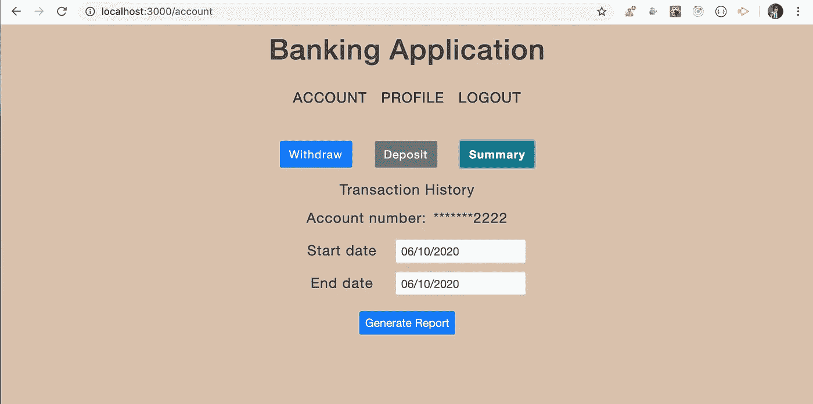

Summary page screen

您可以选择需要交易报告的日期范围，并点击`Generate Report`按钮。

如果在此期间没有任何事务，您将看到“未找到事务”消息。

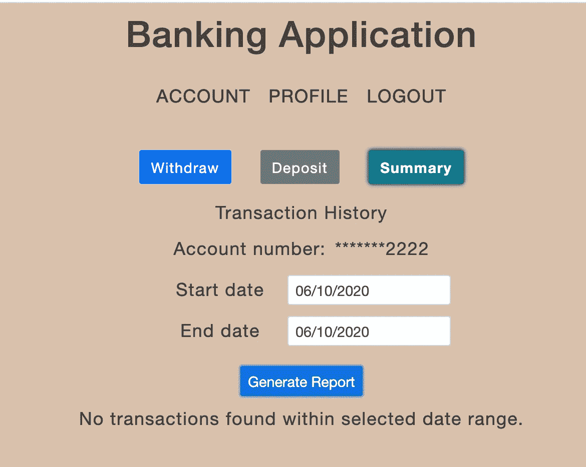

No transactions found message

如果在这些时间段内有交易，那么您将看到表格格式的交易，并且能够下载 pdf 格式的报告。

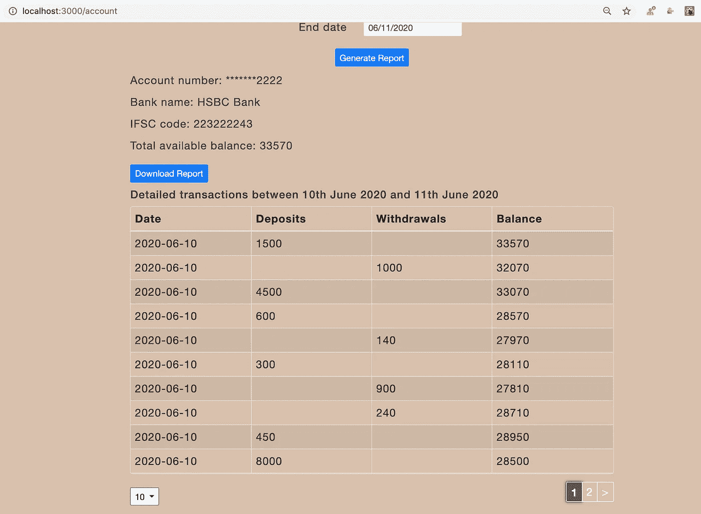

Transactions details

现在让我们来理解代码。

当我们单击摘要页面上的`“Generate Report”`按钮时，我们通过传递所选的`start date`和`end date`来调用`/transactions/account_id`路由，并获取交易列表，将其添加到 redux 存储中

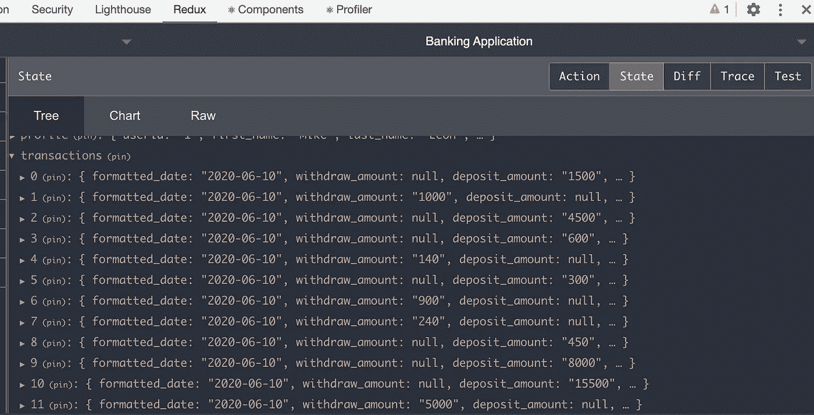

Transactions in the redux store

然后我们将这些事务传递给`Report.js`组件，并以表格形式显示出来。

现在，当我们单击`“Download Report”`按钮时，我们从`routes/transactions.js`文件调用`/download/account_id`路由，我们从`server/views`文件夹中获取事务列表并将事务列表传递给`transactions.ejs`文件，并使用`ejs.compile`方法从存储在`output`变量中的事务数组中生成具有动态值的数据，然后我们将`output` html 写入`transaction.html`文件，然后我们调用`generatePDF`函数，通过传递生成的`transactions.html`使用`puppeteer`库生成 pdf 文件

生成的`transactions.html`和`transactions.pdf`将存储在`views`文件夹中

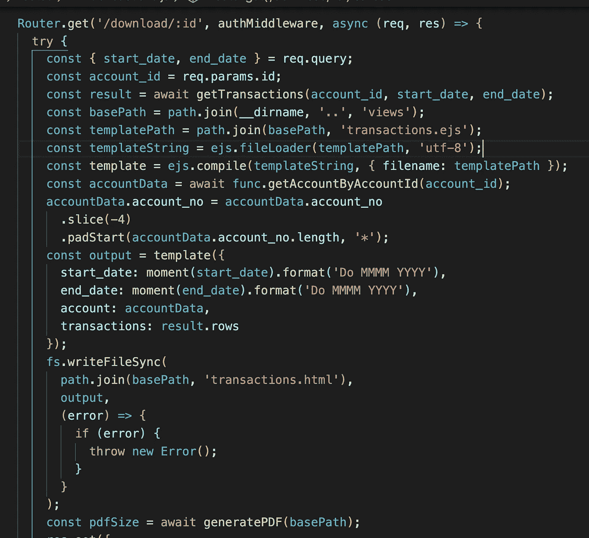

backend code to download pdf

如果你想了解如何使用`puppeteer`生成它的细节，查看我以前的文章[这里](https://medium.com/javascript-in-plain-english/generate-best-quality-pdf-of-any-webpage-html-page-in-nodejs-7b1223e1a3ac)

然后一旦生成 pdf，为了从服务器下载 pdf，我们通过将 pdf 的内容发送到由`downloadjs`库提供的`download`函数来使用`downloadjs`库。

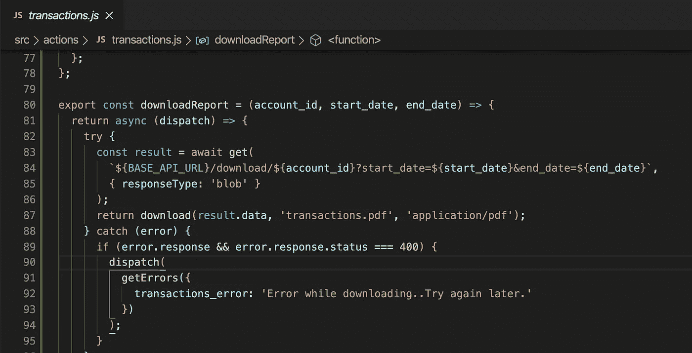

API call for downloading pdf

这里提到，`axios`呼叫的`{ responseType: 'blob' }`非常重要，因为这是一个 pdf 文件，否则你将得到一个空白的 pdf 文件。

**注意:**`downloadjs`库非常强大，我们只需将文件的内容作为第一个参数传递给`download`函数，将文件名作为第二个参数，将文件类型作为第三个参数，就可以下载任何类型的文件。

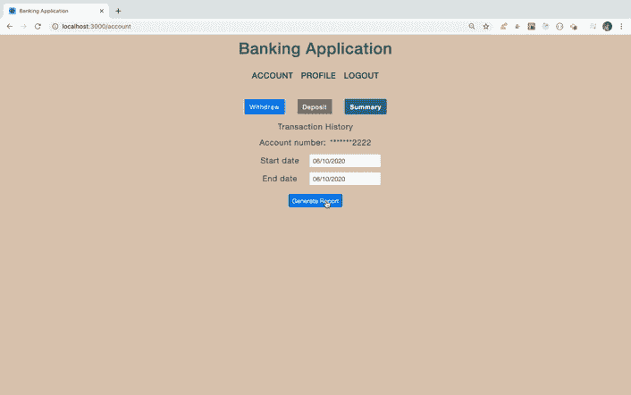

Download transactions report functionality

> 现在，我们完成了应用程序。让我们重温一下 CORS 问题。

如果你还记得，在第一部分中，我们已经在`server/index.js`文件中添加了以下代码

```
app.use(cors());
```

这允许我们从运行在端口`3000`上的 React 应用程序对运行在端口`5000`上的服务器进行 API 调用。

但是在没有任何选项的情况下添加 CORS 将允许任何人访问您的 API，从安全性的角度来看这并不好。因此，让我们看看如何在服务器端消除对 CORS 的需求。

从`fullstack_banking_app`文件夹中打开`package.json`，在`package.json`文件的末尾添加`proxy`属性

React proxy package.json

删除下面一行，因为现在不需要它了:

```
app.use(cors());
```

现在，打开`src/utils/constants.js`并改变:

```
export const BASE_API_URL = 'http://localhost:5000';
```

收件人:

```
export const BASE_API_URL = '';
```

现在，通过运行`yarn start`命令重新启动服务器和 React 应用程序，如果您转到 [http://localhost:3000/](http://localhost:3000/) ，您将看到 React 应用程序和 express APIs 也将在端口`3000`上可用，因此现在没有必要使用 CORS。这是因为添加`proxy`允许`create-react-app`充当`proxy`，现在我们所有的服务器 API 也将在端口`3000`上运行，尽管我们在端口`5000`上运行 express 应用。


Generating transaction report

您可以找到 Github 的源代码，直到现在:

*   使用类组件[这里](https://github.com/myogeshchavan97/fullstack_banking_app/tree/section-2-using-class-components)
*   使用钩子[这里](https://github.com/myogeshchavan97/fullstack_banking_app/tree/section-2-using-hooks)

**为保护本 app 免受**`**XSS**`**`**CSRF**`**攻击，请点击此处** **查看下一部分** [。](https://medium.com/javascript-in-plain-english/create-a-full-stack-banking-application-using-react-23d0ef2f5bd2?source=friends_link&sk=1f27f7bc70d67a9c55f8e65f62576288)**

**今天到此为止。我希望你学到了新东西。**

****别忘了直接在你的收件箱** [**订阅我的每周时事通讯，里面有惊人的技巧、诀窍和文章。**](https://yogeshchavan.dev/)**