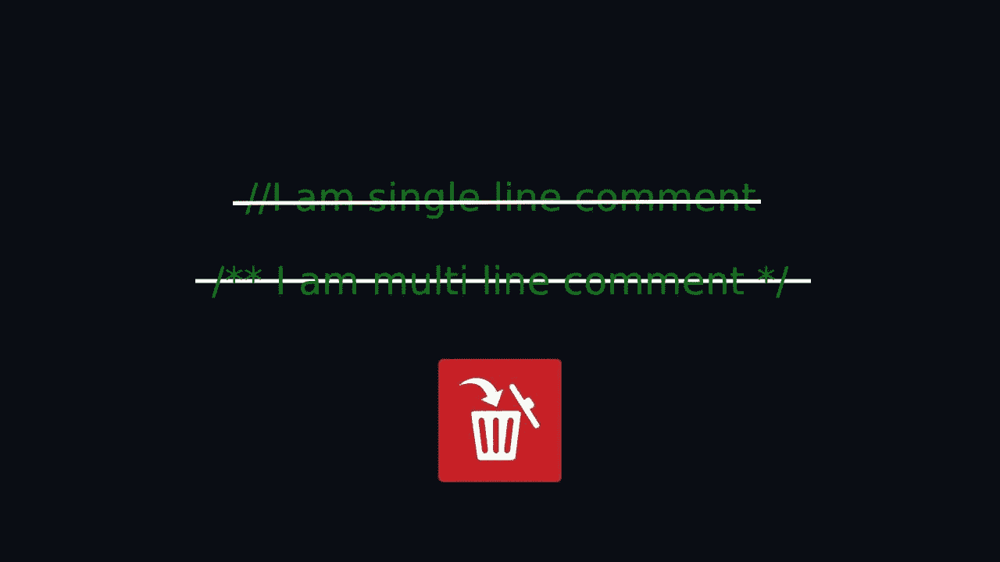
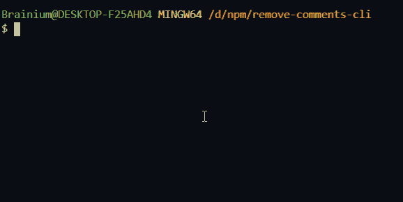
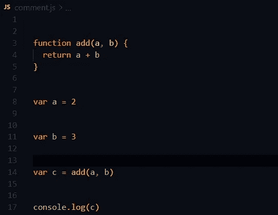
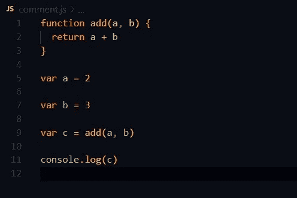
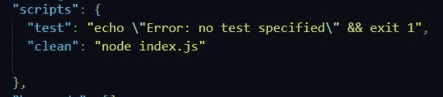

# 创建一个 JavaScript 注释移除器

> 原文：<https://javascript.plainenglish.io/create-a-javascript-comments-remover-9ae123c344b5?source=collection_archive---------6----------------------->



在本文中，我将向您展示如何创建一个注释移除器，它将从您的所有 JavaScript 文件中移除所有单个或多个注释。每当我们在一个项目中工作时，我们都会创建一些单行或多行注释，以便理解当前代码的必要性或可用性。这些单行或多行注释在开发阶段很有用，但不适合生产，因为这会增加文件的大小。

我知道文件大小的增量非常小。我们基本上在一个小项目上工作，这个小项目不需要优化到我们需要在生产中删除注释的程度😂。不过，如果有人想知道如何从 JavaScript 文件中删除所有注释，请阅读下面的文章。这对所有节点、Angular、React、Vue 或任何其他 JavaScript 项目都很有用。

1.  创建一个目录并初始化您的项目。

```
npm init -y#or yarn init -y
```

2.然后在项目目录中创建两个文件。

**index.js —** 这个文件将是我们项目的主文件，它将保存我们所有的代码。

**comment.js —** 这个文件包含一些带有单个和多个注释的虚拟 JavaScript 代码。

3.现在打开 **comment.js** 文件，粘贴下面的虚拟 JavaScript 代码。

4.现在是时候在我们的 **index.js** 文件中编写代码了，但是在此之前，我们需要安装一些必要的模块。将 [**条形注释**](https://www.npmjs.com/package/strip-comments) 安装到您的项目中。这个库基本上从字符串中去除了行或块注释。

```
npm i strip-commentsor yarn add strip-comments
```

5.现在将下面的代码粘贴到 **index.js** 文件中。

在终端内部运行`node index.js`命令将从声明的文件路径中去除注释，在我们的例子中是 **comment.js** 。



现在，如果我们查看我们的 **comment.js** 文件，我们可以看到我们所有的单个和多个注释都已经从文件中删除了。但是，我仍然对结果不满意，因为在注释的地方增加了空格。



为了解决这个问题，我们将使用更漂亮的模块来格式化我们的文件。所以现在安装[更漂亮的](https://www.npmjs.com/package/prettier)到我们的项目中，然后修改我们的一些代码。

```
npm i prettieror yarn add prettier
```

现在将使用更漂亮的**格式**方法来格式化我们的代码。用下面提到的来自您的 **index.js** 文件的代码替换先前的代码。

现在在您的终端中运行`node index.js`并检查 **comment.js** 文件。



这是完美的所有评论和空格已被删除。😃

但是，这仍然只适用于单个 JavaScript 文件，但是我们需要从项目中所有可用的 JavaScript 文件中删除注释。为此，我们需要将 [**glob**](https://www.npmjs.com/package/glob) 模块安装到我们的项目中。这个模块将在一个数组中给出项目中所有可用的 JavaScript 文件。

```
npm i globoryarn add glob
```

安装 glob 之后，从你的 **index.js** 文件中删除之前的代码，然后粘贴下面的代码。

就是这样，运行上面的代码`node index.js`将会删除所有 JavaScript 文件中的注释。

为了简化，最好不要反复使用`node index.js`，你可以在你的 package.json 中添加一个脚本，然后运行`npm run clean`



上述代码将适用于您的所有 JavaScript 项目。你需要做的就是创建一个 js 文件，粘贴上面的代码，并安装所需的库(glob，appellister，strip-comments)。

喜欢这篇文章吗？如果是这样，通过 [**订阅获取更多类似内容解码，我们的 YouTube 频道**](https://www.youtube.com/channel/UCtipWUghju290NWcn8jhyAw?sub_confirmation=true) **！**

感谢阅读。下面我分享了一个 GitHub 的资源库，供参考。

[](https://github.com/Mediumtutorial/remove-comments) [## 媒体教程/删除-注释

### 创建一个 JavaScript 注释移除器 GitHub 是超过 5000 万开发者的家园，他们一起工作来管理和审查…

github.com](https://github.com/Mediumtutorial/remove-comments)