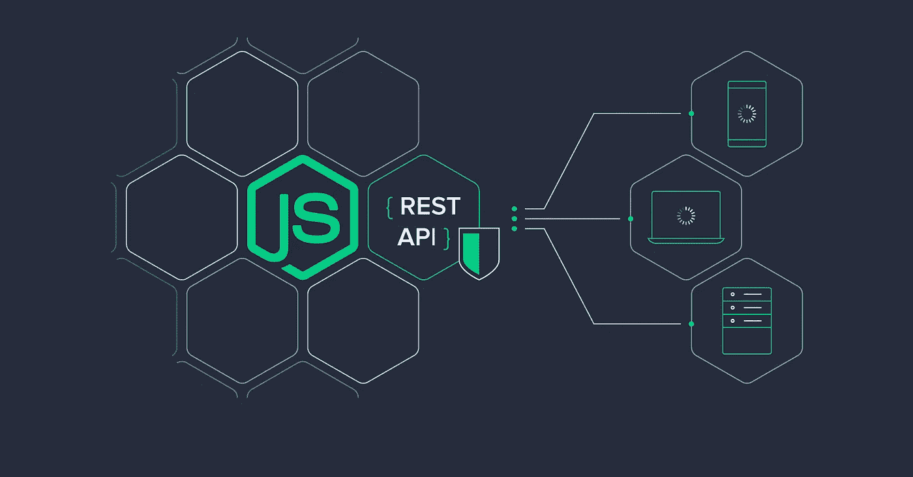
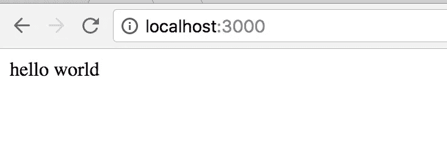

# 用 SQL 构建 Restful NodeJS API

> 原文：<https://javascript.plainenglish.io/create-a-nodejs-expressjs-moviestore-webapi-with-postgresql-database-6fbf60fce2da?source=collection_archive---------2----------------------->

我将展示如何用 SQL 数据库开发一个完整的 node.js web API。我们要做一个现实生活中的电影故事项目。

> 用 SQL 数据库构建一个通用的后端，它将支持所有的客户端应用程序。



**Node.js 是基于 Chrome 的 V8 JavaScript 引擎构建的 JavaScript 运行时**。我们将使用 Node 创建一个服务器端应用程序。由于节点的非阻塞异步特性，节点用于创建高可伸缩性、数据密集型和实时应用程序。它速度超快，并且使用 JavaScript。

记住！**节点不是编程语言**。它是执行 javascript 代码的运行时环境。Node.js 使用事件驱动的非阻塞 I/O 模型，这使得它变得轻量级和高效。它有一个包生态系统， **npm** ，是世界上最大的开源库生态系统。


Express 是一个最小且灵活的 Node.js web 框架，为 web 和移动应用程序提供了一组强大的功能。Express 是许多 Web 应用程序的“主干”,它们的后端在 NodeJS 中。转到 https://expressjs.com/en/starter/installing.html[的 express.js 文档](https://expressjs.com/en/starter/installing.html)

# **创建 Restful API**

创建一个新目录，从终端进入目录路径，输入`npm init`，它将初始化`package.json`，它将存储项目中使用的所有依赖项。

```
const express = require(‘express’)
const app = express()
const port = 3000app.get(‘/’, (req, res) => 
    res.send(‘Hello World!’)
)app.listen(port, () => console.log(`Example app listening on port ${port}!`))
```

## **节点门**

Nodemon 是一个实用程序，它将监视源代码中的任何更改，并自动重启服务器。非常适合开发。只需使用`nodemon`而不是`node`来运行您的代码，现在当您的代码更改时，您的进程将自动重启。要安装，获取 [node.js](https://nodejs.org/) ，然后从您的终端运行:

```
npm install -g nodemon
```

有关基本的快速 JS 路由，请阅读以下文章:

[](https://medium.com/@hidayatarg/basic-routing-in-express-js-30a374915cbb) [## Express.js 中的基本路由

### 路由是指确定应用程序如何响应客户端对特定端点的请求，这是一个 URI…

medium.com](https://medium.com/@hidayatarg/basic-routing-in-express-js-30a374915cbb) 

# 创建第一个应用程序

```
*mkdir* [101-NodeJs-MovieStore](https://github.com/hidayatarg/101-NodeJs-MovieStore) *&& cd* [101-NodeJs-MovieStore](https://github.com/hidayatarg/101-NodeJs-MovieStore)
```

创建一个新目录来保存这个项目，然后切换到那个目录。随着大多数节点项目的开始，打开您的终端，从初始化 NPM 开始，创建一个 *package.json* 文件。

然后将 Express 作为依赖项安装。

```
npm init --yes
npm install express --save
```

# 服务器

我们将从经典的“hello world”示例开始，解释它，然后从那里开始构建。首先，创建一个名为 *index.js* 的新文件，并添加以下代码。

```
const express = require('express');
const app = express();
const port = 3000;app.get('/', (req, res) => {
  res.send('hello world');
});app.listen(port, () => {
  console.log(`Express backend running on localhost: ${port}`);
});
```

这个应用程序启动一个服务器并在端口 3000 上监听连接。该应用程序会回复“你好，世界！”对于请求，以根 URL ( `/`)或 ***路由*** 。对于每一个其他路径，它将响应一个 **404 未找到**。

**通过以下命令从终端本地运行**

```
node app.js
```

或者

```
nodemon server.js
```

`node`和`nodemo`的主要区别。如果您使用`node`命令，每次保存后您手动运行该命令，或者如果您使用`nodemon`命令，它会在保存项目的任何文件后自动检测更改。

然后在浏览器中打开 *localhost:3000* ，您应该会看到:



**使用 PG 创建数据库和功能。**

pg 是 Node.js 的非阻塞 PostgreSQL 客户端，纯 JavaScript 和可选的原生 libpq 绑定。

## 安装 pg

```
npm install pg --save
```

为数据库创建 pool.js

```
const Pool = require ('pg').Pool;
const pool = new Pool({        
      user     : 'postgres',        
      host     : 'localhost',        
      database : '101-NodeJs-MovieStore',        
      password : '**',        
      port     : 5432,    
});
module.exports = pool;
```

通过 SQL 客户端在数据库中创建电影表

```
CREATE TABLE movies(   
 id serial PRIMARY KEY,   
 title VARCHAR,   
 cover VARCHAR,   
 created_on TIMESTAMP
);
```

用 movie.js 文件创建一个新文件，并放入以下代码

```
const pool = require('./pool')

const getMovies = (request, response) => {
        pool.query('SELECT * FROM movies ORDER BY "id" DESC', (error, results) => {
            if (error) {
                throw error
            }
            const res = {
                success: true,
                data: results.rows.sort(item =>item.as)
            }
            response.status(200).json(res)
        });
}

const getMoviesById = (request, response) => {
    const id = parseInt(request.params.id)

    pool.query('SELECT * FROM movies WHERE id = $1', [id], (error, results) => {
        // if remove return use if else
        if (error) {
            return response.status(500).json({ errors: { global: "Something went wrong" } });
        }
       return response.status(200).json(results.rows[0])
    });
}

const createMovie = (request, response) => {
    const { errors, isValid } = validate(request.body);

    if (isValid){
        const { title, cover } = request.body
        pool.query('INSERT INTO movies (title, cover) VALUES ($1, $2) RETURNING * ', [title, cover], (error, results) => {
            if (error) {
               return response.status(500).json({ errors: { global: "Something went wrong" } });
            }
          return  response.status(201).json(results.rows);
        })
    } else {
        response.status(400).json({ errors });
    }   
}

const validate = (data) => {
    let errors = {};
    if (data.title === '') errors.title = "Can't be empty";
    if (data.cover === '') errors.cover = "Can't be empty";
    const isValid = Object.keys(errors).length === 0;
    return { errors, isValid };
};

const updateMovie = (request, response) => {
    const id = parseInt(request.params.id)
    const { title, cover } = request.body

    pool.query(
        'UPDATE movies SET title = $1, cover = $2 WHERE id = $3',
        [title, cover, id],
        (error, results) => {
            if (error) {
                return response.status(500).json({ errors: { global: "Something went wrong" } });
            }
            return response.status(200).send(`User modified with ID: ${id}`)
        }
    )
}

const deleteMovie = (request, response) => {
    const id = parseInt(request.params.id)

    pool.query('DELETE FROM movies WHERE id = $1', [id], (error, results) => {
        if (error) {
            return response.status(500).json({ errors: { global: "Something went wrong" } });
        }
        return response.status(200).json('OK')
    });
}

module.exports = {
    getMovies,
    getMoviesById,
    createMovie,
    updateMovie,
    deleteMovie,
}
```

现在我们需要更新 index.js

```
const express = require('express')
const bodyParser = require('body-parser')
const app = express()
const config = require('./config');
const cors = require('cors');

app.use(bodyParser.json())
app.use(
    bodyParser.urlencoded({
        extended: true,
    })
)
app.use(cors());
app.get('/', (request, response) => {
    response.json({ info: 'Node.js, Express, and Postgres API' })
})

const db = require('./queries')

app.get('/api/movies', db.getMovies)
app.get('/api/movies/:id', db.getMoviesById)
app.post('/api/movies', db.createMovie)
app.put('/api/movies/:id', db.updateMovie)
app.delete('/api/movies/:id', db.deleteMovie)

app.use((req, res) => {
    res.status(404).json({
        errors: {
            global: "Still working on it. Please try again later when we implement it."
        }
    });
});

// port listening
app.listen(config.port, () => {
    console.log(`App running on port ${config.port}.`)
})
```

和 config.js

```
module.exports = {
    port: '8080',
}
```