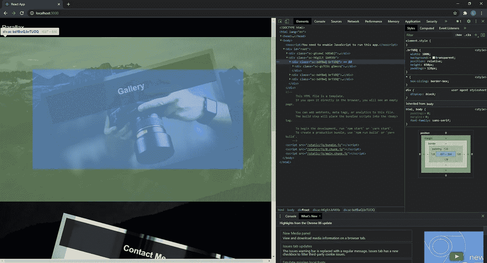

# 使用反应和风格化组件创建带有浮动卡的视差背景

> 原文：<https://javascript.plainenglish.io/create-a-parallax-background-with-floating-cards-using-react-styled-components-69ccddb2515e?source=collection_archive---------4----------------------->

## **我们将创造什么**

这是成品的视频。

基本，但展示了一些很酷的东西。你有视差滚动效果，以及一些像浮动卡一样的奖励。

注意:本教程中使用的所有图像都可以在文章末尾找到。

## **本教程的步骤**

1.  在我们开始之前
2.  使用样式化组件创建全局样式
3.  创建视差组件
4.  创建卡组件

**开始前**

确保你有一个安装了样式化组件库的基本的 react 应用程序。最简单的方法是打开一个终端并运行:

`npx create-react-app parallax`

然后导航到新创建的`parallax`文件夹并运行:

`npm i styled-components`

您可以通过直接 CSS 来实现，但是本教程将使用样式化的组件。

## **使用样式化组件创建全局样式**

现在，我们的应用程序可能已经应用了一些样式，即默认边距和填充应用于所有 html 文档。我们可以使用`styled-components`中的`createGlobalStyle`功能将其关闭。

在您的顶级组件(我的是`App.jsx`)中，写下以下内容:

现在`createGlobalStyle`中定义的样式将应用于整个文档。

## **创建视差组件**

讽刺的是，视差部分可能是最简单的部分。我们甚至不需要为它创建适当的反应组件。相反，我们只使用一个基本样式的组件。

在我的项目中，我通常创建一个`components`文件夹，然后在里面创建一个`styled.js`文件来保存所有样式化的组件。因此，添加了视差组件后，`components/styled.js`如下所示:

我们在第 1 行导入`styled-components`库。然后，我们在第 3 行创建视差样式的组件，并使其成为`div`。

在第 4 行，我们将视差组件的背景设置为图像。您可以在本文底部的参考资料部分找到我使用的背景图像。我把我的放在`img`文件夹里。

在第 5 行和第 6 行，我们告诉背景覆盖 div 的整个大小，然后告诉它不要滚动文档的其余部分。`background-attachment: fixed`就是这么做的。

然后，我们只需使 div 与视口的宽度相同。

确保在`App.jsx`中渲染你的新视差组件。我的现在看起来像这样。

您不会看到太多，因为视差组件中没有任何内容。

## **创建卡片组件**

Card 组件负责呈现您在本文开头的演示视频中看到的盒子和图像。和以前一样，这一部分需要的所有图片都在下面的参考资料部分。

卡组件本身并不复杂。我已经存到`components/Card/index.jsx`里了。看起来是这样的:

第 2 行的导入是我们稍后将创建的样式化组件。

道具是`children`(这是我们将在卡片上看到的文本)，`alignment`决定卡片将出现在页面的哪一面，`img`是卡片应该使用的图像的路径。

卡片组件的其余部分是样式，位于`components/Card/styles.js`。这是:

这里有很多，我们可以一点一点来。

## *卡片容器*

组件是一个透明的 div，作为卡片本身的包装器。这里有一张来自 Chrome devtools 的图片，应该会让它看起来更清楚。

由于窗口的宽度，这张截图中的牌叠得更多。但是，正如你所希望看到的，`CardContainer`只是创造了一个空间来容纳卡片，并通过一些填充将其与其他卡片分开。它也有`position:relative`，所以我们可以使用 css 属性如`left`和`right`在里面放置卡片。

## *卡片内容*

`CardContent`样式的组件是渲染实际卡片本身的组件。我们从一些基本的东西开始，比如填充、背景色、宽度和高度。我们还设置了`position:absolute`，这样我们就可以用`left`和`right`对其进行定位。然后我们给它一个指针，这样它就像一个链接。

在第 19 行，我们使用*插值*来获得我们传递给`CardContent`组件的道具。这与在 javscript 字符串中插入变量是一样的，就像 so `${someVar}`一样，只是我们传入的不是变量，而是一个回调函数。这个回调访问我们传递给组件的道具，这就是为什么我们可以取出`img`道具。然后我们从回调函数中返回我们想要的东西，这是图像的路径。总之，第 19 行将被编译成`background: url(img/photography.jpg);`或我们传递给它的任何其他图像路径。

我们在第 22 行做了类似的事情，只是稍微复杂一点。我们抢的是`alignment`道具，不是`left`就是`right`。然后，我们使用一个三元表达式来管理我们返回的 css。如果对齐方式是“右对齐”，我们要确保返回的 css 将卡片定位在屏幕的右侧，并将其正向旋转 15 度。如果道具是“左”，我们做相反的事情。

最后，每当我们将鼠标悬停在卡片上时，我们就在卡片上设置一个边框。

## *卡片正文*

CardText 组件负责在卡片上呈现带有白色文本的黑色横幅。这里的 CSS 非常简单。

随着卡组件的创建，我们可以将它添加到我们的`App.jsx`文件中。我们还想用一些卡片对象创建一个数组，这样卡片就可以呈现出来了。

这就是`App.jsx`现在的样子。

注意，我们正在导入 Card 组件，并且在第 18 行创建了一个`cards`数组。

我们覆盖了第 37 行的`map`数组，每次都创建一个新的`Card`组件。我们使用三元组来计算对齐属性，如果索引变量被 2 整除(偶数)或不能整除(奇数),三元组将返回“left”。这具有在地图的每次迭代中在`left`和`right`之间交替的效果。

完成所有这些后，您应该能够启动您的应用程序，并看到与演示视频中几乎相同的内容(除了标题，但我将省略这一部分，因为它只是一个基本组件)。

这篇文章是基础的，但是提供了一个起点，从这里你可以通过分层视差背景或者将它们与 CSS 动画结合来创建更复杂的效果。积木很简单，但是通过把它们放在一起，你可以创造出一些非常酷的东西。

感谢阅读。