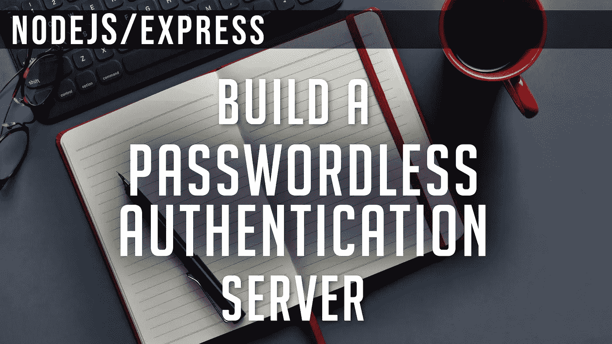

# 创建无密码认证服务器

> 原文：<https://javascript.plainenglish.io/create-a-passwordless-authentication-server-dac438182374?source=collection_archive---------6----------------------->

## 使用 Node.js 和 Express 为您的应用程序创建一个简单的登录系统



我们将使用 Node.js 和 Express 创建一个 Express REST API 服务器。我们不会创建和管理数据库来验证用户凭证，但是我们会在 JavaScript 代码中模拟这种行为。

## 我们开始吧。

我们将从安装所有需要的包开始。

```
>> npm init -y
>> npm install express body-parser cors jsonwebtoken nodemailer
```

**注:** 1。**快递** —为我们的服务器路由
2。**主体解析器** —用于提取请求对象主体中传输的信息
3。 **cors** —允许跨来源资源共享(域调用之间)
4。 **jsonwebtoken** —构造一个 **JWT** (jsonwebtoken)，我们将使用它进行认证
5。**节点邮件程序** —允许我们的服务器发送电子邮件

我们还需要一个名为“ngrok”的程序。它允许我们向外界公开我们的
**本地主机**地址 127.0.0.1。

当我们点击传递到我们电子邮件收件箱的神奇链接时，如果我们指向' **localhost** '，你的电子邮件服务器(Protonmail，Outlook，Gmail 等。)不会知道‘localhost’是什么。

我们必须重定向到一个真实的网址。

你可以在这里找到**ngrok**:[**https://ngrok.com/**](https://ngrok.com/)

要启动到本地主机的隧道，只需打开命令行 shell 并键入，

```
>> ngrok http 3000
```

## 让我们为我们的服务器创建基本的脚手架。

我们将创建**三个路由**，一个基本的 404 处理程序路由，和一个
错误处理中间件。

我们将有一个'**/send _ magic _ link**'**POST**route，它将接收一个电子邮件地址，查找与之关联的唯一 ID，并向该电子邮件地址发送一个神奇的链接。

然后，我们需要一个'**/authenticate _ user**'**GET**路由，它将从用户的电子邮件收件箱获取重定向，在 URL 查询参数中获取 **JWT** (jsonwebtoken)，并对其进行身份验证。

最后，我们有一个'**/welcome**'**GET**route，它只显示一个文本，通知用户他们现在已经登录。

**注意:**
获取“**ngrok**”HTTP URL，并将其保存在服务器文件的一个变量中。我们以后会需要这个。

## 让我们填写我们的'/send_magic_link '路线。

当我们获得用户的电子邮件地址时，我们将模拟检查我们的数据库，寻找一个唯一的' **sub** '(subject) ID。
这让我们能够用我们开发的任何一款应用来个性化他们的体验。

一旦我们得到他们的**潜艇**，我们将建造一个 **JWT** 。
将会有:
- an ' **iss** '(issuer)，us
-an '**exp**'(expiration date)，从创建令牌起 5 分钟
- a ' **sub** '(subject)，我们的用户的唯一 ID
-a '**nonce**，一个可以标识整个令牌的随机唯一字符串。

我们用一个**秘密**来构造我们的 **JWT** 。这使我们能够确保令牌没有被其他任何人修改。

构造好令牌后，我们使用' **nodemailer** '将其发送到用户的电子邮件。
我这里用的是 ***谷歌的 Gmail 服务器*** ，**smtp.gmail.com**。
“**auth**”属性应该是**您的电子邮件帐户的用户名和密码**。

**注意:**
注意我们邮件的 HTML 正文。
我们已经构建了一个锚标签，它通过“ **ngrok** ”代理将用户指引到我们的 REST API。
同样，我们在那个“ **href** ”的 ***查询字符串*** 中附加 **JWT** 。

## 让我们来解决“/authenticate_user”路线。

在' **/send_magic_link** '路由中，我们向用户发送了一个链接，通过查询参数中的令牌将他们重定向到我们的' **/authenticate_user** '路由。

我们将首先提取令牌。一旦我们有了它，我们将使用我们的'**秘密**'来验证 **JWT** 。

在我们验证了用户传递给我们的令牌与我们传递给他们的令牌相同之后，我们可以模拟一些数据库事务:

创建唯一的' **session_id** '并将其放入数据库。
获取用户信息。

如果我们想用这些信息做些什么，我们可以在这里做。

相反，我们只需要用两个 cookie 将用户重定向到我们的“ **/welcome** ”路径:它们是唯一的“ **sub** 和唯一的“ **session_id** ”。

## 最后是我们的“/欢迎”路线。

这是最基本的。
我们将向用户发送一条消息，通知他们“**登录了**”运行该服务器的应用程序。

```
// ...
    res.status(200).send(
        `<h1>Welcome</h1>
        <br>
        <h3>You are now logged into the *APP*</h3>`
    );
// ...
```

如果你想要更深入的指导，可以看看我在 YouTube 上的完整视频教程，**一个对象就是一个**。

## 创建您自己的无密码认证服务器| Node.js & Express