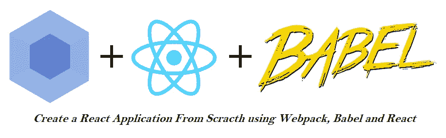
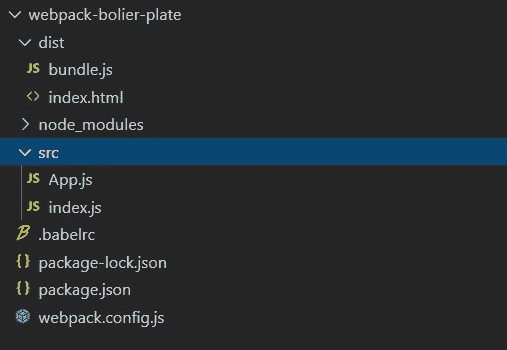

# 使用 webpack、babel 和 React 从头开始创建 React 应用程序

> 原文：<https://javascript.plainenglish.io/create-a-react-application-from-the-scracth-using-webpack-babel-and-react-79a7913c8f61?source=collection_archive---------0----------------------->



Webpack 4.2, React 16.9 and babel 7.3

这篇文章有助于理解“创建-反应-应用”命令是如何在幕后工作的。您可以使用 webpack、babel 和 react 库从头开始构建 react 应用程序。

**从头开始构建 React 应用程序应该遵循的步骤。**

打开命令提示符，开始按顺序执行以下命令。

> 1.mkdir 网络包-bolier-plate
> 
> 2.光盘网络包-锅炉-板
> 
> 3.npm 初始化-y
> 
> 4.npm 安装 react-dom react-hot-loader
> 
> 5.NPM install—save-dev web pack web pack-CLI[@ babel/preset-react](http://twitter.com/babel/preset-react)babel-loader[@ babel/core](http://twitter.com/babel/core)[@ babel/preset-env](http://twitter.com/babel/preset-env)[@ hot](http://twitter.com/hot)-loader/react-DOM web pack-dev-server

## 操纵文件。

1.  现在创建一个名为 **webpack.config.js** 的文件，并将以下内容复制到其中。

```
const webpack = require('webpack');
const path = require('path');

const config = {
  entry: [
    'react-hot-loader/patch',
    './src/index.js'
  ],
  output: {
    path: path.resolve(__dirname, 'dist'),
    filename: 'bundle.js'
  },
  module: {
    rules: [
      {
        test: /\.(js|jsx)$/,
        use: 'babel-loader',
        exclude: /node_modules/
      },
      {
        test: /\.css$/,
        use: [
          'style-loader',
          'css-loader'
        ],
        exclude: /\.module\.css$/
      },
      {
        test: /\.css$/,
        use: [
          'style-loader',
          {
            loader: 'css-loader',
            options: {
              importLoaders: 1,
              modules: true
            }
          }
        ],
        include: /\.module\.css$/
      }
    ]
  },
  resolve: {
    extensions: [
      '.js',
      '.jsx'
    ],
    alias: {
      'react-dom': '@hot-loader/react-dom'
    }
  },
  devServer: {
    contentBase: './dist'
  }
};

module.exports = config;
```

3.用以下内容替换 **package.json** 中的脚本部分。

```
"scripts": {
    "build-dev": "webpack --mode development",
    "build-prod": "webpack --mode production",
    "start": "webpack serve --hot --mode development"
}
```

4.创建 **src** 文件夹和**创建 app . js**文件并添加以下内容。

```
import React from "react";
import { hot } from 'react-hot-loader/root';class App extends React.Component {    
   render() {   
      const { name } = this.props; 
      return (<><h1> Hello {name}</h1></>);
   }
}
export default hot(App);
```

5.创建 **src** 文件夹和**创建 index . js**文件并添加以下内容。

```
import React from "react";
import ReactDOM from "react-dom";
import App from "./App";var mountNode = document.getElementById("app");
ReactDOM.render(<App name="Kailas" />, mountNode);
```

6.创建一个名为**的新文件。babelrc** 并在该文件中有以下内容。

```
{
    "presets": [ [ "@babel/preset-env", {"modules": false}], "@babel/preset-react"], "plugins": [ "react-hot-loader/babel"]}
```

6.在 **dist** 文件夹下创建**index.html**文件，并复制以下内容

```
<!DOCTYPE html>
<html>
   <head>
       <title>Kailas Create-react-app-project</title>
       <meta charset="utf-8">
   </head>
<body>
   <div id="app"></div>
   <script src="bundle.js"></script>
</body>
</html>
```

7.运行**“NPM run build-dev”**查看您的第一个构建导出到‘dist’文件夹😊

8.现在运行**“NPM run start”**命令来查看应用程序的工作情况。

下面是最终的文件夹结构供参考。



Folder Structure

**注意:** *我一直在关注这个 youtube 视频* *教程，但在它的基础上添加了我自己的定制和*在[【https://createapp.dev/】](https://createapp.dev/)*的现场演示。*

## **如果你只是想使用现有的代码，那么遵循以下步骤:**

1.  你既可以使用命令**git clone**[**【https://github.com/Kailashw/webpack-boiler-plate】**](https://github.com/Kailashw/webpack-boiler-plate)**来克隆回购协议，也可以简单地从[位置](https://github.com/Kailashw/webpack-boiler-plate)下载 zip 文件。**
2.  **转到下载文件的位置并打开命令提示符。**
3.  **运行**“NPM 安装”****
4.  **随后是**“NPM 运行构建开发”****
5.  **以及**“NPM 启动”****

**这个题目到此为止。感谢您的阅读。**

## **进一步阅读**

**[](https://bit.cloud/blog/how-to-create-a-composable-react-app-with-bit-l7ejpfhc) [## 如何用 Bit 创建一个可组合的 React App

### 在本指南中，您将学习如何使用 Bit 构建和部署一个成熟的可组合 React 应用程序。建立一个…

比特云](https://bit.cloud/blog/how-to-create-a-composable-react-app-with-bit-l7ejpfhc)** 

***更多内容请看* [***说白了就是***](https://plainenglish.io/) *。报名参加我们的* [***免费每周简讯***](http://newsletter.plainenglish.io/) *。关注我们关于* [***推特***](https://twitter.com/inPlainEngHQ) ，[***LinkedIn***](https://www.linkedin.com/company/inplainenglish/)*，*[***YouTube***](https://www.youtube.com/channel/UCtipWUghju290NWcn8jhyAw)*[***不和***](https://discord.gg/GtDtUAvyhW) *。对增长黑客感兴趣？检查出* [***电路***](https://circuit.ooo/) *。****