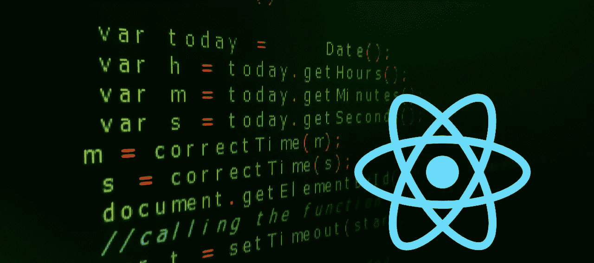
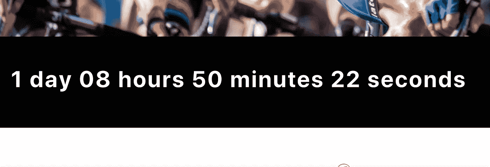

# 在 React 中创建一个可重复使用的事件倒计时器

> 原文：<https://javascript.plainenglish.io/create-a-reusable-event-countdown-timer-in-react-580c0356a32?source=collection_archive---------6----------------------->



React 是前端开发最流行的 JavaScript 框架之一。它让 UI 开发变得轻松。使用 React，很容易构建管理自己状态的封装组件。

在这个简短的教程中，我将构建一个组件，负责为未来事件倒计时。



为此，需要 React 的设置，还需要您的 JavaScript 知识(React 组件、道具和状态)。

# **让我们开始编码**

我更喜欢以这样一种方式构建我的应用程序，这样我就可以更容易地根据它们的功能来定位文件。我通常将可重用模块放在 src/components/common 目录中。(*你可以随心所欲地构建你的应用*)。

在 src/components/common 文件夹中，创建一个文件并将其命名为 CountDownTimer.jsx。

```
import React, { Component } from ‘react’;class CountDownTimer extends Component {
   render() {
     return <></>
   }
}
```

我们需要在组件中定义一些状态，这些状态将用于显示以天、小时、分钟和秒为单位的当前倒计时。用下面的代码更新 CountDownTimer 类。

```
...
class CountDownTimer extends Component {   state = {
     days: 0,
     hours: '00',
     minutes: '00',
     seconds: '00',
     timeUp: false } render() {
     const {days, hours, minutes, seconds, timeUp} = *this*.state;
     const dayString = days > 1 ? 'days' : 'day'; return (
        timeUp ?
          <p>Event in progress</p> 
          :
          <p>{ `${days} ${dayString} ${hours} hours ${minutes}  minutes ${seconds} seconds` }</p>
     ); }
...
```

在上面，我们定义了一些状态并将它们的值初始化为 0，这样我们就可以有一个默认值 **0 天 00 小时 00 分钟 00 秒。**还定义了超时状态，并将其初始化为**假，**这有助于跟踪事件日期是否在过去，然后向最终用户显示**事件正在进行中**。

现在，让我们来定义计算活动日期倒计时的逻辑。用下面的代码片段更新您的代码。

```
...componentDidMount() {
   setInterval(() => {
      let eventDate = +new Date(*this*.props.date);
      let difference = eventDate - +new Date(); if (difference < 1) {
         *this*.setState({ timeUp: true });
      } else {
         let days = *Math*.floor(difference / (1000 * 60 * 60 * 24));
         let hours = *Math*.floor((difference / (1000 * 60 * 60)) % 24);
         let minutes = *Math*.floor((difference / (1000 * 60)) % 60);
         let seconds = *Math*.floor((difference / (1000)) % 60);
         *this*.setState({
            hours: hours > 9 ? hours : `0${hours}`,
            minutes: minutes > 9 ? minutes : `0${minutes}`,
            seconds: seconds > 9 ? seconds : `0${seconds}`,
            days
         });
      }
   }, 1000)
}render() {

...
```

在上面的代码中，我们从 props 获得了事件日期(它将作为 date 传递给这个组件)。在前面的 **+** 的帮助下，这个日期被传递给 date 对象以创建一个时间戳(从 1970 年 1 月 1 日开始，以毫秒为单位)。此外，我们得到了未来日期和当前时间之间的差异。如果差值不小于 1，那么我们将计算日、小时、分钟和秒并更新它们的状态，否则我们将 **timeUp** 的状态设置为 **true** 。所有这些都封装在 **setInterval** 中，setInterval 每 1 秒运行一次，并使 render 方法以此间隔刷新。

请参见下面 out CountDownTimer 组件的完整代码:

```
import React, { Component } from ‘react’;class CountDownTimer extends Component {state = {
     days: 0,
     hours: '00',
     minutes: '00',
     seconds: '00',
     timeUp: false}componentDidMount() {
   setInterval(() => {
      let eventDate = +new Date(*this*.props.date);
      let difference = date - +new Date();if (difference < 1) {
         *this*.setState({ timeUp: true });
      } else {
         let days = *Math*.floor(difference / (1000 * 60 * 60 * 24));
         let hours = *Math*.floor((difference / (1000 * 60 * 60)) % 24);
         let minutes = *Math*.floor((difference / (1000 * 60)) % 60);
         let seconds = *Math*.floor((difference / (1000)) % 60);
         *this*.setState({
            hours: hours > 9 ? hours : `0${hours}`,
            minutes: minutes > 9 ? minutes : `0${minutes}`,
            seconds: seconds > 9 ? seconds : `0${seconds}`,
            days
         });
      }
   }, 1000)
}render() {
     const {days, hours, minutes, seconds, timeUp} = *this*.state;
     const dayString = days > 1 ? 'days' : 'day';return (
        timeUp ?
          <p>Event in progress</p> 
          :
          <p>{ `${days} ${dayString} ${hours} hours ${minutes}  minutes ${seconds} seconds` }</p>
     ); }
}export default CountDownTimer;
```

现在是时候在其他组件中使用倒计时时间了。该组件可以在任何其他组件中使用，但是出于本教程的目的，我们将在 App.js 文件中使用它。打开 App.js 文件，用下面的代码更新 render 方法。

```
import React, { Component } from "react";
import "./App.css";
import CountDownTimer from "components/common/CountDownTimer";class App extends Component { render() {
      return (
         **<CountDownTimer date="01/20/2021" />** );
   }}export default App;
```

运行应用程序并在浏览器上查看结果。