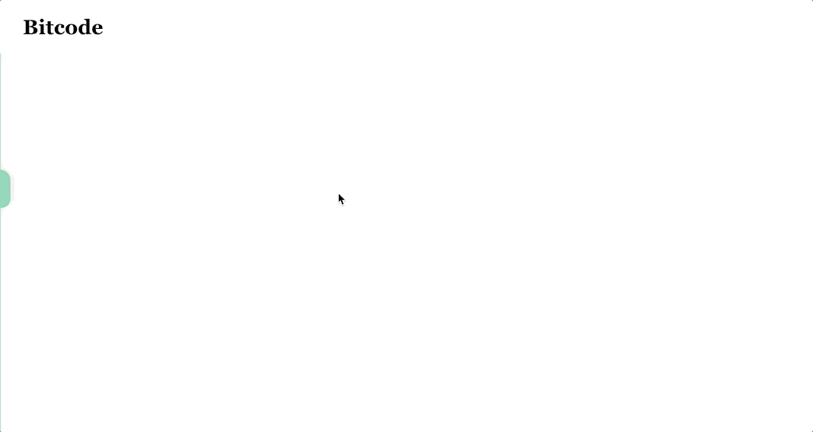
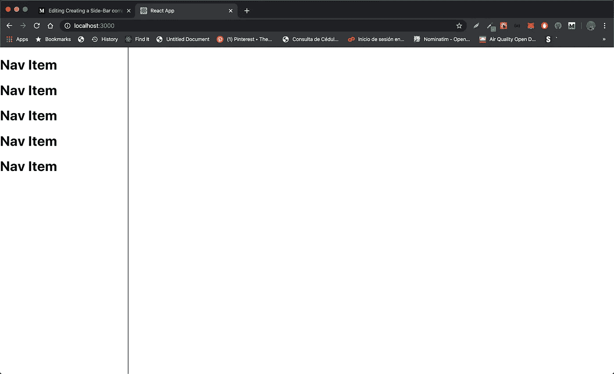
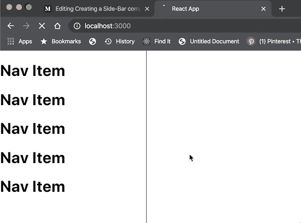
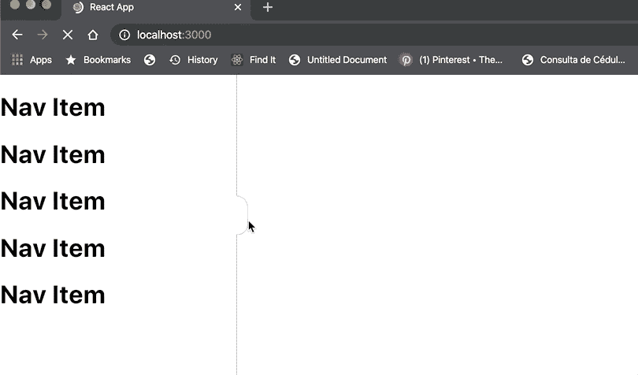

# 使用 React 创建可重用的侧栏组件

> 原文：<https://javascript.plainenglish.io/create-a-reusable-sidebar-component-with-react-d75cf48a053a?source=collection_archive---------0----------------------->


Photo by [Filiberto Santillán](https://unsplash.com/@filijs?utm_source=medium&utm_medium=referral) on [Unsplash](https://unsplash.com?utm_source=medium&utm_medium=referral)

## 创建一个平滑过渡的侧边栏从未如此简单。立即阅读了解如何操作！

如果你刚刚接触 React——一般来说是 web 开发——你可能会想知道开发者是如何创建像下面这样的很酷的动画边栏的。



Sidebar I created for a website I’m building

我们将实现一个侧边栏，可以由用户切换-打开或关闭。

让我们从把每件事情分解成小而简单的步骤开始吧！

# 创建组件并传递道具。儿童

## 我们的侧边栏将收到三个道具

*   **宽度**:图表的实际宽度。
*   **高度**:我们设置高度为最小高度
*   **儿童**:儿童道具是 react 中的一个特殊关键字。孩子将呈现你在<侧边栏>标签之间添加的任何内容。

如果我们希望侧边栏看起来总是一样的，我们可以创建一个 div 而不是 React。对它进行分段和样式化，但是因为我们想让它可重用，所以我们让它这样，这样我们就可以根据情况完全定制它。

如前所述，我们使用 **props.children** 以便我们可以在组件中放置任何我们想要的东西，而不必局限于特定的结构或设计。

## 例如

## 会是这个样子



现在我们都设置好了，我们可以继续在组件第一次呈现的时候动画化侧边栏。

# 制作边栏动画



为了在侧边栏第一次加载时制作动画，我们将使用 react 钩子。

## 实现 React 的 useEffect 挂钩

当组件第一次呈现时，我们将更新侧边栏的位置。为此，我们将一个空数组作为第二个参数放在 *useEffect* 中。这样，它将等同于 *componentDidMount* 。

## 我们如何制作侧边栏的动画？

我们的状态变量“xPosition”将决定侧边栏在屏幕中的 x 坐标。因为我们希望滚动条从左向右滑动，所以我们希望它隐藏在屏幕的左侧。

## 使用变换:平移(x，y)

为此，我们将 xPosition 设置为等于条形的宽度，但是在左边。我们可以通过使用-width(相当于 width * -1)来做到这一点。

它必须为负，因为*变换*从它将变换的元素的左侧开始其效果。

> 注意，我们也可以将 transform-origin 改为从右边开始，并将位置设置为 0 来隐藏侧边栏。

## 平移元素时应用平滑过渡

我们的侧边栏现在将有效地开始隐藏，因为位置是负的。当它呈现时——使用 use effect——我们可以将位置更新为 0 以显示侧边栏。

最后，为了创建一个平滑的过渡，我们将侧栏 div 的 css 过渡属性设置为

```
transition: 1s ease
```

太好了！我们已经成功地创建了一个加载时打开的侧边栏，但是关闭它呢？如果我们希望我们的组件被用户切换，我们必须实现附加逻辑和一个按钮来使它工作。

# 切换侧栏



为了获得上面显示的结果，我们必须使用一个按钮来根据它的当前值修改 xPosition。因为我们已经有了所有的逻辑，所以实现起来很简单。

我们所要做的就是创建一个函数，当点击它时，会将 xPosition 从 0 改变为-width，反之亦然。

现在更详细地说，为了切换菜单，我们检查 *xPosition* 是否为负。如果是，这意味着侧边栏当前是隐藏的，所以我们将 *xPosition* 设置为 0。如果它是打开的，我们将它设置为**-宽度**

为了在我们想要的地方显示按钮，我们可以使用 translate 属性来修改它在屏幕上的位置。

您可以在本文末尾找到该实现中使用的完整代码。

# 结论

总之，为了创建这个组件，我们使用了 *React 钩子*和条件渲染。我们使用了 *useState* 来保存和修改组件的当前 *xPosition、*和 *useEffect* 来在第一次渲染时动画显示工具条的过渡。

# 完整代码

## 这是侧边栏的 CSS

```
.side-bar {
    height: 100% !important;
    display: flex;
    flex-direction: column;
    border-right: 1px solid;
    border-radius: 0;
    border-color: rgba(64, 194, 133, 0.693);
    background-color: rgb(255, 255, 255);
    transition: 0.8s ease;
}
```

## …按钮呢

```
.toggle-menu {
    height: 50px;
    border-top-right-radius: 10rem;
    border-bottom-right-radius: 9rem;
    width: 10px;
    position: absolute;
    outline: none;
    z-index: 1;
    background-color: rgba(64, 194, 133, 0.693);
    border-color: rgba(64, 194, 133, 0.693);
    border-left: 0;
}
```