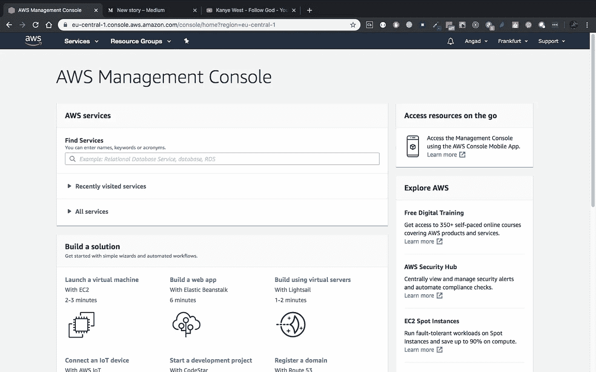
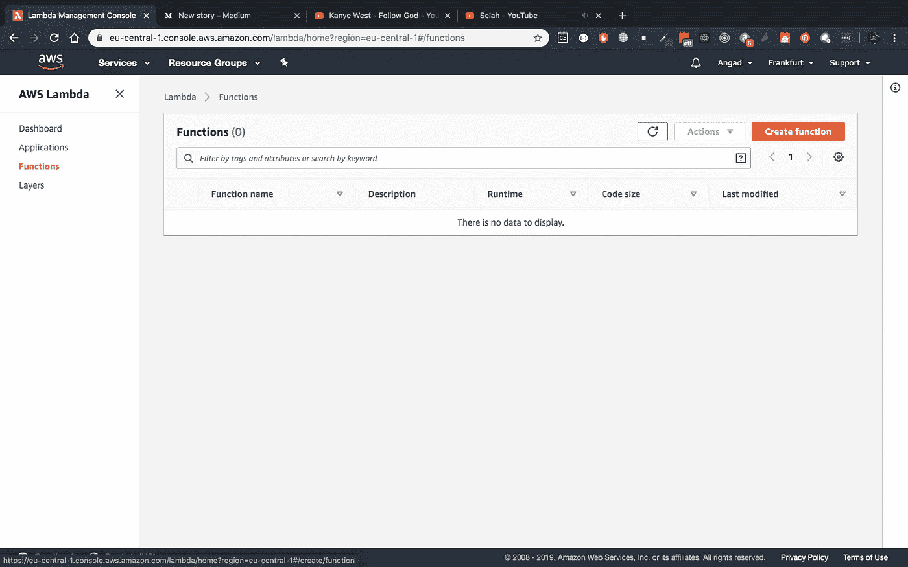
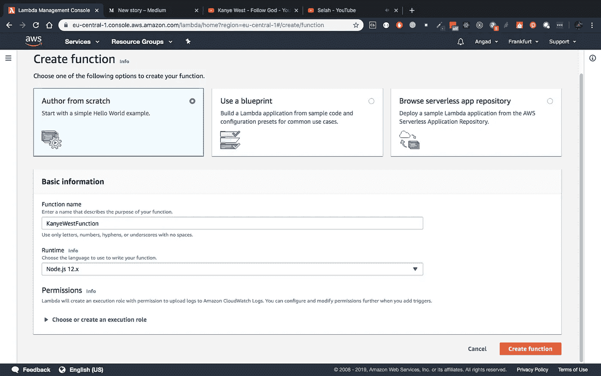
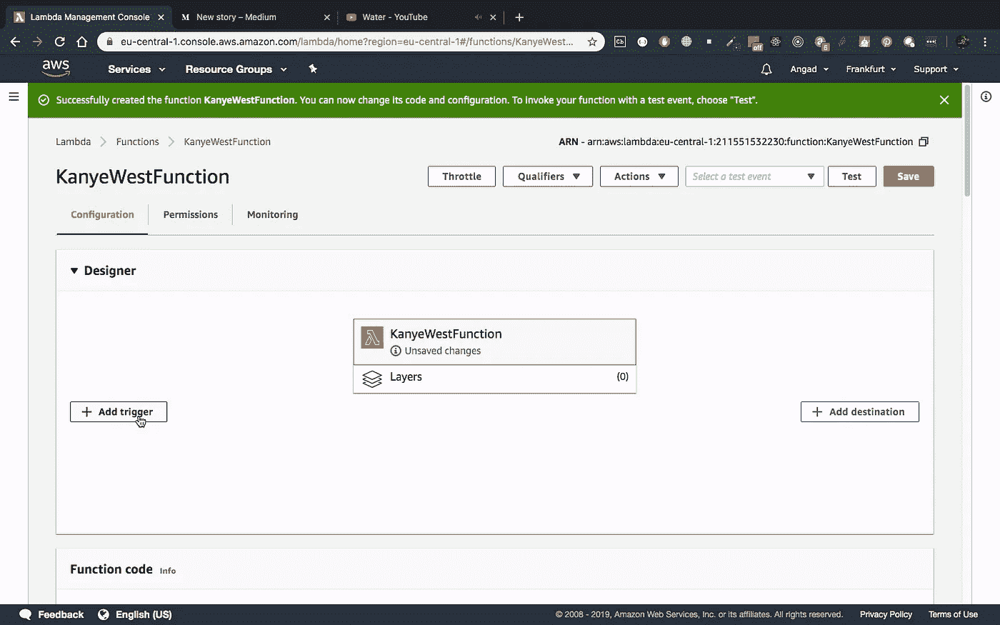
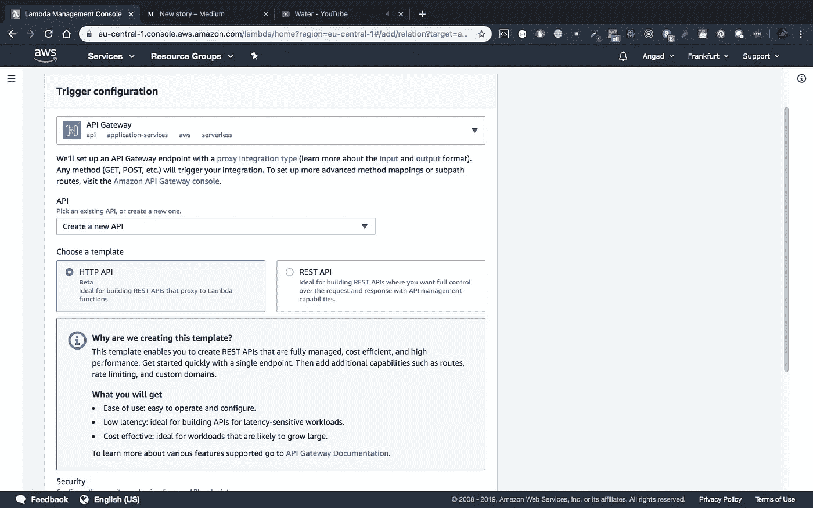
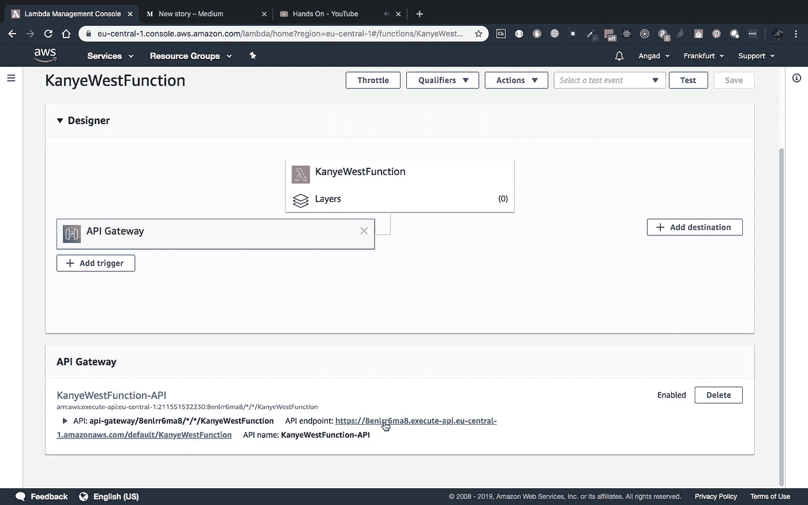

# 在 10 分钟内创建一个无服务器的 Node.js API

> 原文：<https://javascript.plainenglish.io/create-a-server-less-api-in-10-minutes-4a4cf012eeda?source=collection_archive---------1----------------------->

## 使用 AWS Lambda 和 Node.js

为什么应该使用无服务器 API？[在这里了解一下](https://medium.com/@angadsingh_40633/my-30-days-of-building-a-startup-day-6-93a047a3ea0f)。已经服气了？遵循以下基本步骤:

## 第一步

创建一个 AWS 帐户。在您从 https://console.aws.amazon.com/[创建了一个 AWS 帐户并登录后；您将被带到此屏幕:](https://console.aws.amazon.com/)

AWS console home page

## 第二步

通过在**查找服务**部分搜索“Lambda ”,创建一个新的 Lambda 函数。您将被带到此屏幕:

Functions Page

从上面的屏幕中，点击“创建功能”橙色按钮。在这个页面上，给你的函数取一个你喜欢的名字，并选择 AWS Lambda 在阅读本文时支持的最新 Node.js 版本。在我的例子中，它是版本 12:

Create your function

接下来的部分非常明显:点击“创建功能”。

## 第三步

写你的代码！点击按钮后，您将看到您的功能的详细信息。如果您继续向下滚动，您将看到该函数的默认代码。在我的例子中，它看起来像这样:

Default Lambda Code

你可以随意编辑代码。我选了这个:

Customized code

完成更改后，记得点击“保存”按钮。

## 第四步

我们的 Lambda 函数现在已经完成了，但是我们还需要一个触发器。“触发器”本质上是一个调用我们函数的条件。由于目前最常见的接口之一是 HTTP API，我们将创建这样一个 API。要做到这一点；向上滚动到页面顶部，点击“添加触发器”，如下所示:

Add trigger button

从该屏幕的选项中，选择“API 网关”作为 API 的类型。对于下一个输入，选择“Create a new API”并保留默认的 HTTP API 模板。像这样:

Trigger Configuration

现在向下滚动并点击“添加”确认按钮。一旦这样做了；现在，您将拥有一个指向“无服务器”API 端点的 URL。这里可以看到我的鼠标停留在:

API URL

## 使用您的 API

只需复制 API 端点并将其粘贴到浏览器上，您将看到 API 的响应:

Your API’s Response

谁知道会这么快？这个 AWS 基础设施更棒的是，你可以更改 Lambda 函数的代码，点击“保存”,你的端点就更新了。无需通过管道在 API 中部署更改。希望你喜欢这个简短的教程！