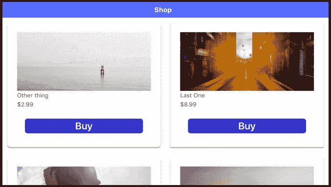
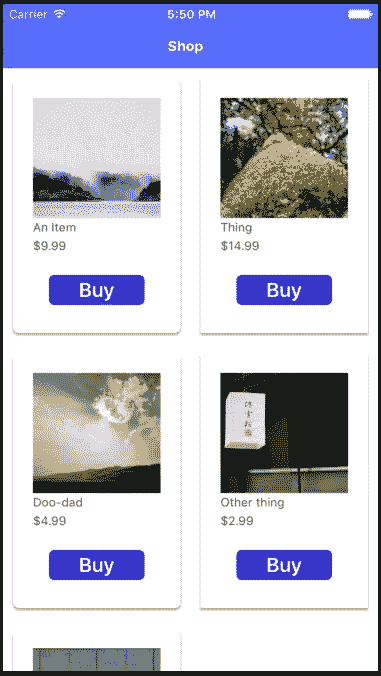
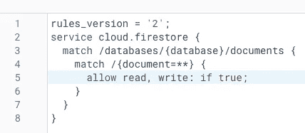
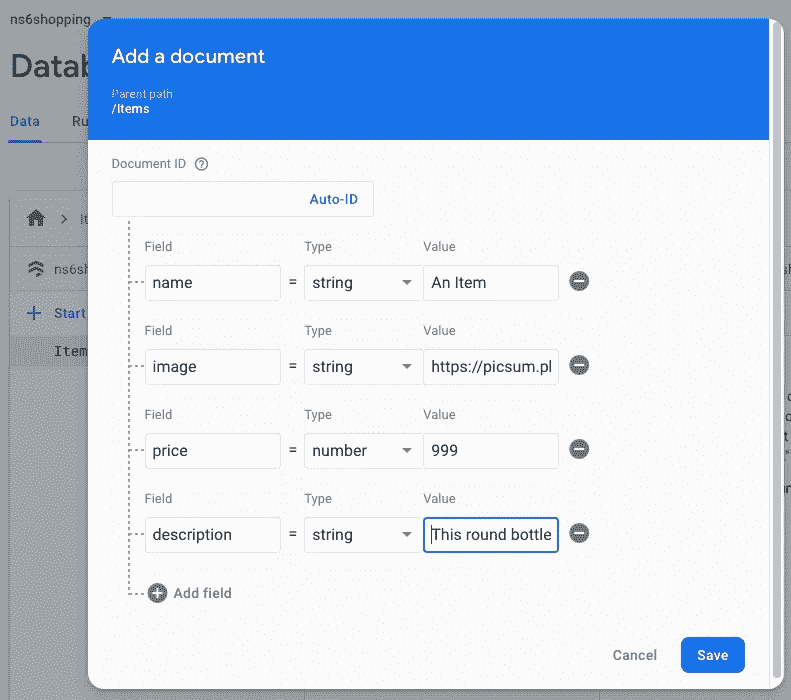
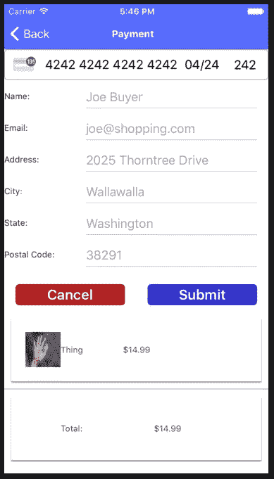
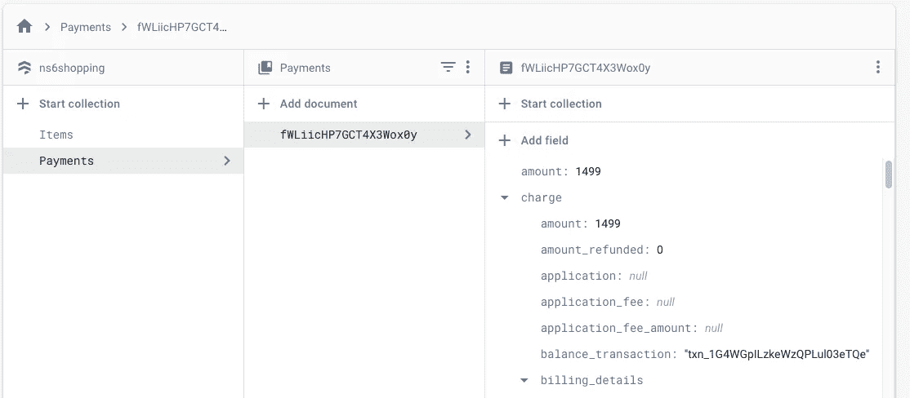
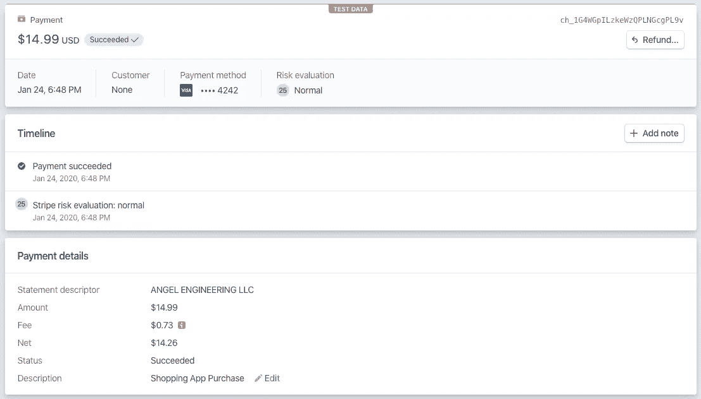

# 使用 NativeScript Vue、Firebase 和 Stripe 创建购物应用程序

> 原文：<https://javascript.plainenglish.io/create-a-shopping-app-with-nativescript-vue-firebase-and-stripe-f8e81a37f986?source=collection_archive---------3----------------------->

现代设备带来了现代化的便利，例如，无论您身在何处，都可以通过移动设备购物。使用 NativeScript Vue，我将介绍如何创建一个带有产品目录的购物应用程序，该程序使用 Firebase 和 Stripe 来处理信用卡支付。



这个应用程序将依赖 Firebase 来满足我们的服务器需求，提供认证、数据库和云功能服务。如果你以前没有使用过 Firebase，你应该通读一下我在[之前的帖子，在那里我解释了如何建立一个 Firebase 项目](https://blog.angelengineering.com/nativescript-vue-firebase-profile/)。运行相同的步骤来设置一个新的 Firebase 应用程序，注册它以用于 Android 和 iOS，并在 Firebase 控制台的身份验证/登录方法下启用电子邮件/密码。您还可以在该页面的 templates 选项卡下更新 Firebase 用来发送激活和密码重置电子邮件的模板。

使用 CLI 命令`tns create ns6shopping`创建一个新的 NativeScript Vue 应用程序，并选择空白的 Vue 模板。这将是一个单一的框架应用程序，将包括登录页面，产品画廊，产品详情页面和支付页面。如果你想用[多框架应用](https://www.nativescript.org/blog/getting-your-route-on-with-nativescript-vue-episode-two)来试验，你可以用 Tabs Vue 模板创建一个，并在单个标签上工作来框架里面的商店页面。编辑`/app.js`并替换为以下内容:

```
import Vue from "nativescript-vue";
import Login from "./components/Login";
new Vue({
    template: `
        <Frame>
            <Login />
        </Frame>`,
    components: {
        Login
    }
}).$start();
```

这告诉应用程序在单个框架中初始化和加载登录页面。添加新的登录页面为`/app/components/Login.vue`:

```
<template>
    <Page actionBarHidden="true" backgroundSpanUnderStatusBar="true">
        <FlexboxLayout class="page">
            <StackLayout class="form">
                <Image class="logo" src="~/images/NativeScript-Vue.png" />
                <Label class="header" text="SHOPPER" />
                <StackLayout class="input-field" marginBottom="25">
                    <TextField class="input" hint="Email" keyboardType="email" autocorrect="false" autocapitalizationType="none" v-model="user.email" returnKeyType="next" @returnPress="focusPassword" fontSize="18" />
                    <StackLayout class="hr-light" />
                </StackLayout>
                <StackLayout class="input-field" marginBottom="25">
                    <TextField ref="password" class="input" hint="Password" secure="true" v-model="user.password" :returnKeyType="isLoggingIn ? 'done' : 'next'" @returnPress="focusConfirmPassword" fontSize="18" />
                    <StackLayout class="hr-light" />
                </StackLayout>
                <StackLayout v-show="!isLoggingIn" class="input-field">
                    <TextField ref="confirmPassword" class="input" hint="Confirm password" secure="true" v-model="user.confirmPassword" returnKeyType="done" fontSize="18" />
                    <StackLayout class="hr-light" />
                </StackLayout>
                <Button :text="isLoggingIn ? 'Log In' : 'Sign Up'" @tap="submit" class="btn btn-primary m-t-20" />
                <Label v-show="isLoggingIn" text="Forgot your password?" class="login-label" @tap="forgotPassword" />
                <Label class="login-label sign-up-label" @tap="toggleForm">
                    <FormattedString>
                    	<Span :text="isLoggingIn ? 'Don’t have an account? ' : 'Back to Login'" />
                    	<Span :text="isLoggingIn ? 'Sign up' : ''" class="bold" />
                    </FormattedString>
                </Label>
            </StackLayout>
        </FlexboxLayout>
    </Page>
</template>

<script>
import HomePage from "./Home";
var firebase = require("nativescript-plugin-firebase"); 
export default {
    data() {
        return {
            isLoggingIn: true,
            user: {
                email: "foo@foo.com",
                password: "foo",
                confirmPassword: "foo"
            },
            userService: {
                register(user) {
                    return Promise.resolve(user);
                },
                login(user) {
                    return Promise.resolve(user);
                },
                resetPassword(email) {
                    return Promise.resolve(email);
                }
            }
        };
    },
    mounted(){
        firebase
            .init({
            })
            .then(
                function(instance) {
                    console.log("firebase.init done");
                },
                function(error) {
                    console.log("firebase.init error: " + error);
                }
            );
    },
    methods: {
        toggleForm() {
            this.isLoggingIn = !this.isLoggingIn;
        },
        submit() {
            if (!this.user.email || !this.user.password) {
                this.alert("Please provide both an email address and password.");
                return;
            }
            if (this.isLoggingIn) {
                this.login();
            } else {
                this.register();
            }
        },
        login() {
            let that = this
            this.userService
                .login(this.user)
                .then(() => {
                    this.$navigateTo(HomePage, { clearHistory: true });
                })
                .catch(() => {
                    this.alert("Unfortunately we could not find your account.");
                });
        },
        register() {
            if (this.user.password != this.user.confirmPassword) {
                this.alert("Your passwords do not match.");
                return;
            }
            this.userService
                .register(this.user)
                .then(() => {
                    this.alert("Your account was successfully created.");
                    this.isLoggingIn = true;
                })
                .catch(() => {
                    this.alert("Unfortunately we were unable to create your account.");
                });
        },
        forgotPassword() {
            let that = this
            prompt({
                title: "Forgot Password",
                message: "Enter the email address you used to register for APP NAME to reset your password.",
                inputType: "email",
                defaultText: "",
                okButtonText: "Ok",
                cancelButtonText: "Cancel"
            }).then(data => {
                if (data.result) {
                    that.userService
                        .resetPassword(data.text.trim())
                        .then(() => {
                            that.alert(
                                "Your password was successfully reset. Please check your email for instructions on choosing a new password."
                            );
                        })
                        .catch(() => {
                            that.alert(
                                "Unfortunately, an error occurred resetting your password."
                            );
                        });
                }
            });
        },
        focusPassword() {
            this.$refs.password.nativeView.focus();
        },
        focusConfirmPassword() {
            if (!this.isLoggingIn) {
                this.$refs.confirmPassword.nativeView.focus();
            }
        },
        alert(message) {
            return alert({
                title: "Shopper",
                okButtonText: "OK",
                message: message
            });
        }
    }
};
</script>	
<style scoped>
.page {
    align-items: center;
    flex-direction: column;
}
.form {
    margin-left: 30;
    margin-right: 30;
    flex-grow: 2;
    vertical-align: middle;
}
.logo {
    margin-bottom: 12;
    height: 90;
    font-weight: bold;
}
.header {
    horizontal-align: center;
    font-size: 25;
    font-weight: 600;
    margin-bottom: 70;
    text-align: center;
    color: rgb(51, 51, 206);
}
.input-field {
    margin-bottom: 25;
}
.input {
    font-size: 18;
    placeholder-color: #A8A8A8;
}
.input-field .input {
    font-size: 54;
}
.btn-primary {
    height: 50;
    margin: 30 5 15 5;
    background-color: rgb(51, 51, 206);
    color: white;
    border-radius: 5;
    font-size: 20;
    font-weight: 600;
}
.login-label {
    horizontal-align: center;
    color: #A8A8A8;
    font-size: 16;
}
.sign-up-label {
    margin-bottom: 20;
}
.bold {
    color: #000000;
}
</style>
```

如果你想了解这里发生的事情，这个页面在之前的帖子中有更详细的解释。看看这个页面，你会发现我们有一个单独的页面来处理登录、注册和忘记密码的请求，现在绑定到虚拟函数。我们使用了前一篇文章中的 NativeScript Vue 徽标图像，复制到了`/app/images/NativeScript-Vue.png`。

在 ios 模拟器上运行该应用程序，如果运行正常，您应该会看到控制台上打印的`firebase.init done`。确保已经从 Firebase 控制台下载了 Android 和 iOS 配置文件，如果没有，将它们放在`app/App_Resources`下相应的目录中。如果你尝试在 Android 上运行这个，你可能会遇到下面的错误:


为了解决这个问题，我们将在`app/App_Resources/Android/app.gradle`的`defaultConfig`部分添加以下内容:

```
multiDexEnabled true
```

在 Android 上运行时，您现在应该会看到相同的成功初始化消息。运行该应用程序，您应该会看到如下内容:


我们的登录前端已经准备好了，现在我们将集成 Firebase 来提供认证服务。

# 使用 Firebase 进行身份验证

在继续使用之前，我们需要为 NativeScript 安装 Firebase 插件:

`tns plugin add nativescript-plugin-firebase`

这将询问您要启用哪些 Firebase 服务，对于身份验证、云功能和 Firestore，您将回答是。在我们开始用真实的 Firebase 调用填充虚拟身份验证函数之前，让我们添加另一个插件，它显示一个浮动加载指示器，我们可以在调用身份验证方法和其他长延迟操作时显示该指示器。

`tns plugin install @nstudio/nativescript-loading-indicator`

显示指示器时需要一个默认选项对象，我们将在导入后将其添加到`app/app.js`中，并通过整个应用程序的全局对象进行访问。

```
global.loaderOptions = {
    android: {
        margin: 100,
        dimBackground: true,
        color: "#4B9ED6", 
        hideBezel: true, 
        mode: 3 
    },
    ios: {
        dimBackground: true,
        color: "#FFFFFF", 
        hideBezel: true, 
        mode: 3 
    }
};
```

让我们更新`app/components/Login.vue`中的`login`、`register`和`forgotPassword`方法，以便在等待 Firebase 操作完成时使用加载程序:

```
login() {
            let that = this
            loader.show(global.loaderOptions);
            this.userService
                .login(this.user)
                .then(() => {
                    loader.hide()
                    this.$navigateTo(HomePage, { clearHistory: true });
                })
                .catch((err) => {
                    loader.hide()
                    console.log(err)
                    this.alert("Unfortunately we could not find your account.");
                });
        },
        register() {
            if (this.user.password != this.user.confirmPassword) {
                this.alert("Your passwords do not match.");
                return;
            }
            if (this.user.password.length < 6) {
                this.alert("Your password must be at least 6 characters.");
                return;
            }
            loader.show(global.loaderOptions);
            this.userService
                .register(this.user)
                .then(() => {
                    this.isLoggingIn = true;
                    loader.hide()
                })
                .catch((err) => {
                    loader.hide()
                    console.log(err)
                    this.alert("Unfortunately we were unable to create your account.");
                });
        },
        forgotPassword() {
            let that = this
            prompt({
                title: "Forgot Password",
                message: "Enter the email address you used to register for APP NAME to reset your password.",
                inputType: "email",
                defaultText: "",
                okButtonText: "Ok",
                cancelButtonText: "Cancel"
            }).then(data => {
                if (data.result) {
                    loader.show(global.loaderOptions);
                    that.userService
                        .resetPassword(data.text.trim())
                        .then(() => {
                            loader.hide()
                            that.alert(
                                "Your password was successfully reset. Please check your email for instructions on choosing a new password."
                            );
                        })
                        .catch(() => {
                            loader.hide()
                            that.alert(
                                "Unfortunately, an error occurred resetting your password."
                            );
                        });
                }
            });
        },
```

因为 Firebase 要求密码长度至少为 6 个字符，所以我们在 register 函数中添加了一个检查。现在让我们填充`userService`中的虚拟函数，从寄存器函数开始:

```
async register(user) {
                    return await firebase.createUser({
                        email: user.email,
                        password: user.password,
                    }).then(
                        function(response) {
                            firebase.sendEmailVerification().then(function() {
                                    alert("A verification email has been sent, click on the link to activate your account")
                                },
                                function(error) {
                                    console.error("Error sending email verification: ", error);
                                }
                            )
                        })
                },
```

您会注意到，我们首先调用 Firebase，使用提供的电子邮件和密码注册一个新帐户。如果成功，我们将让 Firebase 发送一封带有验证链接的电子邮件。由于我们正在创建一个购物应用程序，我们将限制用户登录，直到他们验证他们有权访问该电子邮件帐户。Firebase 没有禁止未验证电子邮件地址的用户登录的选项，所以我们必须在登录方法中执行我们自己的检查。

用相应的 Firebase 登录函数填写`userService`登录函数:

```
async login(user) {
                    return await firebase.login({
                        type: firebase.LoginType.PASSWORD,
                        passwordOptions: {
                            email: user.email,
                            password: user.password,
                        }
                    })
                },
```

现在，我们将更改主要的`login`方法，在允许登录之前检查用户是否已经验证了他们的电子邮件地址:

```
login() {
            let that = this
            loader.show(global.loaderOptions);
            this.userService
                .login(this.user)
                .then((currentUser) => {
                    loader.hide()
                    if (!currentUser.emailVerified) {
                        this.alert("Please click on the link in the verification email sent during registration. Check your Spam folder for a new link we've just emailed.");
                        firebase.sendEmailVerification().then(function() { console.log("email sent") },
                            function(error) {
                                console.error("Error sending email verification: ", error);
                            }
                        )
                        return false;
                    }
                    this.$navigateTo(HomePage);
                })
                .catch((err) => {
                    loader.hide()
                    console.log(err)
                    this.alert("Unfortunately we could not find your account.");
                });
        },
```

如果用户试图在未经验证的情况下登录，我们将显示一个警告，要求他们通过电子邮件链接进行验证。我们可以显示一个新的链接，使用`currentUser.emailVerified`作为标志请求另一封验证邮件，但对于这篇文章，我们只会在他们每次尝试登录时发送一封新的验证邮件，以防他们没有收到邮件。

现在填写`userService` resetPassword 函数，它将让 Firebase 发送一封电子邮件，其中包含一个更改密码的链接:

```
async resetPassword(email) {
	return await firebase.sendPasswordResetEmail(email)
}
```

如果你现在在模拟器上运行这个应用程序，你应该能够使用 Firebase 身份验证来注册、登录和重置你的密码。登录后，您将只看到基本的模板应用程序页面，因此让我们将其转到主商店目录页面。

# 创建商店目录

让我们创建一个列出一系列待售商品的页面。为了跳过一些样式，我们将利用 [NativeScript Cardview 插件](https://github.com/nstudio/nativescript-cardview)来显示材料设计 CardViews 中的产品，卡片以 2 列格式显示。使用以下方式安装插件:

`tns plugin add @nstudio/nativescript-cardview`

我们将它作为组件导入到`/app/app.js`中:

```
Vue.registerElement(
    "CardView",
    () => require("@nstudio/nativescript-cardview").CardView
);
```

将`app/components/Home.vue`的内容替换为:

```
<template>
    <Page>
        <ActionBar>
            <Label text="Shop"></Label>
        </ActionBar>
        <ScrollView>
            <StackLayout>
                <GridLayout rows="*" columns="*, *" v-if="rowCount>0" v-for="i in rowCount" :key="i">
                    <CardView class="card" margin="10" col="0" elevation="20" v-if="Items[(i - 1) * itemsPerRow] && Items[(i - 1) * itemsPerRow ].name" @tap="seeDetails(Items[(i - 1) * itemsPerRow])">
                        <GridLayout class="card-layout" rows="120, auto,auto,auto" columns="*, *, *">
                            <Image v-if="Items[(i - 1) * itemsPerRow].image" :src="Items[(i - 1) * itemsPerRow].image" stretch="aspectFill" colSpan="3" row="0" />
                            <Label :text="Items[(i - 1) * itemsPerRow].name" class="" row="1" colSpan="3" />
                            <Label :text="Items[(i - 1) * itemsPerRow].price | dollars" class="" row="2" colSpan="3" />
                            <Button row="3" colSpan="3" text="Buy" @tap="addItem(Items[(i - 1) * itemsPerRow])" class="btn m-t-20 add-button" />
                        </GridLayout>
                    </CardView>
                    <CardView class="card" margin="10" col="1" elevation="20" v-if="Items[(i - 1) * itemsPerRow +1] && Items[(i - 1) * itemsPerRow +1].name" @tap="seeDetails(Items[(i - 1) * itemsPerRow +1])">
                        <GridLayout class="card-layout" rows="120, auto,auto,auto" columns="*, *, *">
                            <Image v-if="Items[(i - 1) * itemsPerRow+1].image" :src="Items[(i - 1) * itemsPerRow + 1].image" stretch="aspectFill" colSpan="3" row="0" />
                            <Label :text="Items[(i - 1) * itemsPerRow + 1].name" class="" row="1" colSpan="3" />
                            <Label :text="Items[(i - 1) * itemsPerRow +1].price | dollars" class="" row="2" colSpan="3" />
                            <Button row="3" colSpan="3" text="Buy" @tap="addItem(Items[(i - 1) * itemsPerRow +1])" class="btn m-t-20 add-button" />
                        </GridLayout>
                    </CardView>
                </GridLayout>
            </StackLayout>
        </ScrollView>
    </Page>
</template>

<script>
export default {
    data() {
        return {
            Items: [
                { invId: 1, name: "An Item", image: "https://picsum.photos/300/200", price: 999, description: "This round bottle is made of opaque bright rose glass.  It has a mid-length neck, stands about seven inches tall, and the ink on its label has been washed off." },
                { invId: 2, name: "Thing", image: "https://picsum.photos/300/200", price: 1499, description: "This round bottle is made of opaque chartreuse glass.  It has a mid-length neck, stands about six inches tall, and the ink on its label has been washed off." },
                { invId: 3, name: "Doo-dad", image: "https://picsum.photos/300/200", price: 499, description: "This coffin-shaped bottle is made of opaque lilac glass.  It has a long neck, stands about five inches tall, and it has no label." },
                { invId: 4, name: "Other thing", image: "https://picsum.photos/300/200", price: 299, description: "This cylindrical bottle is made of transparent bright turquoise glass.  It has a mid-length neck, stands about twelve inches tall, and it has a simple printed label." },
                { invId: 5, name: "Last One", image: "https://picsum.photos/300/200", price: 899, description: "This teardrop-shaped bottle is made of translucent bright purple glass.  It has a mid-length neck, stands about eleven inches tall, and most of its label has been torn off." }
            ],
            itemsPerRow: 2
        }
    },
    computed: {
        rowCount: function() {
            return Math.ceil(this.Items.length / this.itemsPerRow);
        },
    },
    filters: {
        dollars: num => `$${num / 100}`
    },
    methods: {
        seeDetails(item) {
            console.log("Showing detailed view for: ");
            console.dir(item);
        },
        addItem(item) {
            console.log("Adding item:");
            console.dir(item);
        }
    },
};
</script>

<style scoped lang="scss">
@import '~@nativescript/theme/scss/variables/blue'; 
.add-button {
    height: 30;
    background-color: rgb(51, 51, 206);
    color: white;
    border-radius: 5;
    font-size: 20;
    font-weight: 600;
}

.card {
    background-color: #fff;
    color: #4d4d4d;
    margin: 15;
}

.card-layout {
    padding: 20;
}
</style>
```

我们使用来自 [Lorem Picsum 网站](https://picsum.photos/)的图片 URL 定义了 5 个示例项目，该网站提供指定尺寸的随机图片。运行应用程序，登录，您应该会看到基本目录页面:



目前，这个页面上的项目列表是硬编码的。相反，让我们使用 Firebase Firestore 来存储项目，并让应用程序从那里读取它们。

# 使用 FireStore DB

回到 [Firebase 控制台](https://console.firebase.google.com/)，转到项目的数据库部分，为应用程序创建一个新的 Firestore 数据库。当询问时，选择生产安全规则(受限读/写),尽管我们在处理应用程序时会将它们更改为开发规则。创建数据库后，转到 rules 选项卡，将读/写访问权限更改为 true:



现在，返回主数据选项卡，开始我们商店产品的新收集。我们将这个集合命名为条目，并开始为每个条目添加与`Home.vue`中的`Items`数组具有相同字段和值的文档。第一项看起来像:



在您添加了示例项目后，让我们更新`Home.vue`开始从 Firebase Firestore 阅读这些内容。我们将添加 Firebase 库的导入，注释掉 Items 数组条目，并添加`created`函数在页面加载时从 Firestore 加载条目。我们还将准备两个新页面，用于显示商品详细信息和购买商品。更改顶部脚本部分，使其看起来像这样:

```
<script>
import firebase from "nativescript-plugin-firebase";
import ItemDetail from "./ItemDetail";
import Payment from "./Payment";
export default {
    data() {
        return {
            Items: [
                // { invId: 1, name: "An Item", image: "https://picsum.photos/300/200", price: 999, description: "This round bottle is made of opaque bright rose glass.  It has a mid-length neck, stands about seven inches tall, and the ink on its label has been washed off." },
                // { invId: 2, name: "Thing", image: "https://picsum.photos/300/200", price: 1499, description: "This round bottle is made of opaque chartreuse glass.  It has a mid-length neck, stands about six inches tall, and the ink on its label has been washed off." },
                // { invId: 3, name: "Doo-dad", image: "https://picsum.photos/300/200", price: 499, description: "This coffin-shaped bottle is made of opaque lilac glass.  It has a long neck, stands about five inches tall, and it has no label." },
                // { invId: 4, name: "Other thing", image: "https://picsum.photos/300/200", price: 299, description: "This cylindrical bottle is made of transparent bright turquoise glass.  It has a mid-length neck, stands about twelve inches tall, and it has a simple printed label." },
                // { invId: 5, name: "Last One", image: "https://picsum.photos/300/200", price: 899, description: "This teardrop-shaped bottle is made of translucent bright purple glass.  It has a mid-length neck, stands about eleven inches tall, and most of its label has been torn off." }
            ],
            itemsPerRow: 2
        }
    },
    created() {
        let that = this
        firebase.firestore
            .collection("Items")
            .get()
            .then(snapshot => {
                let itemArr = [];
                snapshot.forEach(document => {
                    itemArr.push(document.data());
                });
                that.Items = itemArr
            });
    },
    methods: {
        seeDetails(item) {
            this.$navigateTo(ItemDetail, { props: { item: item } });
        },
        addItem(item) {
            this.$navigateTo(Payment, { props: { item: item } });
   		}
    }
```

让我们将商品详情页面添加为`app/components/ItemDetail.vue`:

```
<template>
    <Page backgroundSpanUnderStatusBar="true">
        <ActionBar>
            <Label text="Details"></Label>
        </ActionBar>
        <ScrollView>
            <StackLayout>
                <CardView class="card" margin="10" col="0" elevation="20">
                    <GridLayout class="card-layout" rows="400, auto,auto,auto,auto,auto" columns="*, *, *">
                        <Image :src="item.image" stretch="aspectFill" colSpan="3" row="0" />
                        <Label :text="item.name" class="item-name" row="1" colSpan="3" />
                        <Label :text="item.price| dollars" class="item-price" row="2" colSpan="3" />
                        <Button row="3" colSpan="2" text="Buy" @tap="buyItem(item)" class="btn btn-primary m-t-20 add-button" />
                        <StackLayout class="line" row="4" colSpan="3" />
                        <TextView editable="false" row="5" colSpan="3" class="item-desc" textWrap="true" :text="item.description" />
                    </GridLayout>
                </CardView>
            </StackLayout>
        </ScrollView>
    </Page>
</template>

<script>
import Payment from "./Payment";
export default {
    components: {},
    filters: {
        dollars: num => `$${num / 100}`
    },
    props: {
        item: {
            type: Object,
            required: true
        }
    },
    data() {
        return {
        }
    },
    computed: {
    },
    methods: {
        buyItem(item) {
            this.$navigateTo(Payment, { props: { item: item } });
        }
    }
};
</script>

<style scoped>
.card {
    background-color: #fff;
    color: #4d4d4d;
    margin: 15;
}

.card-layout {
    padding: 20;
}

.line {
    background-color: #cecece;
    height: 1;
    margin: 0;
    padding: 4;
}

.item-name {
    font-size: 16;
    color: black;
}

.item-price {
    font-size: 14;
    color: rgb(54, 54, 54);
}

.item-desc {
    font-size: 16;
    color: black;
    padding-bottom: 10;
    background-color: transparent;
    border-color: transparent;
}

.add-button {
    height: 30;
    background-color: rgb(51, 51, 206);
    color: white;
    border-radius: 5;
    font-size: 20;
    font-weight: 600;
}
</style>
```

如果您再次运行该应用程序，您应该仍然会看到从 Firestore 读取并由该应用程序显示的相同项目(由于每个平台加载/缓存 url 图像的方式，iOS 上的图像不同，而 Android 上的图像相同)。如果你不创建一个空文件作为`app/components/Payment.vue`，你会得到一些错误，这将在我们准备好我们的应用程序以使用 Stripe 进行支付后处理。

# 种类

让我们使用`tns plugin add nativescript-stripe`添加条纹插件。我们需要导入 Stripe 信用卡小部件，并通过更改`app/app.js`来声明我们的 Stripe 公共令牌，如下所示:

```
import Vue from "nativescript-vue";
import Login from "./components/Login";
const application = require("tns-core-modules/application");

Vue.config.silent = false;
global.loaderOptions = {
    android: {
        margin: 100,
        dimBackground: true,
        color: "#4B9ED6",
        hideBezel: true,
        mode: 3
    },
    ios: {
        dimBackground: true,
        color: "#FFFFFF",
        hideBezel: true,
        mode: 3
    }
};
Vue.registerElement(
    "CardView",
    () => require("@nstudio/nativescript-cardview").CardView
);
Vue.registerElement(
    "CreditCardView",
    () => require("nativescript-stripe").CreditCardView
);
application.on(application.launchEvent, args => {
    if (args.ios) {
        STPPaymentConfiguration.sharedConfiguration().publishableKey = "YOUR_STRIPE_PUBLIC_TEST_KEY";
    }
});
new Vue({
    template: `
        <Frame>
            <Login />
        </Frame>`,
    components: {
        Login
    }
}).$start();
```

NativeScript Stripe 插件将为我们提供一个可以在我们的应用程序中显示的信用卡小部件，以及允许我们使用公共 Stripe 密钥创建支付令牌的库，然后我们可以将它发送到 Stripe 服务器来处理支付。这种方法需要将 Firebase 上的 Stripe 服务器库作为云功能运行，以使用您的私有 Stripe 密钥处理支付。

接下来，我们将使用[这里的指令](https://firebase.google.com/docs/functions/get-started)准备 Firebase 云函数。安装 Firebase 控制台 CLI 包，并创建一个新目录来存储函数代码

```
npm install -g firebase-tools
mkdir functions
cd functions
firebase login
firebase init functions
```

Firebase login CLI 命令应该会弹出一个窗口，请求允许使用 Firebase CLI 使用您的 Google 帐户。使用用于创建此应用程序的 Firebase 项目的 Google 帐户对其进行授权。一旦获得授权，您就可以运行 CLI init 命令，选择使用 Javascript 作为语言的现有项目，并允许它安装 NPM 的依赖项。


现在让我们添加云功能来处理 Firestore 中付款集合的新条目。首先，用`npm install stripe --save`添加 Stripe 库，从云函数调用 Stripe API 时需要用到它。编辑`functions/functions/index.js`使其看起来像:

```
const functions = require("firebase-functions");
const admin = require("firebase-admin");
admin.initializeApp(functions.config().firebase);
const stripe = require("stripe")(functions.config().stripe.token);
exports.stripeCharge = functions.firestore
    .document("/Payments/{paymentId}")
    .onCreate(async (event, context) => {
        const payment = event.data();
        const paymentId = context.params.paymentId;
        const amount = payment.amount; // amount must be in cents
        const source = payment.token;
        const currency = "usd";
        const description = "Shopping App Purchase";
        const newcharge = {
            amount,
            currency,
            description,
            source
        };
        return await stripe.charges
            .create(newcharge, {
                idempotencyKey: paymentId //used to prevent double charges for the same payment request
            })
            .then(async function(charge, err) {
                if (err) console.error("error!:", err);
                else {
                    console.log("charge:", charge);
                    return charge;
                }
            })
            .then(newcharge => {
                return admin
                    .firestore()
                    .collection("Payments")
                    .doc(paymentId)
                    .update({ charge: newcharge })
                    .then(function(res) {
                        console.log("Updated DB", res);
                    })
                    .catch(err => {
                        console.error(err);
                    });
            });
    });
```

每当 Firestore 上的付款集合中添加新文档时，都会触发此功能。首先，它会向 Stripe 平台发送一个收费请求，如果成功，它会将收费收据存储回此次购买的付款文档中。我们使用 async/await 操作来确保条带调用和数据库更新都在云函数执行守护进程完成并失去访问授权之前运行和完成。

接下来，使用 CLI 将您的私有测试密钥添加到 Firebase Cloud Functions 配置中:

`firebase functions:config:set stripe.token=<YOUR PRIVATE STRIPE TEST API KEY>`

并通过以下方式部署该功能:

`firebase deploy --only functions`

如果您在部署期间收到关于条带包丢失的错误，请确保在`package.json`依赖项中出现一个类似于`"stripe": "^8.4.0"`的引用。

现在让我们在我们的应用程序中创建支付页面，这样用户就可以输入他们的信用卡信息并进行购买。添加支付页面为`app/components/Payment.vue`:

```
<template>
    <Page backgroundSpanUnderStatusBar="true">
        <ActionBar>
            <Label text="Payment"></Label>
        </ActionBar>
        <ScrollView>
            <StackLayout>
                <CreditCardView ref="ccview"></CreditCardView>
                <GridLayout class="" rows="*,*,*,*,*,*" columns="100,*">
                    <Label ref="name" text="Name:" class="" row="0" col="0" />
                    <TextField class="input" row="0" col="1" hint="Joe Buyer" v-model="buyer.name" fontSize="18" />
                    <Label text="Email:" class="" row="1" col="0" />
                    <TextField ref="email" class="input" row="1" col="1" hint="joe@shopping.com" v-model="buyer.email" fontSize="18" />
                    <Label text="Address:" class="" row="2" col="0" />
                    <TextField ref="address" class="input" row="2" col="1" hint="2025 Thorntree Drive" v-model="buyer.address" fontSize="18" />
                    <Label text="City:" class="" row="3" col="0" />
                    <TextField ref="city" class="input" row="3" col="1" hint="Wallawalla" v-model="buyer.city" fontSize="18" />
                    <Label text="State:" class="" row="4" col="0" />
                    <TextField ref="state" class="input" row="4" col="1" hint="Washington" v-model="buyer.state" fontSize="18" />
                    <Label text="Postal Code:" textWrap="true" class="" row="5" col="0" />
                    <TextField ref="postalcode" class="input" row="5" col="1" hint="38291" v-model="buyer.postalcode" fontSize="18" />
                </GridLayout>
                <GridLayout rows="*" columns="*, *">
                    <Button row="0" col="0" text="Cancel" @tap="$navigateBack()" class="btn cancel-button m-t-20 " />
                    <Button row="0" col="1" text="Submit" @tap="submitPayment()" class="btn buy-button m-t-20" />
                </GridLayout>
                <CardView class="card" margin="10" elevation="20" @tap="seeDetails(item)">
                    <GridLayout class="card-layout" rows="50" columns="50, *,*,*">
                        <Image :src="item.image" stretch="aspectFill" col="0" row="0" />
                        <Label :text="item.name" class="" row="0" col="1" />
                        <Label :text="item.price | dollars" class="" row="0" col="2" />
                    </GridLayout>
                </CardView>
                <StackLayout class="line" />
                <CardView class="card" margin="10" elevation="20">
                    <GridLayout class="card-layout" rows="50" columns="50, *,*">
                        <Label text="Total:" class="" row="0" col="1" />
                        <Label :text="total | dollars" class="" row="0" col="2" />
                    </GridLayout>
                </CardView>
            </StackLayout>
        </ScrollView>
    </Page>
</template>

<script>
import firebase from "nativescript-plugin-firebase";
import ItemDetail from "./ItemDetail";
import { Stripe, Card } from 'nativescript-stripe';
import { isAndroid, isIOS } from "tns-core-modules/platform";
export default {
    components: {},
    filters: {
        dollars: num => `$${num / 100}`
    },
    data() {
        return {
            buyer: {},
            stripeObj: null,
        };
    },
    props: {
        item: {
            type: Object,
            required: true
        }
    },
    computed: {
        total() {
            return this.item.price
        },
    },
    methods: {
        seeDetails(item) {
            this.$navigateTo(ItemDetail, { props: { item: item } });
        },
        submitPayment() {
            let that = this
            let cardobj
            let ccview = this.$refs.ccview.nativeView
            let myCallback = function getPaymentMethod(err, pm) {
                if (pm) {
                    return that.submitStripePayment(pm.id, that.buyer.email, that.total);
                } else if (err) {
                    console.log(err);
                }
            }
            if (isAndroid) {
                let newcard = ccview.android.getCard() //null if invalid
                if (newcard && newcard.validateCard()) {
                    cardobj = new Card(newcard.getNumber().toString(), Number(newcard.getExpMonth()), Number(newcard.getExpYear()), newcard.getCVC().toString())
                    this.stripeObj.createToken(cardobj, (error, token) => {
                        if (!error) {
                            that.submitStripePayment(token.id, that.buyer.email, that.total).then(() => {
                                alert("Payment sent").then(() => {
                                    that.$navigateBack()
                                })
                            }).catch(err => {
                                alert("Sorry, we were unable to reach our payment server. Try again later")
                            })
                        } else {
                            console.log("Error creating token!")
                            console.log(error);
                            alert("Sorry, we were unable to reach our payment server. Try again later")
                        }
                    })
                } else {
                    console.log("INVALID card")
                    alert("Sorry, credit card is not valid")
                }
            } else if ((isIOS && ccview.ios && ccview.ios.isValid)) {
                cardobj = new Card(ccview.ios.cardNumber.toString(), ccview.ios.expirationMonth, ccview.ios.expirationYear, ccview.ios.cvc.toString())
                this.stripeObj.createToken(cardobj, (error, token) => {
                    if (!error) {
                        that.submitStripePayment(token.id, that.buyer.email, that.total).then(() => {
                            alert("Payment sent").then(() => {
                                that.$navigateBack()
                            })
                        }).catch(err => {
                            alert("Sorry, we were unable to reach our payment server. Try again later")
                        })
                    } else {
                        console.log("Error creating token!")
                        console.log(error);
                        alert("Sorry, we were unable to reach our payment server. Try again later")
                    }
                })
            } else {
                alert("Sorry, credit card is not valid")
            }
        },
        submitStripePayment(token, email, amount) {
            let charge = {};
            return firebase.firestore.collection("Payments").add({
                email: email,
                amount: amount,
                token: token,
                charge: charge,
                createDate: new Date()
            }).then(documentRef => {
                console.log(`Payment Token added with auto-generated ID: ${documentRef.id}`);
                return Promise.resolve(documentRef);
            }).catch(
                err => {
                    return Promise.reject(err);
                });
        },
    },
    created() {
        this.stripeObj = new Stripe('YOUR_STRIPE_PUBLIC_TEST_KEY'); //public test key
    }
};
</script>

<style scoped>
.card {
    background-color: #fff;
    color: #4d4d4d;
    margin: 15;
}

.card-layout {
    padding: 20;
}

.line {
    background-color: #cecece;
    height: 2;
    margin: 0;
    padding: 4;
}

.input {
    font-size: 18;
    placeholder-color: #a8a8a8;
}

.buy-button {
    height: 30;
    background-color: rgb(51, 51, 206);
    color: white;
    border-radius: 5;
    font-size: 20;
    font-weight: 600;
}

.cancel-button {
    height: 30;
    background-color: rgb(179, 31, 31);
    color: white;
    border-radius: 5;
    font-size: 20;
    font-weight: 600;
}
</style>
```

您将会看到，我们在页面顶部使用插件的信用卡小部件，随后是为购买而收集的常规用户信息。这个小部件根据输入的信用卡信息提供视觉提示，并且还具有验证信用卡号码格式是否有效的功能。当用户希望购买一件商品时，该应用程序将验证信用卡信息，在 Firestore 上的支付集合中创建一个新条目，并包括从用户信用卡信息和您的公共条带密钥生成的支付令牌。确保您现在使用测试密钥，这样您就可以使用 Stripe 的[测试卡之一测试支付流程。如果一切正常，当您点击某个商品的购买按钮时，您应该会看到以下屏幕:](https://stripe.com/docs/testing)



输入其中一张测试信用卡的信息，并提交购买请求。现在，您可以检查 Firebase 控制台 Firestore DB，查看应用程序创建的新购买条目，并在云功能完成处理后更新费用详细信息:



如果这不起作用，您可以检查云功能日志，以确保服务器处理没有错误地完成。如果没有问题，检查你的条纹测试仪表板，你应该看到付款。



# 搞定了。

这个帖子到此为止。如果你想下载最终的源文件，你可以在 [Github](https://github.com/drangelod/ns6shopping.git) 上找到。

*原载于 2020 年 1 月 24 日 https://blog.angelengineering.com*[](https://blog.angelengineering.com/shopping-app/)**。**