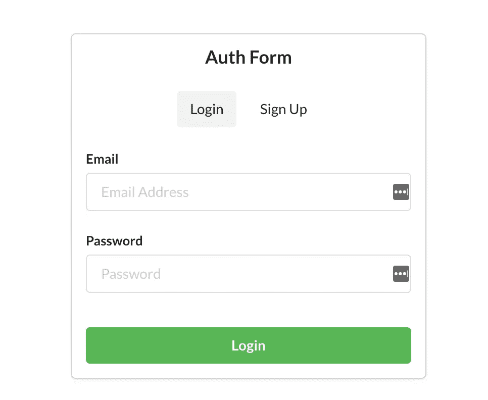
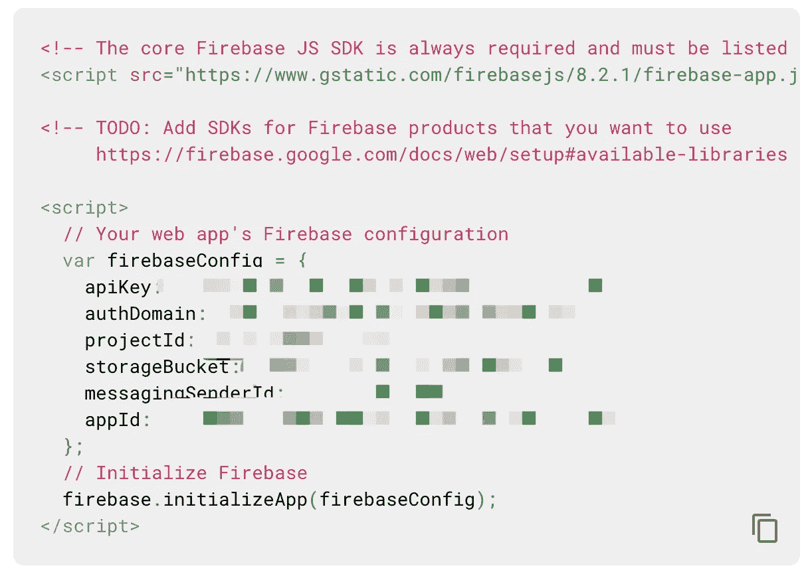
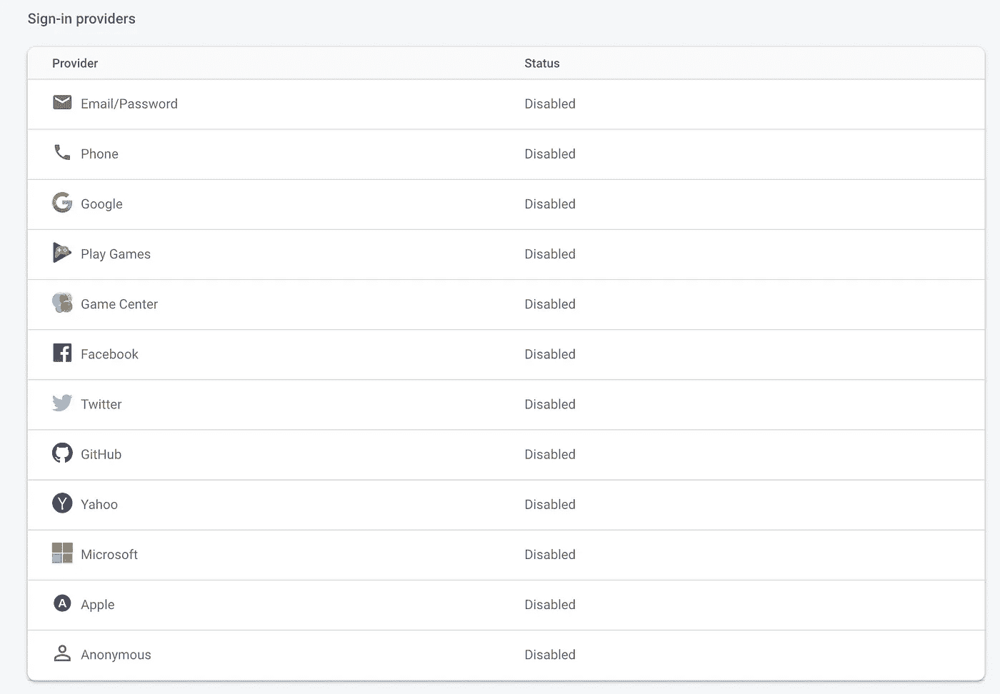
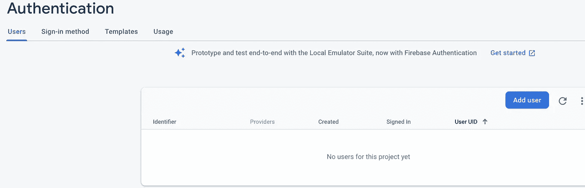
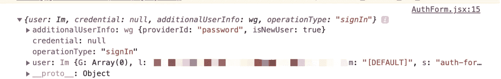
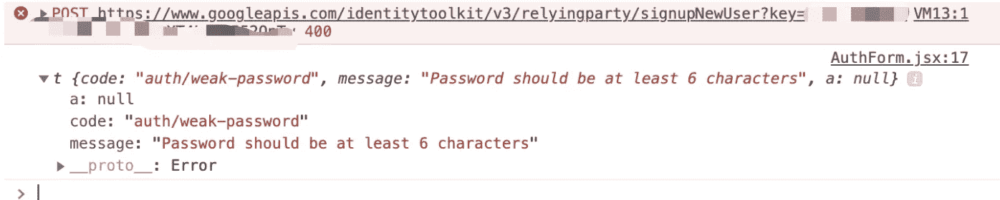
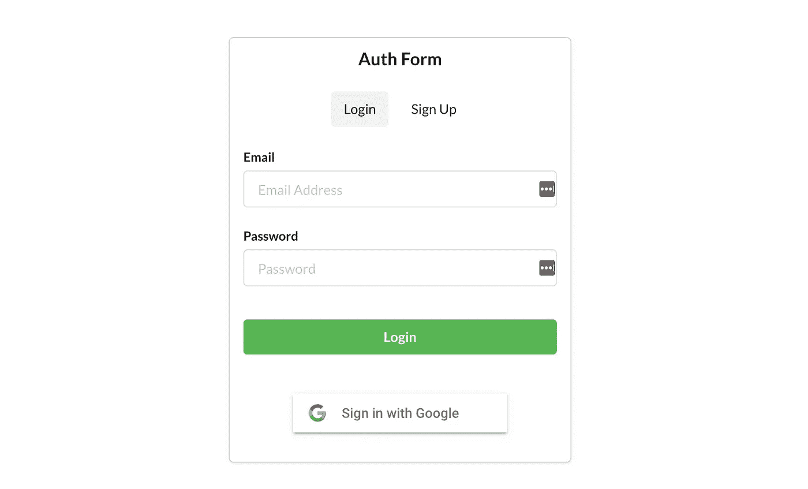

# 用 React 和 Firebase 创建一个简单的身份验证表单

> 原文：<https://javascript.plainenglish.io/create-a-simple-authentication-form-with-react-and-firebase-f29f723b341c?source=collection_archive---------2----------------------->

## 利用现有技术简化事情


[https://dzone.com/articles/react-apps-firebase](https://dzone.com/articles/react-apps-firebase)

如果您的 web 应用程序需要持久化用户数据，那么您可能需要他们注册或登录以显示更个性化的内容。

如今，如果你希望你的应用程序更容易访问，你需要支持各种登录方式，如短信，电子邮件/密码，谷歌，脸书等。工作量很大。

在本教程中，我想告诉你 **Firebase** 和 **Firebaseui** 如何简化事情。这些技术支持多种登录方法，将跟踪用户状态，并使我们作为开发人员的工作变得非常容易。

我们将创建一个注册和登录表单，支持电子邮件/密码和谷歌登录。该表单还将跟踪用户是否登录。

# 在开始之前

在本教程中，我们将只使用 Firebase 的认证服务。

这项服务只处理注册和登录。如果你想让你的应用程序存储更多的用户相关数据，你需要把它连接到 [Firestore](https://firebase.google.com/docs/firestore) 。

本教程将使用 React 钩子来完成。如果你还不太熟悉它们，请参考[官方 React 文档。](https://reactjs.org/docs/hooks-intro.html)

# 设置

我已经在 GitHub 上创建了由表单的 HTML 和 CSS 组成的[起始代码。](https://github.com/mchigit/auth_form_react/tree/starter_code)

克隆存储库后，运行以下命令安装依赖项并启动应用程序:

```
yarn install
yarn start// or npmnpm install
npm start
```

目前，我们所有的是一个可以在登录和注册之间切换的表单。我们将在后面的章节中使用`firebaseui` 添加 Google 登录按钮。



我还设置了一些钩子来管理状态，比如输入值和跟踪登录/注册切换。

## 设置 Firebase

**Firebase** 是一个构建 web 和移动应用的云平台。我们将使用身份验证服务，该服务为用户身份验证提供后端和 SDK。

要使用身份验证服务，我们需要一个 Firebase 项目。如果您已经登录到 Firebase 控制台，您应该会看到如下屏幕:


点击“**创建一个项目**”并完成步骤。我们并不真的需要分析，所以您可以在创建步骤中禁用它们。

您将被带到项目概述页面，您可以通过单击此处创建应用程序:


完成注册 web 应用程序的步骤，您将获得如下所示的代码片段:



这段代码将使用我们刚刚创建的应用程序的配置来初始化 firebase。但是我们不需要全部，你应该记下的重要变量是`firebaseConfig`。

现在，单击此处为我们的应用启用身份验证:


单击“开始”以启用该服务。然后点击顶部的**登录方式**，设置您希望您的用户如何登录。你应该到达这里:



我们需要启用 2 个提供商:电子邮件/密码和谷歌。当您启用 Google 时，您需要输入支持电子邮件。

设置部分到此结束。现在我们可以写一些实际的代码了！

# 使用 Firebase 创建用户并让他们登录

我们可以在 Firebase 的“用户”选项卡中手动创建用户:



但是理想情况下，我们希望当用户想要注册时，前端表单请求这个动作。

为此，我们将需要使用 Firebase SDK for Node。Firebase 提供了许多不同语言的 SDK 与之交互。要在 React 应用程序中安装 Firebase，请运行以下命令:

```
yarn add firebase// or using npmnpm install firebase --save
```

安装好库之后，在`src`文件夹中创建一个`firebase.js`文件，代码如下:

这段代码将为我们刚刚创建的项目初始化 Firebase。它通过调用`firebase.auth()`导出 Firebase Auth 服务。

当用户单击注册按钮时，在状态中捕获输入值。然后我们将使用 Firebase 的`createUserWithEmailAndPassword`方法来创建用户。这个函数接受电子邮件和密码作为参数，并返回一个带有用户对象的承诺。

登录非常相似，但方法不同。我们可以使用接受相同参数的`signInWithEmailAndPassword`方法。让我们创建一个函数来处理这两种情况:

我们可以在登录/注册按钮的 onClick 处理程序中使用这个函数:

```
// Previous code// loginEmail, LoginPassword are input values stored in state<Button onClick={() => authenticateUser(loginEmail, loginPassword, true)}>  Login </Button>...// Same with signupEmail and signupPassword<Button onClick={() => authenticateUser(signupEmail, signupPassword, false)}>  Sign up </Button>
```

现在，如果我们尝试使用电子邮件和密码注册，用户应该在 Firebase 中创建。因为我们添加了控制台日志，所以您也可以打开控制台窗口来查看用户对象:



Firebase 的一个方便的流程是用户在创建时自动登录。

如果您输入的电子邮件没有通过验证或密码太弱，该方法将返回拒绝的承诺:



# 跟踪授权状态

我们应该根据用户是否登录来显示不同的内容。Firebase 有一个有用的方法，允许我们跟踪应用程序的身份验证状态。

`onAuthStateChanged`允许我们添加一个监听器，当认证状态改变时，该监听器将被触发。我们作为参数传入的函数可以访问用户变量。如果用户已注销，此变量将为 null，否则将包含用户的信息。

在`AuthForm.jsx`中，在`AuthForm`中的 return 语句之前添加以下代码:

```
auth.onAuthStateChanged((user) => setUser(user));
```

`setUser`是一个钩子函数，设置用户对象的状态。我们可以根据这种状态呈现不同的内容。

让我们创建一个函数，在用户登录时呈现不同的内容:

如果用户已经登录，我们希望呈现一个标题文本来通知他们，并为他们提供一个注销按钮。现在让我们添加注销用户的功能。

# 注销

注销也非常简单。Auth 有一个我们可以使用的`signOut`方法:

```
<Button onClick={() => auth.signOut()} color="yellow"> Log out </Button>
```

从技术上来说，`signOut` 也回报承诺，但我们不必等待。该操作将触发 auth 状态的变化，导致我们设置的监听器运行，并将用户状态设置为 null。这将导致组件重新呈现。

现在我们有了一个功能认证表单，允许用户注册、登录和注销。

# Google 登录

## 建立

要添加 Google 登录，我们可以在这里下载一个 [Google 按钮资产](https://developers.google.com/identity/branding-guidelines)并使用 Firebase 方法来处理登录。

然而，谷歌登录有各种各样的用户流，可能很难管理。例如，我们需要考虑已经有 Google 帐户登录的情况，没有帐户登录的情况，以及用户可能需要创建新的 Google 帐户的情况。

[**Firebaseui**](https://github.com/firebase/firebaseui-web) 是一个前端库，在 Firebase SDK 之上创建 ui 绑定。它将细节抽象化，设置起来超级简单。在您的终端中，运行以下命令来安装库:

```
yarn add firebaseui// or using npm:npm install firebaseui --save
```

然后我们需要在`index.js`中导入 CSS，这是我们的根 JavaScript 文件。这将允许我们使用库提供的样式:

```
// src/index.jsimport 'firebaseui/dist/firebaseui.css'
```

在`src/firebase.js`中，我们需要用下面的代码初始化 UI 库:

```
export const authUI = new firebaseui.auth.AuthUI(auth);
```

注意，auth 变量是我们从 Firebase 初始化的认证服务。现在我们可以在组件中使用`authUI`来创建 Google 登录。

> 如果您在上一步中没有启用 Google 登录方法，您还需要启用它。

## 履行

在`AuthForm.jsx`中，我们已经有了一个 div，可以用作 Google 登录按钮的占位符:

```
<div className="google-login"></div>
```

为了呈现一个 Google 登录按钮，我们需要使用`authUI.start`方法。第一个参数是一个 HTML 元素，它可以是一个 CSS 选择器或一个实际的元素。第二个参数是配置。

我们只想在用户注销时呈现 Google 登录。代码如下:

我们使用了`useEffect`钩子，并使它依赖于用户状态。每当这种状态改变时，内部的功能就会被触发。我们检查用户是否为空，如果是，只调用`start`方法。这是因为当用户登录时，我们不呈现占位符 div，Firebaseui 将无法找到该元素。

第一个参数用于选择 div 作为按钮的占位符。Firebaseui start 方法将一直等到整个 DOM 加载完毕。

第二个对象是配置。在这里，我们需要定义支持的登录选项，我们将在这里添加谷歌提供商 ID。如果您希望支持脸书或苹果等登录方式，可以在这里添加其他提供商。通过指定其他提供程序，相应的按钮也将被呈现。

现在，如果我们重新启动服务器，我们会在表单底部看到一个新的 Google 登录按钮:



点击该按钮将带您浏览谷歌的登录流程。您可以尝试创建一个新的 Google 用户，以现有用户的身份登录，或者选择一个已经登录的帐户。然后在控制台中，您应该会看到登录用户的相应信息。

这就是使用 Firebase 创建基本身份验证表单的简单之处。你可以在这里查看[的完成代码](https://github.com/mchigit/auth_form_react/tree/finished)。

完成本教程后，您现在应该知道:

*   如何注册用户，使用 Firebase 登录和注销他们
*   如何使用 Firebaseui 为其他登录方法创建 ui 绑定
*   跟踪用户是否经过身份验证

希望这篇教程能对你有所帮助！

## 资源

*   [React 钩子文档](https://reactjs.org/docs/hooks-intro.html)
*   [Firebaseui](https://github.com/firebase/firebaseui-web)
*   [Firebase Auth](https://firebase.google.com/docs/auth/web/start)
*   [GitHub 代码](https://github.com/mchigit/auth_form_react)