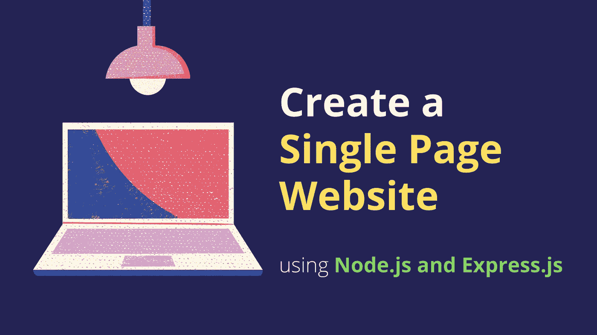
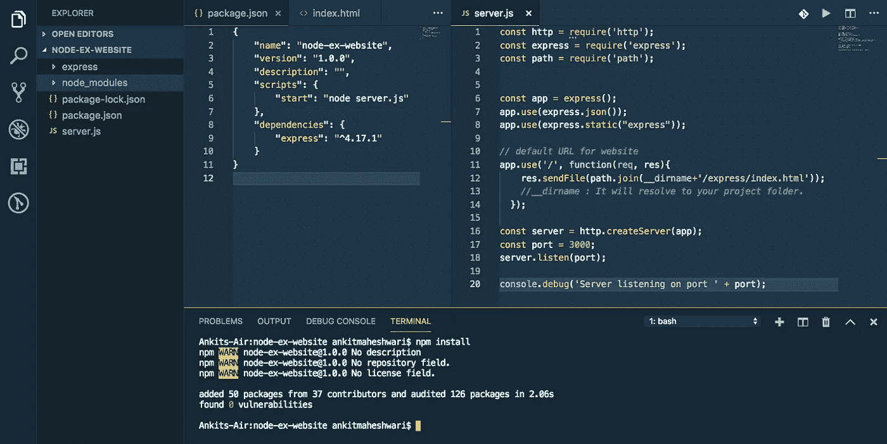
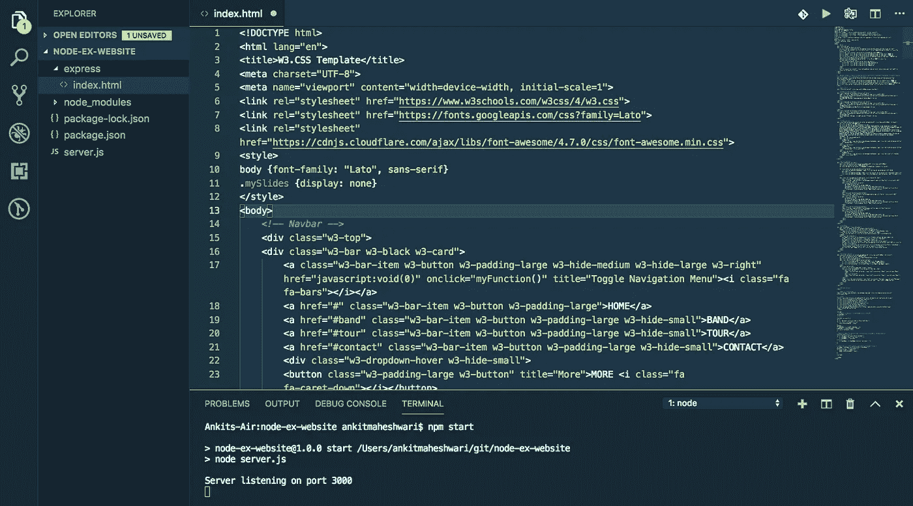
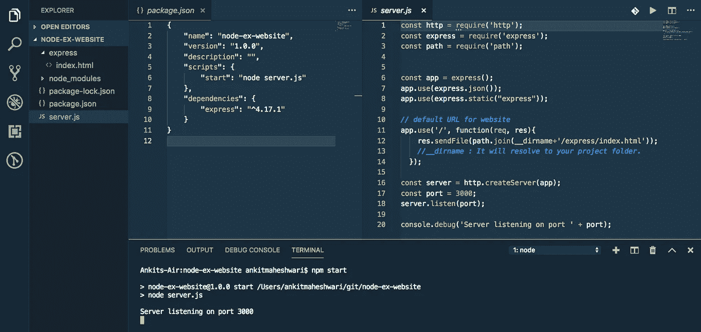
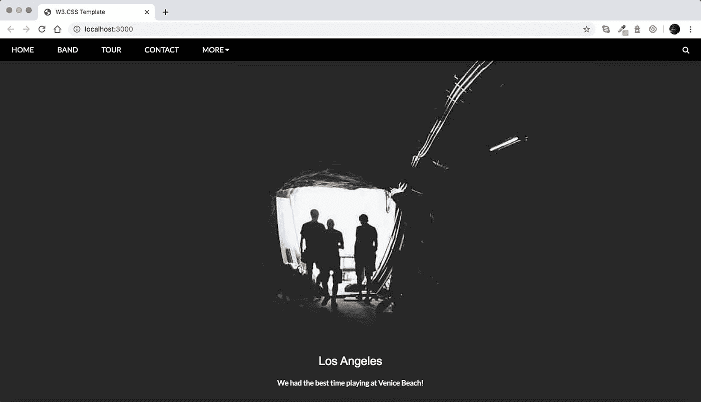

# 使用 Node.js 和 Express 创建一个单页网站

> 原文：<https://javascript.plainenglish.io/create-a-single-page-website-using-node-js-and-express-js-a0b53e396e4f?source=collection_archive---------0----------------------->

为了在 Node.js 中建立一个网站，我们将使用 Express framework。也可以使用任何其他框架，但是 Express 在使用 Node 时非常流行。



# 本文涵盖的内容:

**#1)** 安装。
**#2)** 用 Express.js 创建新的 [Node.js](https://nodejs.org/) 项目
**#3)** 使用 Express 创建路线。
**#4)** 测试——确保一切正常。

# #1)需要安装

*   [Node.js](https://nodejs.org/) 或 [NPM](https://nodejs.org/) (节点包管理器)
*   [VS 代码](https://code.visualstudio.com/download)(可选)——一个代码编辑器。

要检查 Node.js 是否已经安装在您的计算机上，请打开您的终端或 CMD 并运行`node -v`命令。如果你看到你的 Node.js 版本意味着它已经安装。

否则就去这些链接安装:
→ [点击这里下载安装 Node.js](https://nodejs.org/) (应该选择 LTS 版本)。
→ [点击此处下载 VS 代码](https://code.visualstudio.com/download)

# 快速应用程序生成器:

快速创建应用程序框架。您可以使用这个应用程序生成器工具(` express-generator `)。应用程序生成器使用`npx`命令(在 Node.js 更新版本中可用)。
→ [点击此处了解更多 Express application generator。](https://expressjs.com/en/starter/generator.html)

在这篇文章中，我们不会使用`express-generator`，相反，我们将自己创建一切，以避免从生成器生成额外的文件，并深入了解。

# #2)创建新项目(使用 Node.js 和 Express.js)

创建一个新文件夹(在您想要保存项目的位置)。
命名文件夹:`node-ex-website`

在`node-ex-website`文件夹下创建两个文件:
→ `package.json`文件。
→ `server.js`档。

创建一个文件夹(名称:express)并在`node-ex-website/express`文件夹中创建一个文件:
→ `node-ex-website/express/index.html`文件。

用下面的代码打开并更新您的`node-ex-website/package.json`文件:

```
{
    "name": "node-ex-website",
    "version": "1.0.0",
    "description": "",
    "scripts": {
        "start": "node server.js"
    },
    "dependencies": {
        "express": "^4.17.1"
    }
}
```

用下面的代码打开并更新您的`node-ex-website/server.js`文件:

```
const http = require('http');
const express = require('express');
const path = require('path');const app = express();
app.use(express.json());
app.use(express.static("express"));// default URL for website
app.use('/', function(req,res){
    res.sendFile(path.join(__dirname+'/express/index.html'));
    //__dirname : It will resolve to your project folder.
  });const server = http.createServer(app);
const port = 3000;
server.listen(port);console.debug('Server listening on port ' + port);
```

创建以上两个文件后，在`"node-ex-website"`文件夹中打开您的终端并运行以下命令:

```
npm install
```

该命令将安装在`"package.json"`文件中定义的依赖项。
(可以用 VS Code——一个代码编辑器↓)。



安装完依赖项后，这将在`"node-ex-website"`文件夹的根目录下创建`"node_modules"`文件夹。

# 模板(index.html)

用下面的代码替换您的→ `node-ex-website/express/index.html`文件，或者您可以使用自己的模板。

您也可以将所有静态文件添加到`express`文件夹中，如……
→`node-ex-website/express/css`和`node-ex-website/express/js`

`node-ex-website/express/index.html` file



# 运行项目

我们刚刚创建了 Node-Express 项目😍让我们启动一个服务器。
要启动服务器，请运行以下命令:

```
npm start
```



要测试这个 API——打开您的 web 浏览器并输入这个 URL → [localhost:3000](http://localhost:3000/)



# 搞定了。🤩使用 Node.js 和 Express.js 创建一个网站就是这么简单

再见👋👋

> 欢迎在评论框中发表评论…如果我错过了什么，或者有什么是不正确的，或者有什么对你不起作用:)
> 继续关注更多文章。
> 
> 更多文章敬请关注:
> [https://medium.com/@AnkitMaheshwariIn](https://medium.com/@AnkitMaheshwariIn)

如果你不介意给它一些掌声👏 👏既然有帮助，我会非常感谢:)帮助别人找到这篇文章，所以它可以帮助他们！

永远鼓掌…


# 了解更多信息

[](https://medium.com/@AnkitMaheshwariIn/create-a-single-page-website-using-angular-firebase-hosting-8ba22b8176a1) [## 使用 Angular & Firebase 托管创建一个单页网站。

### 新的角度与一个网页的网站和 Firebase 托管直播服务器项目。

medium.com](https://medium.com/@AnkitMaheshwariIn/create-a-single-page-website-using-angular-firebase-hosting-8ba22b8176a1) [](https://medium.com/javascript-in-plain-english/create-rest-api-web-services-using-node-js-and-express-js-with-crud-operations-ff790d6ae030) [## 用 Node 和 Express.js 创建 CRUD Rest API

### 为了在 Node.js 中构建 API，我们将使用 Express.js 框架。也可以使用任何其他框架，但是 Express.js 非常…

medium.com](https://medium.com/javascript-in-plain-english/create-rest-api-web-services-using-node-js-and-express-js-with-crud-operations-ff790d6ae030) [](https://medium.com/codechintan/everything-you-need-to-know-about-angular-framework-typescript-10049b858ae0) [## 关于 Angular framework/TypeScript 你需要知道的一切。

### 完整的角度系列-什么是角度/类型脚本？|为什么我们需要有棱角？|使用 Angular 的好处？|…

medium.com](https://medium.com/codechintan/everything-you-need-to-know-about-angular-framework-typescript-10049b858ae0) 

## 进一步阅读

[](https://bit.cloud/blog/composing-reusable-landing-pages-in-components-l4mk36jk) [## 在组件中组合可重用的登录页面

### 最近，我们不得不创建一个登录页面，允许人们请求演示我们的产品。这一页是…

比特云](https://bit.cloud/blog/composing-reusable-landing-pages-in-components-l4mk36jk) 

*更多内容请看*[***plain English . io***](https://plainenglish.io/)*。报名参加我们的* [***免费周报***](http://newsletter.plainenglish.io/) *。关注我们关于*[***Twitter***](https://twitter.com/inPlainEngHQ)[***LinkedIn***](https://www.linkedin.com/company/inplainenglish/)*[***YouTube***](https://www.youtube.com/channel/UCtipWUghju290NWcn8jhyAw)***，以及****[***不和***](https://discord.gg/GtDtUAvyhW) *对成长黑客感兴趣？检查* [***电路***](https://circuit.ooo/) ***。*****