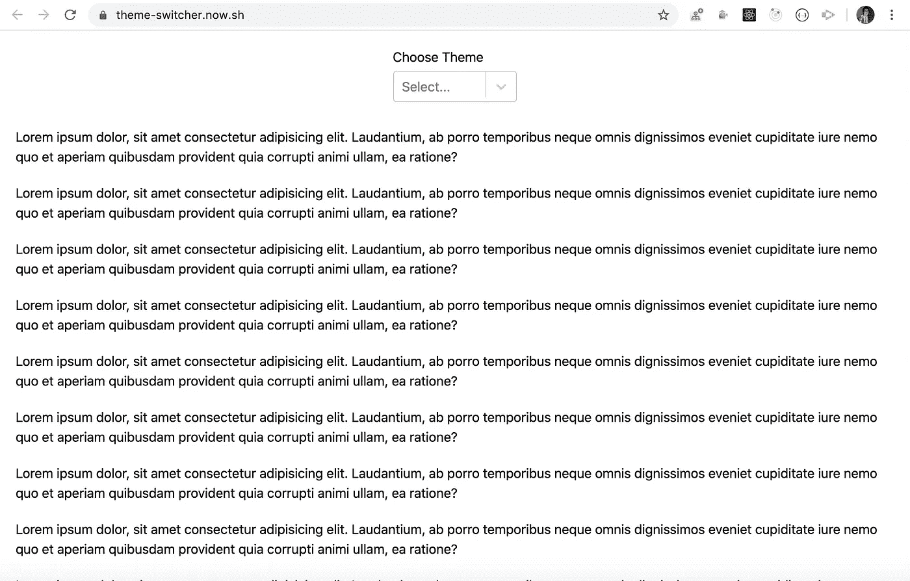
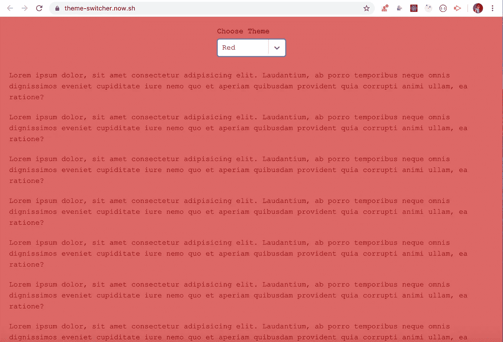
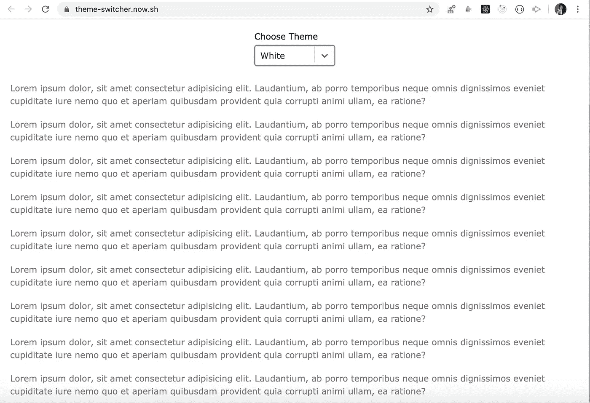

# 在 React 中创建一个主题切换应用

> 原文：<https://javascript.plainenglish.io/create-a-theme-switching-app-in-react-d848da151455?source=collection_archive---------3----------------------->

## 学习如何动态地改变你网站的主题


Photo by [Aryan Dhiman](https://unsplash.com/@mylifeasaryan_?utm_source=medium&utm_medium=referral) on [Unsplash](https://unsplash.com?utm_source=medium&utm_medium=referral)

在本文中，我们将创建一个 React 应用程序，允许我们更改应用程序的主题。

## 我们开始吧

使用`create-react-app`创建一个新项目

```
create-react-app theme-switcher
```

项目创建完成后，删除`src`文件夹中的所有文件，在`src`文件夹中创建`index.js,` `App.js`和`styles.css`文件。同样，在`src`文件夹中创建`components`和`utils`文件夹。

安装`react-select`包，我们将使用它来显示下拉选项

```
yarn add react-select@3.1.0
```

在`utils`文件夹中创建一个新文件`themes.js`，内容如下

themes.js

在这里，我们定义了应用程序所需的所有定制主题

在`components`文件夹中创建一个新文件`Dropdown.js`,内容如下

Dropdown.js

这里，我们使用来自`themes.js`的主题名称创建一个下拉列表

在`components`文件夹中创建一个新文件`Header.js`,内容如下

Header.js

这里，我们只显示先前创建的下拉列表，并在从下拉列表中选择任何值时调用处理程序。

在`components`文件夹中创建一个新文件`Main.js`，内容如下

Main.js

这里，我们添加了需要显示的页面的虚拟文本内容。

在`src/App.js`内增加以下内容

App.js

这里，我们在主 div 中添加了一个`ref`,这样我们就可以改变主 div 的样式。

```
<div ref={refCallback} className="main-section">
```

所以每当我们从下拉菜单中选择任何一个主题，就会调用`App.js`中的`handleChange`处理程序，在这里我们用`utils/themes.js`中匹配的主题对象来设置主题状态。

因此，如果选择红色主题，主题状态将包含来自`themes.js`的红色对象值

```
{
 'background-color': '#dc6868',
 'color': '#a50b0b',
 'font-family': "'Courier New', Courier, monospace"
}
```

在`refCallback`处理程序中，我们采用为特定主题定义的样式，并使用 DOM 的`setProperty`方法为分配了`ref`的节点添加样式。

```
node.style.setProperty('css-property', 'property-value', 'important');
```

第三个参数将`!important`添加到每个属性中，因此即使我们为 div 定义了单独的 CSS 样式，应用于该 div 的样式也不会受到影响。

在`src/styles.css`内增加以下内容

styles.css

在`src/index.js`内添加以下内容

index.js



Initial Screen



Red Theme



White Theme

你可以在这里[找到这篇文章的完整源代码](https://github.com/myogeshchavan97/theme-switcher)，在这里找到现场演示

看看我最近出版的[掌握 Redux](https://master-redux.yogeshchavan.dev/) 课程。

在本课程中，您将构建 3 个应用程序以及一个点餐应用程序，您将了解:

*   基本和高级冗余
*   如何管理数组和对象的复杂状态
*   如何使用多个减速器管理复杂的冗余状态
*   如何调试 Redux 应用程序
*   如何在 React 中使用 Redux 使用 react-redux 库让你的 app 反应性。
*   如何使用 redux-thunk 库处理异步 API 调用等等

最后，我们将从头开始构建一个完整的[订餐应用](https://www.youtube.com/watch?v=2zaPDfCKAvM)，集成 stripe 以接受支付，并将其部署到生产中。

**别忘了订阅我的每周简讯，里面有惊人的技巧、诀窍和文章，直接在这里的收件箱** [**中订阅。**](https://yogeshchavan.dev/)

## 进一步阅读

[](https://bit.cloud/blog/theming-react-apps-with-styled-components-and-bit-l7epurug) [## 使用风格化组件和位对 React 应用程序进行主题化

### 作为 UI 开发人员，我们经常希望将表示与交互分开，这样我们就可以应用相同的 CSS…

比特云](https://bit.cloud/blog/theming-react-apps-with-styled-components-and-bit-l7epurug) 

*更多内容请看*[***plain English . io***](https://plainenglish.io/)*。报名参加我们的* [***免费周报***](http://newsletter.plainenglish.io/) *。关注我们关于*[***Twitter***](https://twitter.com/inPlainEngHQ)[***LinkedIn***](https://www.linkedin.com/company/inplainenglish/)*[***YouTube***](https://www.youtube.com/channel/UCtipWUghju290NWcn8jhyAw)*[***不和***](https://discord.gg/GtDtUAvyhW) *。对增长黑客感兴趣？检查* [***电路***](https://circuit.ooo/) *。***