# 在 React 中创建一个旅行列表应用程序

> 原文：<https://javascript.plainenglish.io/create-a-travel-list-app-in-react-ab1564885bbe?source=collection_archive---------3----------------------->

## 了解如何使用 React、Gatsby、list、GraphCMS 创建旅行列表应用程序。


Photo by [Philipp Kämmerer](https://unsplash.com/@philippcamera?utm_source=medium&utm_medium=referral) on [Unsplash](https://unsplash.com?utm_source=medium&utm_medium=referral)

读者你好！

今天在这篇文章中，我们将看到如何使用 React、Gatsby、fleet 和 GraphCMS 创建一个旅行列表应用程序。

实际上旅行总是很有趣，我们想去很多不同的地方旅行，但是我们没有足够的时间去做。所以我们决定创建一个包含自定义地图应用程序的列表，在列表中显示我们所有的目的地。

在进入主题之前，让我们看看构建这个应用程序需要遵循哪些步骤:

*   用传单创建一个新应用程序。
*   在 GraphCMS 中管理旅行地点列表。
*   用 GraphQL 查询我们的数据位置。
*   为目的地创建一个清单，并添加到我们的地图。

让我们进入主题，我们将使用 Gatsby 和 CMS 构建一个地图应用程序，它将在地图上显示标记，并在一个简单的列表位置中显示我们的位置。

# 使用传单创建新应用程序

我们将创建一个带有绘图工具的基本 React 应用程序。首先，转到您想要创建新应用程序并运行的本地目录。

```
gatsby new my-travel-bucket-list https://github.com/colbyfayock/gatsby-starter-leaflet
```

现在把你的**我的旅行清单**换成你想要的方便的名字。这用于为应用程序创建新文件夹。

运行该命令后，Gatsby 将启动并安装我们需要的所有依赖项。然后转到该目录并运行开发命令:

```
cd my-travel-bucket-list
yarn develop
# or
npm run develop
```

现在你的应用程序应该准备好了。

现在转到 **src/pages/index.js** 文件。然后移除 **mapEffect** 内的第一行，让 leafletElement 映射:

```
async function mapEffect({ leafletElement: map } = {}) {
  if ( !map ) return;
}
```

然后移除 IndexPage 组件顶部的 markerRef。然后从我们的 **< Marker >** 组件中移除 ref={markerRef} prop，下一步是**useRef**import React。

最后，我们必须删除所有以 popup 和 time 开头的变量，包括:

*   时间工作室
*   timeToOpenPopupAfterZoom
*   timeToUpdatePopupAfterZoom
*   popupContentHello
*   popupContentGatsby

然后，您必须删除以下所有行:

```
import L from 'leaflet';
...
import { promiseToFlyTo, getCurrentLocation } from 'lib/map';
...
import gatsby_astronaut from 'assets/images/gatsby-astronaut.jpg';
...
const ZOOM = 10;
```

现在你将得到基本的地图。

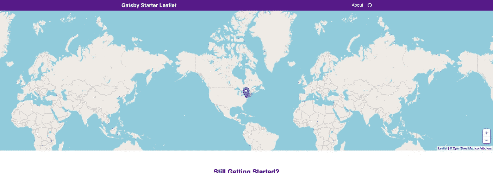

Initial map

# 在 GraphCMS 中管理旅行地点列表

要开始使用 GraphCMS，首先你需要一个帐户，有一个免费层，可以很容易地注册我们的演示。如果您已经有一个帐户，那么您可以使用它登录。

## 在 GraphCMS 中创建新项目

登录后，您必须创建一个新项目。我们将手动创建，因此转到 GraphCMS [](https://app.graphcms.com/)仪表板并选择 Create new project。

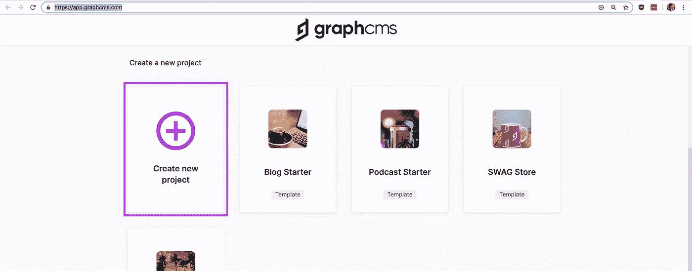

Creating a new project

现在您必须输入名称和描述:

**姓名**:我的旅行遗愿清单

**描述**:我想去旅游的地点。

选择下图所示的区域，用于存储该区域的数据。为了方便起见，请选择您附近的地区。

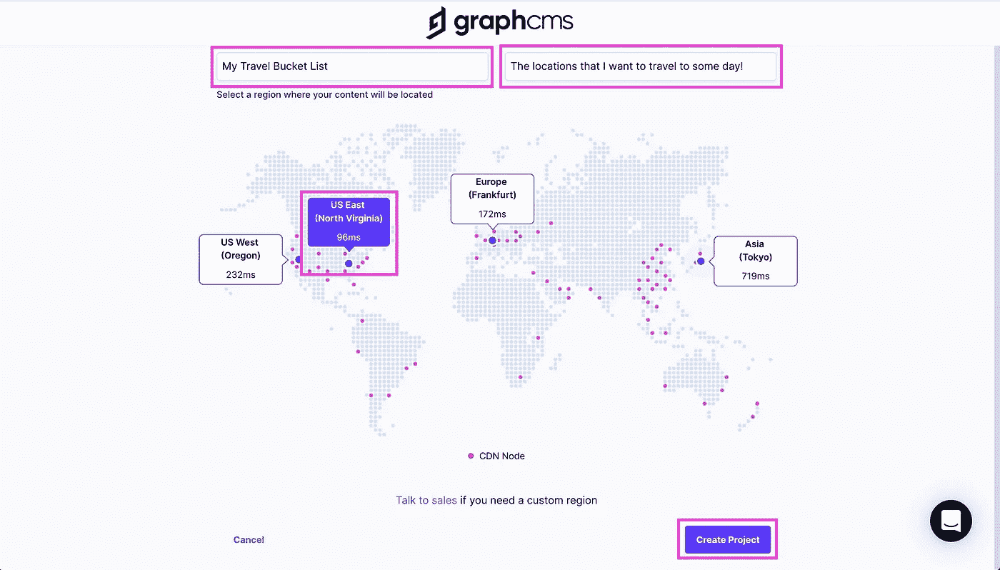

Configure a new project

选择您所在的地区后，单击创建项目。

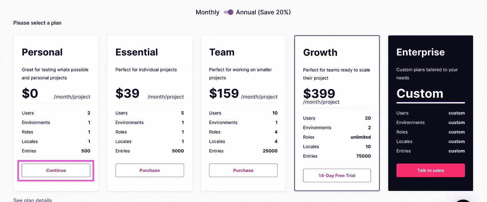

Personal plans

在 GraphCMS 中创建新的内容模型

在 GraphCMS 中，内容模型是一种特定类型的数据，包含与之相关联的特定属性。在我们的例子中，我们的模型是一个目的地，我们可以通过名称和位置来定义。

然后转到左边栏中 GraphCMS 的 Schema 部分并选择 Create Model。

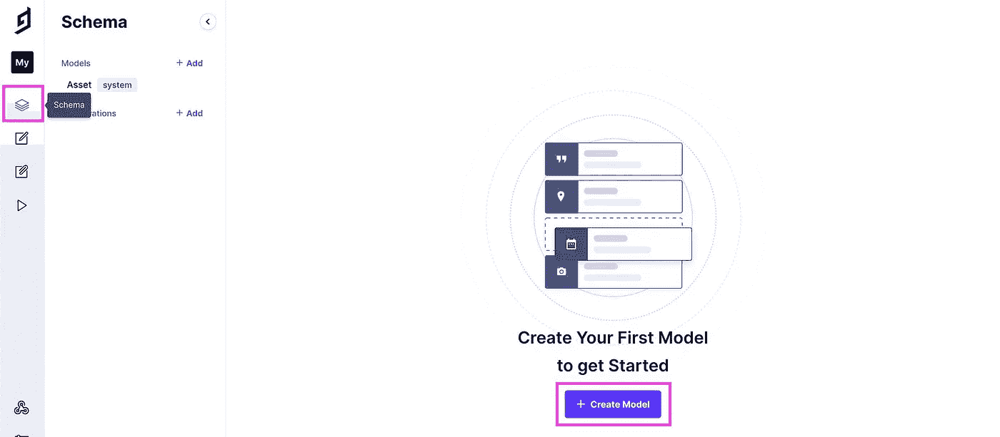

Creating a new schema

选中后，您将看到一个弹出窗口，要求提供更多信息。您可以在那里输入“目的地”作为**显示名称**，但这是可选的，不是必需的。

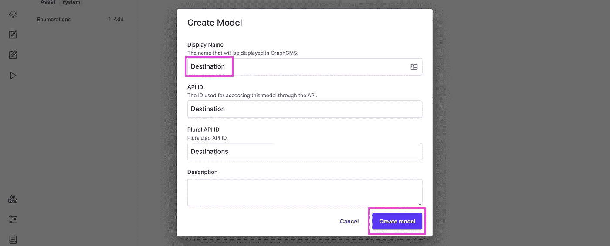

Creating a new model

然后想加描述就加描述，不重要。然后选择创建模型。

现在我们有了带有属性的模型，然后在右边的字段列表中选择单个文本，并添加一个显示名称“Name”。这将生成一个应用程序 Id。然后单击创建。

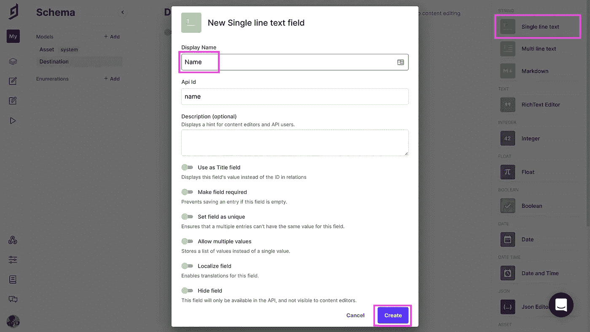

Adding and configuring a new text field

接下来，向下滚动位置并选择地图。添加“位置”作为显示名称，并将应用程序 Id 设置为“位置”，然后单击创建。

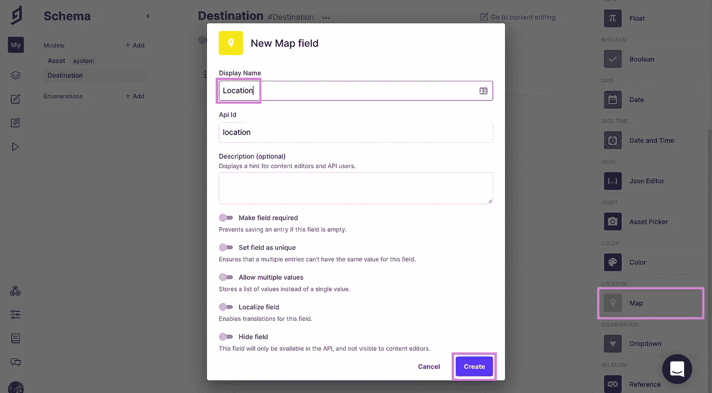

Adding and configuring new map field

然后我们有一个内容模型，用于创建我们位置。

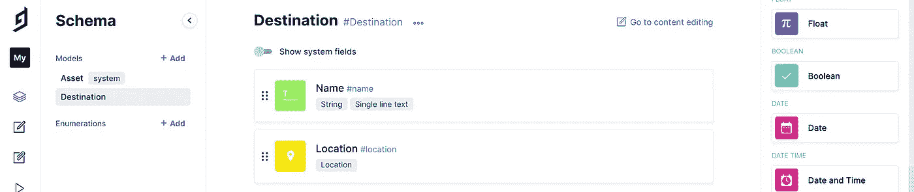

Destination content model

创建我们的位置

现在让我们创建我们的位置。转到 GraphCMS 仪表板中的内容和系统下的选定目标，然后新建。

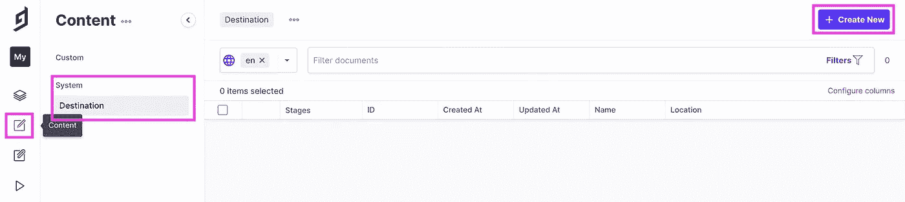

Creating a new destination content

现在我们必须开始添加所有的位置。首先在名称字段中添加您所在位置的名称，然后在位置下添加搜索框以在地图上查找该位置。

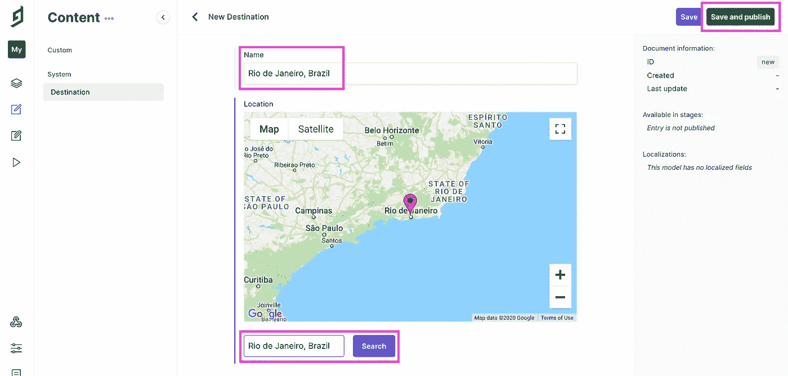

Adding a new destination content

最后保存并发布。现在，您已经成功创建了您的第一个位置。

按照同样的步骤，根据需要创建多个位置。

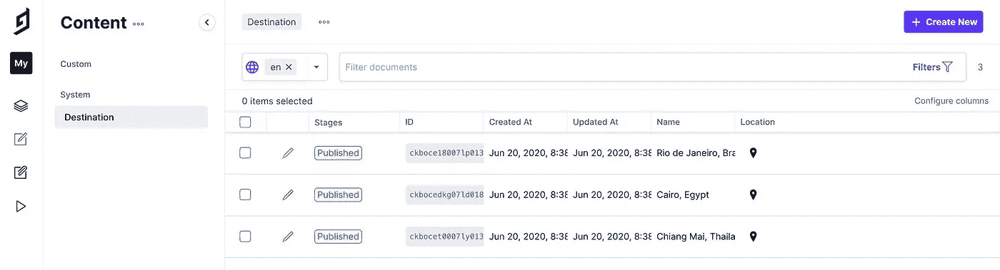

List of destination content items

# 用 GraphQL 查询我们的数据位置

现在我们有了我们的位置，让我们现在使用数据。

## 给 Gatsby 添加一个插件来查询我们的 GraphQL 数据

第一步，我们必须向 Gatsby 项目添加一个新插件来查询 GraphQL 数据。在您的终端中运行以下代码:

```
yarn add gatsby-source-graphql
# or
npm install gatsby-source-graphql
```

接下来打开项目中的 **gatsby-config.js** 文件，并将以下内容添加到插件中:

```
{
  resolve: 'gatsby-source-graphql',
  options: {
    typeName: 'GCMS',
    fieldName: 'gcms',
    url: '[API ENDPOINT]',
  }
}
```

## 为 GraphCMS 寻找我们的 API 端点

打开浏览器，导航到 GraphCMS 项目，在左侧导航栏中选择 Settings，然后选择 API Access。

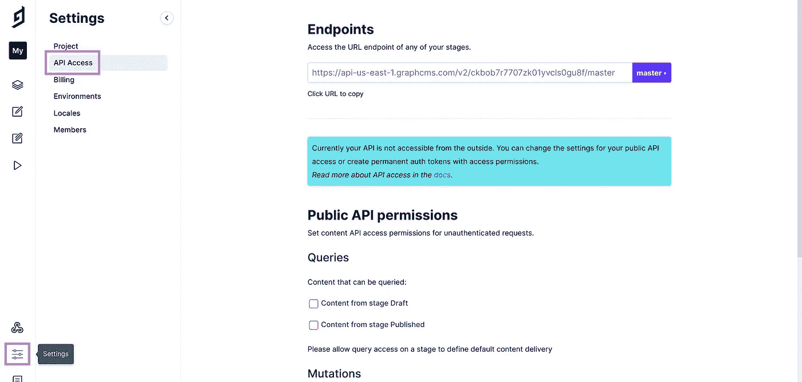

API Access

首先，我们必须在复制以前的代码之前更新我们的权限，所以我们必须查询我们的 API。在**公共 API 权限**下，勾选**内容**旁边的复选框，点击**保存**。

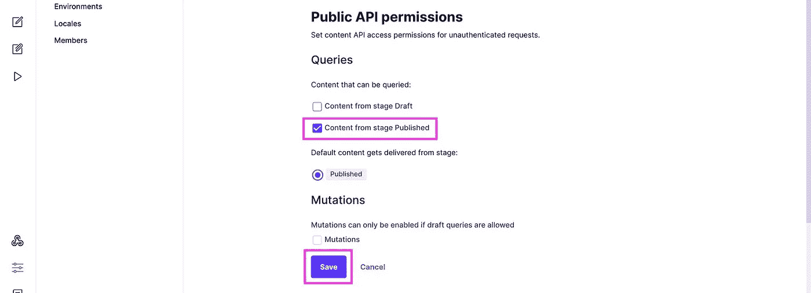

Configure API Access

现在复制端点下的 URL:

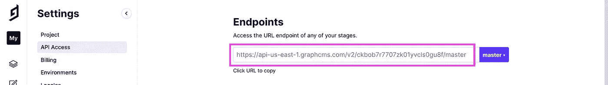

Copying API Endpoints

并将其粘贴到您的 **gatsby-config.js** 文件中:

```
{
  resolve: 'gatsby-source-graphql',
  options: {
    typeName: 'GCMS',
    fieldName: 'gcms',
    url: 'https://[region-id].graphcms.com/v2/[project-id]/master',
  },
},
```

现在保存 **gatsby-config.js** 文件并启动开发服务器。

## 通过 GraphQL 查询我们的位置

现在，我们将查询我们的数据，并能够在我们的应用程序中使用它。

首先，我们必须创建一个新的 [React Hook](https://reactjs.org/docs/hooks-reference.html) 来抓取我们在应用程序中的任何位置。

在 **src/hooks/index.js** 中，将以下代码添加到现有列表中:

```
export { default as useDestinations }
```

然后在 **src/hooks** 中，创建一个新文件 **useDestinations.js** 并粘贴以下代码:

```
import { graphql, useStaticQuery } from 'gatsby';

export default function useDestinations() {
  const { gcms = {} } = useStaticQuery( graphql`
    query {
      gcms {
        destinations {
          id
          name
          location {
            latitude
            longitude
          }
        }
      }
    }
  ` );

  let { destinations } = gcms;

  return {
    destinations,
  };
}
```

现在转到您的 **src/pages/index.js** 文件并导入我们的新钩子:

```
import { useDestinations } from 'hooks';
```

现在转到 **IndexPage** 组件并查询我们的数据:

```
const { destinations } = useDestinations();
```

这将在 destinations 变量中生成所有位置。我们可以通过登录控制台对此进行测试:

```
console.log('destinations', destinations);
```

现在打开你的浏览器，看看开发者控制台，你可以看到我们的位置数据。


Gatsby Initial map

# 为目的地创建一个清单，并添加到我们的地图

现在，我们将开始创建一个简单的目的地列表。

## 创建我们目的地的文本列表

导航到我们的**索引页面**并添加以下代码:

```
<h2>My Destinations</h2>
<ul>
  { destinations.map(destination => {
    const { id, name } = destination;
    return <li key={id}>{ name }</li>
  })}
</ul>
```

然后保存并重新加载，我们将在地图中看到我们的列表。


Marker for each destination

现在打开**src/assets/style sheets/pages/_ home . scss**并在。 **home-start** class:

```
.home-start {

  ...

  ul {
    list-style: none;
    padding: 0;
    margin: 1.2em 0;
  }
```

然后修改 **h2** 使之稍微好一点:

```
.home-start {

  ...

  h2 {

    margin-top: 2em;

    &:first-child {
      margin-top: 0;
    }

  }
```

然后保存并重新加载，现在看起来是这样的:

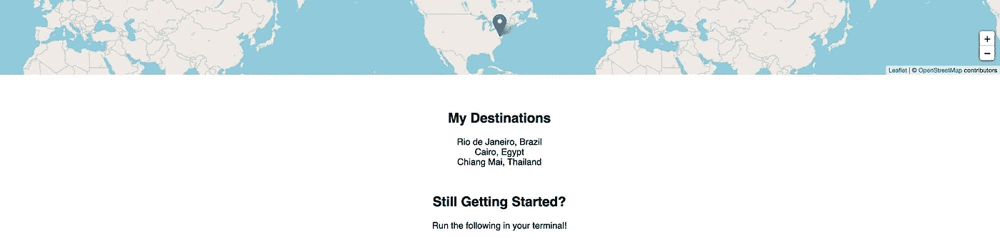

Popup for each destination

## 将我们的目的地添加到地图

现在我们必须将我们的目的地添加到地图上。

导航到你的 **<地图>** 组件，我们已经有了一个 **<标记>** 。这用于在地图的给定位置添加标记。

将以下代码添加到 **<地图>** 部分:

```
<Map {...mapSettings}>
  { destinations.map(destination => {
    const { id, name, location } = destination;
    const position = [location.latitude, location.longitude];
    return <Marker key={id} position={position} />
  })}
</Map>
```

现在，我们必须为每个标记添加一个弹出窗口来显示名称。

首先，我们必须从**反应-传单**中导入**弹出菜单**:

```
import { Marker, Popup } from 'react-leaflet';
```

然后在我们的 **<标记>** 组件中添加以下代码进行返回:

```
return (
  <Marker key={id} position={position}>
    <Popup>{ name }</Popup>
  </Marker>
);
```

然后保存并打开我们的地图，点击每个标记来查看我们的目的地名称。

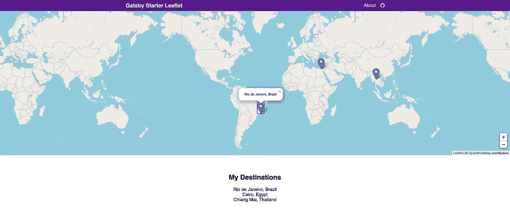

Final demo

# 结论

我希望你玩得开心。这个应用程序给你所有你环游世界的目的地。您还可以在此应用程序中添加更多样式和功能。

感谢阅读！