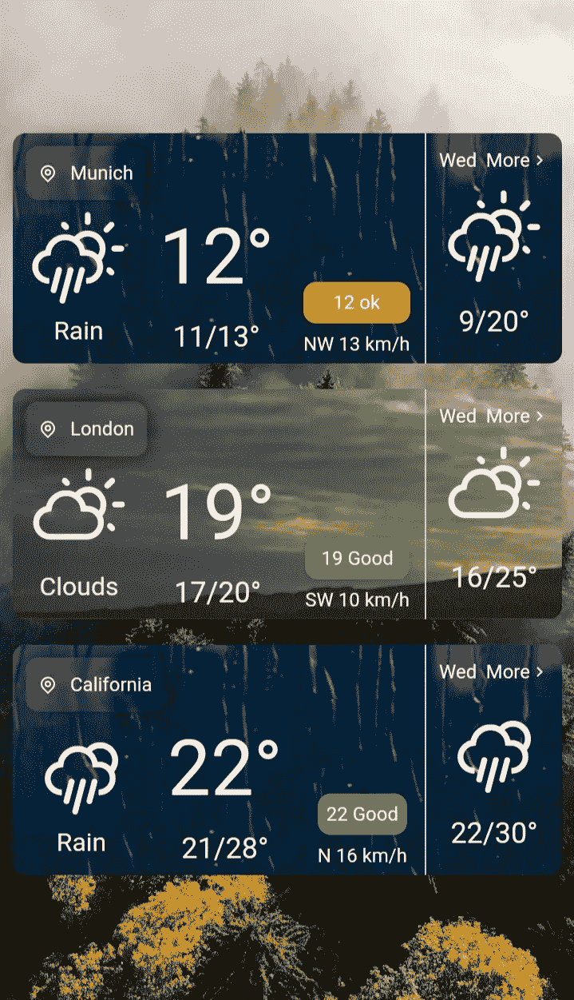

# 在 React 中创建天气应用程序。射流研究…

> 原文：<https://javascript.plainenglish.io/create-a-weather-app-in-react-js-d9a9b931142d?source=collection_archive---------4----------------------->

## 了解如何使用 React、Redux、TypeScript 和 Tailwind 创建天气应用程序。


Photo by [Wim van 't Einde](https://unsplash.com/@wimvanteinde?utm_source=medium&utm_medium=referral) on [Unsplash](https://unsplash.com?utm_source=medium&utm_medium=referral)

读者你好！

在本文中，您将了解如何使用 React、Redux、TypeScript 和 Tailwind 开发一个基本的天气应用程序。这篇文章是专门为 React 初学者准备的。所以它最适合那些读者。

在进入正题之前，我构建这个应用的原因是什么？

最简单的回答是，我总是喜欢在网络技术领域创造新事物。这对于最近开始学习 web 技术的人来说很有用。

让我给你看看最终的应用程序是什么样的。



Final Application

# 我们开始吧

开发这款应用的要求是:

*   节点. js
*   npm

# 第一步

首先安装软件包。

打开您的终端并执行以下代码。

```
npx create-react-app weather --template typescriptcd weathernpm install react-icons react-redux react-router-dom redux redux-thunk tailwindcss postcss-cli autoprefixer @fullhuman/postcss-purgecss @types/react-redux @types/react-router-dom
```

第**个**命令用于在 Typescript 中构建 React 模板。

第二个命令**将把我们带到应用程序目录。**

第三个命令**将安装所有的软件包。**

*   **react-icons** -用于花式图标。
*   **react-redux** -用于连接 redux 和 react。
*   **react-router-dom** -用于启用多条路由。
*   **redux** -用于状态管理。
*   **redux-thunk** -用于启用 redux 中的异步行为。
*   用于样式的 css 框架。
*   **postcss-cli** -用于启用缩小应用程序制作。
*   **autoprefixer** -用于解析 CSS 解析器。
*   **@ full human/postcss-purge CSS**-一个 post CSS 插件。
*   **@ types/react-redux**-Typescript 的类型定义。
*   **@ types/React-Router-DOM**-React 路由器的类型定义。
*   让我们使用命令启动应用程序。

```
npm start
```

# 第二步

这一步是为了删除自动生成的代码。

进入**。/src/App.tsx** 并删除 return 语句中的代码。

```
return <></>;
```

在顶部，您会看到:

```
import logo from "./logo.svg";
import "./App.css";
```

移除导入并删除 **src/App.css** 并删除其他无用的代码。

# 第三步

建筑结构

在。/src。

*   行动
*   资产
*   成分
*   页
*   还原剂

解释:

*   **动作** -用于存储动作类型和冗余动作。
*   **资产** -用于静态内容。
*   **组件** -你可以多次使用同一个组件，节省大量时间。
*   这是一个干净代码的地方。
*   **reducers**——redux 动作改变应用程序状态的地方。

# 第四步

让顺风进入我们的项目。

打开**。/src/index.tsx** 并添加:

```
import "./tailwind.output.css";
```

然后添加添加**。/tailwind.config.js.**

```
module.exports = {
  theme: {
    extend: {
      width: {
        "410px": "410px",
      },
    },
  },
};
```

执行 **npm run build** 构建 Tailwind，并在 **package.json** 中添加“脚本”标签。

```
build:tailwind": "tailwind build src/tailwind.css -o src/tailwind.output.css",
"prestart": "npm run build:tailwind",
"prebuild": "npm run build:tailwind"
```

创建 **src/tailwind.css**

***。/src/tailwind.css*** :

```
@tailwind base;
@tailwind components;
@tailwind utilities;
```

再次运行 **npm start** 编译所有代码。

# 第五步

准备 Redux

在**中。/src/减速器**制造:

**。/src/reducers/Ajax reducer . js**:

```
const initialState = {
    weather: {},
  };

  export default function (state = initialState, action) {
      switch (action.type) {
          default:
              return state;
      }
  }
```

我们可以从 OpenWeatherMap 获取数据，数据将存储在天气状态组件中。

现在让我们写样板代码。

**src/reducers/index.js**

```
import { combineReducers } from "redux";
import ajaxReducer from "./ajaxReducer";

export default combineReducers({
  weatherReducer: ajaxReducer,
});
```

对于一个更大的项目， **index.js** 充当 React Redux 的中心位置。

现在是行动的时候了…行动！

创建 **types.js** 并存储 Redux 动作的所有类型。

**。/src/reducers/index.js**

对于简单的项目，我们只有一个动作。

**。/src/actions/types.js**

```
export const FETCH_WEATHER = "FETCH_WEATHER";
```

现在做一个也是唯一的 Ajax 请求/还原操作。转到 OpenWeatherMap 并制作一个令牌。

使用 OpenWeatherMap 需要一个令牌，它可以免费提供大量 API 调用。

**。/src/actions/ajaxactions . js**

```
import { FETCH_WEATHER } from "./types";

export const fetchWeather = () => async (dispatch) => {
  const ids = {
    India: 2867714,
    Canada: 2643743,
    California: 4350049,
  };

  const fetches = await Promise.all(
    Object.values(ids).map((e) =>
      fetch(
        `https://api.openweathermap.org/data/2.5/forecast?id=${e}&appid=` // here you put your token key
      ).then((e) => e.json())
    )
  );

  dispatch({
    type: FETCH_WEATHER,
    payload: {
      // iterating through object does not guarantee order, so I chose manually
      India: fetches[0],
      Canada: fetches[1],
      California: fetches[2],
    },
  });
};
```

我选择我最喜欢的城市，你可以自己选择城市。

首先制作一个带有城市名和 id 的对象。然后将获取并解析的 JSON 存储到常量 **fetches** 中。使用 **Promise.all()** 获取城市数据。使用 await 关键字加载内容，这也使它变得漂亮。我们未完成 **ajaxReducer.js** 让我们现在完成。

**。/src/reducers/Ajax reducer . js**

```
import { FETCH_WEATHER } from "../actions/types";

const initialState = {
  weather: {},
};

export default function (state = initialState, action) {
  switch (action.type) {
    case FETCH_WEATHER:
      return {
        ...state,
        weather: action.payload,
      };
    default:
      return state;
  }
}
```

Redux 不允许我们从 reducers 中改变一个状态。所以我们只是用来自**的动作有效载荷覆盖天气键。/src/actions/ajaxactions . js**。

# 第六步

将应用程序连接到 redux

首先，我们必须为 Redux 创建一个文件，并将主 Redux 文件命名为。

**。/src/store.js**

```
import { createStore, applyMiddleware } from "redux";
import thunk from "redux-thunk";
import rootReducer from "./reducers";

const initialState = {};

const middleware = [thunk];

const store = createStore(
  rootReducer,
  initialState,
  applyMiddleware(...middleware)
);

export default store;
```

总是做一个更干净的代码。为更大的项目清理样板文件。

在**。/src/App.tsx** 现在是做一些小改动的时候了。

**。/src/App.tsx**

```
import React from "react";
import { Provider } from "react-redux";
import store from "./store";
import { BrowserRouter as Router, Switch, Route } from "react-router-dom";

import Home from "./pages/Home";

function App() {
  return (
    <Provider store={store}>
      <Router>
        <Switch>
          <Route path="/" component={Home} />
        </Switch>
      </Router>
    </Provider>
  );
}

export default App;
```

为了让 React 应用程序与 Redux 一起工作，我们必须将应用程序包装在其中，它接收**。/src/store.js** 。这只是一个主页，还有更多的建设。

# 第七步

命名资产

对于主页，这些是我用的 gif。

。/src/assets/clear.gif

。/src/assets/clouds.gif

。/src/assets/毛毛雨. gif

。/src/assets/fog.gif

。/src/assets/rain.gif

。/src/assets/snow.gif

。/src/assets/雷暴. gif

对于主页，使用了八张图片。四个用于手机，四个用于台式机。

对于电话:

​ ./src/assets/p_bg1.jpg

​ ./src/assets/p_bg4.jpg

对于台式机:

​ ./src/assets/d_bg1.jpg

​ ./src/assets/d_bg4.jpg

# 第八步

家及其组成部分

**。/src/pages/Home.tsx**

现在将组件定义为一个**类**组件。使用**反应钩子**可以做同样的事情。

**设置状态**不会立即设置状态。它只在收到状态后的回调时执行。然后现在是递归调用改变背景照片的时候了。

为了清楚起见，让我们保持这样。

**/src/components/home/card . tsx**

用大写字母命名您的组件！

我们收到的 API 请求是开尔文，所以要得到摄氏温度，我们必须减去 273.15。

您必须通过在请求 URL 上传递 units=metric 来做同样的事情。

此外，这个组件可以被分成更小的部分，以便于理解和维护干净的代码。

还有 3 个组件，我们必须探索。

**。/src/components/home/left component . tsx**

```
import React from "react";
import { determineIcon } from "../Utils";

interface FormProps {
  stateOfWeather: string;
  idOfWeather: number;
  day: boolean;
}

function LeftComponent(props: FormProps) {
  return (
    <div className="flex flex-col text-center">
      {determineIcon(props.idOfWeather, props.day, "h-16 w-16")}
      <div>{props.stateOfWeather}</div>
    </div>
  );
}

export default LeftComponent;
```

**。/src/components/home/right component . tsx**

```
import React from "react";

interface FormProps {
  feelsLike: number;
  deg: number;
  speed: number;
}

function RightComponent(props: FormProps) {
  const determineLevel = (temp: number): string[] => {
    if (temp < 10 || temp > 29) {
      return ["Bad", "bg-red-600"];
    }

    if ((temp > 9 && temp < 18) || (temp > 22 && temp < 30)) {
      return ["ok", "bg-yellow-600"];
    }

    if (temp > 17 && temp < 23) {
      return ["Good", "bg-green-600"];
    }

    return [];
  };

  const determineSide = (deg: number): string | undefined => {
    if (deg < 30) return "N";

    if (deg < 60) return "NE";

    if (deg < 120) return "E";

    if (deg < 150) return "ES";

    if (deg < 210) return "S";

    if (deg < 240) return "SW";

    if (deg < 300) return "W";

    if (deg < 330) return "NW";

    if (deg < 360) return "N";
  };

  const feelsLikeProperties = determineLevel(props.feelsLike);

  return (
    <div className="self-end text-center">
      <div
        className={`${feelsLikeProperties[1]} rounded-lg text-xs sm:text-sm p-1`}
      >
        {props.feelsLike} {feelsLikeProperties[0]}
      </div>
      <div className="mt-1 text-xs md:text-sm">
        {determineSide(props.deg)} {Math.round(props.speed * 3.6)} km/h
      </div>
    </div>
  );
}

export default RightComponent;
```

风响应以米/秒为单位，因此要将其转换为千米/小时，需乘以 3.6。

。**/src/components/home/tomorrow . tsx**

```
import React from "react";
import { RiArrowRightSLine } from "react-icons/ri";
import { determineIcon } from "../Utils";

interface FormProps {
  idOfWeather: number;
  day: boolean;
  list: [];
}

function Tomorrow(props: FormProps) {
  const determineNextDayAbb = (): string => {
    const weekdays = ["Sun", "Mon", "Tue", "Wed", "Thu", "Fri", "Sat"];

    let date = new Date();
    let index: number;

    if (date.getDay() === 6) {
      index = 0;
    } else {
      index = date.getDay() + 1;
    }

    return weekdays[index];
  };

  const crawlNextDayTemps = (list: any[]): [number, number] | void => {
    const d = new Date();
    d.setDate(d.getDate() + 1); // tomorrow

    const tomorrow = d.getDate() < 10 ? `0${d.getDate()}` : d.getDate();

    let min: number[] = [],
      max: number[] = [];

    list.forEach((e) => {
      if (`${e["dt_txt"][8]}${e["dt_txt"][9]}` === tomorrow.toString()) {
        min.push(e.main.temp_min);
        max.push(e.main.temp_max);
      }
    });

    return [
      Math.round(Math.min(...min) - 273.15),
      Math.round(Math.max(...max) - 273.15),
    ];
  };

  const nextDayTemps = crawlNextDayTemps(props.list);

  return (
    <div className="w-3/12">
      <div className="flex justify-between p-2">
        <div className="text-xs">{determineNextDayAbb()}</div>
        <div className="text-xs flex items-center">
          <div>More</div>
          <RiArrowRightSLine />
        </div>
      </div>
      <div className="flex flex-col text-center">
        <div className="w-full">
          {determineIcon(props.idOfWeather, props.day, "h-16 w-16 mx-auto")}
        </div>
        <div className="text-lg">
          {Array.isArray(nextDayTemps) ? nextDayTemps[0] : "?"}/
          {Array.isArray(nextDayTemps) ? nextDayTemps[1] : "?"}°
        </div>
      </div>
    </div>
  );
}

export default Tomorrow;
```

# 第九步

城市及其组成部分

现在先加上城市路线反应一下。

**。/src/App.tsx**

之前:

```
<Route path="/" component={Home} />
```

添加:

```
<Route path="/:city" component={City} />
```

然后在“家”路线之前添加“城市”路线，或者利用**确切的**道具。

现在在**顶部添加。/src/App.tsx** :

```
import City from "./pages/City";
```

**。/src/pages/City.tsx**

```
import React, { Component } from "react";

import Desktop from "../components/city/Desktop";
import { connect } from "react-redux";
import { fetchWeather } from "../actions/ajaxActions";

// match.params.city is URL (react-router) variable
interface FormProps {
  fetchWeather: Function;
  match: {
    params: {
      city: string;
    };
  };
  weather: Record<string, any>;
}

interface FormState {
  imageSrc: string;
  random: number;
}

class City extends Component<FormProps, FormState> {
  constructor(props: any) {
    super(props);

    if (
      this.props.match.params.city !== "Munich" &&
      this.props.match.params.city !== "London" &&
      this.props.match.params.city !== "California"
    ) {
      window.location.replace("/404");
      return;
    }

    if (!Object.keys(this.props.weather).length) {
      // fetch from api, if city is accessed directly
      this.props.fetchWeather();
    }

    const randomInt = (min: number, max: number) =>
      Math.floor(Math.random() * (max - min)) + min;

    this.state = {
      imageSrc: "",
      random: randomInt(1, 3), // choose random photo from 2 available photos
    };
  }

  updateDimensions = () => {
    // change background photo for phone/desktop
    this.setState({
      imageSrc: require(`../assets/${
        window.innerWidth < 768 ? "p" : "d"
      }_${this.props.match.params.city.toLowerCase()}${this.state.random}.jpg`),
    });
  };

  componentDidMount() {
    this.updateDimensions();
    window.addEventListener("resize", this.updateDimensions);
  }

  render() {
    return (
      <div
        className="h-screen w-screen bg-cover bg-center"
        style={{
          backgroundImage: `url(${this.state.imageSrc})`,
        }}
      >
        <Desktop
          city={this.props.match.params.city}
          info={this.props.weather[this.props.match.params.city]}
        />
      </div>
    );
  }
}

const mstp = (state: { weatherReducer: { weather: {} } }) => ({
  weather: state.weatherReducer.weather,
});

export default connect(mstp, { fetchWeather })(City);
```

现在你可以看到，如果网址不符合这 3 个城市，我们重定向用户到 404 错误页面。最大的挑战是开发一个好看的 404 页面。

同样的模式被用于改变背景照片。

如果用户直接输入 URL，即使状态中没有数据，应用程序也会从 API 获取数据。

这是代码中最大的部分。

**。/src/components/city/desktop . tsx**

# 第十步

Utils.tsx

有许多功能需要在组件之间共享。这些功能将根据我们的 API 通过改变图标和 gif 来适应。

**。/src/components/Utils.tsx**

# 步骤 11

最终产品

**。/postcss.config.js**

```
const purgecss = require("@fullhuman/postcss-purgecss")({
  content: [
    "./src/**/*.html",
    "./src/**/*.ts",
    "./src/**/*.tsx",
    "./public/index.html",
  ],

  defaultExtractor: (content) => {
    const broadMatches = content.match(/[^<>"'`\s]*[^<>"'`\s:]/g) || [];

    const innerMatches = content.match(/[^<>"'`\s.()]*[^<>"'`\s.():]/g) || [];

    return broadMatches.concat(innerMatches);
  },
});

const cssnano = require("cssnano");

module.exports = {
  plugins: [
    require("tailwindcss"),
    require("autoprefixer"),
    cssnano({
      preset: "default",
    }),
    purgecss,
  ],
};
```

**。/package.json**

```
"build:tailwind": "tailwind build src/tailwind.css -o src/tailwind.output.css"
```

换成

```
"build:tailwind": "postcss src/tailwind.css -o src/tailwind.output.css"
```

运行 **npm 运行构建**以在本地启动部署服务器。

# 结论

我希望你今天玩得开心并有所发现。我知道这篇文章比平时要长得多。感谢你的耐心，花时间在这上面。您可以通过添加更多功能来实现多种功能，并使其更加逼真。

感谢阅读！

## 简单英语的 JavaScript

喜欢这篇文章吗？如果有，通过 [**订阅解码获得更多类似内容，我们的 YouTube 频道**](https://www.youtube.com/channel/UCtipWUghju290NWcn8jhyAw) **！**