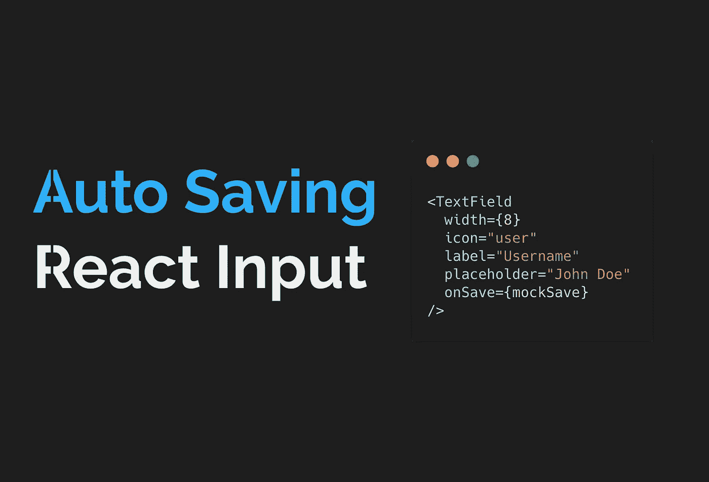

# 创建自动保存反应输入组件

> 原文：<https://javascript.plainenglish.io/create-an-auto-saving-react-input-component-in-10-minutes-2359d84dc29b?source=collection_archive---------1----------------------->

A better UX without too much heavy lifting

在处理长表单(比如医疗表单、档案等)时，允许字段在用户填写时自动保存是 UX 的一大进步。

模糊时自动保存字段听起来像是在一个提交按钮上做了很多额外的工作，嗯？

别担心，我们将使用[语义 UI React 组件库](https://semantic-ui.com/)在 10 分钟内构建一个。

如果您想完全跳过这篇文章，下面是代码沙箱:

The field will save on blur

# 我们的基本文本字段

好了，在我们考虑自动保存之前，让我们先创建我们的基本文本字段组件，或者换句话说，通过语义 UI 使用[输入组件来节省时间:](https://react.semantic-ui.com/elements/input/)

语义 UI 有一堆图标，我们可以按名称传入，这将使显示我们的保存/已保存/错误状态容易得多。

对于上下文，下面是主要的应用程序代码:

这里只有两件事值得注意:

1.  我们创建了一个模拟保存函数，它只是一个承诺，用新值在 2 秒内解决
2.  除了`onSave`之外的每个道具都是输入组件的[语义 UI API 的一部分，没有任何定制。我们稍后会用到`onSave`。](https://react.semantic-ui.com/elements/input/)

# 我们需要追踪什么？

保存单个字段时，需要跟踪更多内容。以下是最重要的问题:

1.  我们如何进行实际的节约？
2.  我们如何指示字段正在保存？
3.  我们如何表明保存成功/失败？

# 我们如何进行实际的节约？

我们可能想保留侠影的领域。我们可以传递一个负责“保存”细节的异步`onSave`函数，但是我们的组件并不真正关心数据是如何保存的，只关心数据正在保存的事实。

虽然看起来代码很多，但一切都很简单:

1.  我们使用`useState`来跟踪我们是否在存钱
2.  我们维护一个对最后输入值的引用，这样我们就可以将它与当前值进行比较。如果是一样的，就没必要保存了。
3.  为了回答我们的**“我们如何指示一个字段正在保存？”**问题:语义用户界面已经成为我们可以利用的加载指标。当字段已经被手动传递了一个“加载”属性，或者我们当前正在保存字段时，我们显示它。
4.  自动保存字段的问题是，用户输入的数据保存后会被覆盖，输入字段会用保存的数据刷新。为了避免这种情况，我们只需在加载时禁用该字段。
5.  这就是奇迹发生的地方。我们给`onBlur`附加了一个异步处理程序。在处理程序中，我们首先检查值是否已经改变。如果有，我们将“saving”状态更新为 true，如果我们被传递了一个`onSave`函数，我们将尝试保存。一旦`onSave`承诺兑现，我们就更新最后保存的值并重置我们的保存状态。

# 我们如何表明保存成功/失败？

因此，我们也许能够显示一个领域是否在节约，但这还不够。我们希望显示一个字段已成功保存(或未能保存)。

所以这几乎是我们的全部组件！以下是我们添加的内容:

1.  引入了新的状态来跟踪何时保存字段，以及何时出现保存错误
2.  为了获得更好的 UX，当我们成功保存时，我们将我们的图标替换为绿色复选标记，当保存失败时，替换为红色警告。
3.  语义 UI 为我们提供了手动设置图标颜色的灵活性，因此我们更改了颜色以适应当前的保存状态。
4.  既然我们处理的不仅仅是字段验证错误，我们手动传递常规的错误属性(从父级传递给我们的组件)，或者我们内部调节的`saveError`变量，如果存在的话。
5.  UX 的另一个改进是确保我们在用户修改输入时移除成功图标。这样他们就知道当前的更改还没有保存。
6.  当我们遇到调用`onSave`的错误时(如果保存失败，我们假设它抛出承诺拒绝)，我们只需更新我们的`saveError`状态。这里可以更加灵活(比如从 API 传递实际的消息)，我在这个例子中保持简单。

# 这个故事的寓意

很明显，这个组件有很多地方可以改进，但是就快速启动和运行而言，由于语义 UI React，这可能在 10 到 20 分钟内就可以完成。

可以使用任何其他组件库(Material UI，Ant 等)。关键是在这种情况下，使用组件库可能会节省您的开发时间。我们能够显示图标、加载指示器、禁用和错误状态，以及更多仅仅通过传递简单的道具。

# 来自作者的信息

嘿你…是你。我知道时局艰难。

无聊？压力大？在家发疯了？想更深入地了解 React 吗？有朋友想学习 React & UI 开发的新知识吗？

我为你和你的朋友们准备了很多文章。请随意分享和关注，因为…嗯…除了检查我的中等统计和狂欢之外，我没什么可做的。

## **用简单英语写的 JavaScript 笔记**

我们已经推出了三种新的出版物！请关注我们的新出版物:[**AI in Plain English**](https://medium.com/ai-in-plain-english)[**UX in Plain English**](https://medium.com/ux-in-plain-english)[**Python in Plain English**](https://medium.com/python-in-plain-english)**——谢谢，继续学习！**

**我们也一直有兴趣帮助推广高质量的内容。如果您有一篇文章想要提交给我们的任何出版物，请发送电子邮件至[**submissions @ plain English . io**](mailto:submissions@plainenglish.io)**，并附上您的 Medium 用户名，我们会将您添加为作者。另外，请让我们知道您想加入哪个/哪些出版物。****