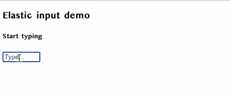

# 使用角度方向创建弹性输入

> 原文：<https://javascript.plainenglish.io/create-an-elastic-input-angular-directive-b58d3e61185e?source=collection_archive---------7----------------------->

## 因为指令很有趣！


> *“代码就像幽默。当你不得不解释它时，它是坏的”——科里豪斯*

使用 Angular 时，指令是强大的模式。深刻理解指令可以帮助您更好地保持开发人员体验，并有助于编写更有意义的代码。

**弹性输入**只是我们给一个根据内容改变宽度的输入字段起的一个好听的名字。

## 这个计划

为此，我们将采取以下步骤。

1.  创建一个指令，姑且称之为`elasticInput`。
2.  创建一个伪 DOM 元素(`<div>`)，并在初始化指令时附加到文档中。
3.  将输入字段的值作为`innerText`分配给`<div>`元素。
4.  获取`<div>`元素的宽度，并显式地将输入宽度设置为等于`<div>`的宽度，并带有一个 delta 值。
5.  每次输入值改变时，重新计算并更新宽度。

为了能够应用 `*width*` *属性，您必须将 inline input 元素转换为 block。*

## 履行

首先创建指令，

```
ng g directive elasticInput 
```

然后我们将修改指令来实现`OnInit`挂钩和注入`DOCUMENT`和`ElementRef`。

我们需要`DOCUMENT`注入器来创建、附加 DOM 元素和`ElementRef`来修改主机元素(输入)的宽度。

现在让我们更新我们的`ngOnInit()`钩子。

每当指令初始化时，我们创建一个虚拟 DOM 元素，更新样式使它对用户不可见，并使用`appendChild`方法附加到 DOM。

我们还需要在初始化时更新输入元素的宽度。让我们实现`update()`方法来做到这一点。

这里发生了两件事。

1.  将虚拟元素的`innerText`更新为输入的值(如果存在)或占位符值。
2.  更新输入的宽度，使其等于虚拟元件的宽度+一个`20px`的增量值。

为了确保虚拟元素和输入的宽度随着输入值的变化而更新，我们需要在变化检测周期完成后调用`update()`方法。为此我们可以使用`ngAfterViewChecked`挂钩。

然后，我们将把这个指令附加到应用程序中的任何输入字段，就像这样，

> 确保您移除了`ngOnDestroy()`上的元素，以免不需要的 DOM 元素被挂起。

```
<input placeholder="Enter Text" elasticInput/>
```

耶！

> **注意:**为了从这种方法中获得 100%的收益，你需要确保对虚拟元素和输入元素使用相同的`font-family`和`font-size`，因为这些属性会影响`width`。



Elastic input — preview

完整的源代码可以在[这里](https://gist.github.com/BharathRavi27/0c7019d5963fa5fc071e58755a38160d)找到。玩 StackBlitz 演示[这里](https://stackblitz.com/edit/angular-ivy-ckebkq?file=src%2Fapp%2Felastic-input.directive.ts)

在 Twitter 上找到我[这里](https://twitter.com/_bharath_ravi)。黑客快乐！