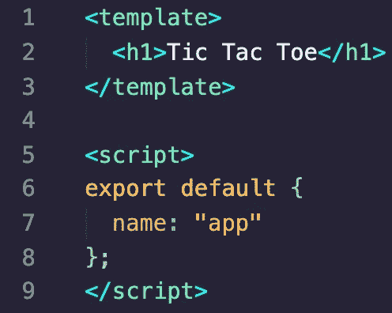
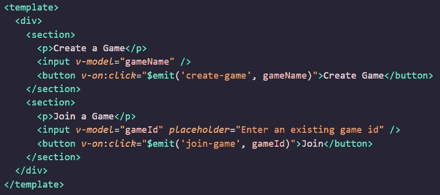

# 用 Vue 和 Firebase 创建一个在线多人井字游戏

> 原文：<https://javascript.plainenglish.io/create-an-online-multiplayer-tic-tac-toe-game-with-vue-and-firebase-5e0be047ba42?source=collection_archive---------1----------------------->


Photo by [Caspar Camille Rubin](https://unsplash.com/@casparrubin?utm_source=unsplash&utm_medium=referral&utm_content=creditCopyText) on [Unsplash](https://unsplash.com/s/photos/javascript?utm_source=unsplash&utm_medium=referral&utm_content=creditCopyText)

> 你可以在这里找到[的所有代码。](https://github.com/z3n0tus/tic-tac-toe-vue)

VueJS 是一种越来越受 web 开发人员欢迎的技术。它吸收了 Angular & React 的一些优点，并将它们集成到一个轻量级的高性能框架中。正因为如此，在 Vue 中你可以比在 Angular *或* React 中做得更快。

所有的框架都在各自的领域表现良好，所以值得学习它们。在本教程中，我们将通过创建一个井字游戏来探索 Vue。我们还将整合 firebase，这样我们就可以和其他人在线玩了，尽管这并不是说和自己玩不好玩。

**这个教程是给谁看的？**

这不是对 HTML、JavaScript 或 CSS 的介绍。你需要很好地理解这些语言。您还需要有使用 npm 下载包的经验，如果您以前使用过 React 或 Angular，这将非常有帮助，因为许多概念是相同的。你还需要知道如何使用终端。不过，你根本不需要了解 Vue。我会解释一切。

**我如何开始？**

使用 npm，全局下载 Vue CLI:

`npm i -g @vue/cli`

然后，通过运行以下命令创建一个项目:

`vue create <project-name>`

如果你想在你已经在的文件夹中生成项目，你可以用一个`.`代替`<project-name>`

`vue create .`

让生成器完成它的工作，然后在 IDE 中打开项目的根目录。您应该会看到一堆文件。知道这些大部分是什么并不重要。重要的东西在`src`文件夹中，我们将在那里完成所有的工作。

Vue 已经在`src`文件夹中创建了一些文件。我们不需要其中的大部分，因为我们将从零开始。所以继续删除`assets/`文件夹和`components/HelloWorld.vue`文件。然后，打开`App.vue`，删除所有代码，替换为以下代码:

```
<template>
  <h1>Tic Tac Toe</h1>
</template><script>
export default {
  name: "app"
};
</script>
```

我一会儿会解释这些东西，但是你可以粘贴它，现在忽略它。

此时，如果您使用 VSCode，您将需要安装`Vetur`插件。它为 Vue 开发提供了很多很好的工具。如果你用的是另一个编辑器，那我就帮不了你了。看医生。

打开项目根目录下的终端并运行`npm run serve`。然后导航到`localhost:8080`，如果一切正常，您应该会看到一个空白页面，顶部用大号字母写着`Tic Tac Toe`。恭喜你，你现在是 Vue 开发者了。打电话给你所有的朋友。

**Vue 入口点**

Vue 入口点住在`main.js`，长这样。


src/main.js

这个文件的顶部导入 Vue 和我们的应用程序组件。请注意，App 的扩展名为`.vue`。所有 Vue 组件都需要有这个扩展。

下一行关闭了一个恼人的生产提示，这只是因为从事 Vue 工作的人那天想不出该做什么而添加的。

最后几行初始化应用程序。`h`是什么，我不知道。也许它代表`how the fuck do i name this variable, never mind, i'll just call it h`。`$mount`行将应用程序附加到我们想要的任何元素上。在这里传递`#app`意味着它将附加到 id 为`app`的元素。

那是主文件。令人兴奋的东西。你还可以做更多的事情，但现在这并不重要。真正的乐趣在别处等着我们。

**Vue 组件的解剖**

看一看`App`。



src/App.vue

在本教程的开始，我说过你应该在遵循本指南之前有一些前端知识。如果你听了我的建议，那么这个东西可能看起来很熟悉。

一个 Vue 组件由三个标签组成:`template`、`script`、&、`style`。这三个标签表示组件的不同方面。模板是它的 HTML，脚本是附带的 JavaScript &风格是它的 CSS 代码。

在`script`标签之间，您必须导出一个对象。Vue 读取该对象，并提供关于该组件的一些细节。现在我们只是给它一个名字，但是很快我们就会看到如何使用方法、道具&生命周期挂钩。

**Firebase 集成**

为了让我们的井字游戏多人化，我们需要集成 Firebase。现在这样做是值得的，这样我们就可以在需要的时候使用 Firebase API，而不是在所有游戏代码完成后再对其进行改造。

Firebase 是一个 web 应用平台，提供托管、数据存储和认证等服务。我们将使用实时数据库服务来处理关于活跃的游戏和我们的游戏板的存储信息。由于是实时的，所有连接的玩家将能够看到游戏板的变化。

*创建 Firebase 项目*

你需要一个谷歌账户。点击[此处](https://console.firebase.google.com/u/0/)登录或注册。

您应该会看到一个`Add Project`按钮；点击这个按钮，给你的项目起一个你喜欢的名字。下一个屏幕询问有关分析的问题—您不必为此项目启用该功能，但即使启用也没关系。

*获取项目配置*


您应该能够在项目的主屏幕上看到上面的内容。如果你不能，那么回到 firebase 控制台的主页，点击你的项目名称。完成后，选择`</>`图标并命名您的应用程序。我把我的名字叫做`tic-tac-toe`。启用 Firebase 托管并注册应用程序。之后你可以点击`next`直到窗口消失。

现在，我们可以检索我们的应用程序的配置，因为它是创建的。这是一个 JSON 对象，包含关于程序的信息。我们将用它来连接我们的数据库。你可以通过点击`Project Overview`右边的 cog 图标，然后项目设置，然后向下滚动`General`标签直到你看到`Firebase SDK Snippet`，然后点击`Config`来获得配置。复制该对象，它看起来像这样:

```
const firebaseConfig = {
  apiKey: "---",
  authDomain: "---",
  databaseURL: "[-](https://tic-tac-toe-vue-3a0b1.firebaseio.com)--",
  projectId: "---",
  storageBucket: "---",
  messagingSenderId: "---",
  appId: "---"
};
```

将其粘贴到 Vue 项目的`src`文件夹中的一个新文件`firebase.config.js`中。把它也加入到你的`gitignore`中，因为你不想犯这个错误。

然后导出，像:`export default firebaseConfig;`。

*安装燃烧底座*

您需要安装 firebase-tools 包来初始化和部署您的项目。在您的终端中运行`npm i -g firebase-tools`。这使您可以全局访问`firebase`命令。

现在运行`firebase init`，并选择以下选项。


从列表中选择您的项目。这是**不是**你的 app。这是您从 firebase 主屏幕创建的原始项目。我的叫做`tic-tac-toe-vue`。

保留数据库规则文件的默认值。

你的公共目录应该是`dist`，**而不是** `public`。

说`yes`重写所有到 index.html 的 URL(这意味着我们的应用程序可以是单页应用程序)。

不要覆盖`index.html`，你不必这样做。

在代码中初始化火焰基地

Firebase 需要在代码中设置才能运行。我通常通过创建一个我在`main.js`中调用的文件来做这件事，尽管实际上你可以直接在那里写代码，如果你愿意的话。

首先，将 firebase 安装到项目的本地依赖项中。

`npm i firebase`

然后在您的`src/`文件夹中创建一个名为`firebase.setup.js`的文件，并添加以下代码:

```
import { initializeApp } from 'firebase';
import firebaseConfig from './firebase.config';const app = initializeApp(firebaseConfig);export default app;
```

这在我们的项目中建立了 firebase，并允许我们访问它的 api 方法，比如与数据库对话的方法。

最后，只需在`src/main.js`中导入您的设置文件。

```
import './firebase.setup';
```

**登录组件**

在接下来的几节中，我将提供组件的完整代码作为要点，然后依次解释每个部分:模板、脚本和样式。所有组件都将存储在`src/components`中，App 除外，它将留在原处。没人愿意和 App 混在一起。

我们将首先看一下登录组件。

登录组件实际上并不做任何特殊的事情。我们只是让用户输入一个名字，然后点击一个按钮登录。然后，该名称作为“用户”存储在数据库中，如果再次输入该名称，将会检索到该名称。没有密码什么的。去他妈的保安。这是代码。

src/components/Login.vue

*模板*


首先，我们有封闭的模板标签，这在任何 Vue 组件中都是必要的。就像在 React 中一样，我们也需要一个单一的父元素，所以这就是`div`的用途。那我们就有两样没见过的东西了。

第一个是`v-model`指令。这就是将值绑定到输入元素的方式。我们在这里引用的`username`实际上是登录组件状态中的一个属性。每当我们向输入中输入数据时，该属性都会更新以反映这些更改。这就是`v-model`所做的一切。这就像 React 中的`value`和`onChange`属性生了一个宝宝，那个宝宝长成了瑞安·雷诺兹(性感又酷)。

第二个是`v-on:click`。这就是添加一个点击处理程序的方法，并且`login`引用了登录组件上的一个函数，每当点击按钮时都应该调用这个函数。

*脚本*


这是所有 Vue 组件必须导出的对象。它为我们的组件起了一个名字，一个定义组件状态的`data`函数(在这种情况下我们只有一个字段:`username`)和一个`methods`对象，它包含一组我们可以从模板中引用的函数。这里我们有附加到上面点击处理程序的`login`函数。这个函数检查`username`状态字段是否不为空，如果是，它发出一个名为‘log in’的事件并传递用户名字段。像这样的事件是一种将数据传递给父组件的方式，就像 React 中的处理函数一样。我们将在`App`中拦截此事件，并在事件发生时采取措施。我们将在最后看一看 App，看看一切是如何组合在一起的。

**选择游戏组件**

是将处理…选择游戏的组件。真的吗？你需要被告知这些吗？这是代码。

src/components/SelectGame.vue

*模板*



这里没有什么新东西。该模板呈现两个部分；一个具有用于创建新游戏的输入和按钮；另一个具有输入和用于加入现有游戏的按钮。

如果您查看每个按钮，您将能够看到如何以内联方式触发事件。您不需要*在组件中创建处理程序。*

*脚本*


这里没什么事情。我们定义了两个状态字段来管理我们的输入框。

*风格*


这不过是基本的 CSS。然而，我确实想指出`style`标签上的`scoped`属性。这意味着该组件内部的样式将**仅**应用于该组件内部。所以不需要用选择器什么的。你可以只设计标签的样式。哇哦。

**游戏板组件**

这是我们在使用 App 之前需要了解的最后一个组件。它比其他的要大一些，但是展示了 Vue 的许多重要方面。它基于以下数据结构呈现一个板。

```
[
  {
    id: 'top-row',
    tiles: [
      { value: '', pos: '0,0' },
      { value: '', pos: '1,0' },
      { value: '', pos: '2,0' }
    ]
  },
  {
    id: 'middle-row',
    tiles: [
      { value: '', pos: '0,1' },
      { value: '', pos: '1,1' },
      { value: '', pos: '2,1' }
    ]
  },
  {
    id: 'bottom-row',
    tiles: [
      { value: '', pos: '0,2' },
      { value: '', pos: '1,2' },
      { value: '', pos: '2,2' }
    ]
  }
];
```

数组中的每个对象代表一行，每个`tiles`数组中的每个对象代表我们井字游戏棋盘上的一个单幅图块。`value`字段包含哪个单元占用该图块(x 或 o),`pos`字段是每个图块的唯一标识符。

这是组件本身的代码。

*模板*


该模板由两部分组成。第一部分简单地呈现了`gameId`，它在`SelectGame`组件中用于加入一个现有的游戏。第二部分稍微复杂一点。

第 7 行第一个不熟悉的东西是一个`v-if`指令。这个指令可以放在任何元素上来控制它的可见性。本质上，如果引用的`game`状态字段还没有定义，那么这个部分就不会被呈现。

下一行 8 使用了一个`v-for`指令。这会根据传递给它的表达式创建一个元素列表。这里，我们说`row in game.board`，这意味着对于`game.board`数组中的每个元素，我们将创建一个 div 及其所有子元素。对于每次迭代，数据都存储在临时变量`row`中，然后我们可以在 div 中的任何地方访问它。你可以看到我们在`div.tile`中使用它。我们必须使用`:key`来帮助 Vue 在内部跟踪我们的元素列表。就跟 React 列表里的`key`道具一样。

我们在第 13 行也有一个 click 处理程序，用于在每次单击时编辑图块的`value`。

尽管这段代码可能有点令人困惑(也可能不是)，但它只是简单地遍历了上面数据结构的每一行，并为其创建了一个 div。然后，对于每一行，它循环遍历每个图块并为其创建一个 div。然后我们的`style`块使它看起来像一块板。

*脚本*

我将一点一点地提取脚本标签，因为它非常大。第一行从`firebase`导入`database`。因为我们已经初始化了我们的应用程序，我们可以使用这个函数直接写入实时数据库。

```
import { database } from "firebase";
```

下一部分是我们定义一些道具的地方。这些就像 react 中的道具:我们可以从上面传递给组件的数据。

```
props: ["gameId", "user"]
```

然后我们定义我们的`game`状态字段，并将其初始化为`null`。这将在我们从数据库中检索游戏时进行设置。

```
data: () => ({
  game: null
}),
```

然后我们有我们的方法块，在这里我们定义了一个单独的`updateTile`方法。


这个函数没有做任何事情，所以我将简单解释一下。

在第 33 行，我们使用 object spread 创建了一个`game`状态字段的副本。

然后，我们根据从模板传来的参数找到要更新的正确的行和块，并将其值设置为等于我们的玩家正在玩的`unit`(x 或 o)。

最后，我们调用我们的数据库方法。这里的`ref`对应于实时数据库中的一个路径。在这种情况下，我们在数据库的顶层有一个名为`games`的对象，该对象上的每个键都是一个`gameId`。这就是我们存储数据的方式(当我们查看应用程序组件时，您会看到这一点)。所以我们在这里所做的就是告诉 firebase 进入数据库中的`games`对象，用我们的 id ( `gameId`)找到游戏，并为它设置新的值，它包含了我们更新的游戏板。

最后一部分是`created`方法。这是一个 Vue 生命周期挂钩。它在注射后立即运行。你想把它用于 api 调用之类的东西。


在第 47 行，我们使用与上面相同的 ref 联系我们的数据库。不过，这次我们不会添加任何东西。相反，我们正在建立一种网络套接字。我们告诉 firebase，无论何时产生`value`事件(当数据改变时会发生这种情况)，我们都希望调用回调:

```
snapshot => {
  this.game = snapshot.val(); if (this.game.creator === this.user.name) {
    this.unit = "x";
  } else {
    this.unit = "o";
  }
}
```

这将我们的`game` state 字段设置为调用回调(`snapshot.val()`)时存储在数据库中的值，并计算出我们应该是什么单元。如果我们创造了游戏，那么我们就是`x`。记住，每次我们的`/game/${gameId}`数据库对象改变时，这个回调就会被调用*，所以这就是我们如何获得实时更新的。*

*风格*

同样，这只是 CSS 使我们的板看起来像一个板，所以我不会粘贴在这里。应该在上面的主旨里。

**App 组件**

这是最大的组成部分，把一切都集合在一起。大多数数据库操作都在这里完成，这里是我们呈现所有定制组件的地方。这是代码。

*模板*


在第 4 行，如果`user`状态字段未定义，我们将呈现`Login`组件。我们还拦截上面看到的`login`事件，当我们捕捉到它时，我们调用`login`处理函数，它是在我们的`methods`块中定义的。

在第 5 行，如果定义了用户，我们将呈现`SelectGame`组件。我们也拦截`create-game`和`join-game`。

在第 7 行，我们呈现了`Gameboard`组件。我们只有在定义了`activeGame`的情况下才这样做。我们还通过`user`和`gameId`道具。冒号是用于将数据绑定到组件的`v-bind`指令的简写。所以在这种情况下，我们将我们的`gameId`和`user`字段绑定到组件，组件将在这些值改变时做出响应。

*剧本*

我会一点一点地接受这一点，就像以前一样。我们首先从 firebase 导入数据库。我们还导入了所有的组件，即`board.js`文件(我马上会展示它；它只包含我们上面看到的数据结构)和用于生成游戏 id 的`uuid`包。

```
import { database } from "firebase";
import uuid from "uuid";
import board from "./board";
import Gameboard from "./components/Gameboard";
import Login from "./components/Login";
import SelectGame from "./components/SelectGame";
```

然后我们导出组件并给它一个名字。我们还定义了`components`对象，这是告诉 Vue 您将在模板中使用定制组件的方式。您打算使用的所有定制组件都必须在那里。

```
export default {
  name: "app",
  components: { Gameboard, Login, SelectGame }
```

我们添加了状态字段`user`、`allUsers`和`activeGame`，它们分别表示当前登录的用户、数据库中的所有用户以及活动游戏的 id。

```
data: () => ({
  user: null,
  allUsers: [],
  activeGame: null,
}),
```

然后我们有了`methods`块。这包含三个方法，所以我们将依次查看每个方法。

*   添加用户


当从`Login`组件触发`login`事件时调用该方法，它负责从`allUsers`检索正确的用户(如果该用户存在)或创建一个新用户。

在第 30 行，它试图从`allUsers`中找到用户——一个已经在`created`lifecycle 方法中填充的列表，我们马上就会看到——如果它找到了用户，那么它就更新状态(第 33 行)并从函数中中断。

如果没有找到用户，它将创建一个空的用户对象，然后更新数据库。ref `users`指向数据库中的整个用户集合，所以我们本质上是获取它，将新用户推入其中，然后覆盖它。最后，我们将`user`状态字段设置为新用户。

*   创建游戏


当`SelectGame`组件触发一个`create-game`事件并简单地向数据库添加一个游戏，然后设置`activeGame`字段时，这个函数被调用。传递给`newGame`的`board`属性包含了我们之前看到的棋盘数据结构，这样当我们开始玩游戏时就可以使用了。文件存储在`src/board.js`中。

```
export default [
  {
    id: 'top-row',
    tiles: [
      { value: '', pos: '0,0' },
      { value: '', pos: '1,0' },
      { value: '', pos: '2,0' }
    ]
  },
  {
    id: 'middle-row',
    tiles: [
      { value: '', pos: '0,1' },
      { value: '', pos: '1,1' },
      { value: '', pos: '2,1' }
    ]
  },
  {
    id: 'bottom-row',
    tiles: [
      { value: '', pos: '0,2' },
      { value: '', pos: '1,2' },
      { value: '', pos: '2,2' }
    ]
  }
];
```

*   加入游戏

```
joinGame(id) {
  this.activeGame = id;
}
```

当`join-game`事件被触发时，从`SelectGame`调用该函数。我们要求用户自己提供 id(他们的朋友应该已经发送给他们了)，所以除了设置`activeGame` state 字段之外，我们不需要做任何特殊的事情。这将使`Gameboard`组件出现，这将触发它使用 id 从数据库中检索正确的游戏。

最后一部分是`created`生命周期挂钩。看起来是这样的。


这只是告诉 firebase 每当数据库中的`users`集合发生变化时更新`allUsers`状态字段。这就是为什么`App`组件总是能够访问最新的用户列表。

就这些了。我故意选择了一个相当复杂的任务，因为我想展示 Vue 简化事情的方式。`v-if`和`v-for`指令简单明了，代码可读性很强。组件的简单结构也是一个巨大的好处，它将不同的方面分开(模板、脚本&风格),但也足够接近，以便在你的大脑中建立逻辑和简单的联系，如果你像我一样拥有糊状香蕉的智力，这是非常好的。我希望这是有帮助的，我希望它能激励你更多地了解 Vue。谢了。