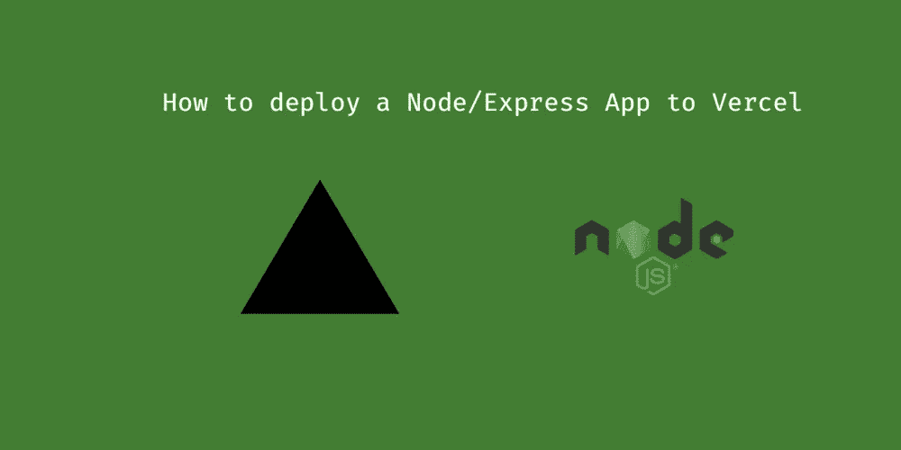

# 使用 Vercel 免费创建并部署一个带有用户界面的 Node.js/Express 应用程序

> 原文：<https://javascript.plainenglish.io/create-and-deploy-a-node-js-express-app-for-free-f75d8796ba70?source=collection_archive---------3----------------------->

## 如何将您自己的 Express Node.js 应用程序从 GitHub 部署到 Vercel



***披露:*** *本人在本帖子所述的任何公司均无隶属关系或投资。这只是我的经验。*

我想你对 Node.js、Express 有一定的经验，并且已经注册了一个免费的 Vercel 账户。

[Vercel](https://vercel.com) (zeit)对我来说很管用已经有一段时间了。问题是在互联网上有不同的方式来设置它，大多数对我来说都不再适用了，也许是因为 Vercel 的变化。但是我很高兴这个设置现在可以工作了。

**Github 信息库链接:**
-[https://github.com/ngduc/vercel-express](https://github.com/ngduc/vercel-express)

首先，将上述存储库克隆到本地目录。设置 vercel 命令行并运行“vercel”命令来部署项目:

## 使用 Vercel 设置和部署

```
$ npm install vercel -g$ cd <project-dir>
$ npm install
$ vercel
```

*   Vercel 将生成一个”。vercel "目录，不要共享或提交此目录。
*   部署后，打开如下 URL:
    —[http://YOUR-VERCEL-APP-id . VERCEL . APP](http://YOUR-VERCEL-APP-ID.vercel.app)—
    示例:[https://VERCEL-express-3 . ng duc . VERCEL . APP](https://vercel-express-3.ngduc.vercel.app)

## app/index.js

*   如果您使用的是带有节点的 typescript，则构建您的源目录(使用类似于“Typescript”包中的“tsc”命令行这样的工具)，输出到“app”。
*   update package . JSON:“main”:“app/index . js”

## vercel.json

*   映射 API 路由(/API/……)和静态(UI)路由(/……)。

现在，您已经使用 Vercel 将一个完整的网络应用程序部署到了互联网上！

快乐编码！

**链接:**
-本文对 Vercel and Express-[https://vercel.com/guides/using-express-with-vercel](https://vercel.com/guides/using-express-with-vercel)
-git hub Repo-[https://github.com/ngduc/vercel-express](https://github.com/ngduc/vercel-express)进行了较为详细的描述