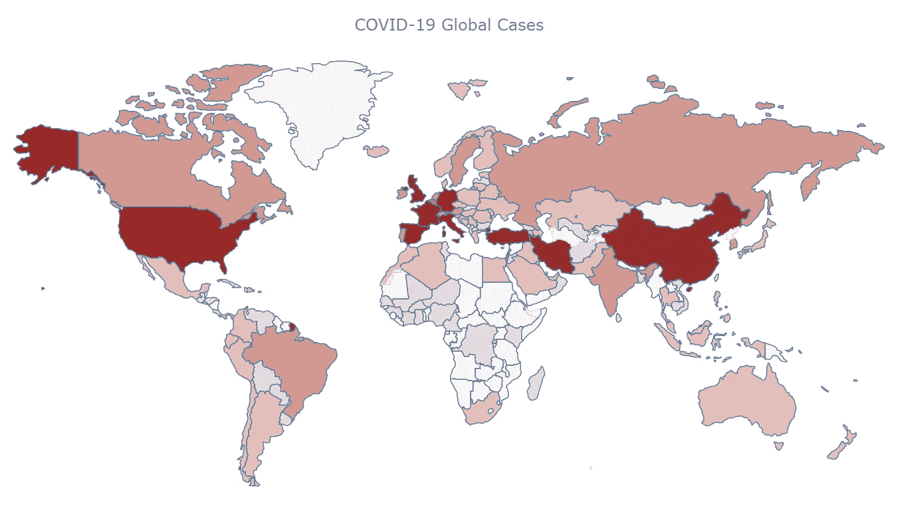
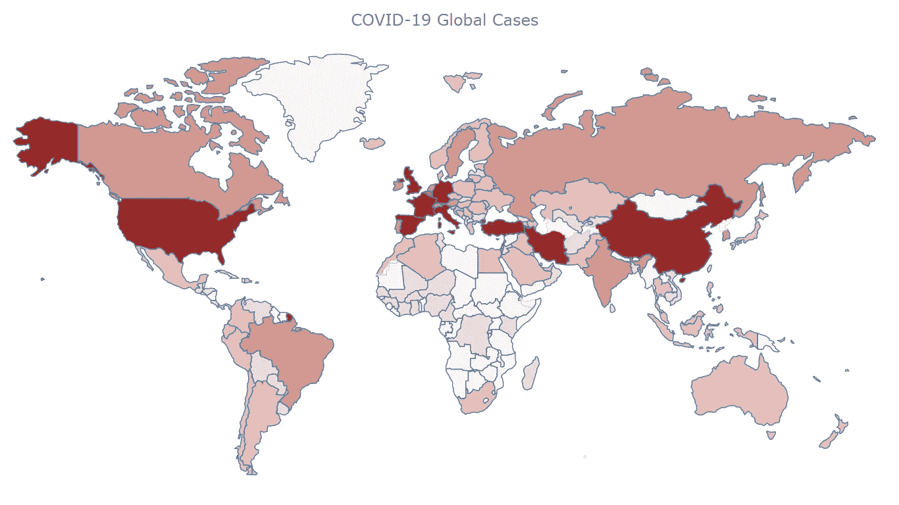
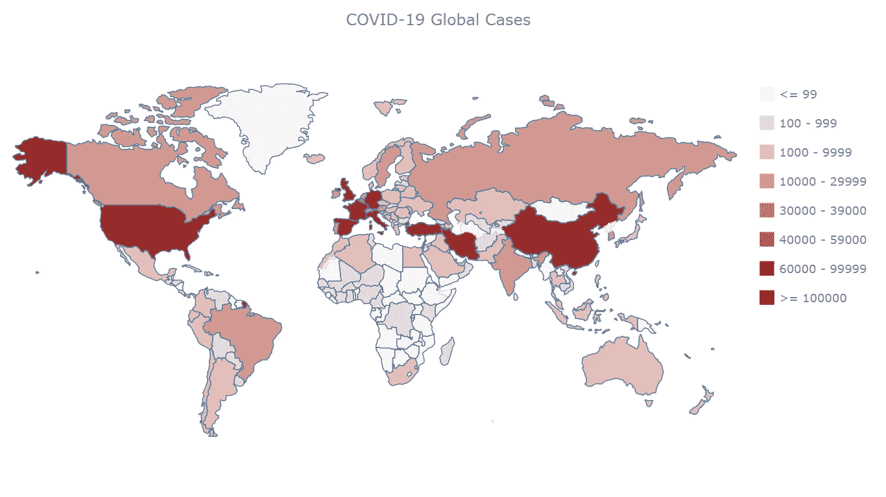
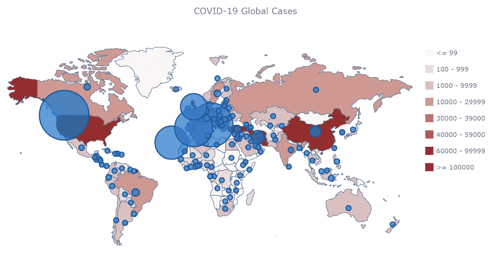
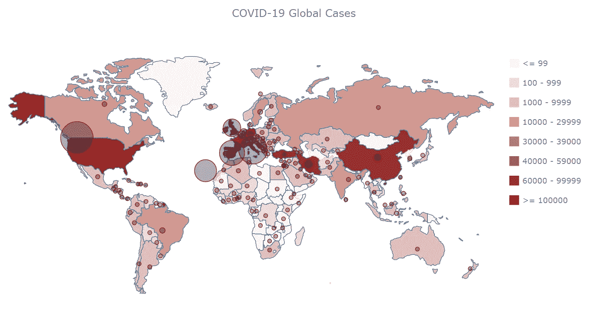
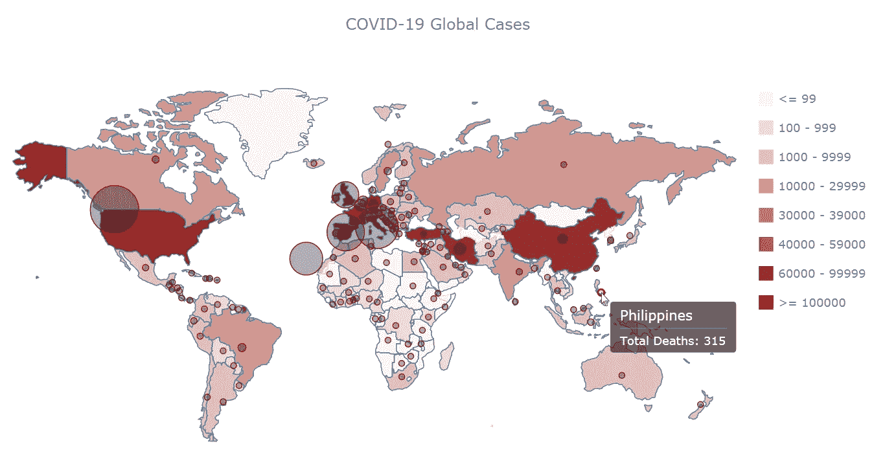

# 用 JavaScript 创建 Choropleth 地图数据可视化

> 原文：<https://javascript.plainenglish.io/create-choropleth-map-data-visualization-with-javascript-8788c98d46e5?source=collection_archive---------12----------------------->


> **查看更方便的代码片段，并嵌入互动图表代替静态图片，** [**查看原 JS choropleth 地图文章**](https://www.anychart.com/blog/2020/05/06/javascript-choropleth-map-tutorial/) **。**

如今，你可以在各种网页上看到 [choropleth 地图](https://www.anychart.com/chartopedia/chart-type/choropleth-map/),并用于各种主题。您是否想知道这样的数据可视化是如何构建的？你有兴趣自己做吗？如果是这样，请继续阅读这篇 JS 图表教程，我将向您展示如何轻松地从头开始创建一个交互式 JavaScript choropleth map。

HTML5 和 JS 的基础知识总是有帮助的，但即使你是这方面的初学者，理解这些**四个简单的步骤**你就能很快得到一个好看的跨平台交互式 choropleth 地图数据可视化给你的 app 或网站！

到底什么是 choropleth 地图？当你分解这个单词时，你会看到*choro-*(“*choros*”)的意思是“*地区*”，*pleth-*(“*plethos*”)的意思是“*众多*”确切地说，这些地图用于可视化与多个地理区域相关的统计数据。根据给定数据的值，每个区域都有不同的颜色或阴影，这样就可以很容易地掌握一个地区的测量值是如何变化的。

在这个 JS 制图教程中，我将使用开放的**新冠肺炎数据**来显示世界各国确诊病例和死亡病例的分布。我将从一个基本的 choropleth 图开始，它将以图形方式表示确诊病例。然后我会添加一个图例，自定义工具提示，并添加气泡来可视化死亡人数。

我们开始吧！

# 如何创建 JavaScript Choropleth 地图

通常，构建基于 JavaScript 的图表或地图需要四个基本要素:

1.  为您的图表创建 HTML 页面。
2.  添加必要的 JavaScript 文件。
3.  准备要可视化的数据。
4.  为图表编写 JS 代码。

现在，让我们详细看看每一步。这是一张 choropleth 地图，它将是本教程第一部分的最终输出:



# 步骤 1:为地图创建 HTML 页面

您需要做的第一件事是创建一个基本的 HTML 页面。给它一个标题并创建一个 HTML 块元素(例如，`<div>)`来放置您的地图图表。为了在后面的代码中识别这个`<div>`，您还应该给它一个您选择的 id 属性。这里，我使用了“容器”这个值。

所以你的页面看起来像这样:

```
<!DOCTYPE html>
<html><head>
  <title>Choropleth Map</title>
  <style>
    html,
    body,
    #container {
      width: 100%;
      height: 100%;
      margin: 0;
      padding: 0;
    }
  </style>
</head><body>
  <div id="container"></div>
</body></html>
```

注意，可以在`<style>`块中使用 CSS 规则来定义如何放置即将到来的 JavaScript choropleth 映射。在这种情况下，在`width`和`height`参数中使用“100%”将使可视化占据整个页面。

# 第二步。添加必要的 JavaScript 文件

其次，您应该转到`<head>`部分，并参考您将要使用的所有合适的 JS 脚本。

为了根据本教程创建一个 choropleth 地图，我将使用 AnyChart 的 [AnyMap JS 库](https://www.anychart.com/products/anymap/overview/)，顾名思义，它是专门为生成地图而设计的。JavaScript 图表库现在非常流行；它们提供了开箱即用的常用功能，使开发过程更简单、更快速。这个特定的库是轻量级的、灵活的、易于上手的，特别是由于一个精心编写的[文档](https://docs.anychart.com/Maps/Quick_Start)和[地图库中的大量样本](https://www.anychart.com/products/anymap/gallery/)。

在本教程中，我将使用 [CDN](https://www.anychart.com/download/cdn/) ，但是请记住，如果您愿意，您可以[下载](https://www.anychart.com/download/)脚本。

对于我心目中的 choropleth 地图，我需要以下[模块](https://docs.anychart.com/Quick_Start/Modules):

*   **核心**，这是使用任何其他模块所需的基本模块。
*   **地理地图**，包含创建地理地图图表的必要信息，以及
*   **地理数据**，包含关于地理位置的信息。

此外，我将使用 Proj4js，这是一个免费的开源 JavaScript 库，可以将点坐标转换为地理坐标。

以下是这一部分的 HTML 代码:

```
<!DOCTYPE html>
<html><head>
  <title>Choropleth Map</title>
  <script src="https://cdn.anychart.com/releases/8.7.1/js/anychart-core.min.js" type="text/javascript"></script>
  <script src="https://cdn.anychart.com/releases/8.7.1/js/anychart-map.min.js" type="text/javascript"></script>
  <script src="https://cdn.anychart.com/releases/8.7.1/geodata/custom/world/world.js" type="text/javascript"></script>
  <script src="https://cdnjs.cloudflare.com/ajax/libs/proj4js/2.3.15/proj4.js" type="text/javascript"></script>
  <style>
    html,
    body,
    #container {
      width: 100%;
      height: 100%;
      margin: 0;
      padding: 0;
    }
  </style>
</head><body>
  <div id="container"></div>
  <script>
 ***// The choropleth map code will be written here***
  </script>
</body></html>
```

# 步骤 3:准备想要可视化的数据

## 加载数据

第三步，添加数据。根据新冠肺炎疫情，我将使用欧洲疾病预防和控制中心( [ECDC](https://www.ecdc.europa.eu/en/publications-data/download-todays-data-geographic-distribution-covid-19-cases-worldwide) )的数据创建一个 JavaScript choropleth 地图，该地图将可视化当前世界各地的情况。我已经下载了 JSON 版本，你可以在这里[找到](https://static.anychart.com/git-storage/word-press/data/choropleth-map-tutorial/data.json)(数据截至 4 月 14 日)。

使用 AnyChart 的[数据适配器](https://docs.anychart.com/Working_with_Data/Data_Adapter/Overview)助手模块可以很容易地从 JSON 文件加载数据，该模块应该添加到`<head>`部分:

```
<!DOCTYPE html>
<html><head>
  <title>Choropleth Map</title>
  <script src="https://cdn.anychart.com/releases/8.7.1/js/anychart-core.min.js" type="text/javascript"></script>
  <script src="https://cdn.anychart.com/releases/8.7.1/js/anychart-map.min.js" type="text/javascript"></script>
  <script src="https://cdn.anychart.com/releases/8.7.1/geodata/custom/world/world.js" type="text/javascript"></script>
  <script src="https://cdnjs.cloudflare.com/ajax/libs/proj4js/2.3.15/proj4.js" type="text/javascript"></script>
  <script src="https://cdn.anychart.com/releases/8.7.1/js/anychart-data-adapter.min.js"></script>
  <style>
    html,
    body,
    #container {
      width: 100%;
      height: 100%;
      margin: 0;
      padding: 0;
    }
  </style>
</head><body>
  <div id="container"></div>
  <script>
 ***// The choropleth map code will be written here***  </script>
</body></html>
```

现在您可以使用数据适配器提供的 [loadJsonFile](https://api.anychart.com/anychart.data#loadJsonFile) 方法来加载 JSON。

```
anychart.data.loadJsonFile ("https://static.anychart.com/git-storage/word-press/data/choropleth-map-tutorial/data.json", function (data) {});
```

## 结构化数据

您刚刚加载的 JSON 数据包含每个国家每天的数据。

这里你需要做两件事:

*   计算每个国家所有确诊病例的总和。
*   以任何图表都能识别的格式组织数据。具体来说，我想创建一个包含区域 id 和值的数组。

要实现上述内容，您需要编写一些代码。下面是我将用来计算和组织数据的方法:

我将读取 JSON 数据并计算每个国家的确诊病例总数。一旦我处理完一个国家，我会将这些信息传递到一个我命名为“data”的数组中，然后继续处理下一个国家。

该阵列将使用:

*   `id`:国家的地理标识符
*   `value`:全国确诊病例总数
*   `title`:国家的名称

这一部分的代码如下:

```
anychart.data.loadJsonFile ("https://static.anychart.com/git-storage/word-press/data/choropleth-map-tutorial/data.json", function (data) { ***// Variables
  // go into the records section of the data***
  var geoData = data.records ***// sum of all cases per country***
  var sumCases = 0; ***// convert cases to numbers***
  var numC; ***// create a new array with the resulting data***
  var data = []; ***// Go through the initial data***
  for (var i = 0; i < geoData.length; i++) {
 ***// convert strings to numbers and save them to new variables***    numC = parseInt(geoData[i].cases); ***// check if we are in the same country by comparing the geoId.*** 
 ***// if the country is the same add the cases to the appropriate variables***    if ((geoData[i + 1]) != null && (geoData[i].geoId == geoData[i + 1].geoId)) {
    sumCases = sumCases + numC;
  }
    else {
  ** *// add last day cases of the same country***
      sumCases = sumCases + numC; ***// insert the resulting data in the array using the AnyChart keywords***    data.push({ id: geoData[i].geoId, value: sumCases, title: geoData[i].countriesAndTerritories }) ***// reset the variables to start over***
      sumCases = 0;

    }
  };
});
```

## 映射数据

这一步骤的最后一部分是将生成的数据与地理地图连接起来。只需添加下面两行代码，就可以完成了:

```
var chart = anychart.map(data);
chart.geoData(anychart.maps.world);
```

# 步骤 4:为图表编写 JS 代码

最后写一些 JavaScript 代码来开发 JS choropleth 地图本身！

记住所有的东西都应该放在`<script>`标签里面。您需要将代码包含在页面准备就绪时执行的`anychart.onDocumentReady`函数中。

```
<script>
  anychart.onDocumentReady(function () {
 ***// The choropleth map code will be written here***  });
</script>
```

数据需要放在这个函数中，所以让我们把第 3 步的代码放在这里，首先:

```
<script>
anychart.onDocumentReady(function () {
 ***// The choropleth map code will be written here***  anychart.data.loadJsonFile ("https://static.anychart.com/git-storage/word-press/data/choropleth-map-tutorial/data.json", function (data) { ***// Variables
  // go into the records section of the data***
  var geoData = data.records ***// sum of all cases per country***
  var sumCases = 0; ***// convert cases to numbers***
  var numC; ***// create a new array with the resulting data***
  var data = []; ***// Go through the initial data***
  for (var i = 0; i < geoData.length; i++) {
 ***// convert strings to numbers and save them to new variables***
    numC = parseInt(geoData[i].cases); ***// check if we are in the same country by comparing the geoId.***
 ***// if the country is the same add the cases to the appropriate variables***  if ((geoData[i + 1]) != null && (geoData[i].geoId == geoData[i + 1].geoId)) {
      sumCases = sumCases + numC;
    }
    else { ** *// add last day cases of the same country***
      sumCases = sumCases + numC; ***// insert the resulting data in the array using the AnyChart keywords***    data.push({ id: geoData[i].geoId, value: sumCases, title: geoData[i].countriesAndTerritories }) ***// reset the variables to start over***
      sumCases = 0; }
  }; ***// connect the data with the map***
  var chart = anychart.map(data);
  chart.geoData(anychart.maps.world);});
</script>
```

最后，让我们设置其他所有内容，根据确诊病例总数的值给每个国家着色。首先，我将指定图表类型，创建系列，并添加适当的标题。其次，我将创建一个[色标](https://docs.anychart.com/Maps/Scales)，并将其应用于图表。看:

```
***// specify the chart type and set the series*** var series = chart.choropleth(data);

***// set the chart title***
chart.title("COVID-19 Global Cases");***// color scale ranges*** ocs = anychart.scales.ordinalColor([
  { less: 99 },
  { from: 100, to: 999 },
  { from: 1000, to: 9999 },
  { from: 10000, to: 29999 },
  { from: 30000, to: 39000 },
  { from: 40000, to: 59000 },
  { from: 60000, to: 99999 },
  { greater: 100000 }
]);

***// set scale colors*** ocs.colors(["rgb(252,245,245)", "rgb(241,219,216)","rgb(229,190,185)", "rgb(211,152,145)", "rgb(192,117,109)", "rgb(178,93,86)", "rgb(152,50,48)", "rgb(150,33,31)"]);***// tell the series what to use as a colorRange (colorScale)*** series.colorScale(ocs);
```

然后，命令绘制地图图表:

```
***// set the container id*** chart.container('container');***// draw the chart***
chart.draw();
```

结果如下:



Basic JS choropleth map

从 [AnyChart 游乐场](https://playground.anychart.com/efdxRDjm/)嵌入的 JS choropleth 地图，给出了新冠肺炎如何影响每个国家的简明可视化。您可以将鼠标悬停在各个区域上，查看每个国家的确诊病例名称和数量。这样的地理数据可视化，每个人都能轻松读懂。

下面是使用 JavaScript/HTML5 构建的 choropleth 地图的完整代码:

```
<!DOCTYPE html>
<html><head>
  <title>Choropleth Map</title>
  <script src="https://cdn.anychart.com/releases/8.7.1/js/anychart-core.min.js" type="text/javascript"></script>
  <script src="https://cdn.anychart.com/releases/8.7.1/js/anychart-map.min.js" type="text/javascript"></script>
  <script src="https://cdn.anychart.com/releases/8.7.1/geodata/custom/world/world.js" type="text/javascript"></script>
  <script src="https://cdnjs.cloudflare.com/ajax/libs/proj4js/2.3.15/proj4.js" type="text/javascript"></script>
  <script src="https://cdn.anychart.com/releases/8.7.1/js/anychart-data-adapter.min.js"></script><style>>
    html,
    body,
    #container {
      width: 100%;
      height: 100%;
      margin: 0;
      padding: 0;
    }
  </style>
</head><body>
  <div id="container"></div>
  <script>anychart.onDocumentReady(function () {***// load the data*** anychart.data.loadJsonFile("https://static.anychart.com/git-storage/word-press/data/choropleth-map-tutorial/data.json", function (data) { ***// Variables*
  *// go into the records section of the data*** var geoData = data.records ***// sum of all cases per country*** var sumCases = 0; ***// convert cases to numbers*** var numC; ***// create a new array with the resulting data***
  var data = []; ***// Go through the initial data***
  for (var i = 0; i < geoData.length; i++) {
    ***// convert strings to numbers and save them to new variables*** numC = parseInt(geoData[i].cases); ***// check if we are in the same country by comparing the geoId.*** 
    ***// if the country is the same add the cases to the appropriate variables*** if ((geoData[i + 1]) != null && (geoData[i].geoId == geoData[i + 1].geoId)) {
      sumCases = sumCases + numC;
    }
    else { ***// add last day cases of the same country***
      sumCases = sumCases + numC; ***// insert the resulting data in the array using the AnyChart keywords*** data.push({ id: geoData[i].geoId, value: sumCases, title: geoData[i].countriesAndTerritories }) ***// reset the variables to start over***
      sumCases = 0; }
  }; ***// connect the data with the map***
  var chart = anychart.map(data);
  chart.geoData(anychart.maps.world); ***// specify the chart type and set the series*** 
  var series = chart.choropleth(data); ***// set the chart title***
  chart.title("COVID-19 Global Cases"); ***// color scale ranges***
  ocs = anychart.scales.ordinalColor([
    { less: 99 },
    { from: 100, to: 999 },
    { from: 1000, to: 9999 },
    { from: 10000, to: 29999 },
    { from: 30000, to: 39000 },
    { from: 40000, to: 59000 },
    { from: 60000, to: 99999 },
    { greater: 100000 }
  ]); ***// set scale colors***
  ocs.colors(["rgb(252,245,245)", "rgb(241,219,216)", "rgb(229,190,185)", "rgb(211,152,145)", "rgb(192,117,109)", "rgb(178,93,86)", "rgb(152,50,48)", "rgb(150,33,31)"]); ***// tell the series what to use as a colorRange (colorScale)***
  series.colorScale(ocs); ***// set the container id***
  chart.container('container');

  ***// draw the chart***
  chart.draw();
});});
  </script>
</body></html>
```

# JS Choropleth 地图定制

您已经有了一个出色的、功能齐全的 JavaScript choropleth 地图。但是如果你想改变一些东西或者增加一些功能呢？

AnyChart 是一个非常灵活的 JS 图表库。因此，您可以轻松地根据自己的需求进行修改。

现在，我将向您展示如何实施以下更改:

*   向图表添加图例
*   为死亡人数的图形表示添加气泡
*   配置工具提示

最终，我会得到下面这张图:


# 向图表添加图例

作为数据可视化的一般规则，每次使用色标时，都应该在页面上的某个地方解释每种颜色代表什么

使用 AnyChart，只需添加`chart.legend(true);`就可以创建一个图例。

在这种情况下，因为 choropleth 图只有一个系列，所以您需要在图例中表示相关的类别。

下面是将图例添加到上面创建的 JS choropleth 地图的代码:

```
***// enable the legend*** chart.legend(true);***// set the source mode of the legend*** chart.legend().itemsSourceMode("categories");
```

这是功能性的，但出于美观的原因，我希望图例出现在图表的右侧，并垂直对齐。为此，我将添加一些 CSS 规则:

```
***// enable the legend*** chart.legend(true);***// set the source mode of the legend and add styles*** chart.legend()
  .itemsSourceMode("categories") 
  .position('right')
  .align('top')
  .itemsLayout('vertical')
  .padding(50, 0, 0, 20)
  .paginator(false);
```

以下是结果(可在 [AnyChart 游乐场](https://playground.anychart.com/RjPyoq2W/)获得完整代码):



JS choropleth map with legend

# 添加代表死亡人数的气泡

受约翰·霍普金斯大学系统科学与工程中心(CSSE)创造的可视化技术[的启发，我决定用气泡来描绘死亡人数。](https://www.arcgis.com/apps/opsdashboard/index.html#/bda7594740fd40299423467b48e9ecf6)

首先，每个国家的新冠肺炎死亡总数需要与新冠肺炎病例总数一起存储在数据中:

```
***// sum of all cases per country*** var sumCases = 0;***// sum of all deaths per country*** var sumDeaths = 0;***// convert cases and deaths to numbers*** var numC;
var numD;***// create a new array with the resulting data*** var data = [];***// Go through the initial data*** for (var i = 0; i < geoData.length; i++) {
 ***// convert strings to numbers and save them to new variables***
  numC = parseInt(geoData[i].cases);
  numD = parseInt(geoData[i].deaths); ***// check if we are in the same country by comparing the geoId***
 ***// if the country is the same, add cases and deaths to the appropriate variables***  if ((geoData[i + 1]) != null && (geoData[i].geoId == geoData[i + 1].geoId)) {
    sumCases = sumCases + numC;
    sumDeaths = sumDeaths + numD;
  }
  else { ***// add last day cases and deaths of the same country***
    sumCases = sumCases + numC;
    sumDeaths = sumDeaths + numD; ***// insert the resulting data in the array using the AnyChart keywords***    data.push({ id: geoData[i].geoId, value: sumCases, size: sumDeaths, title: geoData[i].countriesAndTerritories }) ***// reset the variables to start over***
    sumCases = 0;
    sumDeaths = 0; }
};
```

第二，在单独的数组中只存储至少有一人死亡的国家:

```
***// variable to store data that will be used for bubbles***
var bubbleData=[];***// store only the countries that have at least 1 death***
for (var i=0; i<data.length; i++) {
  if (data[i].size>0){
    bubbleData.push(data[i]);
  }
};
```

然后，添加以下 JS 代码，在地图上的 choropleth 系列之上创建 bubble 系列。

```
***// create a series for bubbles***
var series_1 = chart.bubble(bubbleData);
```

看看下面的地图或者在 [AnyChart 游乐场](https://playground.anychart.com/t0kTUilD/)上:



JS choropleth map with bubbles and legend

自定义气泡的大小是一个好主意，这样它们就不会在图上占据太多空间。为此，使用 AnyChart 的`maxBubbleSize()`和`minBubbleSize()`函数。例如，像这样:

```
***// set the maximum size of the bubble*** chart.maxBubbleSize(25);***// set the minimum size of the bubble*** chart.minBubbleSize(3);
```

接下来，您可以修改气泡的颜色和笔画，使它们与图表的其余部分更加一致:

```
**// set colors and stroke of bubbles** series_1.normal().fill("black", 0.3);
series_1.hovered().fill("black", 0.1);
series_1.selected().fill("black", 0.5);
series_1.normal().stroke("rgb(150,33,31)");
series_1.hovered().stroke("rgb(150,33,31)", 2);
series_1.selected().stroke("rgb(150,33,31)", 4);
```

查看这些修改后的结果，如下图或在 [AnyChart 游乐场](https://playground.anychart.com/JC0ZB65r/):



Customized JS choropleth and bubble map in combination, with legend

# 配置 choropleth 地图工具提示

最后，让我们配置 JS choropleth 地图的工具提示，如果您将鼠标悬停在某个国家的领土上，它将显示有关总病例数的信息，如果您将鼠标悬停在气泡上，它将显示总死亡数的信息。

实现这一点的代码如下所示:

```
***// tooltip formatting*** series.tooltip().format("Total Confirmed Cases: {%value}");
series_1.tooltip().format("Total Deaths: {%size}");
```

看看结果——你也可以在 [AnyChart Playground](https://playground.anychart.com/yxvsY5tD/) 上找到完整的代码:



Final customized JS choropleth map with bubbles, legend, and improved tooltips

为以防万一，以下是用 JavaScript 编写的最终定制 choropleth 地图的代码，现在可以轻松嵌入到 web、移动或独立项目中:

```
<!DOCTYPE html>
<html><head>
  <title>Choropleth Map</title>
  <script src="https://cdn.anychart.com/releases/8.7.1/js/anychart-core.min.js" type="text/javascript"></script>
  <script src="https://cdn.anychart.com/releases/8.7.1/js/anychart-map.min.js" type="text/javascript"></script>
  <script src="https://cdn.anychart.com/releases/8.7.1/geodata/custom/world/world.js" type="text/javascript"></script>
  <script src="https://cdnjs.cloudflare.com/ajax/libs/proj4js/2.3.15/proj4.js" type="text/javascript"></script>
  <script src="https://cdn.anychart.com/releases/8.7.1/js/anychart-data-adapter.min.js"></script><style>
    html,
    body,
    #container {
      width: 100%;
      height: 100%;
      margin: 0;
      padding: 0;
    }
  </style>
</head><body>
  <div id="container"></div>
  <script>anychart.onDocumentReady(function () {***// load the data*** anychart.data.loadJsonFile("https://static.anychart.com/git-storage/word-press/data/choropleth-map-tutorial/data.json", function (data) { ***// Variables
  // go into the records section of the data*** var geoData = data.records ***// sum of all cases per country*** var sumCases = 0; ***// sum of all deaths per country***
  var sumDeaths = 0; ***// convert cases and deaths to numbers*** var numC;
  var numD; ***// create a new array with the resulting data***
  var data = []; ***// Go through the initial data***
  for (var i = 0; i < geoData.length; i++) {
    ***// convert strings to numbers and save them to new variables*** numC = parseInt(geoData[i].cases);
    numD = parseInt(geoData[i].deaths); ***// check if we are in the same country by comparing the geoId.*** 
    ***// if the country is the same add the cases and deaths to the appropriate variables*** if ((geoData[i + 1]) != null && (geoData[i].geoId == geoData[i + 1].geoId)) {
      sumCases = sumCases + numC;
      sumDeaths = sumDeaths + numD;
    }
    else {
      ***// add last day cases and deaths of the same country*** sumCases = sumCases + numC;
      sumDeaths = sumDeaths + numD; ***// insert the resulting data in the array using the AnyChart keywords*** data.push({ id: geoData[i].geoId, value: sumCases, size: sumDeaths, title: geoData[i].countriesAndTerritories }) ***// reset the variables to start over***
    sumCases = 0;
    sumDeaths = 0; }
  }; ***// connect the data with the map*** var chart = anychart.map(data);
  chart.geoData(anychart.maps.world); ***// specify the chart type and set the series*** 
  var series = chart.choropleth(data); ***// variable to store data that will be used for bubbles***
  var bubbleData = []; ***// store only the countries that have at least 1 death***
  for (var i = 0; i < data.length; i++) {
    if (data[i].size > 0) {
      bubbleData.push(data[i]);
    }
  }; ***// create a series for bubbles***
  var series_1 = chart.bubble(bubbleData); ***// set the maximum size of the bubble***
  chart.maxBubbleSize(25); ***// set the minimum size of the bubble***
  chart.minBubbleSize(3); ***// set colors and stroke of bubbles***
  series_1.normal().fill("black", 0.3);
  series_1.hovered().fill("black", 0.1);
  series_1.selected().fill("black", 0.5);
  series_1.normal().stroke("rgb(150,33,31)");
  series_1.hovered().stroke("rgb(150,33,31)", 2);
  series_1.selected().stroke("rgb(150,33,31)", 4); ***// set the chart title*** chart.title("COVID-19 Global Cases"); ***// color scale ranges*** ocs = anychart.scales.ordinalColor([
    { less: 99 },
    { from: 100, to: 999 },
    { from: 1000, to: 9999 },
    { from: 10000, to: 29999 },
    { from: 30000, to: 39000 },
    { from: 40000, to: 59000 },
    { from: 60000, to: 99999 },
    { greater: 100000 }
  ]); ***// set scale colors*** ocs.colors(["rgb(252,245,245)", "rgb(241,219,216)", "rgb(229,190,185)", "rgb(211,152,145)", "rgb(192,117,109)", "rgb(178,93,86)", "rgb(152,50,48)", "rgb(150,33,31)"]); ***// tell the series what to use as a colorRange (colorScale)*** series.colorScale(ocs); ***// enable the legend***
  chart.legend(true); ***// set the source mode of the legend and add styles*** chart.legend()
    .itemsSourceMode("categories")
    .position('right')
    .align('top')
    .itemsLayout('vertical')
    .padding(50, 0, 0, 20)
    .paginator(false); ***// tooltip formatting*** series.tooltip().format("Total Confirmed Cases: {%value}");
  series_1.tooltip().format("Total Deaths: {%size}"); ***// set the container id*** chart.container('container'); ***// draw the chart*** chart.draw();
});});
  </script>
</body></html>
```

# 结论

在本教程中，我向您详细展示了如何创建一个交互式 JavaScript choropleth 地图图表。这种数据可视化是一种非常有用的工具，可以快速分析统计数据。

请随意使用本教程中构建的 JS choropleth 地图示例的代码。例如，接下来您是否想添加[缩放 UI 控件](https://docs.anychart.com/Common_Settings/UI_Controls/Zoom_Controls)？您也可以访问 [AnyChart gallery](https://www.anychart.com/products/anymap/gallery/Maps_Choropleth/) 查看更多 choropleth、bubble 和其他 JS 地图的演示。

*原载于 2020 年 5 月 6 日 https://www.anychart.com*[](https://www.anychart.com/blog/2020/05/06/javascript-choropleth-map-tutorial/)**。**