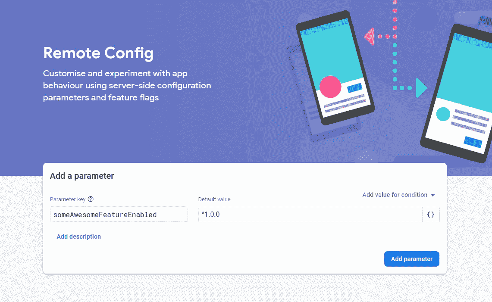
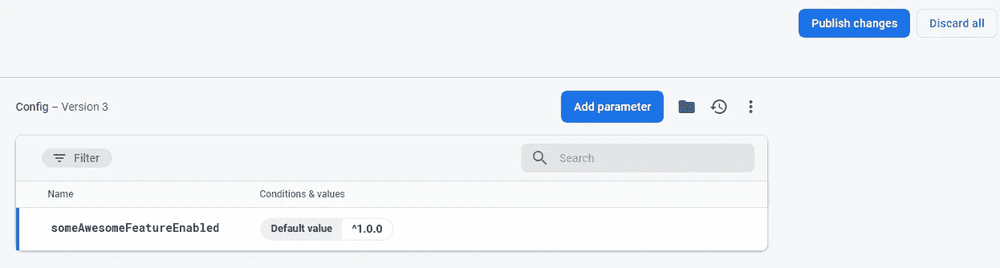

# 使用 Firebase 远程配置为您的 React 应用程序创建功能标志

> 原文：<https://javascript.plainenglish.io/create-feature-flags-for-your-react-app-with-firebase-remote-config-92d17c5e518d?source=collection_archive---------1----------------------->


**特性标志**(切换/开关)，顾名思义，用于打开和关闭应用程序中的某些特性。您可以添加功能标志，通过为某些用户打开 beta 功能来执行 A/B 测试。如果生产中出现问题，您可以将它们用作自动防故障开关。或者，您可以使用它们来隐藏正在进行的功能。

在这里，我将向您展示如何使用 React 实现 Firebase 远程配置的功能标志。

# 1.初始化 Firebase🔥

我们需要为这个演示安装 2 个包。如果你已经在你的项目中安装了 Firebase，只需安装`semver`，我稍后会解释它的用途。

```
yarn add firebase semver
```

然后，创建一个文件`firebase.js`来初始化 Firebase 实例以及您需要的其他 Firebase 服务，在我们的例子中是`remote-config`。

```
// firebase.js
import Firebase from 'firebase/app';
import 'firebase/remote-config';const firebaseConfig = {};export const firebase = Firebase.initializeApp(firebaseConfig);
```

前往你的 [Firebase 控制台](https://console.firebase.google.com/)并创建一个新项目，如果你没有的话。然后转到项目设置页面获取 Firebase SDK 配置，并将其粘贴到`firebase.js`中。

```
// Example
const firebaseConfig = {
  apiKey: "Your Api Key",
  authDomain: "yourapp.firebaseapp.com",
  databaseURL: "https://yourapp.firebaseio.com",
  projectId: "yourapp",
  storageBucket: "yourapp.appspot.com",
  messagingSenderId: "Some ID",
  appId: "Some ID",
  measurementId: "Some ID"
};
```

随着`firebase`实例的初始化，我们可以传递它并调用所有可用的服务。

# 2.在 Firebase 中创建远程标志🚩

在 Firebase 控制台中，转到远程配置部分。你可以在左侧菜单的种植部分找到它。

如果这是您的第一次安装，您应该会看到以下内容。输入一个参数键，该参数键将是我们的特征标志名，其默认值将是一个语义版本字符串`^1.0.0`。该字符串将与我们在开始时安装的`semver`包相关。我将在下一节解释它。



点击**添加参数**应该会到达该页面。



点击**发布更改**，您将拥有第一个可以使用的特征标志！

# 3.创建 FlagsProvider 组件

为了在您的应用程序中共享您的功能标志，我们需要创建一个 FlagsProvider 来获取我们在上面创建的所有远程标志，并通过上下文 API 共享它们。

首先，创建一个`FlagsContext`并获得`remoteConfig`实例。由于所有提取的远程配置都将缓存在您浏览器的 IndexDB 中，我们可以在开发中调整缓存的最大年龄，即`minimumFetchIntervalMillis`。显然，您也可以自己手动删除缓存。

我们的 provider 组件应该接受一个`defaults` prop 来设置特性标志的默认值。我们将它们保存在一个`flags`状态中，并将其传递给下面的提供者，这样当我们设置新的标志时就可以触发重新渲染。

```
// FlagsProvider.js
import React from 'react';
import { firebase } from './firebase';const FlagsContext = React.createContext({});
const remoteConfig = firebase.remoteConfig();// Only for development
remoteConfig.settings = {
  minimumFetchIntervalMillis: 3600000,
};const FlagsProvider = ({ defaults, children }) => {
  const [flags, setFlags] = React.useState(defaults); // Next part... return (
    <FlagsContext.Provider value={flags}>
      {children}
    </FlagsContext.Provider>
  );
};
```

接下来，我们将添加一个 useEffect 挂钩。我们需要将我们的`defaults`道具指定为默认配置。然后我们获取并激活所有的远程标志。然后，我们将遍历远程标志并设置我们的`flags`状态。

```
const FlagsProvider = ({ defaults, children }) => {
  ... React.useEffect(() => {
    remoteConfig.defaultConfig = defaults; remoteConfig
     .fetchAndActivate()
     .then(activated => {
        if (!activated) console.log('not activated');
        return remoteConfig.getAll();
     })
     .then(remoteFlags => {
       const newFlags = {
         ...flags,
       }; for (const [key, config] of Object.entries(remoteFlags)) {
         const appVer = process.env.REACT_APP_VERSION;
         newFlags[key] = 
            semverSatisfies(appVer, config.asString());
       } setFlags(newFlags);
    })
    .catch(error => console.error(error));
  }, []); ...
};
```

这里是`semver`帮助我们确定一个标志的布尔状态的地方。`semverSatisfies`函数检查给定的版本号是否满足版本范围。

**为了说明它是如何工作的，**

*   我们从环境变量中检索我们的应用程序版本。

*在本例中，将* `*REACT_APP_VERSION=$npm_package_version*` *添加到您的* `*.env*` *文件中，这将从您的* `*package.json*` *中检索版本号。*

*   我们有 1 个远程标志，即`['someAwesomeFeatureEnabled', '^1.0.0']`。
*   假设我们的应用程序版本是`1.0.1`，`semverSatisfies('1.0.1', '^1.0.0')`将返回`true`。
*   最后我们称之为`setFlags({ someAwesomeFeatureEnabled: true })`。

最终版本应该是这样的:

# 4.用 FlagsProvider 包装你的应用

最后，将 FlagsProvider 包装到根应用程序中，并指定`defaults`属性。旗帜名称**必须与你在 Firebase 控制台中设置的名称**相匹配。否则它将无法获取相应的标志。

```
import React from 'react';
import FlagsProvider from '...';const App = () => {
  return (
    <FlagsProvider
      defaults={{
        someAwesomeFeatureEnabled: false,
      }}
    >
      <YourApp />
    </FlagsProvider>
  )
}
```

# 如何访问您的标志

为了让您的生活更轻松，您可以创建一个自定义挂钩来从您的`FlagsContext`中检索您的旗帜。

```
export const useFlags = () => {
  const context = React.useContext(FlagsContext);
  return context;
}
```

你现在可以像这样切换你的牛逼功能👏,

```
const Component = () => {
  const { someAwesomeFeatureEnabled } = useFlags();  
  return (
    <div>
     {someAwesomeFeatureEnabled && <SomeAwesomeFeature />}
    </div>
  )
}
```

# 全部完成！🎊

对我来说，这是一次改变发展的经历。我可以继续开发新功能，一旦它们准备好了，我可以简单地打开标志，而不是重新部署应用程序。

如果你想添加更多的旗帜，只需将它们添加到 Firebase 和`defaults`道具中。每次部署新版本时，请记得更新您的应用版本！

远程配置也可以在 React Native 中完成。API 会略有不同，但概念是相同的。

[](https://rnfirebase.io/) [## 反应天然燃料|反应天然燃料

### 欢迎反应原生火焰基！要开始，您必须首先设置一个 Firebase 项目并安装“app”模块…

rnfirebase.io](https://rnfirebase.io/) 

此外，你在指定版本范围方面有很大的灵活性，查看下面的文档。

[](https://github.com/npm/node-semver#ranges) [## NPM/节点-服务器

### 作为一个节点模块:你也可以只加载你关心的函数的模块，如果你想最小化…

github.com](https://github.com/npm/node-semver#ranges) 

下次再见，希望这个演示对你有用。😄