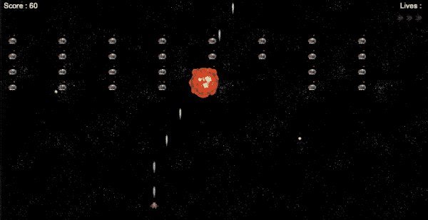
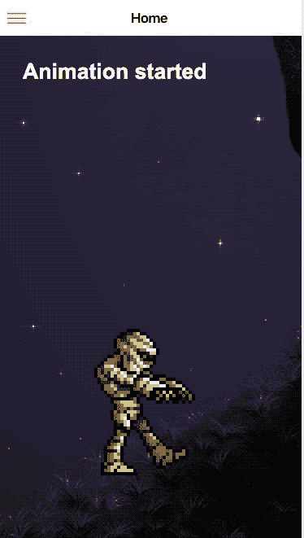
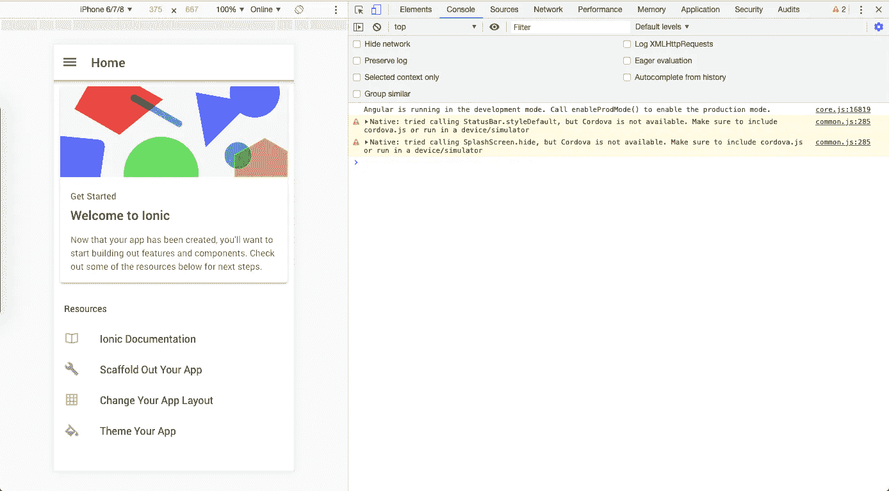
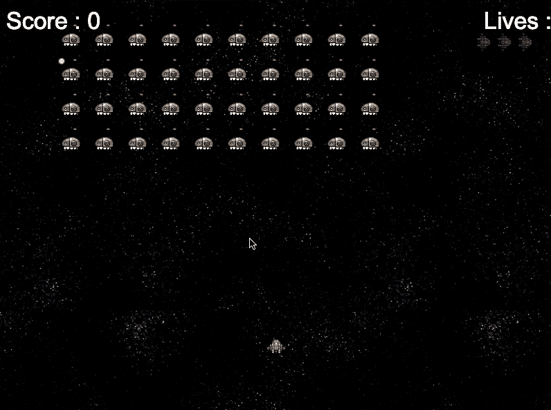
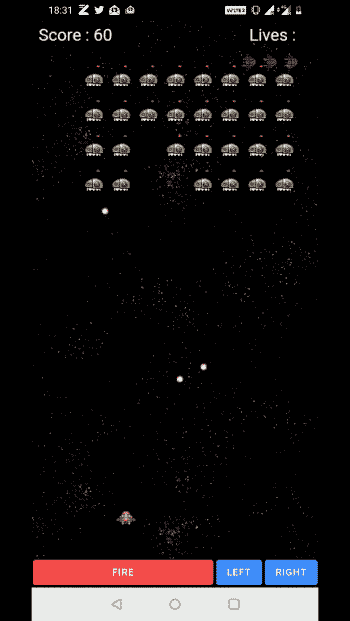

# 使用 Phaser 在 Ionic Capacitor 应用程序中创建 HTML5 原生游戏

> 原文：<https://javascript.plainenglish.io/create-html5-native-games-in-ionic-capacitor-apps-using-phaser-d3040317ae65?source=collection_archive---------6----------------------->


在这篇文章中，你将学习如何在 Capacitor Ionic 应用程序中使用 Phaser 创建 HTML5 游戏。我们将创建僵尸步行者和太空入侵者游戏，你可以在应用程序和浏览器中玩。《太空入侵者》是我在学校用 JAVA 开发的第一个游戏，所以它对我来说就像是一个“Hello World”游戏！



Space Invaders built in Ionic Capacitor with Phaser framework

HTML5 游戏可以使用 Phaser 框架制作，这是一个非常棒的 2D 游戏开发框架。电容器是混合应用程序世界的最新热点。它是对科尔多瓦的替代和改进。我们将在接下来的章节中了解更多。

> **本次演示由 Enappd 的** [**Ionic 4 全 App Starter**](https://store.enappd.com/product/ionic-4-full-app/) **提供支持。本教程完整源代码在 Github repo—**[**Ionic-4-phaser**](https://github.com/enappd/Ionic4-phaser)**(ZMB _ 电容分支&SI _ 电容分支)**中

让我们来看看对每个包含的框架的简要介绍:

1.  离子的
2.  电容器
3.  相位器

# 离子框架

你可能已经知道离子，但我把它放在这里只是为了初学者。 **Ionic** 是一款混合移动 app 开发 SDK。它提供了使用 CSS、HTML5 和 Sass 等 Web 技术开发混合移动应用程序的工具和服务。应用程序可以用这些网络技术构建，然后通过本地应用商店发布。这些应用程序可以通过利用 [Cordova](https://cordova.apache.org/) 或 Capacitor 环境安装在设备上。

所以，换句话说——如果你用 Android 创建原生应用，你就用 Java 编码。如果你在 iOS 中创建原生应用，你用 Obj-C 或 Swift 编码。这两种语言都是强大但复杂的语言。**使用 Cordova(和 Ionic ),你可以为你的应用编写一段代码，它可以在 iOS 和 Android 上运行**(和 windows！)，HTML、CSS 和 JS 的简单性也是如此。

必须注意科尔多瓦/电容在其中的作用。Ionic 只是一个由 HTML、CSS、JS 组成的 UI 包装器。因此，默认情况下，Ionic 不能在 iOS 或 Android 设备中作为应用程序运行。Cordova/Capacitor 是一个构建环境，它将这个 Ionic web 应用程序封装起来，并将其转换为一个可安装在设备上的应用程序，同时为这个应用程序提供对 Camera 等本地 API 的访问。

# Phaser 游戏框架

Phaser 于 2013 年首次发布，是一个 2D HTML5 游戏开发框架。它现在已经成为 2D HTML5 游戏中的一个巨大的名字。基于 javascript，它可以很容易地集成到各种 javascript 框架中。👾 👾 👾

那么为什么要集成 Phaser 和 Ionic 呢？🚀 👾

虽然 Ionic 让你能够以闪电般的速度创建应用程序和 PWA，但你无法用它真正制作游戏。Phaser 虽然在游戏构建方面很棒，但并不是真的要构建一个结构化的移动或网络应用。因此，用 Phaser 构建一个外观简洁的游戏应用或 PWA 需要一个 HTML + CSS 包装器，Ionic 完美地填补了这个空白。

# 什么是电容？

Cordova 帮助将 Ionic web app 构建成一个设备可安装的应用程序。但是 Cordova 有一些限制，电容器试图通过新的应用程序工作流程来克服这些限制。

Capacitor 是一个跨平台的应用程序运行时，可以轻松构建在 iOS、Android、Electron、*和*网络上运行的 web 应用程序。Ionic 人将这些应用称为“原生渐进式网络应用”，它们代表了混合应用之外的下一次发展。它是为 Ionic 构建的，但也可以运行其他框架。它只是一个运行时系统，将你的网络应用“容器化”，允许它在多个地方运行。有了电容器，你就可以在

*   安卓应用
*   iOS 应用程序
*   在浏览器中作为渐进式网络应用程序，以及
*   在使用电子桌面应用中

本质上，电容器就像一个新鲜的，更灵活的科尔多瓦版本。它使得在各种平台上运行混合应用变得非常容易。

# 员额结构

我们将遵循一个循序渐进的方法，在我们的 Ionic 4 电容应用程序中创建一个基于相位器的游戏。以下是步骤

*   步骤 1——创建一个基本的**离子 4 角**应用程序
*   步骤 2-将 Phaser 包含在项目中
*   步骤 3 —在应用程序中集成电容
*   步骤 4-实现 Phaser 游戏
*   第五步——将游戏内置到手机应用程序中

这就是我们在本教程中要构建的内容。



A zombie walking — Using Phaser in capacitor app

所以让我们开始吧！

# 第一步:创建一个基本的离子 4 角应用程序

> 我已经在[这篇博客](https://enappd.com/blog/how-to-create-an-ionic-4-app-for-beginners/13/)中详细报道了这个话题。

简而言之，您需要采取的步骤如下

*   确保您已经在系统中安装了 node(在这篇博文发表时是 V10.0.0)
*   使用 npm 安装 **ionic cli** (我的 ionic 版本是^4.7.1)
*   使用`ionic start`创建 Ionic 应用程序

为了本教程，您可以创建一个`sidemenu`启动器。运行`ionic start ioniser sidemenu`时，将安装节点模块。安装完成后，使用在浏览器上运行您的应用程序

```
$ ionic serve
```

并检查一切运行正常。对我来说，它看起来像跟随。从附带的 Github repo 中复制代码，将其更改到游戏中。



# 步骤 2:在项目中包含 Phaser

Phaser 非常容易包含在项目中。本质上，它只是一个需要包含在 HTML5 项目中的 Javascript 文件。有两种方法可以做到

***# 1——酷炫的“一劳永逸”方式(更快)***

从 [Phaser 官方下载](https://phaser.io/download/stable)下载`*phaser.min.js*`，并将其与您的项目链接。出于演示的目的，我将把这个文件保存在`assets`文件夹中，但是你也可以从 CDN 链接它。

将 phaser.js 文件包含在`index.html`文件中，如下所示

```
<script src="assets/phaser.min.js"></script>
```

现在您可以使用以下命令将 phaser 包含在您的组件`.ts`文件中

```
declare var Phaser;
```

(要检查`Phaser`包含什么，试着安慰变量或保存在`this`中的变量`defaultState`，你会对 Phaser 的构建有所了解。)

***# 2——复杂的“我是一个编码狂”方式***

从 phaser 下载 npm 包

```
npm install phaser-ce
```

准备 **webpack** 来编译 phaser 包，这样您就可以在。ts 文件。您可能需要为此准备自己的 webpack-config 并安装额外的模块。此后，您可以将变量导入为

```
import "pixi";
import "p2";
import * as Phaser from "phaser-ce";
```

这里给出了细节(上次我试过，这种方法在离子上有各种各样的错误，所以我将坚持使用方法#1)

# 步骤 3 —在应用程序中集成电容

电容器也可以连接到现有的离子 app。要将电容器连接到您现有的 Ionic 应用程序，运行

```
$ ionic integrations enable capacitor
```

这将附加电容器到你的离子应用程序。在这之后，你必须`init`电容器应用程序

```
$ npx cap init YOUR_APP_NAME YOUR_APP_ID
```

# 步骤 4:实现 Phaser 游戏

> **你可以在** [**中找到完整的代码**](https://store.enappd.com/product/ionic-phaser-game-framework-ionic-4/)**【ZMB _ 电容支路】**

出于示例目的，我们将使用一个简单的[相位器示例](https://phaser.io/examples/v2/animation/animation-events)，我们将制作一个**僵尸**行走。

我们将关注启动器附带的`home`组件。所以所有相关的 javascript 代码都将放在`home.page.ts`文件中。用以下内容替换`home.page.html`文件中的全部内容

```
<ion-content>
  <div id="phaser-example"></div>
</ion-content>
```

我们将识别 javascript 逻辑中的`phaser-example`,并在这个 div 中实例化游戏。

一个基本的 Phaser 游戏有三个默认函数——preload()、create()和 update()

## 预载()

顾名思义，预载资产等。在我们的例子中，这个函数将加载僵尸和背景图像。

```
preload() {this.game.load.image('lazur', 'assets/thorn_lazur.png');this.game.load.spritesheet('mummy', 'assets/metalslug_mummy37x45.png', 37, 45, 18);}
```

## 创建()

创建游戏实例并加载游戏状态。在我们的游戏中，这个函数将设置场景中的图像。我们还将在这里创建和设置动画监听器。

```
create() {// Set backgroundthis.back = this.game.add.image(0, -400, 'lazur');this.back.scale.set(2);this.back.smoothed = false;// Set mummy from a spritethis.mummy = this.game.add.sprite(200, 360, 'mummy', 5);this.mummy.scale.set(4);this.mummy.smoothed = false;// Set mummy animationthis.anim = this.mummy.animations.add('walk');this.anim.onStart.add(that.animationStarted, this);this.anim.onLoop.add(that.animationLooped, this);this.anim.onComplete.add(that.animationStopped, this);this.anim.play(10, true);}
```

## 更新()

更新循环，动作，物理互动等游戏状态。对于我们的游戏，这将通过移动背景来更新动画，以创建“行走”的效果

```
update() {if (this.anim.isPlaying) { this.back.x -= 1;}}
```

还有 Tada！！！🎉 🎉🎉我们在*发球*窗口运行我们的游戏


Basic Phaser game in Capacitor browser app

同样，你可以用 Ionic 运行任何相位器游戏。相信我，Phaser 中有一些看起来不可思议的[游戏。不久前我们做了一个马里奥复制品，还有一个太空入侵者！](https://phaser.io/examples)

**⭐️️️️⭐️️️️⭐️️️️important️️⭐️️️️⭐️️️️⭐️️️️**

Phaser 的实现可能会让您与`this`的实现混淆。简而言之，一旦相位器场景被初始化，`this`就包含了默认的游戏状态。作为一名 Ionic 开发人员，或者如果您遵循 Ionic 文档，您将使用`this`来引用组件的类。所以你最终使用了冲突的`this`。为了快速解决这个问题，我将离子`this`分配给另一个变量`that`(😅)然后用它指向类函数。

常见的错误是声明`that = this`。是的，它确实通过`that`引用`this`，但是一旦`this`改变，`that`也会改变，因此这样做没有意义。你可以使用`that = Object.assign({},this)`，这是一个很好的标准代码。但是你会发现，这也不会导致我们想要的结果。因为在 Ionic `this`中包含了`_prototype`内部的类**函数，要将这些函数复制到`that`中，您应该这样定义它**

```
that = Object.create(this.constructor.prototype);
```

然后用`that`代替`this`调用函数

例如`that.animationStarted`指向一个函数`animationStarted`。在这里使用`this`会抛出一个错误，因为`create()`函数是一个相位器默认值，并且在`this`中包含场景的默认状态

如果你对`this`概念不太适应，你可以在[这里](https://code.tutsplus.com/tutorials/fully-understanding-the-codethiscode-keyword--net-21117)了解更多。

(作为另一个变通办法，您可以将完整的 javascript 代码放在 Ionic 的类实现之外，或者更糟，放在`index.html`的`<script></script>`标签中，但这太麻烦了。你将无法用这种方式编写庞大的游戏代码)

# 第五步:将游戏制作成手机应用

使用 Phaser 构建电容器应用程序与构建常规电容器应用程序完全相同。对于那些不熟悉 Ionic 4 流程的人，首先构建 ionic web 资产

```
$ ionic build
```

然后，使用以下任意命令向应用程序添加平台

```
$ npx cap add android
$ npx cap add ios
```

添加平台后，您可以打开该平台的本机 IDE，并在设备或模拟器中运行应用程序。

```
$ npx cap open android // opens Android Studio
$ npx cap open ios // opens Xcode
```

您可能希望使用`window.innerWidth`和`window.innerHeight`根据设备尺寸调整`canvas`的尺寸。有了这个，你可以为所有的移动设备尺寸调整游戏画布。


Zombie walking — Phaser game in Ionic Capacitor, running in Android device

经过这些调整，游戏看起来如上。不错吧。👻

酷的是，你仍然可以像移动应用程序一样拥有**侧菜单**或**标签**，并在游戏中加入应用程序的所有常规功能(反之亦然)，如登录、注册等。利用离子插件。

## 太空入侵者？

想在爱奥尼亚制作自己的 PUBG 或太空入侵者游戏吗？我们有东西给你！我们在离子电容 Github repo—[**Ionic-4-phaser**](https://github.com/enappd/Ionic4-phaser)**(SI _ Capacitor branch)**中加入了太空入侵者游戏



Space Invaders in Ionic + Phaser — Using Capacitor in Browser

从回购的`SI_capacitor`分支运行代码，就能得到一个很酷的太空入侵者游戏 app！在 Android 设备上看起来像这样



Space Invaders in Ionic + Phaser — Using Capacitor in Android

# 结论

Ionic 在制作移动应用程序方面速度超快，而 Phaser 则非常适合制作 2D HTML5 游戏。Capacitor 是一个很好的运行时环境，可以将 web 应用程序容器化，在各种平台上运行。结合离子，电容和相位器，你可以创建一些很酷的游戏应用。你也可以将游戏包含在一个常规的 Ionic Capacitor 应用程序中，这使得它更加通用。

> **本教程完整源代码在 Github repo—**[**Ionic-4-phaser**](https://github.com/enappd/Ionic4-phaser)**(ZMB _ 电容分支&SI _ 电容分支)**

*本文原载于*[*【enappd.com】*](https://enappd.com)