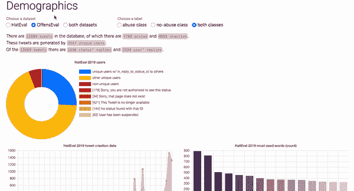
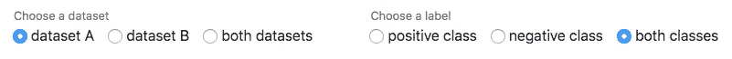

# 用 Django & Chart.js 创建交互式数据可视化

> 原文：<https://javascript.plainenglish.io/create-interactive-data-visualisations-with-django-chart-js-8c4d0b98770e?source=collection_archive---------1----------------------->



## 如何用交互式图形可视化你的数据+奖金:异步香草 JS！

在这个故事中，我将向你展示如何在 [chart.js 库](https://www.chartjs.org/)提供的漂亮图表中可视化你的数据。这些图表比你以前用`matplotlib`创建的任何图表都要漂亮得多，而且它们可以被你的用户操作！

另外，我想借此机会尝试一下异步 javascript 执行(AJAX)，这次使用普通 JS `XMLHttpRequest`。

我们今天要讲的内容:

*   用`XMLHttpRequest`、Django 的`JsonResponse`和`FormData`对象发送和捕捉异步响应。
*   为图表设置标签、值和颜色。
*   创建圆环图、条形图和折线图。
*   提供用户反馈。

让我们从 HTML 表单开始>用 JS 处理到后端>返回响应>捕捉响应并显示结果和反馈。在这个项目中，我们将使用 Twitter 上的两个辱骂性语言数据集，这也是我在硕士论文中使用的。

## **异步请求**



HTML form with radio buttons for selecting various datasets

为了向我们的后端发送一个异步 Javascript 请求，我们将创建一个普通的 HTML 表单，并阻止提交和重新加载网页的默认响应。然后我们将创建一个`FormData`对象，并通过 Javascript 将其发送到 Django 后端。

这个表单中没有 submit 按钮，所以我们必须添加一个`addEventListener`，当一个指定的事件`click`被传递到目标`input`时，它会进行注册。然后，我们将在一个`FormData`键值对象中收集表单字段，并通过`XMLHttpRequest`将其发送到 Django 后端。所有这些都是用普通的 Javascript 完成的。

在某种程度上是伪代码:

*   `line 2-3`我们在等待点击一个带有`class="form-check-input dataset"`的 HTML 元素
*   `line 4–5`我们获取 HTML 表单元素并创建一个键值对象。
*   `line 7-9`我们用表单方法`POST`和动作或 url 打开一个新请求，并将我们的键值对象发送到 Django 后端。

## Django 后端

我们将在这里准备和转换数据，并为返回一个充满数据的响应做好一切准备。我们还将通过一条消息提供一些用户反馈。

当我们用一个`GET`方法访问这个路由时，我们只是显示包含 HTML 表单的模板`demographics.html`，但是当我们用一个`POST`访问这个视图时，我们将准备我们的数据并发送一个`JsonResponse`。`line 15-19`是我们为图表准备数据的地方。`line 19-20`是我们使用 Django 的`render_to_string`的地方，它使我们能够将带有变量的`jinja2`模板加载到字符串中。第三个参数是`context`字典，从中我们可以像`{{ tags }}`一样使用模板中的键。例如，模板`includes/message.html`看起来像这样:

```
<li>
     <div class="alert alert-{{ tags }} msg fade show" role="alert">{{ message }}</div>
</li>
```

还需要注意的是，我们发送了一个包含所有数据的字典`response`，我们将在 Javascript 中提取两个部分。我们将这个字典转换成一个`JSON`对象，然后用 Javascript 中的`JSON.parse`方法将其解包。

## 数据准备

为了展示我们如何准备数据，我选择了三个函数`hashtag_demographics`、`creation_date_demographics`和`text_demographics`。

最有趣的要点和代码片段是:

*   Chart.js 期望它的图表有三个列表:一个列表`labels`、一个列表`values`和一个列表`colours`(十六进制代码)。我们使用带有`*`的`zip`函数来遍历元组列表`[(label, value), (label value)]`。
*   对于配色方案，我们使用的是`seaborn`套装，它带有几套漂亮的[调色板](https://seaborn.pydata.org/tutorial/color_palettes.html)。
*   对于时间序列，我们需要将 Python 的`datetime`对象转换成 Javascript 的`Date`对象，我们在`line 44`中完成了这项工作。
*   `line 62-69`将 tweet 内容矢量化为 tf-idf 计数，这是除了计数矢量化之外的常见做法。

## JSON 响应

我们在`demographics.py, line 33`中从 Django 后端发送的`JsonResponse`应该是我们附加到`send_request.js`中的另一个`addEventListener`。

*   `line 15`展示了我们如何捕捉响应对象并将它的 JSON 转换成一个对象，这使得来自 Django 对象的`response`对象中的键和值是可访问的！
*   `line 18-20`是我们如何将消息添加到 HTML 页面的`messages-list`元素中。我正在使用一个自定义功能`fade_alerts()`，它会在一段时间后淡出消息。
*   我们如何将文本信息添加到网页中。
*   `line 29-36`展示了我们如何在`returnCharts()`和`showCharts()`函数中为我们的 chart.js 视觉效果提取`values`、`labels`和`colours`，这将在下一节中解释。

## Chart.js 可视化

为了简洁起见，我决定只包含时间序列折线图的脚本(和往常一样，完整的代码可以在底部找到)。`get_time_config()`定义图表的配置，`convertDates()`将日期列表转换为 Javascript `Date`对象，`returnChart()`和`showChart()`定义并显示图表。

`line 67`很重要，因为它用`id="time"`获取元素，并在`line 70`中使用它将图表附加到该元素。该元素在`demographics.py, line 20`的模板`includes/demographics.html`中定义为`<canvas id="time"></canvas>.`

## 结束了

最后，我们将在`request.js`中添加一点 Javascript，当呈现模拟`click`事件的视图时，它将被加载，这样人口统计数据将通过如上所示的相同路径被加载。

```
var ***hatEvalData*** = ***document***.getElementById("hateval_dataset");
***hatEvalData***.click();
```

完整的代码和脚本可以在这里找到。此外，您可以在这里与这些图表的现场演示[互动。](https://louisdebruijn.me/thesis/graphs)

