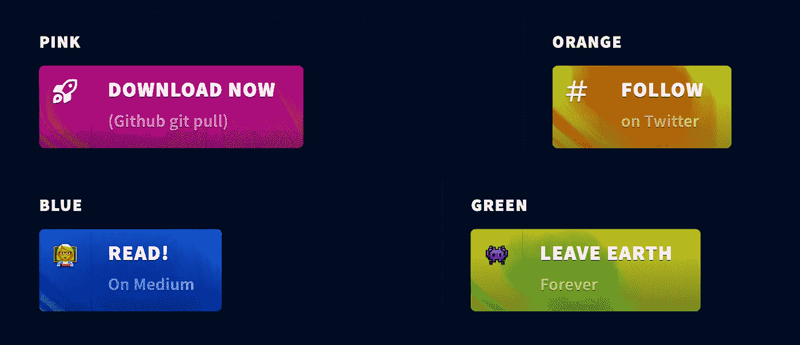
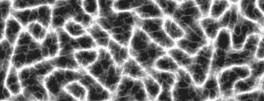

# 创建交互式 WebGL 驱动的按钮

> 原文：<https://javascript.plainenglish.io/create-interactive-webgl-powered-buttons-dc73f8fda7b8?source=collection_archive---------19----------------------->

The effect we will be creating.

我们可以提高网站转化率的一个方法是增加用户在网站上花费的时间，或者与行动号召按钮互动。这可以间接导致转化率的增加。

所以想到这个问题，*我想知道我们是否可以用 WebGL 做一些很酷的事情，并创建动态按钮*，这可能会使用户更有可能想要悬停或关注按钮。一路上，我们会学到一些关于噪音的知识。

[**查看 CodePen Demo**](https://codepen.io/smpnjn/pen/jOMLZKK)

# 第一步。用 WebGL 设置场景

首先要做的是使用 Three.js 编写一点 JavaScript。我在这里所做的是创建一个单一的平面几何体，我将它传递给着色器。我给每个人都做了一个。按钮元素，允许我们进一步定制。我还添加了一些代码，允许每个按钮的颜色根据它在 DOM 中的顺序改变——例如，第一个按钮是粉红色的，第二个是橙色的，等等。

上面的统一变量被传递到片段和顶点着色器上，所以当我们在 JS 中更新它们时，它们会在画布上更新。

使用这个我们可以放大悬停和点击效果。在 GitHub repo 和 CodePen 中，我们添加了一些更高级的功能，允许我们跟踪元素的当前操作，以及鼠标从哪里进入。基于此，它将调整 WebGL 画布的动画，给出一个非常酷的悬停和聚焦效果，如下所示:

# 第二步。着色器和噪波

对于任何不熟悉着色器的人来说，着色器可以获取我们之前定义的几何信息，操纵它们，并将它们发送到 GPU。WebGL 中有两个着色器，**顶点**(操纵多边形位置)和**片段**(操纵多边形颜色)。

**我们可以用着色器创建效果的主要方法之一是使用噪波。**噪点可以给效果添加随机性和真实感，但会改变点。我们今天要用的噪声叫做分形布朗运动(fbm)。我使用的一些代码是对着色器手册上的内容的修改，但也有您可能感兴趣的不同噪波函数的完整 GitHub repo。

An example of what FBM can generate

使用 FBM，我们改变片段着色器来输出效果。查看所有代码的完整着色器，但我们使用了一个名为 fbm 的噪波函数(可以在 GitHub repo 的 *shaders/noise.glsl* 中找到)。关于我们为什么在代码中做一些事情的更多信息，请看下面的评论。

# 结论

**就这样！用 WebGL 创建一些非常棒的效果比你想象的要容易得多，希望这不仅能给你一些很酷的按钮，还能为将来如何创建这些东西打下基础。以下资源:**

*   [GitHub 回购](https://github.com/smpnjn/webgl-vortex-buttons)
*   [CodePen 演示](https://codepen.io/smpnjn/pen/jOMLZKK)