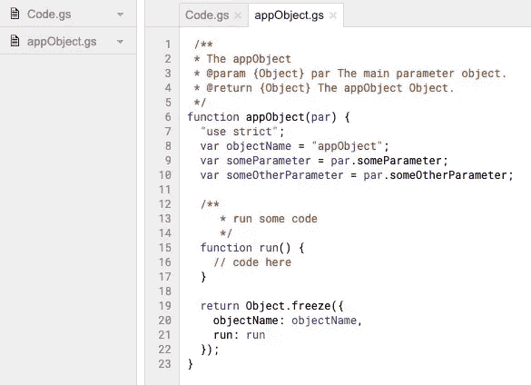
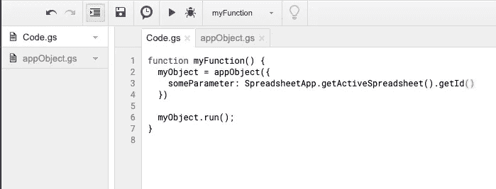
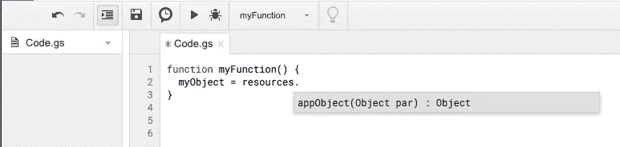

# 构建并简化您的 Google Apps 脚本

> 原文：<https://javascript.plainenglish.io/create-javascript-objects-in-google-apps-script-91472378ab55?source=collection_archive---------1----------------------->

## 用道格拉斯·克洛克福特的构造器模式在 Google Apps 脚本中组织你的 JavaScript 对象。

Photo by [Evan Dvorkin](https://unsplash.com/@evphotocinema?utm_source=medium&utm_medium=referral) on [Unsplash](https://unsplash.com?utm_source=medium&utm_medium=referral)

工厂函数和应用程序脚本是一个很好的匹配。使用这些工厂函数在应用程序脚本中构建代码简化了开发和维护代码的过程。在本文中，我提供了一些例子和背景信息，来解释为什么我要使用这种模式。

# 背景

Apps 脚本基于 JavaScript 1.6，加上 1.7 和 1.8 的一些特性。只要你在服务器端，它就是同步的。编辑是在有限的在线编辑器中完成的。我们正在等待 JavaScript 引擎和编辑器的更新。为了克服一些限制，我们增加了一些外部功能，例如[扣](https://developers.google.com/apps-script/guides/clasp)可以和本地编辑一起工作。

我期待着应用程序脚本的下一次大迭代，然而我喜欢用谷歌应用程序脚本解决问题的主要原因是它的简单性。一旦你打开应用程序脚本编辑器，你需要的一切都在那里。你可以选择自己的抽象层，使用[类 DriveApp](https://developers.google.com/apps-script/reference/drive/drive-app) 快速创建一个文件。如果你需要做一些有趣的事情，请继续使用[驱动服务](https://developers.google.com/apps-script/reference/drive/)，如果你需要来自驱动 V3 的特定内容，请使用 [UrlFetchApp](https://developers.google.com/apps-script/reference/url-fetch/url-fetch-app) 。同步代码迫使你重新思考你的解决方案，避免了复杂的回调或承诺。

简单和返璞归真与道格拉斯·克洛克福特的 [Javascript 的优秀部分](https://www.amazon.com/JavaScript-Good-Parts-Douglas-Crockford/dp/0596517742)非常契合。是的，这本书是否仍然有意义还存在争议。如果你想了解更多，我的建议是跳过辩论。首先理解它是关于理解 JavaScript 语言的重要部分。然后阅读[关于道格拉斯·克洛克福特 Javascript 的注释中好的部分](https://github.com/dwyl/Javascript-the-Good-Parts-notes)。然后放松一下，看看 youtube。下面的视频从创建对象开始，但整个视频仍然值得一看。

# 在应用程序脚本中使用`this`

*与* `*this*` *无双关之意。我在 JavaScript 里根本不用* `*this*` *。如果使用工厂模式创建一个对象，**`*this*`会正常工作，这是好处之一。*

现在回到应用程序脚本和构建代码的方法。这是我用于应用程序脚本代码的模板。

并调用代码，在这种情况下传递活动电子表格的 id。

本文讨论了使用工厂函数的一般优势 [JavaScript 构造函数与工厂函数。](https://web.archive.org/web/20151029152324/http://ericleads.com/2013/01/javascript-constructor-functions-vs-factory-functions)

在应用程序脚本编辑器中，可以将工厂功能组织到不同的文件中。每个文件包含一个函数。

并使用另一个文件来执行代码

这种方法也可以很好地与[库](https://developers.google.com/apps-script/guides/libraries)一起工作。在下面的例子中，我将代码移动到了一个库中，并包含了名为“resources”的代码。typeahead 工作得很好，对象的内部被隐藏和保护。

对于更大的项目，你可以在一个仓库中组织工厂功能，并使用 [clasp](https://developers.google.com/apps-script/guides/clasp) 。

# 结论

一些结论是在链接的文章中得出的。本文主要关注在 Apps 脚本中使用这种模式的附加价值。我喜欢旧式 JavaScript 融入应用程序脚本结构的方式。工厂功能可以整齐地组织在编辑器的文件中。一旦写好了，你就可以忘记函数的内部结构，在需要的时候调用它。这使得代码在需要抽象的地方更加抽象，在需要抽象的地方使用对象。

你可以在我的文章[中找到一个完整的例子，用 Google Sheets、Calendar 和 Apps 脚本](https://medium.com/@duizendstra/record-time-and-activities-with-google-sheets-calendar-and-apps-script-41bf69244346)记录时间和活动