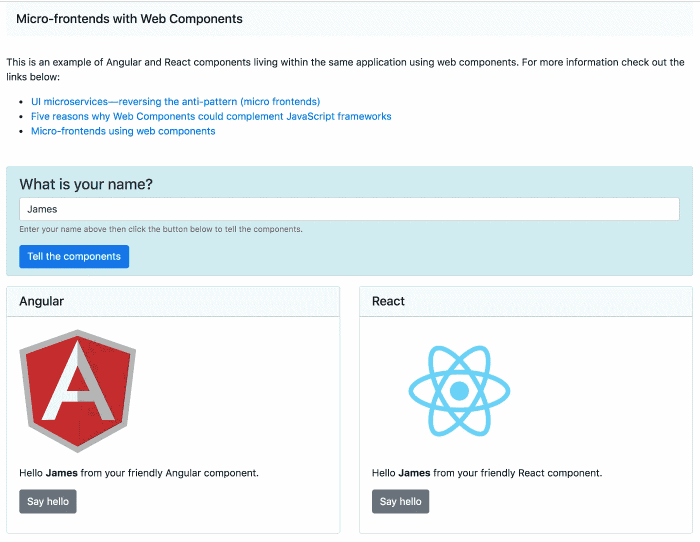

# 使用 Web 组件创建微前端(支持 Angular 和 React)

> 原文：<https://javascript.plainenglish.io/create-micro-frontends-using-web-components-with-support-for-angular-and-react-2d6db18f557a?source=collection_archive---------0----------------------->


对于现代 UI 开发人员来说，你的“*选择框架”*是根深蒂固的东西，它以某种方式定义了你的身份，也许限制了你解决问题的能力。我之前说过， [*大家都好好相处不是更好吗？*](https://medium.com/javascript-in-plain-english/could-web-components-actually-compliment-javascript-frameworks-5-reasons-why-i-think-so-971eee82ee85)


# 如果你是 React 或 Angular，Ember 或 Vue，让我们使用 web 组件创建一个地方，让他们可以和谐共处。

使用 web 组件作为 Angular 和 React 组件的包装器，我将展示它们在单个应用程序中的协同工作。我还将把数据从父容器传递给两个组件，然后再传递回来。*我们的成品会是这样的:*



[https://github.com/chriskitson/micro-frontends-with-web-components](https://github.com/chriskitson/micro-frontends-with-web-components)

# 先决条件

为了让我们能够专注于重要的部分，我已经将所有内容编码并上传到我的 github:

[](https://github.com/chriskitson/micro-frontends-with-web-components) [## chriskitson/带 web 组件的微前端

### 通过在 GitHub 上创建一个帐户，为 chriskitson/micro-frontends-with web-components 开发做贡献。

github.com](https://github.com/chriskitson/micro-frontends-with-web-components) 

无论如何，这不是一个深入的探讨，但是我将在 Angular 和 React 中介绍 web 组件支持的重要部分。

****如果您想完成其他一些框架(Vue、Ember 等)，请随时在我的回购上创建一个拉取请求！***

我已经使用 Angular CLI 为我们的 Angular 项目生成了一个起点。您至少应该熟悉这个工具，以便能够浏览代码:

 [## 角度 CLI

### Angular CLI 使得创建开箱即用的应用程序变得容易。它已经跟随我们的…

cli.angular.io](https://cli.angular.io/) 

因为我们在这里的最终目标是 **web 组件**，所以我们将把静态 JavaScript 文件组合成微服务。为此，我将在我的本地环境中使用 **serve** ，这是一个使用 node:

[](https://www.npmjs.com/package/serve) [## 服务

### 静态文件服务和目录列表

www.npmjs.com](https://www.npmjs.com/package/serve) 

# 作为自定义元素的角度组件

由于 Angular 似乎采用了 web 组件( [*带 Angular 元素*](https://angular.io/guide/elements) )，您可以将 Angular 组件作为 web 组件，只需对默认 Angular CLI 生成的项目做一些小的调整。

在`/micro-fe-ng`目录中，一切都应该正常工作，您需要做的就是安装依赖项并运行启动脚本:

```
cd micro-fe-ng/
npm i
npm start
```

现在我们定义自定义元素为`<ng-el />` 的角度微前端应该在`[http://localhost:5001/main.js](http://localhost:5001/main.js)`运行。

*注意:我们通过本地主机在不同的端口上提供我们的文件，但是它们可以很容易地位于共享相同 DNS 的多个微服务中。*


*如果你对这是如何实现的感兴趣，这里是所需更改的概要:*

我们需要几个新的依赖项:

angular 对定制元素( **@angular/elements** )和 **ngx-build-plus** 的支持，后者是 Angular 的替代构建工具(*它对 Angular 元素的支持还不错*):

```
npm i @angular/elements ngx-build-plus -D
```

我们还需要对我们的 **package.json** 进行一些更改，以构建我们的 Angular 项目并作为定制元素服务于我们的项目:

*微 fe-ng/package.json:*

```
"start": "npm run build && serve -l 5001 dist/micro-fe-ng",
"build": "ng build --prod --output-hashing none --single-bundle true",
```

我们需要在我们的 **app.module.ts** 中定义定制元素如下:

*micro-Fe-ng/src/app/app . module . ts:*

```
import { BrowserModule } from '@angular/platform-browser';
import { NgModule, **Injector** } from '@angular/core';
**import { createCustomElement } from '@angular/elements';**import { AppComponent } from './app.component';
**import { CustomelementComponent } from './customelement/customelement.component';**@NgModule({
  declarations: [
    AppComponent,
 **CustomelementComponent**
  ],
  imports: [
    BrowserModule
  ],
  providers: [],
 **bootstrap: [],**
  entryComponents: [
    AppComponent,
 **CustomelementComponent**
  ]
})export class AppModule { constructor(**private injector: Injector**) {} **ngDoBootstrap(): void {
    const { injector } = this;** **// create custom elements from angular components
    const ngCustomElement = createCustomElement(CustomelementComponent, { injector });** **// define in browser registry
    customElements.define('ng-el', ngCustomElement);** **}**}
```

最后，我们需要告诉 Angular 使用 **ngx-build-plus** 构建工具，方法是在 **angular.json** 中的三个地方指定它，如下所示:

Ngx-build-plus 将构建的项目作为单个 JS 文件返回，这是 web 组件作为单个服务工作的要求。

*微-fe-ng/angular.json:*

```
..."architect": {
  "build": {
   ** "builder": "ngx-build-plus:build",**
    .... "serve": {
 **"builder": "ngx-build-plus:dev-server",**
    ... "test": {
 **"builder": "ngx-build-plus:karma",**
```

# 将组件作为自定义元素进行反应

由于 React 没有现成的对 web 组件的支持，我们将不得不编写比以前多一点的代码来包装一个标准的 React 组件，并将其作为本机 web 组件呈现( *custom elemen* t)。

与 React 组件非常相似，定制元素(web 组件)也有生命周期挂钩，您可以通过回调方法访问这些挂钩。

通过使用定制元素 API 的`connectedCallback()`和`disconnectedCallback()`生命周期方法，我们可以将它们分别映射到 React 组件的`render()`和`unmount()`，如下所示:

```
class MyCustomElement extends HTMLElement {
  constructor() {
    super();
  } connectedCallback() {
    ReactDOM.render(<MyReactComponent />, this);
  } disconnectedCallback(){
    ReactDOM.unmountComponentAtNode(this);
  }
}
```

我还通过映射反应道具和事件对此进行了更深入的研究。如果你想了解一下，那就看看**/micro-Fe-react/src/index . js**。

示例存储库中的一切都应该运行良好，因此您可以执行以下操作来启动和运行 React 微服务:

```
cd micro-fe-react/
npm i
npm start
```

现在，我们的 React 微前端将我们的自定义元素定义为`<react-el />`，应该在`[http://localhost:5002/main.js](http://localhost:5001/main.js)`运行


# 微前端包装器

我们有两个微前端服务；一个用于角度分量，一个用于反作用分量。

*现在，让我们创造一个他们可以和睦相处的世界……*

在`/micro-fe-wrapper`目录中，一切都应该正常工作，您需要做的就是安装依赖项并运行启动脚本:

```
cd micro-fe-wrapper/
npm i
npm start
```

现在我们的微前端包装器应该在`[http://localhost:500](http://localhost:5001/main.js)0`运行。

关于其工作原理的解释，请继续阅读。

由于 web 组件是原生 HTML 规范的一部分，我们不需要做什么太花哨的事情就能把它们组合在一起。

*在现实世界中，你可能希望使用一个框架来实现更好的代码结构和数据绑定等。，但是为了简单起见，让我们继续使用普通的 HTML/JS。*

*micro-Fe-wrapper/index . html:*

我们需要包含一些来自 CDN 的外部依赖关系:

*   **zone.js** 是 Angular 所要求的。最好在包装应用程序中包含一次，因为在同一个页面上不能有多个版本。
*   **Custom-elements-es5-adapter . js**为我们的浏览器提供了自定义元素支持。

此外，我们应该包括来自组件服务的 JS 文件，这些文件是我们在前面的步骤中构建和部署的:

```
<script src="https://cdnjs.cloudflare.com/ajax/libs/zone.js/0.9.1/zone.min.js"></script><script src="https://cdnjs.cloudflare.com/ajax/libs/webcomponentsjs/2.2.10/custom-elements-es5-adapter.js"></script><script src="http://localhost:5001/main.js"></script>
<script src="http://localhost:5002/main.js"></script>
```

我定义了一个名为`tellComponents()`的方法，它应该将自定义元素标签:`<ng-el />`用于 Angular，而`<react-el />`用于 React 到我们的页面中。

我还使用`setAttribute()`传递了一个属性`name`来模拟包装应用程序与组件的对话。

我还使用`addEventListener()`监听一个名为`helloEvt`的事件，该事件将监听来自我们组件的事件，使它们能够与我们的父应用程序和潜在的其他组件对话。相当酷！

【React 和 Angular 的 `helloEvt()` *属性名称略有不同。这是因为框架之间的约定不同。稍后我会详细解释…*

```
function tellComponents() { const name = document.getElementById('yourName').value;**const reactEl = document.createElement('react-el');
  reactEl.setAttribute('name', name);
  reactEl.setAttribute('onHelloEvt', 'onHelloEvt');
  reactEl.addEventListener('onHelloEvt', (e) => helloEvent('react'));** const reactElContainer =  document.getElementById('react-container') if (reactElContainer.children.length > 0) {
    reactElContainer.removeChild(reactElContainer.children[0]);
  } reactElContainer.appendChild(reactEl);**const ngEl = document.createElement('ng-el');
  ngEl.setAttribute('name', name);
  ngEl.addEventListener('helloEvt', (e) => helloEvent('angular'));** const ngElContainer =  document.getElementById('ng-container'); if (ngElContainer.children.length > 0) {
    ngElContainer.removeChild(ngElContainer.children[0]);
  } ngElContainer.appendChild(ngEl);}
```


# 向组件传递值和从组件传递值

还记得我们传递给自定义元素的`name`属性吗？在组件中读取这个值实际上非常简单。

在**角度**中，我们简单地引用一个**输入**:

```
export class CustomelementComponent implements OnInit {
 **@Input() name: string;**
  ...
}
```

这使得该值在我们的模板中可用:

```
<p>Hello <strong>**{{name}}**</strong> from your friendly Angular component.</p>
```

在 **React** 中，它将作为道具传递给组件:

```
export class ExampleComponent extends React.Component {

 **static propTypes = {
    name: PropTypes.string
  }** **static defaultProps = {
    name: "Chris"
  }** render() {
    const { name } = this.props;
    return (
      <div className="exampleComponent">
        <p>Hello <strong>**{name}**</strong> from your friendly React component.</p>
      </div>
    )
  }
}
```

从我们的组件发送事件几乎和我们监听`helloEvt`一样简单。

在**角度**中，我们需要做的就是指定一个**输出:**

```
export class CustomelementComponent implements OnInit {
  @Input() name: string;
  **@Output() helloEvt: EventEmitter<string> = new EventEmitter();**
  ...
}
```

然后我们可以从模板中调用这个事件:

```
<button type="submit" **(click)="helloEvt.next()**">Say hello</button>
```

*注意，EventEmitter 在 Angular 中创建了一个可观察对象，因此我们需要调用* `*next()*` *。*

在 **React** 中，我们的组件包装器(*micro-Fe-React/src/index . js*)将寻找前缀为“on”的 **props** ，并将它们视为事件，例如本地事件的`onClick()`、`onFocus()`等。这就是为什么我们称我们的自定义事件`**on**HelloEvt()`为 React。

在 React 中，事件被视为道具，所以我们需要做的就是定义道具，并将其作为`onClick()`处理程序调用。*就是这样！*

```
export class ExampleComponent extends React.Component { static propTypes = {
    name: PropTypes.string,
 **onHelloEvt: PropTypes.func**
  } static defaultProps = {
    name: "Chris"
  } render() { const { name, onHelloEvt } = this.props;

    return (
      <div className="exampleComponent">
 **<button type="submit" onClick={onHelloEvt}>Say hello</button>**
      </div>
    )
  }
}
```


# 结论

使用这些概念，您应该能够创建一些真正强大的应用程序，通过使用 Web 组件定制元素规范来混合 Angular 和 React 组件。许多大型网络平台已经调用类似的技术来构建微前端。

为什么混合框架可能是有益的或有问题的，这有许多利弊(*取决于您的用例*)；考虑适应性、可伸缩性、性能、安全性、资源、浏览器支持等。

如果你还没有看过我的 github，这里有一个提醒。尽情享受吧！！

[](https://github.com/chriskitson/micro-frontends-with-web-components) [## chriskitson/带 web 组件的微前端

### 通过在 GitHub 上创建一个帐户，为 chriskitson/micro-frontends-with web-components 开发做贡献。

github.com](https://github.com/chriskitson/micro-frontends-with-web-components) 

> 感谢您花时间阅读我的文章。