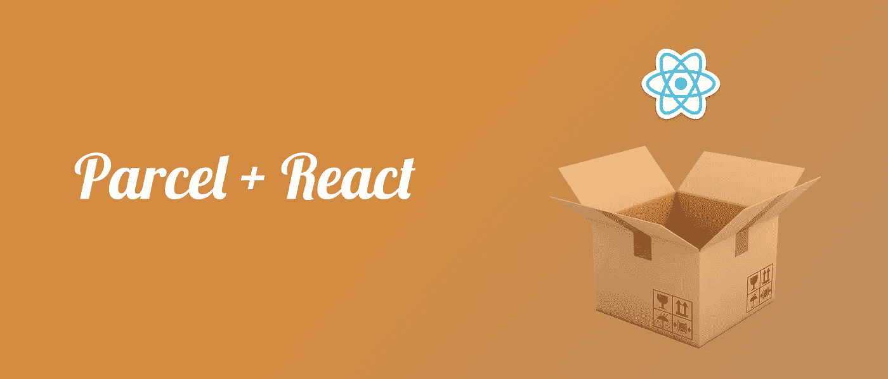
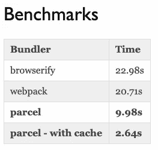
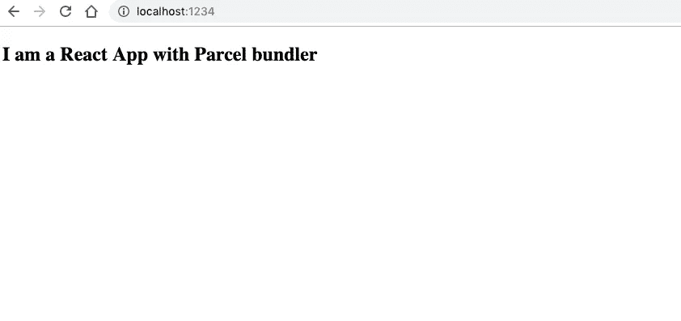

# 创建-反应-应用:包裹的更简单方式

> 原文：<https://javascript.plainenglish.io/create-react-app-the-easier-way-with-parcel-22a44d62c187?source=collection_archive---------1----------------------->



自从我开始在 React 上工作以来，我一直使用 Webpack 和 go swear..只有 Webpack，因为我喜欢它提供我们作为开发人员运行项目所需的所有东西的方式，从项目捆绑器到构建文件和构建任务。

但是最近我碰到了另一个叫做 Parcel 的构建工具，它有下面的基准:



所以为了测试它的速度和更小的包大小，我创建了一个简单的 react 应用程序，如下所示。请耐心等我 5 分钟……

# 安装

像往常一样，使用你最喜欢的包管理器全球下载安装**包**。

与 [npm](https://www.npmjs.com/) :

```
npm install -g parcel-bundler
```

或者用[纱](https://yarnpkg.com/):

```
yarn global add parcel-bundler
```

一旦完成，您应该在终端路径中有可用的 **parcel** 命令。

# 属国

然后，我们将 **npm init** 项目(继续按 *enter* 接受默认值):

```
npm init
```

或者，如果你很懒，你可以按照 [Darren](https://medium.com/@darrentorpey) 在[评论](https://medium.com/@darrentorpey/i-encountered-the-glorious-simplicity-of-parcel-setup-for-a-non-react-but-previously-webpack-based-e232a91cb9f1)中的建议，自动接受所有默认设置:

```
npm init -y
```

并安装依赖项:

```
npm install --save react react-domoryarn add react react-dom
```

您还可以添加 parcel(作为 devDependency):

```
npm install --save-dev parcel-bundleroryarn add -D parcel-bundler
```

我们现在准备创建我们的 react 文件！

# index.html

创建一个名为**index.html**的文件:

```
<!DOCTYPE html>
<html lang="en">
<head>
    <title>React App</title>
</head>
<body>
    <div id="root"></div>
    <script src="index.js"></script>
</body>
</html>
```

# 索引. js

创建一个名为 **index.js** 的文件:

```
import React from "react";
import ReactDOM from "react-dom";
import App from "./App";ReactDOM.render(<App />, document.getElementById("root"));
```

# App.js

创建一个名为 **App.js** 的文件:

```
import React, { Component } from "react";class App extends Component {
    render() {
        return <div>Hello from React!</div>;
    }
}export default App;
```

# 启动脚本

然后，您可以向您的 **package.json** 添加一个新的**脚本**命令，以便启动 dev 服务器:

```
"scripts": {
    "start": "parcel index.html"
},
```

就是这样！

现在 r *un*

```
npm run startoryarn start
```



server running with parcel web app builder

代码低但很神奇。它会处理运行项目所需的所有依赖项，并且在第一次启动时会有一点延迟，在第一次启动时，它会缓存所需的资产，从下一次开始，它会以极快的速度重新加载。

它可以完成小型项目的工作，在这些项目中，您需要开始使用您的应用程序，而在大型复杂项目中检查它仍处于早期阶段。

请大家自己试试看，并在下面留下评论，这样我也可以知道你们是怎么想的。

感谢阅读！如果您有任何问题，请随时联系 rajrock38@gmail.com，通过 [LinkedIn](https://www.linkedin.com/in/rajdeepcoder/) 与我联系，或者通过 [Medium](https://medium.com/@rajrock38) 和 [Twitter](https://twitter.com/rajrock38) 关注我。

如果你觉得这篇文章很有帮助，给它一些掌声会很有意义👏并分享出来帮别人找！并欢迎在下方发表评论。