# 用 Node 和 Express.js 创建 CRUD Rest API

> 原文：<https://javascript.plainenglish.io/create-rest-api-web-services-using-node-js-and-express-js-with-crud-operations-ff790d6ae030?source=collection_archive---------0----------------------->

为了在 Node.js 中构建 API，我们将使用 Express.js 框架。也可以使用任何其他框架，但 Express.js 在使用 Node 时非常流行。

[](https://medium.com/codechintan/everything-you-need-to-know-about-angular-framework-typescript-10049b858ae0) [## 关于 Angular framework/TypeScript 你需要知道的一切。

### 完整的角度系列-什么是角度/类型脚本？|为什么我们需要有棱角？|使用 Angular 的好处？|…

medium.com](https://medium.com/codechintan/everything-you-need-to-know-about-angular-framework-typescript-10049b858ae0) 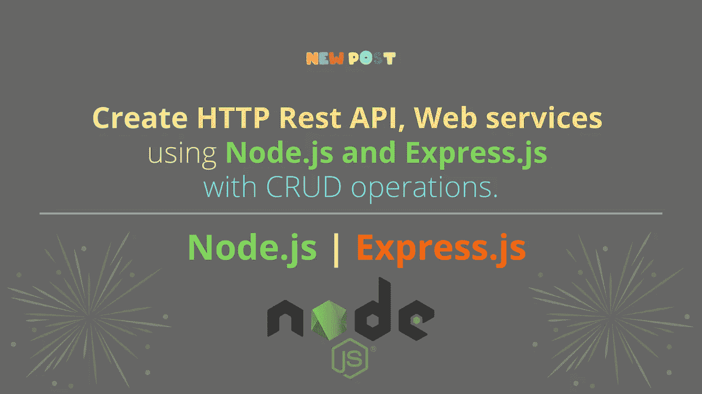

[下载源代码:**克隆 GitHub 库👆**](https://github.com/AnkitMaheshwariIn/Create-HTTP-Rest-API-Web-services-using-Node.js-and-Express.js-with-CRUD-operations) **。**

# 本文涵盖的内容:

**#1)** 安装。
**#2)** 用 Express.js
**#3)** 创建新的 [Node.js](https://nodejs.org/) 项目创建并运行 API 端点。
**#4)** CRUD 操作和 HTTP 方法。
**#5)** 用[邮递员](https://www.getpostman.com/)测试 API。
**【6)**修复 No '访问控制允许来源'

# #1)需要安装

*   [Node.js](https://nodejs.org/) 或 [NPM](https://nodejs.org/) (节点包管理器)
*   [VS 代码](https://code.visualstudio.com/download)(可选)——一个代码编辑器。

要检查 Node.js 是否已经安装在您的计算机上，请打开您的终端或 CMD 并运行`node -v`命令。如果你看到你的 Node.js 版本意味着它已经安装。

否则就去这些链接安装:
→ [点击这里下载安装 Node.js](https://nodejs.org/) (应该选择 LTS 版)。
→ [点击此处下载 VS 代码](https://code.visualstudio.com/download)

# 快速应用程序生成器:

快速创建应用程序框架。您可以使用这个应用程序生成器工具(` express-generator `)。应用程序生成器使用`npx`命令(在 Node.js 更新版本中可用)。
→ [点击此处了解更多 Express application generator。](https://expressjs.com/en/starter/generator.html)

在这篇文章中，我们不会使用`express-generator`，相反，我们将自己创建一切，以避免从生成器生成额外的文件，并深入了解。

# #2)创建新项目(使用 Node.js 和 Express.js)

创建一个新文件夹(在您想要保存项目的位置)。
命名文件夹:`node-ex-api`

在`node-ex-api`文件夹中创建两个文件:
→ `package.json`文件。
→ `server.js`档。

用下面的代码打开并更新你的`node-ex-api/package.json`文件:

```
{
    "name": "node-ex-api",
    "version": "1.0.0",
    "scripts": {
        "start": "node server.js"
    },
    "**dependencies**": {
        "express": "^4.17.1"
    }
}
```

用下面的代码打开并更新您的`node-ex-api/server.js`文件:

```
const http = require('http');
const express = require('express');

const app = express();
app.use(express.json());

// default URL to API
app.use('/', function(req, res) {
    res.send('node-ex-api works :-)');
});

const server = http.createServer(app);
const port = 3000;
server.listen(port);

console.debug('Server listening on port ' + port);
```

创建以上两个文件后，在`"node-ex-api"`文件夹中打开您的终端并运行该命令:

```
npm install
```

该命令将安装`"package.json"`文件中定义的依赖项。
(可以用 VS Code——一个代码编辑器↓)。

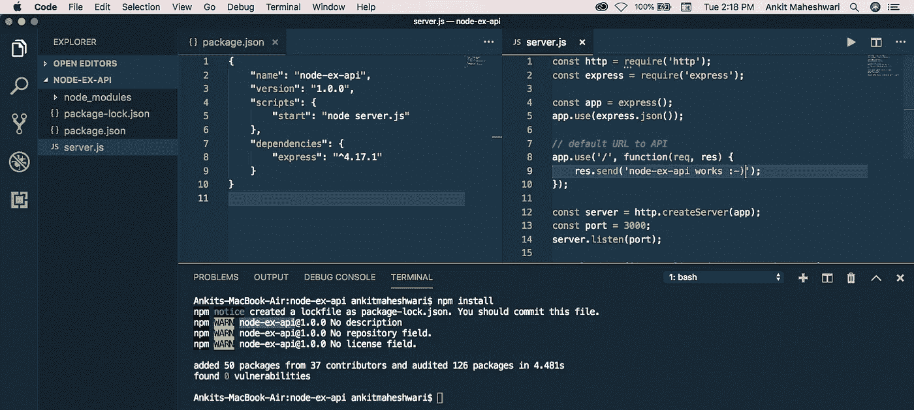

安装完依赖项后，这将在`"node-ex-api"`文件夹的根目录下创建`"node_modules"`文件夹。

# 运行项目

我们刚刚创建了 Node-Express 项目😍让我们启动一个服务器。
要启动服务器，请运行以下命令:

```
npm start
```

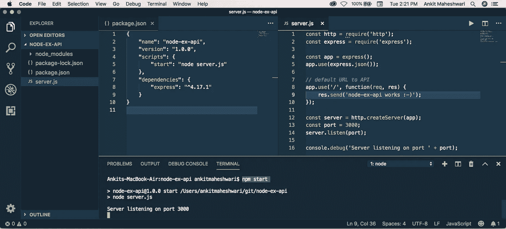

要测试这个 API——打开您的 web 浏览器并输入这个 URL → [localhost:3000](http://localhost:3000/)

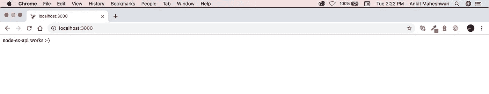

The [localhost:3000](http://localhost:3000/) is calling default Server Path. Which returns simple string “node-ex-api works :-)”

# #3)创建 API 端点

我们的默认端点返回字符串——我们在上面看到了。现在我们将创建另一个 API 端点，这是另一个返回一些有用数据的 URL。

在继续之前，让我们再做一些练习:
→在项目根目录下创建一个名为`"routes"`的文件夹。
→然后在这个`"routes"`文件夹中创建一个名为`"items.js"`的文件。

接下来，用下面的代码打开并更新您的`node-ex-api/routes/items.js`文件:

```
// import required essentials
const express = require('express');
// create new router
const router = express.Router();

// create a JSON data array
let data = [
    { id: 1, title: 'Create a project',  order: 1, completed: true, createdOn: new Date() },
    { id: 2, title: 'Take a cofféé',     order: 2, completed: true, createdOn: new Date() },
    { id: 3, title: 'Write new article', order: 3, completed: true, createdOn: new Date() },
    { id: 4, title: 'Walk toward home', order: 4, completed: false, createdOn: new Date() },
    { id: 5, title: 'Have some dinner', order: 5, completed: false, createdOn: new Date() },
];

// this end-point of an API returns JSON data array
router.get('/', function (req, res) {
    res.status(200).json(data);
});

// this end-point returns an object from a data array find by id
// we get `id` from URL end-points
router.get('/:id', function (req, res) {
    // find an object from `data` array match by `id`
    let found = data.find(function (item) {
        return item.id === parseInt(req.params.id);
    });
    // if object found return an object else return 404 not-found
    if (found) {
        res.status(200).json(found);
    } else {
        res.sendStatus(404);
    }
});

module.exports = router;
```

🌞见下文↓↓

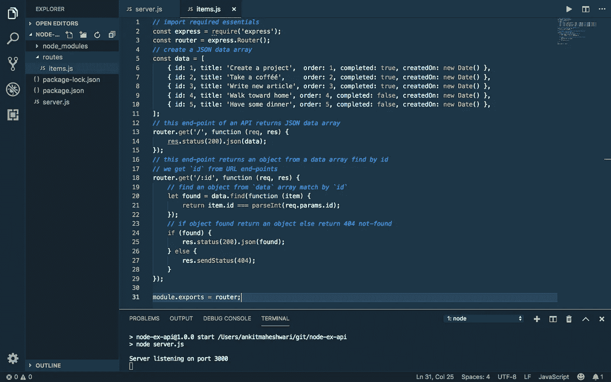

# 注册 API 端点

让我们在`"server.js"`文件中注册它，以便使用新的端点。

不要忘记安装 CORS 。
在`"node-ex-api"`文件夹中打开您的终端并运行以下命令:

```
npm install cors
```

现在，打开你的`node-ex-api/server.js`文件，用下面的代码修改:

```
// import required essentials
const http = require('http');
const express = require('express');
var cors = require('cors');// import `items` from `routes` folder 
const itemsRouter = require('./routes/items');

// create new app
const app = express();
app.use(express.json());
// use it before all route definitions
// allowing below URL to access these APIs end-points
// you can replace this URL(http://localhost:8100) with your
// application URL from where you are calling these APIs
app.use(cors({origin: 'http://localhost:8100'}));

/* this '/items' URL will have two end-points:
→ localhost:3000/items/ (this returns array of objects)
→ localhost:3000/items/:id (this returns single object)
*/
app.use('/items', itemsRouter);

// default URL to API
app.use('/', function(req, res) {
    res.send('node-ex-api works :-)');
});

const server = http.createServer(app);
const port = 3000;
server.listen(port);
console.debug('Server listening on port ' + port);
```

🌞见下文↓↓

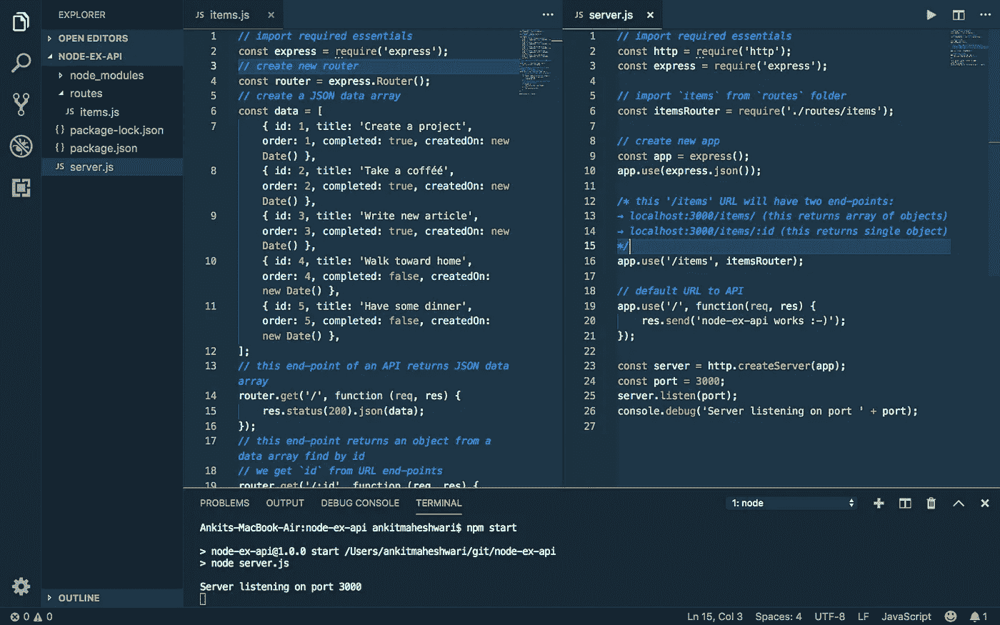

The `"items.js"` and `"server.js"` file will look like this ↑

# 运行 API 端点

现在，如果您的服务器没有运行，运行`npm start`。这次我们有三个端点:
→ [localhost:3000](http://localhost:3000/) (默认)
→[localhost:3000/items](http://localhost:3000/items)(返回所有对象)
→[localhost:3000/items/1](http://localhost:3000/items/1)(返回 id=1 的单个对象)

🌞见下面的浏览器↓

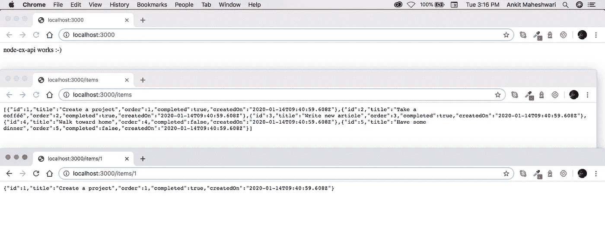

Click image 👆 If you can’t see this.

# #4) CRUD 操作和 HTTP 方法。

然而我们有一个条目列表( [localhost:3000/items](http://localhost:3000/items) )。下一个任务是管理这个列表。为此，我们需要让 CRUD 操作**C**create、 **R** ead、 **U** pdate 和**D**delete 覆盖项目列表。

对于**C**create，我们将创建新的端点`router.post('/', .......)`
→[localhost:3000/items](http://localhost:3000/items)(带有 post 请求)

对于 **R** ead，我们已经有两个端点:
→[localhost:3000/items](http://localhost:3000/items)(返回所有对象)
→[localhost:3000/items/1](http://localhost:3000/items/1)(返回 id=1 的单个对象)

对于 **U** pdate，我们将创建新的端点`router.put('/', .......)`
→[localhost:3000/items](http://localhost:3000/items)(带有上传请求)

对于**D**delete，我们将创建新的端点`router.delete('/', .......)`
→[localhost:3000/items](http://localhost:3000/items)(带有删除请求)

现在，用下面的代码打开并更新你的`node-ex-api/routes/items.js`文件:(HTTP methods ↓↓)

# 关于以上↑代码的重要说明:

→我们处理名为`data`的 JSON 对象的静态数组。
→所有的 HTTP 方法 GET、POST、PUT、DELETE 都只是在操纵这个 JSON 数组。
**→** 随意使用任何数据库，而不是使用本地静态数组。可以在这些 HTTP 方法中编写数据库代码来执行 GET、POST、PUT 和 DELETE 等操作。

# #5)用 [Postman](https://www.getpostman.com/) 测试 API。

我们已经在我们的 web 浏览器中测试了我们的 API 的 GET 方法(check #4 ),并看到了响应。但是我们不能在 web 浏览器中测试 POST、PUT 和 DELETE http 方法。为了测试这些方法，我们使用 [Postman](https://www.getpostman.com/) 或者您可以使用另一个 http 实用程序来调用 API。

这里我们用[邮递员](https://www.getpostman.com/)。所以在开始[之前，点击这里并安装 Postman。](https://www.getpostman.com/downloads)

现在，如果您的服务器没有运行，运行`npm start`。

在 [Postman](https://www.getpostman.com/) 安装完成后，跳过开始窗口(如果有)，然后使用 Google 或电子邮件/密码登录(无论你喜欢哪个)，最后你一定会看到这个屏幕:

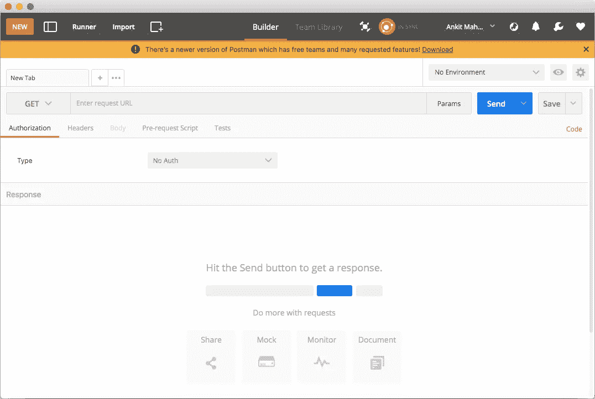

A place where we call HTTP request.

现在，确保您的服务器正在运行(通过`npm start`)并且服务器监听端口 3000。让我们从 HTTP GET 请求开始测试。

# #5.1) HTTP GET 请求(获取数据)

在你看到“输入请求 URL”的 [Postman](https://www.getpostman.com/) 输入框中输入获取请求 URL([localhost:3000/items](http://localhost:3000/items))。


输入网址后点击“发送”按钮:[localhost:3000/items](http://localhost:3000/items)
你一定看到这个画面↓

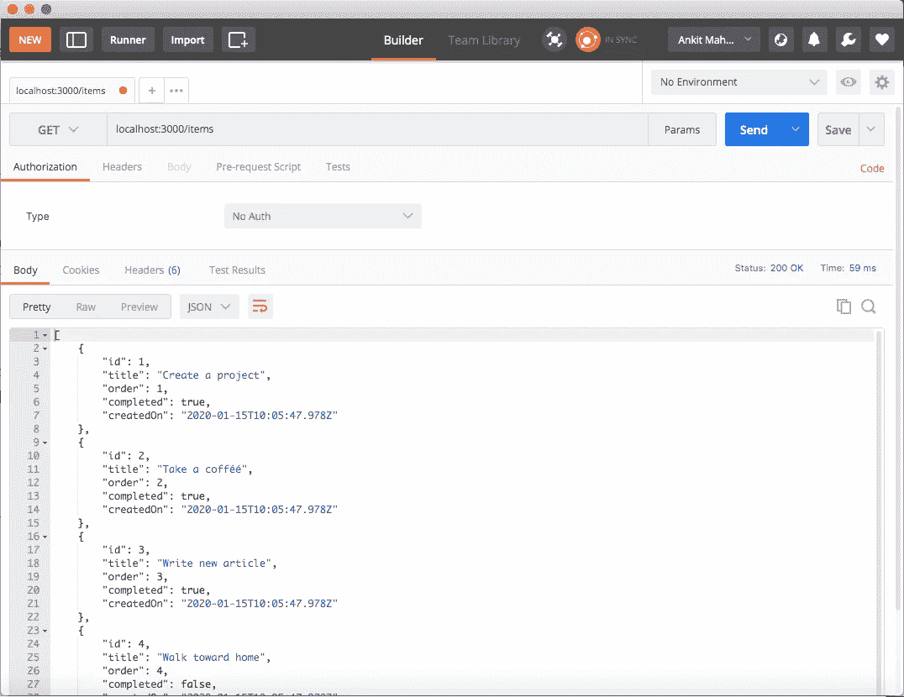

类似地，尝试单个对象 Get 请求。输入 URL:[localhost:3000/items/1](http://localhost:3000/items/1)
后点击“发送”按钮，返回 id=1 的单个对象。你一定要看到这个画面↓

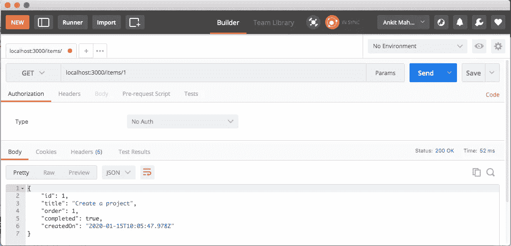

The JSON output “object” of id=”1"

# #5.2) HTTP POST 请求(添加数据)

**→** 在[邮差](https://www.getpostman.com/)的输入框中输入帖子请求网址( [localhost:3000/items](http://localhost:3000/items) )，你会看到“输入请求网址”。


**→** 以及“不要忘记通过单击您输入请求 URL 的输入框的开始处的箭头，将 HTTP 动词更改为 POST。”

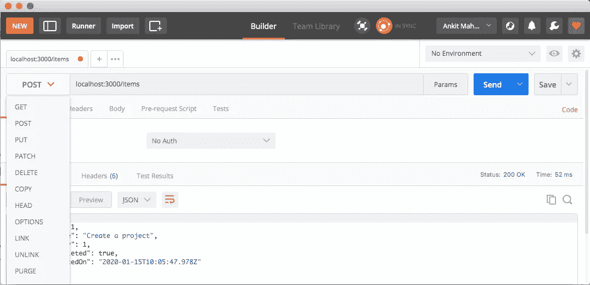

Select “POST” from select box to Send “POST” request with [Postman](https://www.getpostman.com/)

发送帖子请求前:
*点击“正文”标签(1)。
*从单选框(2)中选择“raw”。
*在我们发送 JSON 数据时，从选择框(3)中选择 JSON。
*将请求数据添加到请求的“正文”中(4)。
见下文↓

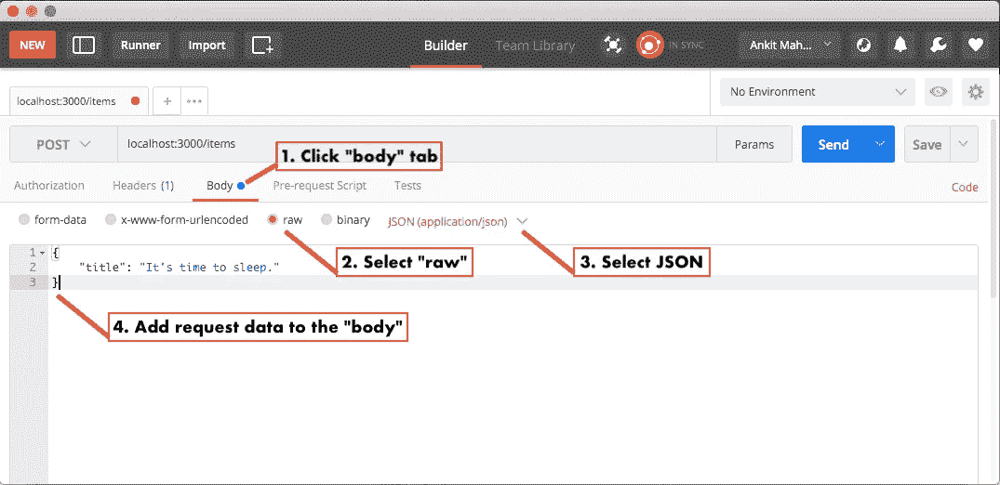

要发送 POST 请求，请在上述四个序列之后点击“发送”按钮。
你一定会看到这个屏幕↓在这个屏幕的底部，你会在“Body”中看到新物品的详细信息。

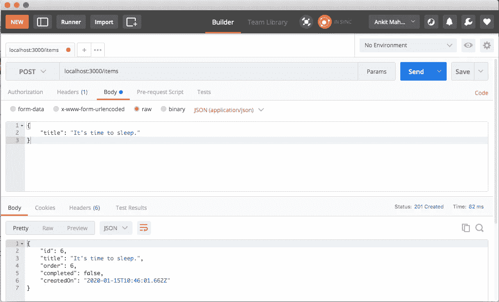

New item has been added to “data” array.

要查看最新项目(重复 5.1)，发送一个 get 请求 URL 到`localhost:3000/items`地址。您必须在列表末尾看到新创建的项目。

# #5.3) HTTP PUT 请求(更新数据)

发送 PUT 请求与发送 POST 请求非常相似。最重要的区别是请求 url，它应该指向特定的项，就像这个`localhost:3000/items/1`。

**→** 在 [Postman](https://www.getpostman.com/) 的输入框中输入帖子请求 URL([localhost:3000/items/1](http://localhost:3000/items/1))，你会看到“输入请求 URL”。


**→** 以及“不要忘记通过单击您输入请求 URL 的输入框开始处的箭头来更改 HTTP 动词 PUT。”

发送上传请求前:(一切同“发布”请求)
*点击“正文”标签(1)。
*从单选框(2)中选择“raw”。
*从选择框(3)中选择 JSON——因为我们正在发送 JSON 数据。
*将请求数据添加到请求的“正文”中(4)。

但是这次在请求体中发送所有需要的数据。
PUT 请求主体中的 JSON 请求数据将是:

```
{
    "title": "Create a NEW project",
    "order": 1,
    "completed": false
}
```

要发送上传请求，请在上述四个序列后点击“发送”按钮。
您必须看到这个屏幕↓在底部，我们看不到任何带有 HTTP 响应代码“204 No Content”的“Body”内容。

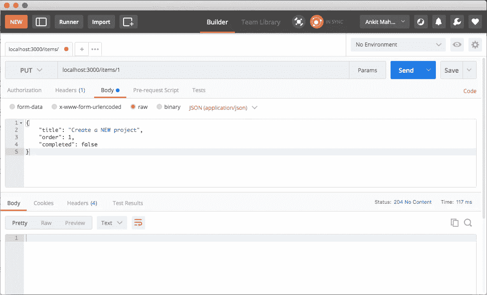

“您可以通过发送 get 请求来检查您更新的项目”。要查看最新项目(重复 5.1)，发送一个获取请求 URL 到`localhost:3000/items`地址。您必须看到带有更新信息的更新项目。

# #5.4) HTTP 删除请求(删除数据)

如果你正确地遵循“发布”和“上传”,就很容易“删除”。
**→** 要发送删除请求，请将请求 url 更改为指定的项目 id，如下所示`localhost:3000/items/3`
**→** ，并选择 DELETE 作为 http 动词。
像这样↓


然后最后，点击“发送”按钮调用 http 删除请求。

在响应“Body”中看不到任何内容，但是可以看到状态为“204 No Content”的 HTTP 响应代码。

“您可以通过发送 get 请求来检查项目列表状态”。要查看最新项目(重复 5.1)，发送一个获取请求 URL 到`localhost:3000/items`地址。您不能在项目列表中看到已删除的项目。

# #6)修复 No“访问控制允许来源”

当从另一个应用程序调用这些 API 时，您可能会遇到以下错误:
**No ' Access-Control-Allow-Origin '**。修复此错误需要一些小的更改。

不要忘记安装 [CORS](https://github.com/expressjs/cors) 。
在`"node-ex-api"`文件夹中打开您的终端并运行以下命令:

```
npm install cors
```

接下来，打开您的`node-ex-api/server.js`文件并添加以下代码:

```
// import required essentials
...
var cors = require('cors');...
// create new app
const app = express();
app.use(express.json());
// use it before all route definitions
// allowing below URL to access these APIs end-points
// you can replace this URL(http://localhost:8100) with your
// application URL from where you are calling these APIs
app.use(cors({origin: 'http://localhost:8100'}));
```

# 然后

[学会调用这些 API 端点👆](https://medium.com/@AnkitMaheshwariIn/call-rest-api-web-services-using-angular-and-rxjs-4f00e833a65)。

[](https://medium.com/@AnkitMaheshwariIn/call-rest-api-web-services-using-angular-and-rxjs-4f00e833a65) [## 调用 Rest API，使用 Angular 和 RxJS 的 Web 服务。

### 调用并缓存从 HttpClient 返回的数据。缓存数据将加速你的网络/应用程序。让我们了解如何..！

medium.com](https://medium.com/@AnkitMaheshwariIn/call-rest-api-web-services-using-angular-and-rxjs-4f00e833a65) 

# 结论

我们已经看到所有的 HTTP 请求方法(GET、POST、PUT 和 DELETE)都在工作。使用[邮差](https://www.getpostman.com/)进行 CRUD 操作。

# 搞定了。🤩使用 Node.js 和 Express.js |通过 CRUD 操作创建 HTTP/Rest API/Web 服务就是这么简单。

再见👋👋

> 欢迎在评论框中发表评论…如果我错过了什么，或者什么是不正确的，或者什么对你不起作用:)
> 继续关注更多文章。
> 
> 更多文章敬请关注:
> [https://medium.com/@AnkitMaheshwariIn](https://medium.com/@AnkitMaheshwariIn)

如果你不介意给它一些掌声👏 👏既然有帮助，我会非常感谢:)帮助别人找到这篇文章，所以它可以帮助他们！

永远鼓掌…


*原载于 2020 年 1 月 16 日*[*https://www.codewithchintan.com*](https://www.codewithchintan.com/create-rest-api-web-services-using-node-js-and-express-js/)*。*

# 了解更多信息

[](https://www.codewithchintan.com/crud-in-firebase-with-firestore/) [## 如何用 Firestore 在 Firebase 中进行 CRUD 与查询操作？(角形/离子形/网状)

### 额外收获:你将学会创建角度模型、服务和组件]。CRUD -创建、读取、更新、删除操作在…

www.codewithchintan.com](https://www.codewithchintan.com/crud-in-firebase-with-firestore/) [](https://www.codewithchintan.com/javascript-callbacks-promises-async-await/) [## 使用' Promises' | Async/Await |代替 JavaScript 回调。

### 我们应该使用允许我们访问异步方法并将值返回给同步方法的承诺。还有…

www.codewithchintan.com](https://www.codewithchintan.com/javascript-callbacks-promises-async-await/) [](https://www.codewithchintan.com/two-way-data-binding-in-angular/) [## Angular 中双向数据绑定的背后是什么？

### 数据绑定允许组件和 DOM (HTML 模板)之间的通信。数据绑定有四种形式…

www.codewithchintan.com](https://www.codewithchintan.com/two-way-data-binding-in-angular/) [](https://www.codewithchintan.com/angular-async-pipe/) [## Angular:使用异步管道来管理可观察的订阅并防止内存泄漏。

### Async-Pipe 是一个 Angular 内置工具，用于管理可观察订阅。我们可以轻松简化的功能…

www.codewithchintan.com](https://www.codewithchintan.com/angular-async-pipe/) [](https://www.codewithchintan.com/angular-route-guards/) [## 使用角形护线板保护角形页面。允许/拒绝/重定向。

### 路由保护是 Angular 路由器的一个重要功能，它允许或拒绝用户访问路由页面…

www.codewithchintan.com](https://www.codewithchintan.com/angular-route-guards/) [](https://www.codewithchintan.com/angular-routing/) [## 角度组件的布线|角度布线。

### 路由意味着从一个页面移动到另一个页面。角度使用户能够从一个视图导航到下一个视图…

www.codewithchintan.com](https://www.codewithchintan.com/angular-routing/)