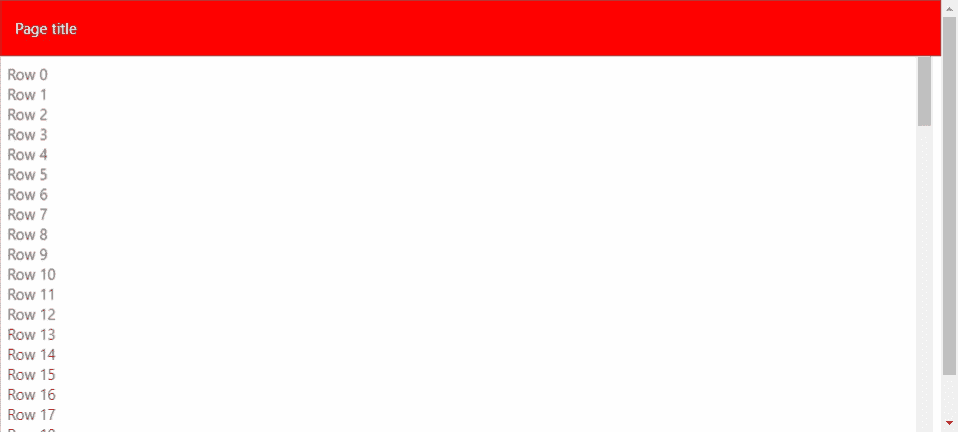

# 如何在 Svelte 中构建一个可重用的布局组件

> 原文：<https://javascript.plainenglish.io/create-reusable-svelte-components-for-your-page-layouts-9593b1a60b08?source=collection_archive---------4----------------------->



## 苗条的

## 在几行代码中，您可以拥有一个将在页面中实际使用的组件

在本教程中，我们将实现一个苗条的组件，作为我们项目的页面结构。

当我们的页面有相似的布局，并且我们想对内容滚动做出反应时，它就派上用场了。

我们将在此构建的结构由以下部分组成:

*   **主要内容**:可滚动
*   **页眉**:固定在页面顶部
*   **页脚** : 固定在页面底部

显然，我们可以根据自己的需要调整组件。如果您只想要完整的组件代码，可以跳到最后。

# 添加页眉和页脚

我们开始添加主要内容布局。这是由一个“主”元素和一个插槽组成的。

```
<main bind:this={main} class:header class:footer>
  <**slot**/>
</main>
```

接下来，我们将添加容纳页眉和页脚的容器:我们保留了内容的主槽，所以我们现在需要添加两个命名槽(“页眉”和“页脚”)。

```
<div class="slotHeader">
  <**slot** name="header"/>
</div><div class="slotFooter">
  <**slot** name="footer"/>
</div>
```

在“script”标签中，我们现在声明:

*   “主”变量，它将被绑定到“主”元素
*   必要的属性“页眉”和“页脚”，指示它们是否存在
*   和他们的身高，默认为 64

```
<script>
  **let** main; **export let** header = false;
  **export let** headerHeight = 64; **export let** footer = false;
  **export let** footerHeight = 64;
</script>
```

我们还对属性变化做出反应，为高度设置正确的 CSS 变量。

```
**$:** if(main) {
  main.style.setProperty('--header-height', headerHeight + 'px');
  main.style.setProperty('--footer-height', footerHeight + 'px');
}
```

现在，在“样式”标签中，我们根据属性填充内容，并固定页面中的页眉和页脚。

```
<style>
  main {
    height: 100%;
    overflow-y: auto;
  } main.header {
    padding-top: var(--header-height, 0px);
  } main.footer {
    padding-bottom: var(--footer-height, 0px);
  } .slotHeader {
    position: fixed;
    top: 0px;
    left: 0px;
    width: 100%;
  } .slotFooter {
    position: fixed;
    bottom: 0px;
    left: 0px;
    width: 100%;
  }
</style>
```

**完整代码**

```
<main bind:this={main} class:header class:footer>
  <**slot**/>
</main><div class="slotHeader">
  <**slot** name="header"/>
</div><div class="slotFooter">
  <**slot** name="footer"/>
</div><script>
  **let** main; **export let** header = false;
  **export let** headerHeight = 64; **export let** footer = false;
  **export let** footerHeight = 64; **$:** if(main) {
    main.style.setProperty('--header-height', headerHeight + 'px');
    main.style.setProperty('--footer-height', footerHeight + 'px');
  }
</script><style>
  main {
    height: 100%;
    overflow-y: auto;
  } main.header {
    padding-top: var(--header-height, 0px);
  } main.footer {
    padding-bottom: var(--footer-height, 0px);
  } .slotHeader {
    position: fixed;
    top: 0px;
    left: 0px;
    width: 100%;
  } .slotFooter {
    position: fixed;
    bottom: 0px;
    left: 0px;
    width: 100%;
  }
</style>
```

# 听卷轴

假设我们希望当用户滚动内容时隐藏和显示标题，就像在 [Material Design 的应用程序栏](https://kstatic.googleusercontent.com/files/60e734664455ce42d79267bdc7f7dd20239ea2086102e302e0d8c3e255b639faddbbbeaf75ceb9ac3fb2f1f14451f937427eabaf6aa028bcd4a3bd80504e68b2)中一样。

为了实现这一点，我们必须监听主内容滚动事件，并计算标题是否以及何时隐藏。这同样适用于页脚。

在布局中，编辑“主”元素。

```
<main bind:this={main} class:header class:footer **on:scroll={Scroll}**>
```

以及页眉和页脚容器。

```
<div class="slotHeader" **class:hide={hideHeader && scroller.hide}**>
  <slot name="header"/>
</div><div class="slotFooter" **class:hide={hideFooter && scroller.hide}**>
  <slot name="footer"/>
</div>
```

在“script”标签中，我们必须声明几个新变量:

*   滚动数据
*   阈值，在此之后隐藏页眉和页脚
*   以及页眉和页脚是否可以在滚动时隐藏

```
**let** scroller = {
  scroll: 0,
  direction: true, // true: scroll down; false: scroll up
  delta: 0,
  hide: false,
  initialScroll: 0
};**export let** threshold = 64;
**export let** hideHeader = false;
**export let** hideFooter = false;
```

然后，我们添加用于计算当前值的“Scroll”函数。

```
**const** Scroll = *e* => {
  **const** scroll = e.target.scrollTop;

  scroller = {
    scroll,
    direction: scroll > scroller.scroll,
    delta: scroll - scroller.initialScroll,
    hide: scroll > threshold && scroller.hide
      ? scroll - scroller.initialScroll > -threshold
      : scroll - scroller.initialScroll > threshold,
    initialScroll: (scroll > scroller.scroll) != scroller.direction
      ? scroll
      : scroller.initialScroll
  };
};
```

最后，我们编辑“style”标签来激活隐藏的页眉和页脚。

```
.slotHeader {
  // previous code
  **transition: all .2s ease-in-out;**
}**.slotHeader.hide {
  transform: translateY(-100%);
}**.slotFooter {
  // previous code
  **transition: all .2s ease-in-out;** }**.slotFooter.hide {
  transform: translateY(100%);
}**
```

# 使用父级中的滚动条

将 scroller 对象暴露给父对象，我们可以使用它在滚动时给 header 元素添加阴影，或者使其他页面元素显示或隐藏。

我们可以通过三种方式做到这一点，我建议你全部实施。

## 导出滚动条属性

```
**export let** scroller = {...};
```

这样你可以绑定:scroller 在你的父节点上。

## 老虎机道具

```
<main bind:this={main} class:header class:footer on:scroll={Scroll}>
  <slot **{scroller}**/>
</main>
```

这样，您可以让:scroller 进入您的父组件，并在布局组件中使用它。

## 事件调度

```
**import** {createEventDispatcher} **from** "svelte";**const** dispatch = createEventDispatcher();**const** Scroll = *e* => {
  // previous code
  **dispatch('scroller', scroller);**
};
```

通过这种方式，您可以将 on:scroller 事件添加到 parent 中，并可能设置为一个变量。

# 完整的代码和用法示例

[](https://svelte.dev/repl/887cda7ab914489e87c45b997b1345cd) [## 布局组件 REPL

### 控制论增强的网络应用

苗条的人](https://svelte.dev/repl/887cda7ab914489e87c45b997b1345cd) 

# 结论

如果你有任何问题或建议，请随意写评论。

谢谢大家，关注我更多文章！

以下是我的一些其他文章:

[](https://medium.com/javascript-in-plain-english/how-to-create-a-router-in-svelte-ce66c10275fe) [## 如何创建一个苗条的路由器

### 我们可以避免不必要的包装

medium.com](https://medium.com/javascript-in-plain-english/how-to-create-a-router-in-svelte-ce66c10275fe) [](https://medium.com/javascript-in-plain-english/diy-multilanguage-in-javascript-project-65f8aa91a506) [## JavaScript 项目中的 DIY 多语言

### 让我们用这个简单的方法来国际化我们的 webapp

medium.com](https://medium.com/javascript-in-plain-english/diy-multilanguage-in-javascript-project-65f8aa91a506)