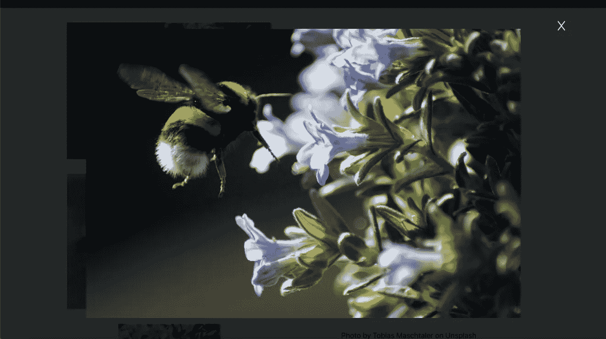
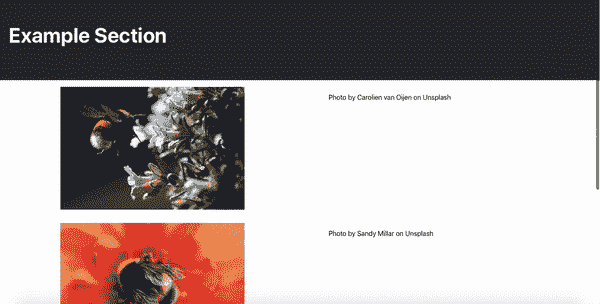
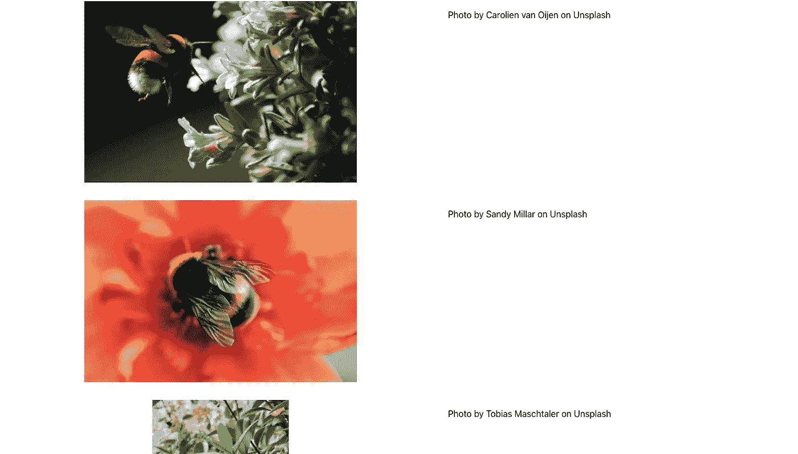
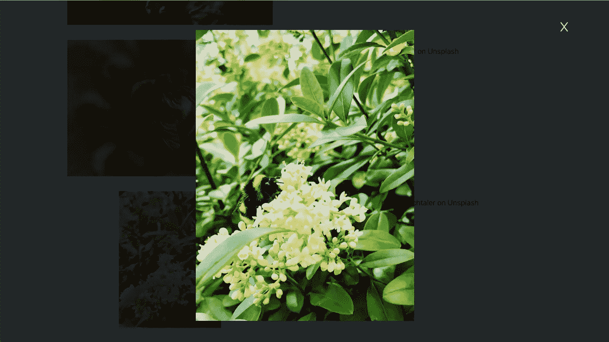

# 用 JavaScript 或 React 创建可伸缩的优雅模态

> 原文：<https://javascript.plainenglish.io/create-scalable-elegant-modals-in-javascript-or-react-b902a7d26b6b?source=collection_archive---------5----------------------->

在任何项目中，模态都是提升用户体验的一种非常好的简单方法。因此，我想介绍如何在 JavaScript 和 React 中创建这个小而有用的特性。

我最喜欢的实现模态的方法之一是当用户点击时产生一个更大的图像视图。考虑到这一点，我决定用这篇文章来解释如何将一系列图像加载到页面上，然后将这个模态特性应用到每个图像上。

正如我上面提到的，我将在本文中涉及 JavaScript 和 React，但是两者的 CSS 是完全一样的。

所以，这是我们将要建造的:

我们所拥有的只是一个带有标题的页面，然后是三张带有描述的图片。每个图像都可以被点击产生一个模态，这个模态有一个图像的放大版本和一个“X”按钮来关闭它。事不宜迟，让我们开始吧！

如果你对设置不感兴趣，想直接跳到模态，可以随意向下滚动到最后的 CSS 部分。否则，请继续阅读！

# JavaScript 版本

## **获取设置**

要创建这个页面，我们需要编写我们的基本 HTML，使用 JavaScript 定义一个包含我们将要呈现的信息的对象数组，然后编写一个函数，首先创建我们将要映射的 HTML 结构，然后将我们的数组映射到那个结构上。

因为我们要采用面向 JavaScript 的方法，所以开始的 HTML 将会很小——无论如何，它更具可伸缩性！

Note that my use of the div with class “App” is just me recreating the setup given by create-react-app

从这里，我们可以打开我们的 JavaScript 文件，定义我们的`main`元素，并创建`ul`元素和一个 images 数组。这个数组将保存包含所有信息的对象，我们将在 HTML 中映射这些信息。

The src needs to contain the location of the images in your project files — I have mine in an Assets folder

第 10 行调用的`renderImages`函数将接受我们刚刚定义的`ul`和`images`变量，然后调用 images 数组上的 map 函数。在这个映射中，创建了我们的 HTML 结构，根据需要分配了类，并将该信息附加到`ul`元素中。

完成后，我们的基本页面就创建好了，我们可以进入模态页面了。

## 模态

这个模型实际上是一个 HTML 块，当用户与图像交互时，它被添加到页面中，并被设计为位于页面其余部分的顶部。为此，我们需要:

1.  向`ul`元素添加一个“click”事件监听器，用于识别哪个图像被点击
2.  将该信息传递给模态 HTML 结构
3.  调用一个负责关闭模态的附加函数

根据我们到目前为止创建的页面结构，JavaScript 代码看起来可能是这样的:

第一行到第六行处理前两个任务。第 7 行将新标识的图像传递给 renderModal 函数，第 8 行调用名副其实的函数来处理关闭模态。

renderModal 函数和 renderImages 函数一样，接受被单击的图像对象，创建我们的 HTML 结构，根据需要分配类和 id，然后将该结构附加到主元素。

值得一提的是第 22 行，它创建了一个按钮，我们将用它来关闭我们的模态。按钮的 innerText 使用一个符号来设置，或者使用 [HTML 符号实体](https://www.w3schools.com/html/html_symbols.asp)。有很多，而且会很有用！这个看起来像一个“x ”,但更好。

使用 handleClose 按钮，关闭 JavaScript 中的模式只是简单地从 main 元素中移除它的 HTML 块。

这就是 HTML 和 JavaScript。剩下要做的就是造型了，但是首先，我要介绍一下这个设置的 React 版本。

# 反应版

## 获取设置

该设置与我们刚刚在普通 JavaScript 中所做的非常相似，但是我们将利用 React 的状态和组件驱动方法。我们这次要做的是保持图像数组的状态，创建页面的基本结构，利用一个单独的组件来呈现图像，然后将图像数组映射到该组件上。

I chose to convert my App.js component to a class component so that I could use state, though hooks would work fine too.

首先，我将初始状态值设置为 null，然后将它们加载到 ComponentDidMount 中。setImages 函数使用在组件顶部导入的名称代替 JavaScript 方法中的“src”属性，将 image 对象的数组加载到 state 中。

`renderImages`函数从 state 中获取 images 数组，并将其映射到 image 组件，该组件为每个图像和描述创建 HTML 结构，并传递适当的数据。

## 模态

为了在 React 中呈现模态，我们将对每个图像应用`handleClick`函数，并将单击的图像传递给`selectedImage`状态属性。这样做时，将在第 61 行调用`getSelectedImage`函数，将该图像呈现为模态图像。更新后的 App.js 组件如下所示:

Note that getSelectedImage is called on line 61

在继续之前，我应该指出，在 React 中输入“关闭”按钮的 HTML 符号需要与在 JavaScript 中不同。我们不得不写`&#x2613`，而不是写`'\u2613'`。

完成所有这些后，我们就可以编写 CSS 了！

# 半铸钢ˌ钢性铸铁(Cast Semi-Steel)

您可以随意设置页面的大部分样式，而不会影响模型本身。也就是说，下面是我用于页面主体的 CSS，以及代码的结果:

*Please note that I created this project in React first, and everything above the outer-container class is just CSS that I copied from that version’s starter CSS.

最后，我们将设计实际的模型

最后，这是模态真正成为我们想要的样子的地方。将`position`设置为 fixed 可以让模态外部 div 及其所有子元素位于页面的其余部分之上。将`height`和`width`设置为 100%，同时将`top`设置为 0，管理我们的 div 的确切大小和位置，以确保它覆盖整个页面。给背景颜色一点透明度可以让模态掩盖网站的其他部分，但不会让用户感觉好像他们被带到了一个新的页面。除此之外，其余元素的样式处理内部 div 和图像的居中和管理。

这样，您就有了一个易于实现的、可伸缩的、优雅的方法来处理警报，提供一个元素的更大视图，等等。

非常感谢您的阅读！请在下面的评论中分享你的反馈。

## **用简单英语写的 JavaScript 笔记**

我们已经推出了三种新的出版物！请关注我们的新出版物: [**AI in Plain English**](https://medium.com/ai-in-plain-english) ，[**UX in Plain English**](https://medium.com/ux-in-plain-english)，[**Python in Plain English**](https://medium.com/python-in-plain-english)**——谢谢，继续学习！**

**我们也一直有兴趣帮助推广高质量的内容。如果您有一篇文章想要提交给我们的任何出版物，请发送电子邮件至[**submissions @ plain English . io**](mailto:submissions@plainenglish.io)**，使用您的 Medium 用户名，我们会将您添加为作者。另外，请让我们知道您想加入哪个/哪些出版物。****