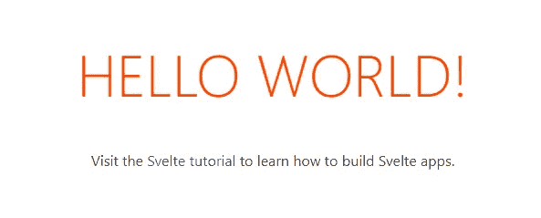
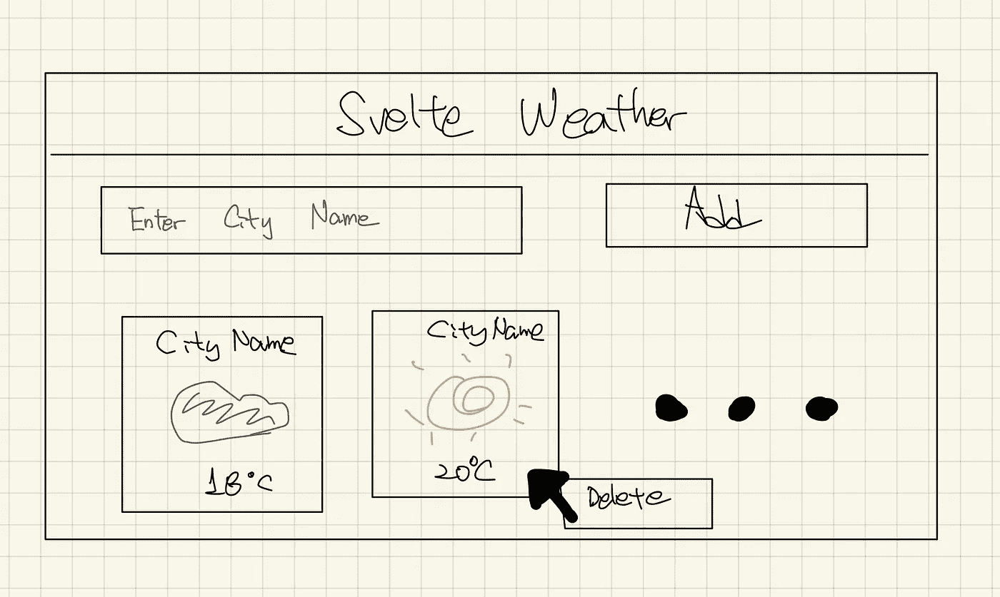
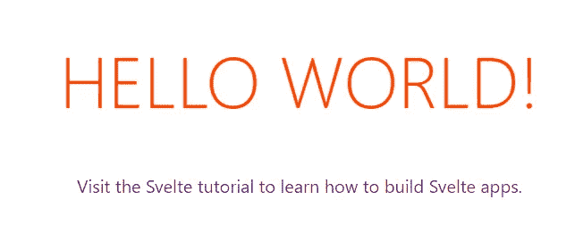
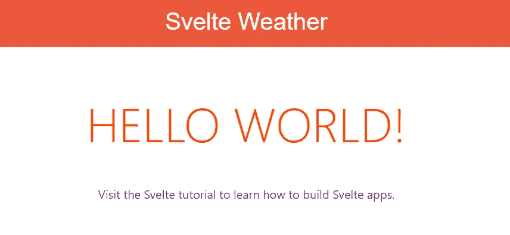
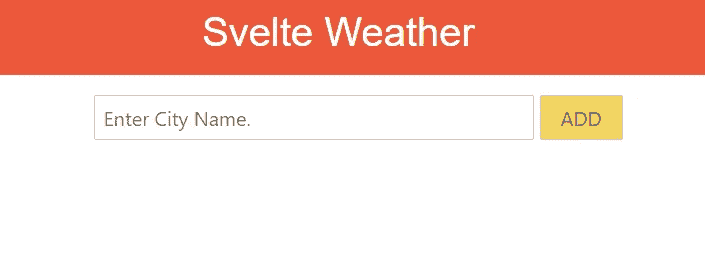
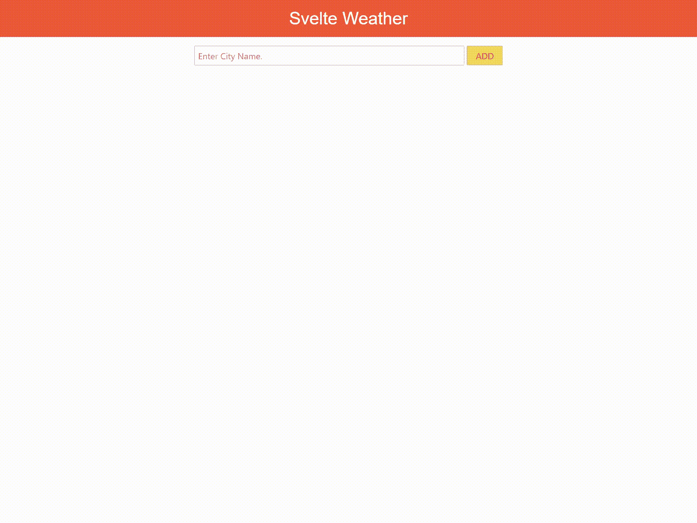

# 创建一个苗条的天气应用程序

> 原文：<https://javascript.plainenglish.io/create-weather-application-using-svelte-ecc2ecb889a2?source=collection_archive---------1----------------------->

我听说苗条又简单又快速。所以我决定通过建立一些东西来学习苗条。

## 先决条件

我使用的是节点版本 12.13.1

我将使用`OpenWeatherMap API`获取天气信息。注册并记住 API 密钥。

[](https://openweathermap.org/) [## с当前天气和预报- OpenWeatherMap

### 获取您所在城市的当前天气、每小时天气预报、16 天的每日天气预报和 5 天的 3 小时天气预报…

openweathermap.org](https://openweathermap.org/) 

如果你不知道如何使用 API，阅读 [MDN web docs 关于获取 API](https://developer.mozilla.org/en-US/docs/Web/API/Fetch_API) 。

## 开始项目前

我将在每一节后写哈希值。如果您想获得该版本的源代码，请执行以下命令。

## 使用模板创建新项目

Svelte 为想要使用 Svelte 创建新项目的程序员提供模板。我们可以通过一行命令克隆模板源代码。

如果你想检查初始模板代码是如何工作的，在你的`project's root directory`上运行这个命令，并使用浏览器访问`http://localhost:5000`。



> 哈希值:be32f0e

## 简单设计应用程序

在写一些代码之前，我简单地设计了应用程序。这将有助于这个项目。

1.  应用程序应该有一个输入城市名称的输入表单。
2.  应用程序应该有一个按钮来添加天气卡。
3.  天气卡上应显示城市名称、天气图标、当前温度(摄氏度)。
4.  如果用户点击天气卡超过 1.5 秒，将显示删除模式。
5.  如果用户点击删除模式，天气卡将被删除。

这是我在创建应用程序之前想到的简单用户界面。



## 安装 SASS 预处理器

我决定用 [svelte-preprocess-sass](https://github.com/ls-age/svelte-preprocess-sass) 来使用 sass。

为了使用这个包，我修改了`/rollup.config.js`文件。

通过这种修改，我可以在组件风格中使用 scss 语法。

为了测试 SASS 预处理器是否工作，我修改了`/src/App.svelte`文件。

如果你能在你的浏览器上看到改变的字体颜色，它就工作了！



> 哈希值:cdae25d

## 添加标题

我将为应用程序创建标题，但在创建之前，我必须修改`/public/global.css`文件。

让我们创建`/src/Header.svelte`组件。

创建组件后，我将这个组件添加到我的`/src/App.svelte`中。

我可以使用`import`语句轻松添加组件。



> 哈希值:a865e3d

## 添加商店

在官方文件中，他们是这样定义一个`svelte/store`模块的。

> 商店是一种对象，它允许通过简单的商店契约对值进行被动访问。

为了访问任何组件的值，我应该将 store 添加到我的应用程序中。我添加了`/src/store.js`文件。

我导入了允许更新和订阅阅读的`writable`。`writable`有三种控制数据的方法。

第一种方法是`subscribe`。此方法用于向订阅者通知值的更改。第二种方法是`set`。此方法用于设置要存储的值。它替换存储值，因为该方法只接收`new_value`作为参数。第三种方法是`update`。此方法也用于设置要存储的值。但是它具有参数功能。所以如果我想部分改变存储值，我应该使用这个方法。

再看我的`/src/store.js`文件。我导出`weatherList`，这也有三个方法。第一个是我已经解释过的`subscirbe`。第二个是`add`，用于添加天气信息。第三个是`remove`，用于使用城市名称从商店中删除天气信息。我用我之前解释的`update`来定义`add`和`remove`方法。

> 哈希值:e10b3b5

## 添加搜索表单

在创建搜索表单之前，将`OpenWeatherMap API`键设置为我的应用程序。我使用 js 文件设置密钥，因为这个应用程序是测试应用程序，它没有任何服务器或数据库。我创建了`/src/key.js`文件。

要将天气卡添加到我的应用程序中，我必须创建具有`input`和`button`元素的搜索组件来检索天气信息。我制作`/src/Search.svelte`文件。

为了使用存储在组件中，我导入了`weatherList`。我定义了一个函数来将天气信息添加到存储中。在这个文件中，你应该可以看到下面这些细节。

1.  为了将`cityName`变量绑定到`input`元素的值，我使用了`bind:value={cityName}`语句。
2.  为了将`addWeatherInfo`函数绑定到`button`元素的 click 事件，我使用了`on:click={addWeatherInfo}`语句。
3.  在`addWeatherInfo`函数中，我使用了`weatherList.add`方法来更新存储。

将`Search`组件添加到`/src/App.svelte`中。



> 哈希值:ba5925e

## 修改商店(这是我的错)

当我开始实施`WeatherCard`时，我意识到我的`weatherList.remove`方法并不合适。为什么那不合适？因为我不用计算就能得到指数。所以我修改了`remove`的方法。

> 哈希值:2dc0b3d

## 添加天气卡片

如果我在`input`元素中输入城市名称并点击`button`元素，我可以检索天气信息。这些信息只是文本数据类型的`json`，我需要创建天气卡来轻松获取这些数据。

这是数据的结构。

首先，我创建了用于天气预报卡列表的 board 组件。我创建了`/src/Board.svelte`文件。

并将板卡组件添加到`/src/App.svelte`文件中。

如果您搜索城市，字符串化的天气信息将显示在 board 组件上。然后，我使用这些信息创建天气卡组件。创建`/src/WeatherCard.svelte`。

在这个文件中，我建议你应该详细了解鼠标事件。为了满足我的简单规范，我必须实现鼠标事件。

检查点击事件的持续时间，如果持续时间超过 1.5 秒，将显示删除部分。

实现天气卡组件后修改`/src/Board.svelte`。

显示我没有写属性名。苗条支持简短声明。`{weather}`语句完全等同于`weather={weather}`。

我的第一个 svelt 申请完成了！



> 哈希值:e3a9f85

## 从`ENVIRONMENT VARIABLES`获取 API 密钥

将 API 密钥作为文件来管理是非常危险的。如果我犯了错误，所以把 API 密匙推给了 github，所有人都可以使用我的 API 密匙。

所以我修改了我的一些代码(其实是我老板修改的)。

首先，我安装了`replace`插件。捆绑时替换插件替换文件中的字符串。

```
npm install [@rollup/plugin-replace](http://twitter.com/rollup/plugin-replace) --save-dev
```

其次，我修改了我的`src/key.js`文件，如下所示。

```
export const key = 'API_KEY';
```

第三，我在我的`/rollup.config.js` 文件上应用了通过设置配置来替换插件。

```
import replace from '@rollup/plugin-replace';
...plugins: [
    replace({
        'API_KEY': process.env.API_KEY
    }),
],
...
```

现在，我们可以使用`ENVIRONMENT_VARIABLE`运行应用程序。运行以下命令。

```
API_KEY=<api-key> npm run dev
```

> 哈希值:a212007

## 结论

苗条很简单，公文很酷。需要多学习！

## 更改日志

1.  从`ENVIRONMENT VARIABLES`获取 API 密钥
2.  2020.03.04 我把这个应用发布到我的 [GitHub 页面](https://www.jangwook.net/svelte-weather/public/)。
    输入你的 API 密匙，搜索！

## 用简单英语写的 JavaScript 的注释

我们总是有兴趣帮助推广高质量的内容。如果你有一篇文章想用简单的英语提交给 JavaScript，用你的中级用户名发邮件到 submissions@javascriptinplainenglish.com[](mailto:submissions@javascriptinplainenglish.com)**给我们，我们会把你添加为作者。**

**我们还推出了三种新的出版物！请关注我们的新出版物，表达对它们的爱:[**AI in Plain English**](https://medium.com/ai-in-plain-english)，[**UX in Plain English**](https://medium.com/ux-in-plain-english)，[**Python in Plain English**](https://medium.com/python-in-plain-english)**—谢谢，继续学习！****