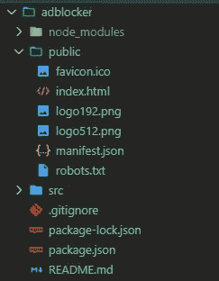
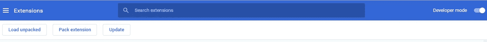
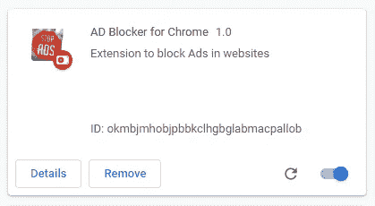
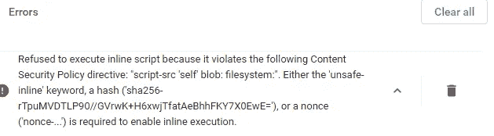

# 使用 React 创建自己的广告拦截器 Chrome 扩展

> 原文：<https://javascript.plainenglish.io/create-your-own-ad-blocker-chrome-extension-using-react-part-i-ea04613b1583?source=collection_archive---------3----------------------->

## 第一部分


在这篇文章中，我将讲述使用 React 创建一个简单的广告拦截器 chrome 扩展的过程。

首先，我们将从使用 create-react-app 创建一个 react 项目开始。我们将其命名为广告拦截器。

```
npx create-react-app adblocker
```

一旦创建了项目，我们就可以开始配置它了。每个 chrome 扩展都需要一个 ***的 manifest.json 文件*** 放在根文件夹中。我们的项目在 public 文件夹下有一个 ***manifest.json*** 文件。



adblocker project

我们将用下面的代码编辑它。

```
{"name": "AD Blocker for Chrome","version": "1.0","manifest_version": 2,"description": "Extension to block Ads in websites","icons":{"16":"logo.png","48":"logo.png","128":"logo.png"},"browser_action": {"default_popup": "index.html","default_title": "Block Popups"},"permissions": []}
```

名称、版本和描述不言自明。因为我们的扩展是用一个 ***manifest.json*** 文件包装的，所以我们需要指定它的版本。清单版本 2 当前正在生产中，版本 1 已被弃用。

然后我们将为我们的扩展添加图标。我添加了下图作为图标。它应该是在 png 格式和方形。默认情况下，我们应该给 128x128 图标。48x48 和 16x16 尺寸可选。我们将提供单个 png 文件，chrome 将根据要求自动调整大小。


浏览器动作是您的扩展添加到浏览器工具栏的按钮。我们可以为该按钮定义许多动作，所有这些动作在[这里](https://developer.mozilla.org/en-US/docs/Mozilla/Add-ons/WebExtensions/manifest.json/browser_action)都是可用的。我们将只添加**弹出框**和**标题**，前者在点击扩展时打开，后者在鼠标移动到扩展上时作为工具提示出现。

我们将在文章的后面看到更多关于权限的内容。

现在，我们将通过运行以下命令来创建构建。它将创建一个包含所有必要文件的构建文件夹。

```
npm run build
```

这样，我们的 chrome 扩展就可以导入了。但是我们仍然缺少实际的代码。我们将在 chrome 中导入它，并在添加代码之前查看它的外观。

我将在 Chrome 中进入 ***扩展*** 并启用 ***开发者模式*** 。之后，我将点击 ***Load Unpacked*** 并选择文件夹“***ad blocker/build***”，其中包含了***【index.html】***和 ***manifest.json 文件。***



现在 chrome 扩展被导入。



现在，如果我们试图点击扩展，它会抛出一个错误。



默认情况下，Chrome 会阻止扩展中的内联脚本。由于我们的代码是一个内联脚本，我们得到了与控制台中的内容安全策略(CSP)相关的错误消息。在错误消息中，我们将获得阿沙值，该值可以添加到 **manifest.json** 文件中以解决问题。 ***manifest.json*** 添加“内容 _ 安全 _ 策略”后会是这个样子。

```
{"name": "AD Blocker for Chrome","version": "1.0","manifest_version": 2,"description": "Extension to block Ads in websites","icons":{"16":"logo.png","48":"logo.png","128":"logo.png"},"browser_action": {"default_popup": "index.html","default_title": "Open the popup","default_icon": "logo.png" },"content_security_policy": "script-src 'self' 'sha256-rTpuMVDTLP90//GVrwK+H6xwjTfatAeBhhFKY7X0EwE='; object-src 'self'","permissions": []}
```

一旦我们在 chrome 中重新构建并再次导入扩展，一切都会好的。当我们点击扩展，我们应该看到一个弹出如下。


我们现在有一个模板 chrome 扩展。在下一部分，我们将利用 Chrome 的 [webRequest](https://developer.chrome.com/extensions/webRequest) API 来拦截 http 请求，并构建将执行实际操作的扩展。