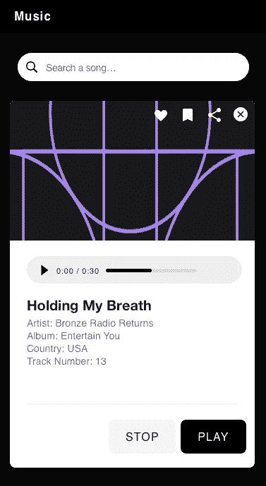
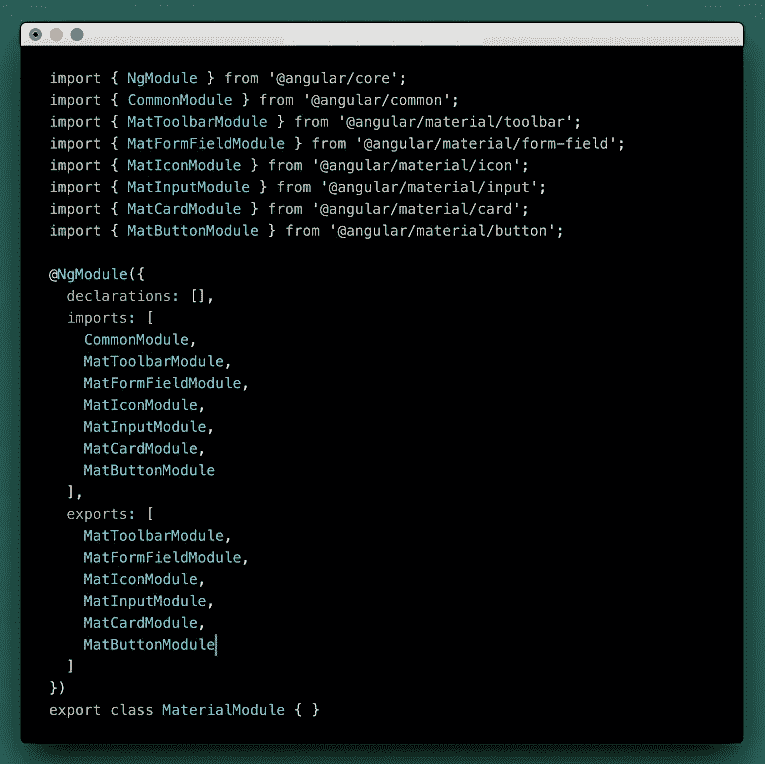
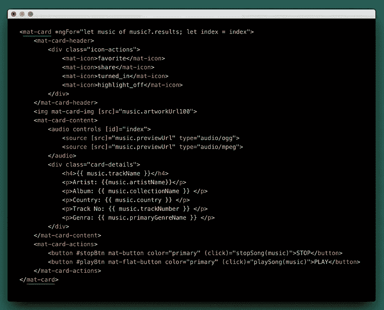
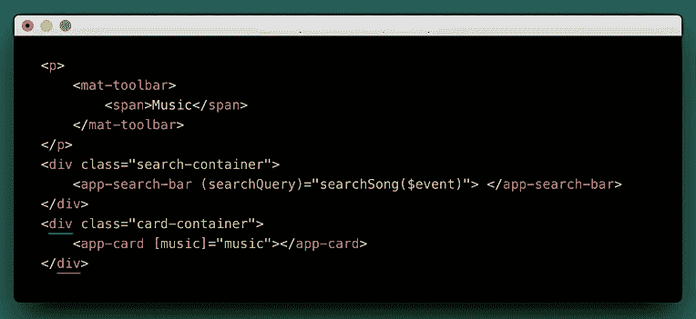
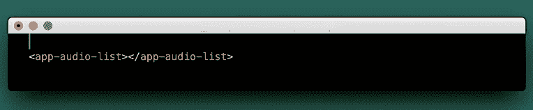
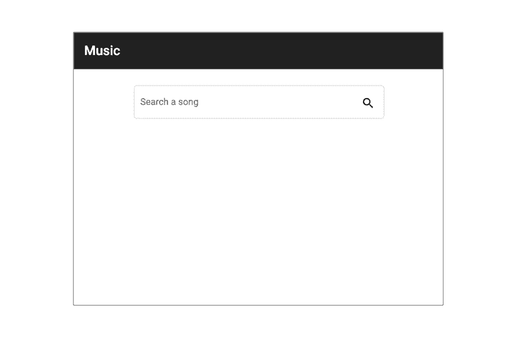
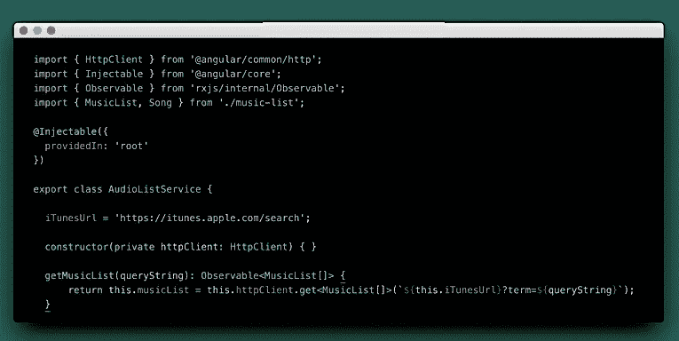
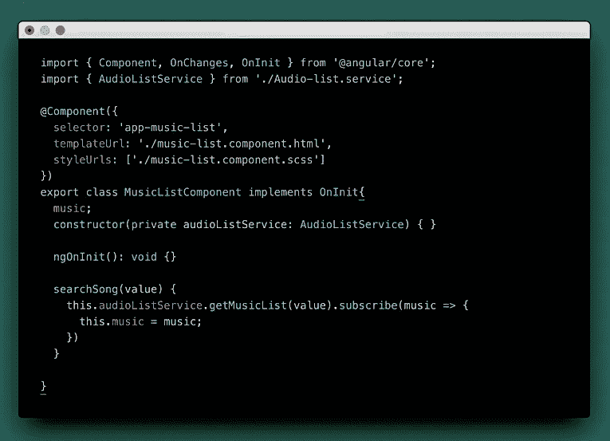
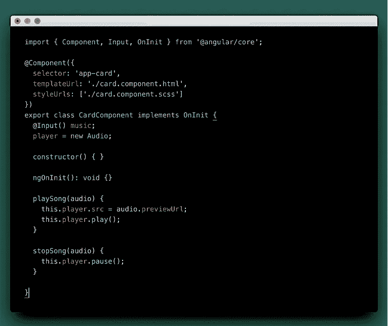
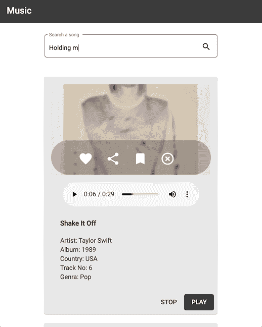

# 用 Angular 创建您自己的音频播放器

> 原文：<https://javascript.plainenglish.io/create-your-own-audio-player-with-angular-f8766ca505ab?source=collection_archive---------2----------------------->


在本文中，您将学习如何使用 Angular 构建一个简单的音频播放器应用程序。用户界面将使用 Angular Material 组件编写，我们还将使用一些 RxJS 操作符来帮助我们与 iTunes API 进行通信。该应用程序将显示一个界面，让您根据您在搜索框中输入的搜索查询来收听歌曲列表。

你可以通过克隆这个[库](https://github.com/foobearer/Audio-Player)来引用最终的代码。

# **我们将讨论的话题**

*   如何集成分层组件交互:
*   创建包含组件 A 和 b 的父组件。
*   允许组件 A 使用@Input()数据绑定类从父组件获取一组歌曲。
*   同样，通过使用@Output 类授权组件 B 将字符串传递给父组件。
*   如何整合一个搜索功能？
*   如何导入一些有角的材质组件？
*   如何创建使用 RxJS 操作符的服务？

# 三维线框模型

在直接进入开发之前，最好创建一个线框或模型，帮助将功能分解成更小的任务块。然后，我们将使用这些任务在整个开发过程中指导我们所有人。



Audio Player UI. Created using Sketch.

# 初始设置

*确保你已经预先安装了 Node.js，Angular CLI，并且它应该和你的 IDE 绑定在一起。另外，不要忘记在应用程序中安装 node_modules。*

1.  通过键入以下内容，使用 Angular CLI 创建新的角度应用程序:

```
ng new Audio Player
```

2.然后通过键入以下命令创建父组件:

***g*** *代表* ***生成*** *和* ***c*** *代表* ***分量。您可以尝试拼出它们，CLI 命令仍然可以工作。***

```
ng g c audio-list
```

3.现在，我们必须创建一个包含组件 A 和 b 的新文件夹。不过，这取决于您自己的偏好，对我来说，我想将所有可重用组件分组到一个文件夹中，以便我知道以后在哪里可以找到它们。

```
mkdir components
```

4.进入文件夹内部

```
cd components
```

5.创建组件 A

```
ng g c search-bar
```

6.创建组件 B

```
ng g c card
```

此时，您已经完成了代码库的设置。我们只需要通过添加 Angular Material 组件来编写 UI，并使用@Input 和@Output 数据绑定类将它们粘合在一起。这些是我们将在下面经历的后续步骤:

# 构建模板

我们需要从角状材料中进口一些组件。我们可以将它们直接导入到***app.module.ts***文件中，或者创建一个专门导入角度材料的单独文件，然后将该文件导入到 app . module . ts 中。我更喜欢后者。

1.  **创建一个单独的模块来导入所有必需的角材料组件:**

***m*** *命令代表一个* ***模块。*** *您可以通过此* [*链接*](https://angular.io/cli) *了解更多 Angular CLI 命令。*

```
ng g m material
```

**2。在物料模块内部导入以下:**



material.module.ts file containing components from Angular Material.

**3。现在我们已经拥有了所有需要的组件，我们可以开始编写搜索栏的模板了。**


search-bar.component.html

**4。接下来是写卡片的模板。**



card-component.html

**5。一旦两个组件都完成了，我们就可以把它组装到父组件上。**



audio-list.component.html

6。最后，将这个音频列表组件调用到根模板，即 app.component.html。



app.component.html

最后，我们已经完成了音频播放器模板的编写。您可以通过在终端中键入以下命令来尝试运行该应用程序。

```
ng serve *or* npm start
```

导航到[*https://localhost:4200/*](http://localhost:4200/)*，您应该会看到与下图类似的视图:*

**

*Audio Player on load view.*

# *添加功能*

*我们现在可以继续构建应用程序的主干。本节的目标是整合应用程序的搜索功能。通过这样做，我们还将涵盖创建服务、使用一些角度数据绑定，以及创建一个新的接口。*

1.  ***创建音频列表服务。***

```
*ng g s audio-list*
```

*在音频列表文件中，我们将创建一个负责与 iTunes API 通信的方法 **getMusicList()** 。*

*如果你对创建角度 HTTP 请求不太熟悉，你可以参考我以前的文章[这里的](https://medium.com/javascript-in-plain-english/how-to-make-http-requests-in-angular-using-httpclient-15e1fdf76a03)获得关于如何创建 HTTP 请求的详细指南。*

**

*audio-list-service.ts*

***2。将音频列表服务导入父组件。***

*在下面的代码中，我们创建了一个 **searchSong()** 方法，该方法接受一个字符串，然后将其传递给 *AudioListService* 类中的 **getMusicList()** 函数。*

*如果您回头参考我们之前编写的模板**(第 5 项，构建模板)**部分，您会注意到*<app-search-bar>*有一个名为 *searchQuery* 的 *@Output* 类，它将在搜索文本框中输入的文本发送到音乐列表组件。这就是父组件从子组件获取数据的方式。*

**

*audio-list-component.ts*

*此时，您应该已经能够根据您在搜索栏中输入的搜索查询从 iTunes API 获得一些响应…但是，要显示结果，我们需要使用 *@Input* 类将这些数据传递给我们的第二个组件子组件，即 *card-component。**

***3。将数据从父组件传递到子组件。***

*下面的@Input music 包含从父组件传递的数据。检查**(Building Templates 下的第 4 项)**部分，看看我们如何迭代到它并显示歌曲细节。*

*您还会注意到，在下面的代码中，我们创建了两个方法，第一个是播放选定的歌曲，另一个是停止播放。*

**

*card-component.ts*

*我们现在可以结束音频播放器的开发了。万一我在这篇文章中漏掉了什么，你可以随时参考我在我的 GitHub [账号](https://github.com/foobearer/Audio-Player)中推送的代码。:)*

*终于，我们现在完成了简单的音频播放器的构建！你现在可以享受听一些你喜欢的歌曲或发现其他你以前没有听过的歌曲。eargasm 快乐！*

**

*Audio player demo gif.*

# *结论*

*使用 Angular 构建应用程序不再那么困难，通过使用一些 CLI 命令，设置应用程序可以很容易地完成，甚至添加文件也可以通过几行命令来实现。这只是弄清楚如何构建它们以及如何使用其他程序员已经开发的现有组件的问题。*

*让我们继续探索和建设吧！*

**

*Unsplash Photo by [Jackson Simmer](https://unsplash.com/@simmerdownjpg).*

*你觉得这个博客有帮助吗？别忘了在评论区留下一些反馈。*