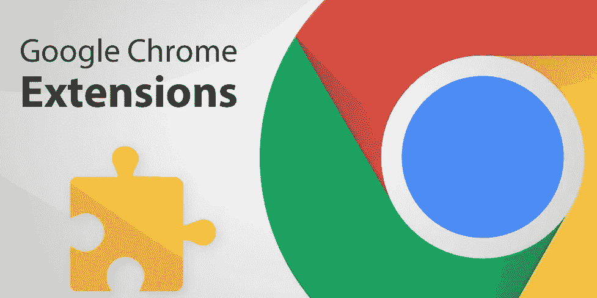
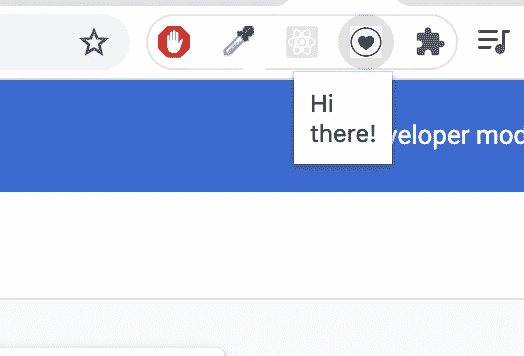

# 在 5 分钟内创建你自己的 Chrome 扩展

> 原文：<https://javascript.plainenglish.io/create-your-own-chrome-extension-in-5-minutes-a43b24d6652e?source=collection_archive---------14----------------------->



Image from 1stformations blog [post](https://www.1stformations.co.uk/blog/12-google-chrome-extensions-that-will-make-your-business-more-efficient/)

想知道 Chrome 扩展是如何工作的吗？这些都是非常小的可插拔应用程序，安装它们可以让你在使用浏览器时更加轻松。Chrome 扩展可以满足各种需求。从很小的事情开始，比如从你的网页中选择一种颜色或为你的标签设置壁纸，到检查你键入的任何内容的语法或阻止你的网页上的广告，你可以说出它的名字-有与你的网络浏览器相关的每个需求的扩展。如果你已经进入了 web 应用程序开发，那么这对你来说应该是小菜一碟。

# 什么是 Chrome 扩展？

Chrome 扩展基本上只是一个小的 web 应用程序，它使我们能够向 web 浏览器添加额外的自定义功能。如果你想执行浏览器还没有提供的某些操作，寻找现有的 Chrome 扩展，如果你仍然找不到，就继续构建你的扩展。真的就那么简单。

# 你应该知道什么？

所以你一定想知道它是如何构建的，恐怕不是——构建一个 Chrome 扩展超级简单。你只需要知道一点 HTML、JavaScript 和一些 CSS。

# 它们是如何工作的？

Chrome 扩展基本上是一个压缩的**。用户可以在浏览器中安装的所有必需文件的 crx** 文件。所以基本上，这些扩展可以上传到浏览器，不需要互联网，也不需要来自网络的内容。

一旦扩展构建完成，它们就可以发布到 Chrome 网络商店，并通过 Chrome 开发者仪表板分发。

# 让我们建造它

首先，您需要创建一个目录并给它命名。在这个文件夹中，我们将存储扩展所需的文件。我们将把这个文件夹加载到 Chrome 中。

## manifest.json

每个 Chrome 扩展都需要一个`manifest.json`文件。它基本上是一个 JSON 文件，告诉 Chrome 加载扩展所需的一切。因此，让我们在之前创建的目录中创建一个`manifest.json`文件，它看起来像这样:

```
{
  “name”: “hello_extension”,
  “version”: “1.0”,
  “description”: “demo”,
  “manifest_version”: 2,
  “browser_action”: {
    “default_icon”: “icon.png”,
    “default_popup”: “hello.html”
  }
}
```

以下是对 JSON 中使用的属性的解释:

*   **名称**—Chrome 扩展的名称
*   **版本** —它定义了你的扩展的版本
*   **描述** —这个值可能只是一个小的描述性文本，解释这个扩展是做什么的
*   **manifest_version** —必须说明清单规范的版本。正如 Chrome 所提到的，开发人员目前应该将版本指定为 2，因为版本 1 在 Chrome 18 中已被弃用。
*   **browser_action** —它用于将图标放在谷歌浏览器主工具栏中，地址栏的右侧。除了图标之外，浏览器操作还可以有工具提示、徽章和弹出窗口。

## icon.png

为您的扩展创建一个图标，并将其存储在目录中，并在`manifest.json`文件中将该图标的名称称为 **default_icon** 。

## hello.html

我们将`hello.html`文件称为 **default_popup** 文件，单击我们的扩展图标，该文件的内容就会弹出。这里有一个样本`hello.html`文件:

```
<html>
  <head> Hi there! </head>
</html>
```

# 将扩展加载到 Chrome

请按照以下步骤将您的扩展加载到 Chrome，并检查它是否工作:

1.  前往链接— `chrome://extensions/`
2.  启用开发人员模式。
3.  单击 load unpacked 图标，上传我们创建的扩展目录。
4.  现在，您应该看到您的扩展和其他扩展一起显示为一个图块。
5.  切换到另一个选项卡，然后单击扩展。
6.  现在，您应该可以看到您的扩展以及您添加的图标。
7.  点击扩展，你应该会看到一个弹出窗口，上面写着“你好！”。



Extension demo

瞧，你的扩展现在起作用了！

# 如何发布你的扩展？

请访问这个[链接](https://chrome.google.com/webstore/devconsole/register)，支付注册费，按照提到的步骤，你的扩展就可以发表了。一旦发表，你应该可以在 Chrome 网站的商店里找到这篇文章。

# 还能做些什么？

这只是一个简单的例子，用来描述构建一个 Chrome 扩展是多么容易。如果你能学会 Chrome 提供的扩展 API，那么你能做的远不止这些。请务必查看 Chrome 必须提供的所有[API](https://developer.chrome.com/extensions/api_index)，并享受构建扩展的乐趣:)

感谢您的阅读！