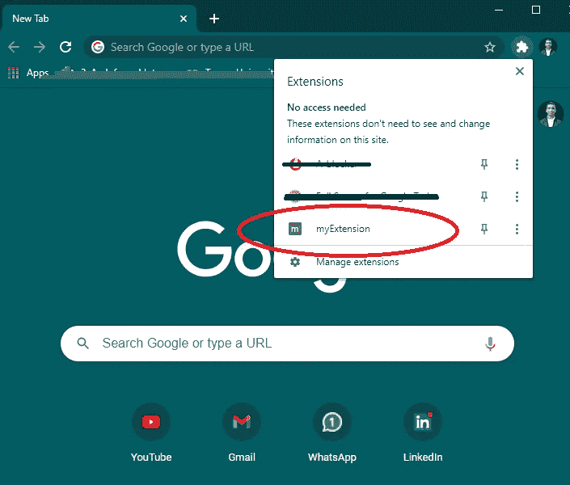
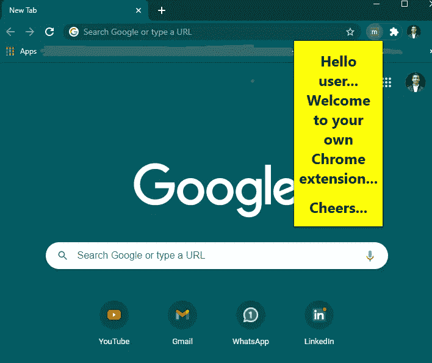

# 创建你自己的谷歌浏览器扩展

> 原文：<https://javascript.plainenglish.io/create-your-own-google-chrome-extension-de146f1ce645?source=collection_archive---------16----------------------->


Photo by [Benjamin Dada](https://unsplash.com/@dadaben_?utm_source=medium&utm_medium=referral) on [Unsplash](https://unsplash.com?utm_source=medium&utm_medium=referral)

在本文中，我们将创建一个简单的 Google Chrome 扩展，几乎不需要五分钟。我们的扩展将向用户显示一条问候消息。

根据 Chrome 开发者的说法，扩展是定制浏览体验的小软件程序。它们使用户能够根据个人需求或偏好定制 Chrome 的功能和行为。它们建立在 HTML、JavaScript 和 CSS 等 web 技术之上。

一个扩展必须满足一个明确定义且易于理解的单一目的。一个扩展可以包含多个组件和一系列功能，只要一切都有助于一个共同的目的。

对于这个迷你项目，我们将在系统中创建一个包含以下文件的目录(`myExtension`)。

```
myExtension
      |------manifest.json
      |------index.html
```

`manifest.json`文件将包含以下内容:

```
{
 "name":"myExtension",
 "version":"1.0",
 "description":"For greeting the user",
 "manifest_version": 2,
 "browser_action": { 
  "default_popup":"index.html"
  }
}
```

清单文件将告诉 Chrome 它需要知道的一切来正确加载扩展。

并且，`index.html`文件将包含以下内容:

现在，我们将打开 Chrome 浏览器，导航到 Chrome 的菜单，打开`More tools`，选择`Extensions`。我们必须打开`Developer mode`。然后，我们将点击`Load Unpacked Extension`并选择我们为该项目创建文件的目录，即`myExtension`。

因此，我们现在将在部署到 Chrome 后检查我们的扩展。



在上图中，我们可以看到浏览器中已经添加了我们的扩展。

现在我们将点击它，并得到以下结果。



就这么简单，我们创建了一个非常基本的 Chrome 扩展！

# 参考

> [https://developer.chrome.com/docs/extensions/mv2/overview/](https://developer.chrome.com/docs/extensions/mv2/overview/)
> 
> Chrome 开发者——什么是扩展？