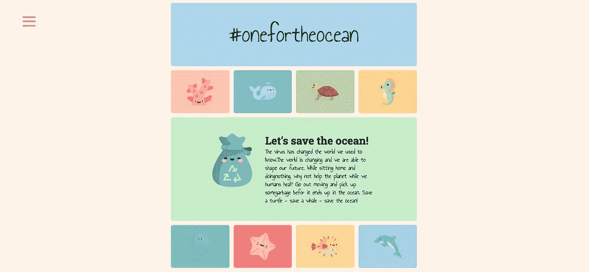

# 菜单上的反应汉堡🍔

> 原文：<https://javascript.plainenglish.io/create-your-own-hamburger-menu-using-react-hooks-typescript-and-styled-components-4b2797c4d193?source=collection_archive---------4----------------------->

## TypeScript 教程:

## 使用 React、hooks、TypeScript 和 styled-components 创建自己的菜单。



我更喜欢一个简单的菜单，它不会打扰我的网页，把注意力从内容上转移开，但对我的用户来说却是随时可用的。一起，我们将创建一个简单的粘汉堡菜单！

**细分:
*#1*** 🍔什么是汉堡菜单？
***#2*** 🍽工控配料 ***#3*** ⚙️制作最小工作菜单
***#4*** 💃使用转场
**#5 添加移动📱**为移动添加调整
***#6*** 🎣添加自定义钩子(点击事件)
***#7*** 🎉所有代码放在一起

# 🍔什么是汉堡菜单？

我认为“汉堡”这个名字只是一个单词，用来形象化看起来像汉堡的菜单图标🤷‍♀:我打赌你以前在网站上见过 3 线图标？

Hamburger menu from my page #[onefortheocean](http://www.onefortheocean.com)

上面是一张 gif 图片，展示了我是如何为我的网页# one for the ocean 创建汉堡菜单的。在本文中，我们将根据上面的 gif 图制作一个更简单的菜单👩‍💻

# 🍽配料

我想开始列出汉堡成分是很危险的——每个人都有自己强烈的个人偏好！技术堆栈的组成也是如此。无论如何，如果你不喜欢我的一些配料，欢迎你把它们剥掉。代码是使用 React (16.13)、TypeScript (3.8)和样式化组件(5.1)编写的。

如果你想添加一些番茄酱或番茄皮，你可以随意添加！我不介意😄

# ⚙️的基本组件

我将从最低限度开始构建组件，并在此过程中添加更多的细节。我希望你能通过这种方式得到要点。如果你是一个有经验的开发人员，你可以在任何时候直接阅读本文底部提供的全部代码。

通过下面提供的代码，我们有了一个最基本的开始。我们稍后将添加移动调整、过渡和挂钩(点击事件)。我选择将我的代码分成`Menu`和`Hamburger`，在添加了基本部分后，你的菜单应该变成这样:

## 菜单

`Menu`是棕色的背景，实际上是包含导航链接的菜单。

Menu.tsx

`Hamburger`是图标菜单图标本身，用于将`Menu`从可见切换到隐藏，然后再切换回来。

Hamburger.tsx

# 💃使用转场添加一些运动

现在你有了基本的汉堡菜单。也许有点无聊？让我们增加一些运动！首先，我们希望通过在更改时放松来过渡`Menu`及其内容。

为了充分利用我们的`Hamburger`，当`Menu`开放时，你可以将它从一个汉堡图标变成一个关闭标志——两个图标合二为一！更改后，您的菜单应该是这样的:

对于`Menu`，我们用一些滞后来缓和它的进出以进行一些移动。对于汉堡包，我们将第一个和第三个 div 旋转 45 度，形成一个十字。第二个 div 我们只是让它不可见，因为我们只需要两行形成一个关闭的图标。这就对了——你刚刚创建了一个汉堡菜单👏 🙌

# 📱为移动设备调整

我通常保持我的设计简单，没有任何大的移动调整，但菜单太重要了，不能不在小屏幕上给它一些额外的关注。

当在小屏幕上看菜单时，我们应该让`Menu`覆盖整个页面。我认为它广告了应用程序对它的感觉——你不同意吗？在我的应用程序中，我在 600 像素处创建了一个断点，在这里`Menu`获得全屏焦点。现在，我们的菜单在较小的屏幕上应该是这样的:

Mobile adjustments

Mobile adjustments

对于`Menu`，我们只需创建一个媒体查询，当屏幕宽度为 600 像素或更小时，使菜单宽度为 100%，而不是视图宽度的 30%。对于`Hamburger`，我想在手机上打开菜单时将十字图标全部移到右边。left 属性用于从左侧推动图标 x 的量。当你在手机上时，我希望图标(全屏)离右边 x 的距离。有道理吗？

# 🎣钩子

`Menu`需要跟踪它的状态——它应该保持打开还是关闭？
这是一个简单的`useState`钩子，带有一个布尔值`open`和一个函数`setOpen`来改变状态`open`。这一点我们已经添加到我们的`Menu`中，因为这是它工作的一个重要部分。

```
const [open, setOpen] = useState<boolean>(false);
```

**如果用户在** `**Menu**` **外点击会怎样？**眼下没什么。

如果`Menu`是打开的，用户在外面点击，作为一个用户，我希望`Menu`关闭。为了能够判断用户是在菜单内部还是外部点击，我们将添加一个对`Menu`的节点引用。这样，我们将能够问——“用户是点击了`Menu`还是外部？”。和节点一起，我们可以使用一个自定义的钩子`useOnClickOutside`。它应该是这样的:

Click outside hook

The hooks

# 🎉所有的材料放在一起，你的时尚和类型的反应汉堡就做好了:

# 信息、灵感和欣赏

😄我希望这篇文章对你有帮助！我允许你进行简单的复制粘贴，或者去掉你喜欢(或不喜欢)的成分。你喜欢怎么用就怎么用🍔Tanks to [Anson Low](https://codesandbox.io/s/q0pz9?file=/src/App.js) 展示他是如何制作汉堡菜单的！
👏感谢 [codesandbox.io](https://codesandbox.io/) 提供了一个很棒的服务来帮助社区分享他们的工作
🐳这个概念:# [onefortheocean](http://www.onefortheocean.com) 是一个激励人们通过清理垃圾来拯救海洋的概念。该页面本身是为了激励孩子们，让他们参与其中，成为一种有趣的体验。这个项目是我在 corona 时代发起的。为什么不在散步呼吸新鲜空气的同时为世界做些好事呢？它仍在开发中，代码在 [GitHub](https://github.com/marteloge/onefortheocean) 上。