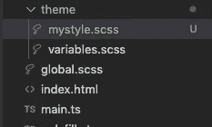
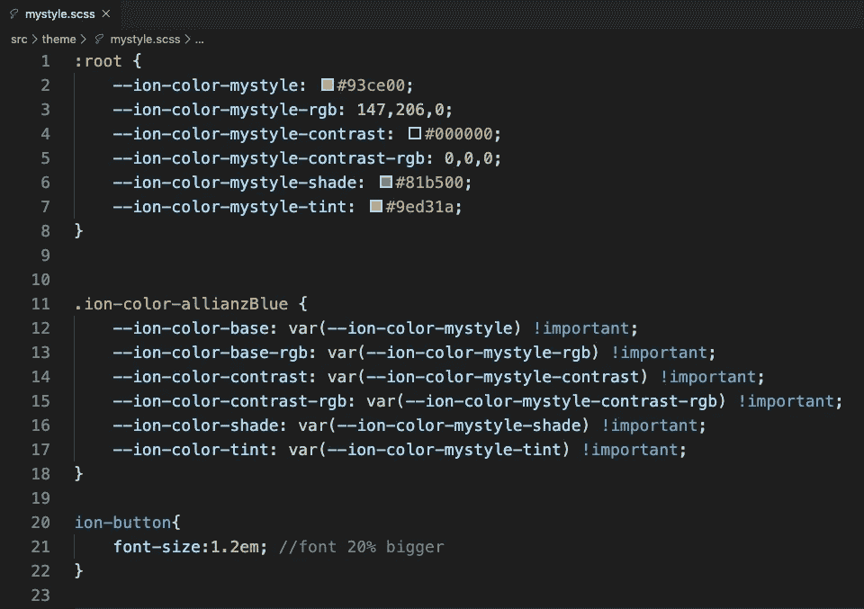
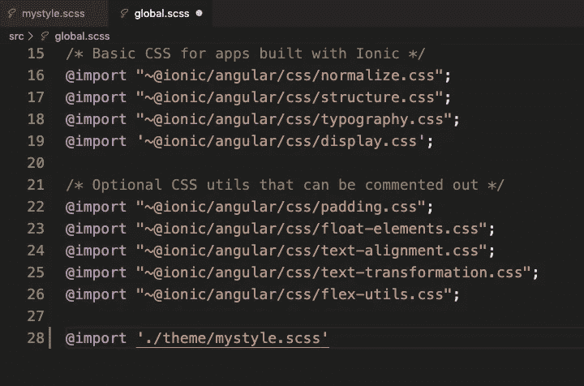

# 在 Ionic 项目中创建您自己的主题

> 原文：<https://javascript.plainenglish.io/create-your-own-theme-in-a-ionic-4-project-cf496b3ef0e6?source=collection_archive---------8----------------------->

## 你想定制你的 Ionic 4+项目，而不打破一切。您希望确保您正在构建的应用程序使用与您之前的应用程序相同的样式。或者你只是想在你的开发中创建一个标准的 SCSS 主题。方法如下:

假设你对爱奥尼亚有一点了解。如果你熟悉爱奥尼亚，就跳到下面一张**老虎**的图片，否则，就坚持下去，看下一节。

# 什么是爱奥尼亚？(有删节)

Ionic 是一个框架，你可以使用它来构建移动应用程序，今天，它包括 Android、iOS、PWA(渐进式网络应用程序),甚至是一个完整的计算机应用程序。它提供了所有好看的导航条和按钮(UI 组件)，除此之外，它还提供了原生 API，让你可以轻松美观地集成到你的应用中。

Ionic 是一种混合风格的移动开发，使用 HTML、TypeScript 和 SCSS 文件，将 web 开发直接引入到移动应用程序开发中，在典型的原生开发之上增加了一层 web 开发。

如今，Ionic 支持 Angular、ReAct、VueJS 和您的普通 Javascript 环境，确保经验丰富的 web 开发人员能够轻松集成和低门槛地构建移动应用。

Ionic 过去只与 Cordova(它可以将任何网站转换为应用程序)合作，将他们的网页设计转换为应用程序，但今天 Ionic 也支持自己的原生转换器，称为电容器。

要启动一个 Ionic 应用程序，我建议在这里查看 Ionic 网站:

 [## Ionic -跨平台移动应用开发

### 我们帮助开发人员构建和部署跨平台应用。从开源到优质服务，Ionic 创造了应用程序…

www.ionicframework.com](https://www.ionicframework.com) 

欲了解更多关于电容器的信息，请点击此处:

 [## 电容器:通用网络应用

### 《入门指南》支持构建在 iOS、Android、electronic 上同样运行良好的 web 应用程序，并支持渐进式 Web 应用程序访问…

capacitor.ionicframework.com](https://capacitor.ionicframework.com) 

当然，科尔多瓦，看看这里:

【https://cordova.apache.org 号

Photo by [Max van den Oetelaar](https://unsplash.com/@maxvdo?utm_source=unsplash&utm_medium=referral&utm_content=creditCopyText) on [Unsplash](https://unsplash.com/s/photos/tiger?utm_source=unsplash&utm_medium=referral&utm_content=creditCopyText)

## **咆哮！欢迎回来**

这里的想法很简单。创建一个可重复使用的主题或组件，供您在任何 Ionic 项目中使用，而无需不必要地思考和浪费时间来弄清楚这种颜色将如何工作，并使您以前构建的某些应用程序的风格与您正在构建的新应用程序相匹配。

因此，拥有一个“一刀切”的主题文件是合乎逻辑的，您可以在任何未来的 Ionic 项目中使用和实现它来帮助您构建您的 Ionic 应用程序。

开始第一步:

1.  *创建 SCSS 文件*

您需要创建一个 SCSS 文件。在哪里创建这个文件由您决定，但是我的建议是将它放在主题文件夹中。在这里，我在主题文件夹中创建了一个名为`mystyle.scss` 的文件。

*2。在那个文件*中为你的主题做一些 SCSS 风格的设计

添加新的字体，改变某些项目的颜色，做 CSS 动画，这都由你决定。在我的例子中，我会在我的项目中加入一种特殊的颜色，我会让按钮的字体大 20%。

*3 .* `*mystyle.scss*` *文件导入* `*global.scss*`

下一步是非常简单的一步，您只需要将`mystyle.scss`文件导入您的`global.scss`文件中，如下所示:

4.这就是全部。现在你可以使用你的应用程序中的`color='mystyle'`来使用你的颜色，你的按钮有大约 20%大的字体。继续试一试。

对于您来说，上面解释的方法是一个简单的解释，因为您可以将 SCS 主题用于任何全面的 ion 项目。换句话说，您可以根据自己的内心内容定制应用程序。

但不要仅限于此，我还建议构建定制的组件和管道，这些组件和管道可以根据您的内心内容进行定制，并且可以很容易地导入到任何离子项目中，但这是另外一个话题。