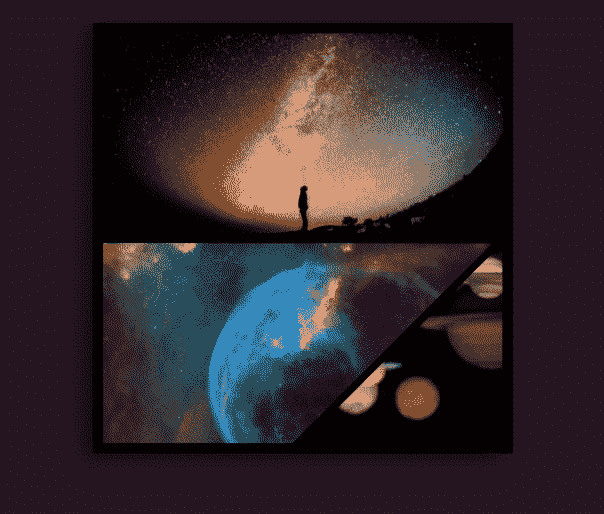
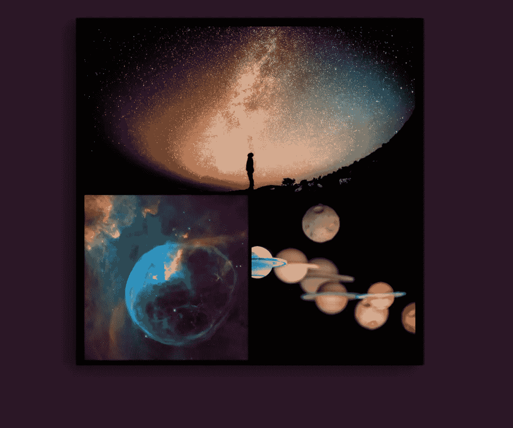
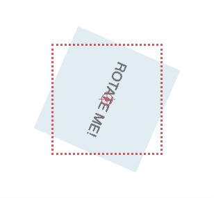
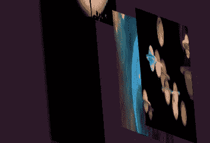
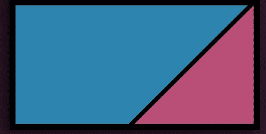
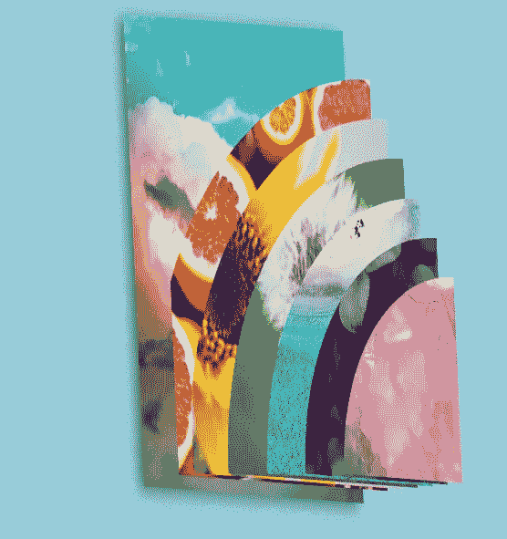
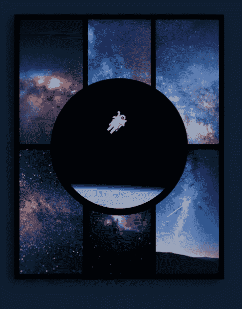

# 使用网格和变换用 CSS 创建 3D 布局

> 原文：<https://javascript.plainenglish.io/creating-3d-layout-with-css-using-grid-perspective-65cd03dfc56c?source=collection_archive---------3----------------------->



CSS 网格不仅仅是为了创建平面的 2D 布局——我们可以充分利用 CSS 网格，并将其与其他 CSS 属性结合起来，做很多令人惊叹的事情，比如 3D 布局(也有一些很棒的形状)。

如果你只是想玩代码笔，请随意，否则请继续阅读一些解释/一步一步的过程。



Figure 1: CSS Grid layout. Top row has an image spanning two columns, bottom row has two images each taking up half the space.

我们需要一些东西来创造这个效果——CSS 网格和一些变换。

我们将从一个基本布局(见图 1)开始，我们将向它添加一个 3D 旋转。你可以将它应用到任何类型的布局中，为了演示的目的，我们将保持它的简单。

我们将在最后讨论标题图像中看到的不同形状。

布局的 HTML 将类似于下面的例子。一个网格容器元素，和三个容器来保存我们的图像，或文本或任何你想要的东西。

```
 <div class="grid">
    <div class="grid-item"></div>
    <div class="grid-item"></div>
    <div class="grid-item"></div>
  </div> 
```

## 设置网格

我们想先设置网格，CSS is Grid 太棒了，我们的例子不需要太多代码，但是根据你想要创建的布局，你可能需要更好一点。

```
.grid {
  display: grid;
  grid-gap: 10px;
  grid-template-columns: 1fr 1fr;
}.grid-item {
  height: 200px;

  &:nth-child(1) {
   grid-column: 1 / span 2;
  }

  &:nth-child(2) {
   grid-row: 2 / span 1;
   grid-column: 1 / span 1;
  }

  &:nth-child(3) {
   grid-row: 2 / span 1;
   grid-column: 2 / span 1;
  } 
}
```

为了演示的目的，我们将非常详细，我设置了我的网格，每个项目之间有 10px 的间隔。我希望底行有 2 列，所以我们为每列设置一个分数为 1 的值。

然后，我可以使用 n-child 和 grid-row 和 grid-column 属性将我的项目放在网格中。网格行和网格列允许我定义每个项目在网格中的位置，以及开始和结束列是什么。(记住网格线从 1 开始，而不是从 0 开始)。

我的网格项目中有图像，所以我还将添加以下代码，以便它们覆盖整个可用空间。

```
img {
   object-fit: cover;
   width: 100%;
   height: 100%;
 }
```

## 使网格在 3D 空间中旋转

有几种方法可以在 CSS 中制作 3D 效果，在这个例子中我们将使用 3D 变换。

```
.grid {
   ...
   transform: rotate3d(3, 29, 0, 80deg);
   transform-style: preserve-3d;
   transform-origin: center;
}
```

对我来说，搞清楚 3D 旋转( [rotate3D](https://developer.mozilla.org/en-US/docs/Web/CSS/transform-function/rotate3d) )只是一些尝试和错误，我基本上打开开发工具，编辑风格面板中的数字，直到它看起来像我想要的样子。

*注意:如果你想像我的例子 Codepen 一样把它从平的变成旋转的，你可以从* `*transform:rotate3d(0, 0, 0, 0);*` *开始，然后在你的动画中加入结束状态。(稍后详细介绍)*

我们使用`transform-style`来确保元素的子元素位于 3D 空间，所以不要忘记这一部分。


Figure 2: transform-origin: top left

属性真的很重要。`rotate3D`函数围绕固定轴旋转元素— `transform-origin`定义应用变换的坐标。



Figure 3: transform-origin: bottom center

使用 MDN 上的[演示图 2，演示了左上角的变换原点，这意味着从元素的左上角应用旋转。](https://developer.mozilla.org/en-US/docs/Web/CSS/transform-origin)

在图 3 中，变换原点被设置为中心。这就是我们将在我们的示例中使用的，但是您可以随意选择，找到最适合您的选项。

## 在 3d 空间内交错排列项目

在我的例子中，你会看到每个网格项目位于 3D 空间中的不同点，创建了一个“层”效果。

为了实现这一点，我们可以使用`transform`属性将 [translate3D](https://developer.mozilla.org/en-US/docs/Web/CSS/transform-function/translate3d) 函数添加到每个网格项目中。例如:

```
&:nth-child(1) {
   grid-column: 1 / span 2;
   transform: translate3d(0, 0, 40px);
}
```

translate3D 函数的工作方式非常类似于标准的`translate`，除了你有一个额外的向量。其中 translate 有 x 和 y 轴，`translate3d`除此之外还有 z 轴。因为我们希望在 3D 空间中平移我们的项目，所以我们将 x 和 y 值保留为 0，并设置 z 轴。你可以根据自己的需要进行调整，我再次打开开发工具，手动将它放置在样式面板中，直到它看起来像我想要的那样。

## 制作旋转动画

如果你想制作旋转的动画，我使用了 CSS 动画——从 0 度开始“平坦”,旋转到 80 度，为了定位有一些微小的偏移。

```
[@keyframes](http://twitter.com/keyframes) rotatediv {
 10% {
  transform:rotate3d(0, 0, 0, 0);
 }
 50% {
  transform: rotate3d(3, 29, 0, 80deg);
 }
 80% {
  transform:rotate3d(0, 0, 0, 0);
 }
}
```

在父网格元素上，我添加了动画属性

```
.grid {
  ...
  animation: 10s rotatediv infinite;
}
```

## 创建非矩形形状

你可能已经注意到在这篇文章的英雄图像中，我的图像不是矩形的，相反，它们是不同的形状。



Figure 4: Overlapping images in 3D space

创建类似这样的东西的方法是让网格项目重叠，然后使用`clip-path`来创建形状。

使用下面的两幅图像，我们将它们都设置为从网格线 1 开始，跨度为 2 列。(参见图 4 中的示例)

```
&:nth-child(2) {
   grid-column: 1 / span 2;
}&:nth-child(3){
   grid-column: 1 / span 2;
}
```

通过让图像重叠，我们可以把不再需要的部分剪掉。你可以创建任何你想要的形状，一个有用的工具是 [Clippy](https://bennettfeely.com/clippy/) ，它给你一个界面和一些基本形状。Firefox dev tools 还有一个奇妙的路径编辑器，对于更复杂的形状非常有用。



```
&:nth-child(2) {
   grid-column: 1 / span 2;
   clip-path: polygon(0 0, calc(100% - 10px) 0, calc(50% - 10px) 100%, 0% 100%);}&:nth-child(3){
   grid-column: 1 / span 2;
   clip-path: polygon(100% 0, 50% 100%, 100% 100%);
}
```

用`clip-path`你需要定义每个坐标的位置。我已经使用 calc 函数将边界与我之前设置的`grid-gap`相匹配(你可以使用一个变量来确保它的一致性)。

使用这种技术，您可以创建各种形状和布局，并且可以将它与 3D 透视图相结合来创建一些真正有趣的效果。在 Codepen 上查看我的[布局实验集](https://codepen.io/collection/XzePLw)中的一些例子。



这留给我们最后的效果，你可以[在 Codepen](https://codepen.io/mandymichael/pen/ExPebjY) 上找到。这里真的有很多选择，去尝试，享受乐趣。


谢谢，玩得开心。
小敏💜