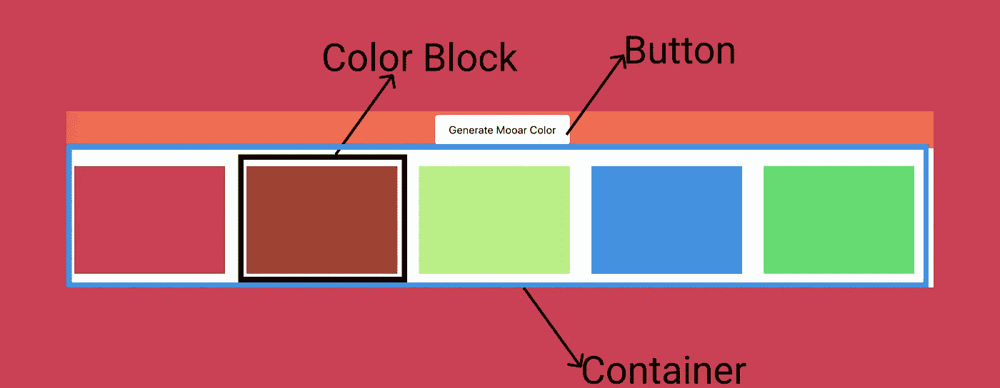

# 用 JavaScript 创建颜色生成器网站

> 原文：<https://javascript.plainenglish.io/creating-a-color-generator-website-in-javascript-cf1f2354da0f?source=collection_archive---------3----------------------->

## 了解如何创建一个能产生独特颜色的网站


Image by [Paola Galimberti](https://unsplash.com/@paolaccia?utm_source=unsplash&utm_medium=referral&utm_content=creditCopyText)

这是最终结果的样子

在本教程中，我们只关注 Javascript，你可以从上面的笔中复制并粘贴`html and css`。



用户界面具有

*   色块→使用 JavaScript 创建
*   按钮→当我们点击按钮时，我们需要生成 10 个随机的独特色块
*   容器→颜色块被附加到容器块上

# 当用户点击一个按钮时，我们需要

*   生成随机颜色
*   创建颜色块
*   确保该颜色尚未出现
*   将颜色块添加到容器中

# 生成随机的十六进制颜色

我们知道，十六进制颜色有`1–9`和`a-f`

来产生随机的颜色

*   在数组中存储十六进制值
*   使用 math.rand 获取索引
*   创建长度为 6 或 3 的颜色字符串

`Math.random()` →生成一个 0 到 1 之间的随机数。我们可以将随机数乘以数组的`length-1`得到一个随机索引。

[](https://medium.com/better-programming/generating-random-numbers-in-javascript-4b2a1e9d1806) [## 在 JavaScript 中生成随机数

### 不止是 Math.random()

medium.com](https://medium.com/better-programming/generating-random-numbers-in-javascript-4b2a1e9d1806) 

当我们调用`generateColor`方法时，它会给我们一个随机的颜色字符串。

我们需要确保颜色是独一无二的。

为了存储唯一值，我们可以使用`Set` →没有重复值的元素集合。

了解 Set

[](https://levelup.gitconnected.com/set-data-structure-in-javascript-62e65908a0e6) [## Javascript 中的集合数据结构

### 了解如何以及何时在 javascript 中使用 Set。

levelup.gitconnected.com](https://levelup.gitconnected.com/set-data-structure-in-javascript-62e65908a0e6) 

让我们创建`set`并将事件监听器添加到按钮中。

```
var set = new Set();var btn = document.getElementById('button');btn.addEventListener('click', function (ev) { // operation});
```

当用户点击`btn`时，我们需要生成 10 种随机的独特颜色，为此

*   我们可以在变量`size`中存储当前的设定长度
*   创建随机颜色
*   检查随机颜色是否已经存在于集合中
*   如果集合中没有，则将颜色添加到集合中，创建一个颜色块并添加到容器中。
*   如果已经存在于集合中，则什么也不做
*   每次迭代完成后，我们需要检查`set.size`是否小于`**size(old Set size)+ 10**`变量
*   如果 set.size 大于`size+10`，循环将被终止

```
let size = set.size; // old set Sizewhile(**set.size** < **(size + 10)** ) { let newColor = **generateColor**(); if(!**set.has**(newColor)){ set.add(newColor); // addColorBlock; }}
```

让我们实现 addColorBlock 函数

```
function addColorBlock(color) { let child = document.createElement('div'), p = document.createElement('p'); child.style.background = color; p.innerText = color.toUpperCase(); child.append(p); child.classList.add("child"); container.append(child);}
```

和我一起携手🖐[JavaScript jeep🚙💨](https://medium.com/u/f9ffc26e7e69?source=post_page-----cf1f2354da0f--------------------------------)。

[**给我买杯咖啡**](https://www.buymeacoffee.com/Jagathish) **。**


[**Buy me a coffee**](https://www.buymeacoffee.com/Jagathish)**.**