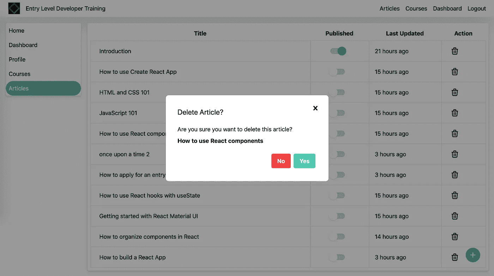

# 在 React 和 Tailwind CSS 中创建确认对话框

> 原文：<https://javascript.plainenglish.io/creating-a-confirm-dialog-in-react-and-tailwind-css-3b99f6e56fab?source=collection_archive---------1----------------------->


在这篇文章中，我们将介绍如何使用 React 和 Tailwind CSS 创建一个确认对话框。这篇文章将大致回顾我的另一篇文章中的逻辑，在 React 和 Material UI 中创建确认对话框，然而这篇文章将使用 Tailwind CSS。

在每个应用程序中都有你想删除某些东西的时候。所以像每个开发者一样，你添加一个按钮，当点击它时，删除资源。

无论是一篇博客文章、一个购物车中的商品，还是禁用一个帐户，您都希望防止不必要的按钮点击。

进入确认对话框。

有时候你确实想执行一个动作而不总是提示用户一个确认对话框，有时候总是提示用户会很烦人。

> 嘿，你想这么做吗？
> 
> 不，真的，你想这么做吗？

有时候，我会很烦，告诉自己，还有应用。是啊！我当然想做动作。不然我为什么会点击它？

然而，当涉及到删除敏感数据时，比如一篇博客文章，我建议添加一个确认对话框，这样用户就可以得到警告，如果他们不小心误点击了它，就可以退出。

在我们开始之前，让我们看看如何实现这是原生 JavaScript。

```
var shouldDelete = confirm('Do you really want to delete this awesome Medium article?');if (shouldDelete) {
  deleteArticle();
}
```

这将提示一个默认的确认框，并提示用户“您真的想删除这篇很棒的文章吗？”

如果用户单击 Yes，那么它会将 shouldDelete 布尔值设置为 true，并运行 deleteArticle 函数。如果他们单击“否”或“取消”，将关闭对话框。

但是确认对话框的本地浏览器实现有点无聊，所以让我们用 React 和 Tailwind CSS 做一个看起来不错的版本。

让我们从创建一个可重用的组件开始。您可以在任何使用 React 和 Tailwind 的应用程序中使用它。

我还可以提一下，我正在使用 NextJs 和 Typescript 来服务我的 React 组件。

首先，我们需要构建一个对话框组件。我将使用另一篇文章来帮助构建基本的对话框。您可以遵循本文或使用我制作的组件。

[](https://codeburst.io/creating-a-modal-dialog-with-tailwind-css-42722c9aea4f) [## 用 Tailwind CSS 创建一个模态对话框

### 在我探索、学习和使用最近发布的 Tailwind CSS“实用优先”CSS 框架时，我想与大家分享…

codeburst.io](https://codeburst.io/creating-a-modal-dialog-with-tailwind-css-42722c9aea4f) 

# 基本对话框

```
import ExitIcon from '@components/Icons/Exit';
import IconButton from '@components/Button/IconButton';interface Props {
  children: React.ReactNode;
  open: boolean;
  onClose: Function;
}export default function Dialog(props: Props) {
  const { open, onClose } = props;
  if (!open) {
    return <></>;
  } return (
    <div className="fixed inset-0 z-50 overflow-auto bg-smoke-light flex">
      <div className="relative p-8 bg-white w-full max-w-md m-auto flex-col flex rounded-lg">
      <div>{props.children}</div>
      <span className="absolute top-0 right-0 p-4">       <IconButton onClick={() => onClose()}>
         <ExitIcon />
       </IconButton>
     </span>
     </div>
   </div>
 );
}
```

我已经预先制作了一些其他的辅助组件，如图标按钮和退出图标。

# 图标按钮

```
interface Props {
  children: React.ReactNode;
  onClick?: (event: React.MouseEvent<HTMLButtonElement>) => void;
  className?: string;
}export default function IconButton(props: Props) {
  const {
    children,
    onClick = (event: React.MouseEvent<HTMLButtonElement>) => {},
    className = '',
  } = props; return (
    <button
      onClick={onClick}
      className={`focus:outline-none focus:border-none hover:bg-gray-400 hover:bg-opacity-25 p-2 rounded-full inline-flex items-center ${className}`}
    >
      {children}
    </button>
  );
}
```

# ExitIcon

```
export default function ExitIcon() {
  return (
    <svg
      className="h-6 w-6 fill-current text-grey hover:text-grey-darkest"
      role="button"

      viewBox="0 0 20 20"
    >
      <path d="M14.348 14.849a1.2 1.2 0 0 1-1.697 0L10 11.819l-2.651 3.029a1.2 1.2 0 1 1-1.697-1.697l2.758-3.15-2.759-3.152a1.2 1.2 0 1 1 1.697-1.697L10 8.183l2.651-3.031a1.2 1.2 0 1 1 1.697 1.697l-2.758 3.152 2.758 3.15a1.2 1.2 0 0 1 0 1.698z" />
    </svg>
  );
}
```

# 纽扣

```
interface Props {
  children: React.ReactNode;
  type?: 'submit' | 'button' | 'reset';
  onClick?: (event: React.MouseEvent<HTMLButtonElement, MouseEvent>) => void;
  className?: string;
}export default function Button(props: Props) {
  const { type = 'button', children, onClick, className = '' } = props;
  return (
    <button
      className={`bg-primary hover:bg-primary-light text-white font-bold py-2 px-4 rounded focus:outline-none focus:shadow-outline ${className}`}
      type={type}
      onClick={onClick}
    >
      {children}
    </button>
  );
}
```

# 确认对话框

```
import Dialog from './Dialog';
import Button from '@components/Button/Button';interface Props {
  title: string;
  children: React.ReactNode;
  open: boolean;
  onClose: Function;
  onConfirm: Function; 
}export default function Confirm(props: Props) {
  const { open, onClose, title, children, onConfirm } = props;
  if (!open) {
    return <></>;
  }

  return (
    <Dialog open={open} onClose={onClose}>
      <h2 className="text-xl">{title}</h2>
      <div className="py-5">{children}</div>
      <div className="flex justify-end">
        <div className="p-1">
          <Button
            onClick={() => onClose()}
            className="bg-secondary hover:bg-secondary-light"
          >
            No
          </Button>
        </div>
        <div className="p-1">
          <Button
            onClick={() => {
              onClose();
              onConfirm();
            }}
          >
            Yes
          </Button>
        </div>
      </div>
    </Dialog>
  );
}
```

该组件将接受这些道具:

1.  标题—这是将显示为对话框标题的内容
2.  孩子—这是将在对话框内容中显示的内容。这可以是一个字符串，也可以是另一个更复杂的组件。
3.  打开—这是告诉对话框显示的内容。
4.  onClose —这是一个状态函数，将对话框的状态设置为关闭。
5.  onConfirm —这是用户单击“是”时的回调函数。

这只是一个基本的确认对话框，您可以修改它以满足您的需要，例如更改“是”或“否”按钮。

现在让我们看看如何在我们的应用程序中使用这个组件。

例如，假设我们有一个列出博客文章的表。我们希望当我们单击一个删除图标时运行一个函数，它将显示这个确认对话框，当我们单击“是”时，它将运行一个 deletePost 函数。

```
<div>
  <IconButton aria-label="delete" onClick={() =>     setConfirmOpen(true)}>
    <DeleteIcon />
  </IconButton>
  <ConfirmDialog
    title="Delete Post?"
    open={confirmOpen}
    onClose={() => setConfirmOpen(false)}
    onConfirm={deletePost}
  >
    Are you sure you want to delete this post?
  </ConfirmDialog>
</div>
```

在这个组件中，我们需要用属性 open、onClose 和 onConfirm 实现 ConfirmDialog。Open 和 setOpen 通过使用 React 状态来控制，onConfirm 接受一个名为 deletePost 的函数，该函数调用一个 API 来删除这个特定的帖子。实现这些超出了本文的范围。我将让它来实现这些函数的实际功能。

你有它！创建一个可重复使用的确认对话框非常容易，它看起来比默认的本地浏览器对话框要好一百万倍。



# 顺风 CSS 注释

我最近发现了 Tailwind CSS，我喜欢它的每一分钟。Tailwind CSS 是一个实用至上的 CSS 框架，易于使用，可以在几秒钟内让一些东西看起来很棒。Material UI 和 Tailwind CSS 之间的区别在于，前者有大量预构建的组件，这些组件在各个应用程序之间看起来都是一样的，而后者使用实用程序类来构建您想要的组件，在不同的应用程序上，您可以为每个应用程序配置自己的外观。请查看并给我留下评论。

[](https://tailwindcss.com/) [## tailwind CSS——一个实用的 CSS 框架，用于快速构建定制设计

### 它们带有各种预先设计的组件，如按钮、卡片和警报，可以帮助您快速移动…

tailwindcss.com](https://tailwindcss.com/) 

另外，快速喊出这个网站，它使得 SVG 图标在使用 Tailwind CSS 的 React 组件中更容易使用。

[](https://heroicons.dev/) [## 开源 SVG 图标库

### 新的，麻省理工学院开源 SVG 图标库设计的史蒂夫肖格尔。实心和笔画变体，一键复制粘贴，以及…

heroicons.dev](https://heroicons.dev/) 

## **用简单英语写的 JavaScript**

你知道我们有三份出版物和一个 YouTube 频道吗？在[T3【plain English . io找到一切的链接！](https://plainenglish.io/)