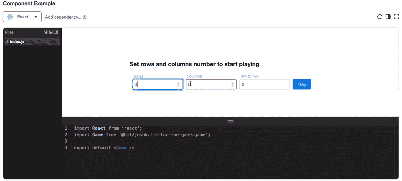

# 在 React 中创建设计系统

> 原文：<https://javascript.plainenglish.io/creating-a-design-system-in-react-5c4d811d0ccc?source=collection_archive---------1----------------------->

## 如何使用 React、Bit 和 friends 构建设计系统？

[](https://bit.dev/mui-org/material-ui)

React Material-UI reusable component system

设计系统是现代 web 开发中最热门的趋势之一。从 Airbnb 和优步这样的科技巨头到喜欢 UI 一致性和代码重用的小公司，任何人都可以使用它们。

现代用户界面由许多原子组件组成。每个组件封装了界面中某个元素的视觉和功能属性。不同的组件放在一起可以为应用程序用户创造不同的体验。

当构建许多项目时，将组件组织到一个统一的系统中可以通过重用节省时间，并有助于确保您的用户在每个接触点都获得一致的体验。这可以极大地帮助加速和标准化任何规模的现代 web 开发。


How [Uber Design](https://medium.com/u/f0f8b53891a8?source=post_page-----5c4d811d0ccc--------------------------------) does components

设计系统是开发者、设计者和其他利益相关者之间的桥梁。对于开发者来说，设计系统[有着独特的意义](https://medium.com/sketch-app-sources/what-is-your-design-system-really-c7a927d7bf92)。它是用于构建应用程序的实际模块集。

我写了一个详细的展示和讲述(有例子！)关于[如何利用 React 和 Bit 构建我们自己的设计系统](https://blog.bitsrc.io/how-we-build-our-design-system-15713a1f1833):

[](https://blog.bitsrc.io/how-we-build-our-design-system-15713a1f1833) [## 构建我们的设计系统

### 用组件构建一个设计系统来标准化和扩展我们的 UI 开发过程。

blog.bitsrc.io](https://blog.bitsrc.io/how-we-build-our-design-system-15713a1f1833) 

以及如何创建高度模块化和可组合的设计系统，并快速创建新作品:

[](https://blog.bitsrc.io/building-a-react-design-system-for-adoption-and-scale-1d34538619d1) [## 为采用和扩展构建一个反应式设计系统

### 通过独立组件和可组合架构实现 DS 扩展和采用——附示例。

blog.bitsrc.io](https://blog.bitsrc.io/building-a-react-design-system-for-adoption-and-scale-1d34538619d1) 

还有，我们如何使用这些组件[一起构建微前端](https://blog.bitsrc.io/how-we-build-micro-front-ends-d3eeeac0acfc):

[](https://blog.bitsrc.io/how-we-build-micro-front-ends-d3eeeac0acfc) [## 我们如何构建微前端

### 构建微前端来加速和扩展我们的 web 开发过程。

blog.bitsrc.io](https://blog.bitsrc.io/how-we-build-micro-front-ends-d3eeeac0acfc) 

在本帖中，我们将学习如何在 React 中创建一个有效的设计系统，并成功地将它分发到您的应用程序中同步使用。

以下是我们将讨论的关键部分:

*   **建筑(独立)**
*   **分发**
*   **记录**
*   **采用和协作**

有许多伟大的[工具](https://blog.bitsrc.io/7-tools-for-building-your-design-system-in-2020-452d9c9b3b8e)用于设计系统。在这篇文章中，我们将使用 [Bit](https://github.com/teambit/bit) ，它有效地简化了 React 组件的管理。可在此探究示例:

[](https://bit.dev/collections) [## UI 组件设计系统位

### 构建您的 UI 组件设计系统。发现数千个由 React、Vue 和…中的组件构建的设计系统

bit.dev](https://bit.dev/collections) [](https://bit.dev/collections)

# 构建隔离组件

每个 React 设计系统都是由组件组成的。当我们隔离组件时，我们可以确保它们开箱即用。

我们将使用 Bit 作为工作台来隔离我们的组件。这将让我们在项目的“外部”开发它们，并且如果每个组件可以独立地构建、测试和呈现，我们将得到反馈。

然后，我们可以使用[位](https://github.com/teambit/bit)独立地对每个组件进行[版本化，并在每个应用程序中定义和控制组件之间的关系。](https://blog.bitsrc.io/versioning-independent-ui-components-why-and-how-7ea60d8be5f2)

## 孤立的


孤立地开发组件意味着将组件从项目的上下文中分离出来。这确保了每个组件可以被引入到不同的 web 应用程序中。

Bit 提供了一种隔离项目中组件的方法。它将每个组件放在一个“胶囊”中，胶囊基本上是组件的容器。

这个封装包含了所有组件的文件和依赖项，这些文件和依赖项是使用`bit add`自动定义并添加到封装中的。

例如:

```
$ bit add src/components/*
```

因此，允许在项目环境之外，将每个组件作为一个独立的单元进行开发。它拥有独立运行所需的一切。

## 构建和测试

当组件被隔离时，测试它们的可重用性就成为可能。

使用 Bit，您可以为项目工作空间中的每个组件定义一个开发环境。这些环境是可重用的，可以直接应用于给定项目中的所有组件。

例如，当构建 [React 组件库](https://blog.bitsrc.io/building-a-react-component-library-d92a2da8eab9)时，可以应用 [react](https://bit.dev/bit/envs/compilers/react) 或 [react-typescript](https://bit.dev/bit/envs/compilers/react-typescript) 环境来编译项目外部的代码，并确保即使在对代码进行更改后也能构建。

要应用构建环境，只需将它添加到组件中:

```
$ bit import bit.envs/compilers/react-typescript$ bit build
```

测试也是如此。一个可重复使用的测试器可以被应用到组件上，在完全和完全隔离的情况下测试每个组件。

测试实际上将在项目之外运行，因此结果将表明每个组件(或对其进行的更改)是否通过。

```
$ bit import bit.envs/testers/jest$ bit test
```

## 记录和渲染

快速的视觉反馈是开发组件的强大方法。

[](https://bit.dev/components)

Bit 为发布在 [bit.dev](https://bit.dev) 上的组件生成文档，方法是从其代码中提取信息(TypeScript、PropTypes 和 JSDoc 注释)或呈现组件的。md 文件(如果有)。

Storybook 可能是用于本地呈现组件的最重要的工具。它可以在有或没有钻头的情况下使用。在 Bit 的下一个版本中，根据官方规格，本地渲染将作为开发体验的原生部分被添加。预计它也支持故事格式。

# 分发组件

设计系统的主要目标是其组件将在其他应用程序中被消费和使用。


为此，需要对组件进行版本控制、发布，然后导入到其他应用程序中。有了 Bit，就不需要把库作为一个包来版本化和发布了。这意味着不必为了使用或更改单个组件而安装、更新或运行整个库。

相反，可以独立地对每个组件进行版本控制([了解原因](https://blog.bitsrc.io/versioning-independent-ui-components-why-and-how-7ea60d8be5f2]))，定义和管理相关的依赖组件，并发布以供独立重用。

## 版本控制

当一个项目中的不同组件有不同的版本时，该项目就成为一个“多组件”项目，也称为“monorepo”。

Bit 自动化了单个项目中许多组件的版本控制、更新和管理。使用`bit tag`命令，一个独立的语义版本可以同时应用于所有组件。

例如，第一次在一个新的库上运行这个命令会将您选择的版本`1.0.0`或`0.0.1`应用到所有的组件。

```
$ bit tag
```

当一个组件后来发生变化时，比如`button`，它的版本可以被修改，而不必修改其他组件。一个`bit status`命令将显示项目中所有组件的确切版本和状态。

而且，如果有另一个组件依赖于它(例如，`submit-form`可以依赖于`button`)，Bit“知道”它也应该碰撞依赖的组件并用它们新的依赖版本更新它们。

## 出版

传统的设计库被版本化并作为单个包发布。这种方法主要是面向节点模块的包管理器系统的不希望的结果，它不是为小组件构建的。

使用 Bit every 组件可以独立打包和发布，而不必重构库或做太多工作。


组件被发布到远程范围。它们可以是内部服务器上的，也可以是云中的，比如像 [bit.dev](https://bit.dev) 这样的云平台。

一旦版本化，可以使用`bit export`发布组件，同时在 bit.dev 上指定指定的范围，如下所示:

```
$ bit export user.scope
# 2 components were exported to owner/my-collection
```

一旦发布，每个组件都可以以两种方式之一被消费。

1.  它可以使用 npm/yarn 作为独立的软件包安装。
2.  可以使用 Bit 导入，在本地开发其源代码。

这种结合使得消费独立组件而不是整个库成为可能，并且可以从消费应用程序本地编辑和更新任何组件，以克服任何采用障碍。

## 更新

从一个组织的角度来看，能够不断地更新不同 web 应用程序中的 UI 元素是至关重要的。

使用 Bit，只对每个应用程序的部分 UI 进行更新是可行的。


由于每个组件都有独立的版本，因此现在只能为特定的组件发布新版本。更新的消费者不必更新整个应用程序，也不必更新其他组件的版本，除非 Bit 提示他们依赖于已更改的组件。

GitHub 和 Bit.dev 之间的一个[集成可以用来自动为每个使用组件的应用程序创建一个 PR，要求它更新到新版本。团队可以准确地了解谁更新了什么，在哪里更新了。](https://blog.bitsrc.io/announcing-auto-github-prs-for-component-version-bumping-74e7768bcd8a)

与 Slack 的集成[还会通知相关的栈持有人新的更新，这样他们就可以更新他们的应用，回顾变化，并加入这个过程。](https://blog.bitsrc.io/optimizing-collaboration-between-distributed-front-end-teams-82ba14ce21f9)

# 记录组件


开发人员、设计人员、产品经理和其他利益相关者协作的焦点设计系统。

因此，组件的可发现性和文档化是任何设计系统的重要基础。一些团队选择构建他们自己的文档门户(参见 [beautiful Grommet 网站](https://v2.grommet.io/))并使用[不同的工具](https://blog.bitsrc.io/6-tools-for-documenting-your-react-components-like-a-pro-5027cdfb40c6)来记录组件 API、示例等等。

如前所述，Bit React 组件使用标准文档格式进行记录。它分析、提取并可视化它们。

在 [bit.dev](https://bit.dev) 平台上，文档成为 React 组件系统中不可或缺的现成部分。因此，不是为库创建和维护 docs 站点，而是在文档中创建实际的组件系统。

## 搜索和可发现性

Bit.dev 用相关信息索引组件，如上下文(react、angular 等)、标签(按钮、表单等)、权重(bundle-size)、依赖关系等。然后可以通过这些参数快速找到组件。


## 例子

几个工具为组件示例提供了交互体验，包括 Codesandbox、Storybook 等等。

在 Bit 中，示例实际上是在本地或云中的交互环境中呈现的组件的组合。这有助于改进组件的开发，也创建了一个漂亮的文档库，人们可以亲自尝试和测试。



## API 参考

Bit 提取 React 组件的 API 引用(使用 react-doc-gen)并将其作为组件文档的一部分呈现，以便快速使用。

[](https://bit.dev/semantic-org/semantic-ui-react/tab)

Example API of the Semantic-UI `tab` component

它会随着代码的更新而更新，所以不需要在多个地方手动更新 API 文档。它构建在同一个地方，组件在不同的应用程序中被托管、管理和重用。

## 测试结果作为文档

测试是用组件构建的关键部分。

单元测试描述和结果也是组件文档中的一个关键部分，因为它们描述了在不同用例及上下文中组件的预期结果。

[](https://bit.dev/bit/base-ui/text/paragraph)

# 采用和协作

[](https://bit.dev)

为设计系统创造采用不是一件简单的任务。许多应用程序开发人员拒绝采用设计库的原因有很多，例如:

*   人找不到组件。
*   人们不能对组件进行更改。
*   人们不想耦合到库。

为了克服这些障碍，Bit 提供了两个相当独特的功能。

1.  **每个人都可以向系统共享组件****—**Bit“合法化”并极大地简化了组件的创建和发布，因此每个开发人员现在都可以向组织库发布组件。
2.  **每个人都可以导入和本地修改组件**——将组件的源代码导入到消费项目中进行本地修改，同时仍然可以获得最新的更新。这打破了不能从库中修改组件的障碍。

[](https://bit.dev)

这不是一条单行道，一个团队发送一个包含许多组件的大包供其他人使用，其他人通常需要编写他们自己的库中缺少的组件，这有助于创建一个**协作组件生态系统**，在那里人们一起构建 ui。

感谢阅读，这只是通过组件创建现代 web 设计系统的一个例子，利用 Bit 作为一个工作台来驱动组件开发、重用和发展协作。请在下面随意评论、提问或分享想法。干杯🍻

# **用简单英语写的便条**

你知道我们有四份出版物和一个 YouTube 频道吗？你可以在我们的主页[**plain English . io**](https://plainenglish.io/)找到所有这些内容——关注我们的出版物并 [**订阅我们的 YouTube 频道**](https://www.youtube.com/channel/UCtipWUghju290NWcn8jhyAw) **来表达你的爱吧！**