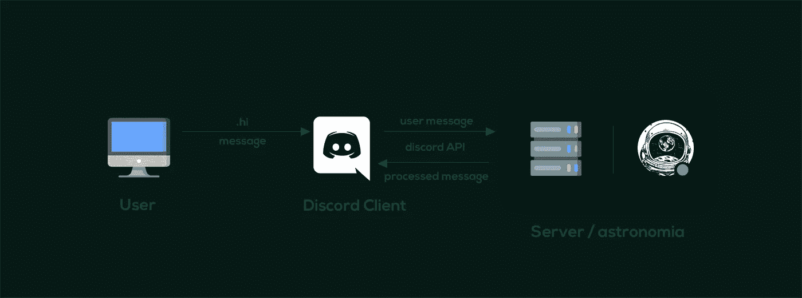
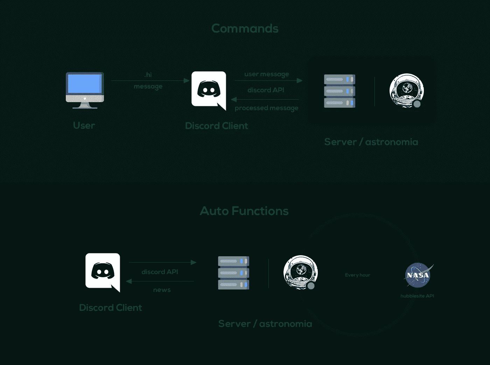

# 使用 discord.js 创建不和谐机器人

> 原文：<https://javascript.plainenglish.io/creating-a-discord-bot-with-discord-js-2f9f7a1a9d80?source=collection_archive---------3----------------------->

先说一下**天文学。** Astronomia 是一个不和谐机器人，可以提供新闻，给出天体信息，建议随机电影，等等。你可以去[这个站点](https://ayushman-git.github.io/astronomia-site/)探索它所有的命令。

astronomia 项目可能是我参与的最激动人心的项目。这是因为两个原因——首先，我要建立一些包括天文学在内的东西，而天文学总是让我兴奋不已；另一个原因是我可以在一个项目中使用如此多的技术。我使用了几个 API 来获取数据，如果没有 API，我就用**木偶师**来废弃数据。我还用 **Firestore** 做了一些很酷的东西，最后用 **discord.js** npm 模块与 discord 互动。我将谈论所有这些技术，以及它们是如何帮助我建造 astronomia 的。

# 什么是 discord.js？

在潜入 discord.js 之前，我先简单解释一下 **Discord** 。Discord 基本上是 slack，但面向游戏玩家，尽管它可以被任何想和朋友在网上闲逛的人使用。用户可以在文本频道中相互聊天，或者加入语音频道与其他成员交谈。

说完了，我们来说说 [**discord.js**](https://discord.js.org/#/) 。Discord.js 是一个与 discord API 交互的 npm 包。它基于事件驱动的架构，所以如果 discord 上的任何用户发送消息，该消息可以在 discord.js API 中被捕获。它不仅限于消息，我们可以捕捉几乎每一个活动，如-用户加入服务器，对消息的反应，文本频道的创建等等。如果机器人有适当的权限，也可以让它做服务器所有者能够做的任何事情(除了删除服务器)。

# 不和谐机器人是如何工作的？

让我们花一分钟来了解一个不和谐机器人是如何工作的。

因此，用户在 discord 客户机中输入一条消息，然后这条消息通过 discord API 被发送到我们的服务器，在那里我们的机器人被托管。然后，服务器根据用户发送的命令执行一些代码。

这里，我们将以**为例。嗨**指挥我们的机器人。每当用户键入**时。hi** is discord，discord API 发出一个事件，我们用它来捕捉—

第一个挑战是确定发送的信息是普通信息还是给**天文机器人**的命令。所以我写了一个条件，忽略所有不以**开头的东西。，**这是我挑的一个前缀。

在检测到它是针对机器人的命令后，我将消息分解为命令名和参数。**后的第一个字母“.”**被认为是一个命令，其后的所有内容都被转换成一个数组，作为命令的参数。

在检测到它是针对机器人的命令后，我将消息分解为命令名和参数。**后的第一个字母“.”**被认为是一个命令，其后的所有内容都被转换成一个数组，该数组将被用作命令的参数。

所以当用户输入**时。嗨，**在服务器端，机器人从我创建的数组中随机选择一个问候词，并通过 discord API 返回给用户。

如果从整体概念来看，并没有那么复杂。我正在识别用户发送的命令，并执行一个特定的函数，将处理后的消息返回。但是当 astronomia 没有用户请求的数据时会发生什么呢？当我们必须获取数据并发送给用户时，事情就变得有点复杂了。

# 获取数据

在上一节中，我们探索了一个简单的**。hi** command，老实说这没什么意思。在本节中，我们将讨论另外两个命令— **。探索**和 **.wallpaper.** 这些命令更容易理解。

**。浏览**命令带有一个参数。所以正确的语法应该是这样的— **。探索泰坦**，它将返回这个作为响应。

Here .e is a shorthand for .explore

这是怎么回事？实际上是一些事情。我们来分解一下。只要用户发送这个命令，机器人就会向太阳系 open data API 发出 GET 请求，这是一个包含太阳系天体数据的 API。在识别出 explore 命令后，astronomia 向 API 发送一个请求，API 返回关于 Titan 卫星的 JSON 数据。这个 JSON 数据看起来像这样。

它包含了很多很酷的东西，但是缺少了两样东西——一张泰坦的图片和一段简短的描述。为了添加这两个，我手动从互联网上收集了著名天体的图像和描述，包括所有八大行星、太阳和几个常见的卫星，并将它们存储在 JSON 文件中。

所以每当用户点击**。探索泰坦**命令，机器人从 API 获取数据，从 JSON 文件本地获取数据，并返回包含各种数据的正确消息。

到目前为止，我们只使用 API 来获取数据，但是当没有 API 或者使用 API 有一些限制时，我们应该做什么呢？我实现壁纸功能的时候就是这样。

有一些很棒的天文学壁纸，但是它们对 API 调用的请求有限，并且有一些 CORS 限制。所以我安装了 puppeteer，这是一个用 chrome 报废数据的 npm 包，并报废了所有与天文学相关的壁纸 URL。

这个小脚本使得收集 1200 多个壁纸网址成为可能。我们来破解一下上面的代码，以便更好的理解。

我正在导入 **fs** 模块，因为我将把获取的 URL 存储在一个文件中。第二个模块是**木偶师**，我在一个异步函数中使用它。必须在异步函数中使用木偶特性，因为它需要一些时间来完成像打开 chrome、打开 tab 等任务。

然后我用循环遍历每一页。在第 11 行和第 12 行，我启动了 chrome 并创建了一个新标签。之后，我将访问提供的 URL。

从第 20 行到第 26 行， **evaluate()** 函数返回该页面上壁纸的 URL，并将其存储在 **const result** 中。然后，我对 URL 进行了一些调整，以引导到正确的路径。最后，我使用 **fs.writeFile()** 将这些 Url 存储在 wallpaperUrl.js 文件中。现在我可以用这些 1200+的壁纸，发给用户了。

# 自动功能

我解释到现在的每个命令都是在用户输入某个命令后执行一段代码。但是对于像新闻更新这样的事情，应该定期执行一个函数。让我们来探索这些自动功能。

对于 **setInterval()** 函数，我正在传递一个回调函数。这个回调函数每小时向 [hubble 站点 API](http://hubblesite.org/api/documentation) 发出一个请求，在得到响应后，我会检查收到的 JSON 是否与 firestore DB 中存储的 JSON 相同。如果相同，那么函数将返回，不做任何其他事情。但是如果收到的 JSON 和 firestore 中的 JSON 有差异，它会处理这些数据并将其发送回 Discord。最后，firestore 中存储的 JSON 将被用 axios 获取的 JSON 替换。整个过程每 60 分钟重复一次，这就是用户获取最新新闻的方式。

# 结论

这只是一个开始，我计划扩大这个机器人，并添加许多新的命令和功能。如果你有一些想法，请与我分享。

这个想法是作为另一个为期一周的项目开始的。但是我不断回到它上面来添加新的功能或者改进现有的功能。这个项目帮助我探索未开发的领域，并帮助我面对现实世界的问题，如——当没有服务的 API 时，我们应该做什么，如何托管 Node.js 应用程序，等等。这个项目也有它的挑战，例如，我花了一整天的时间来弄清楚如何从 Goodreads 收集数据。

你可以访问这个 [**网站**](https://ayushman-git.github.io/astronomia-site/) 来探索更多关于这个机器人的信息，或者你可以[为这个项目贡献](https://github.com/ayushman-git/astronomia-bot)。如果你喜欢天文学，你会喜欢这个机器人。我将用我最喜欢的一句名言来结束这篇文章。

> ”“宇宙就是现在、过去或将来的一切。我们对宇宙最微弱的沉思会激起我们——脊柱发麻，声音颤抖，一种微弱的感觉，仿佛是遥远的记忆，或者从高处坠落。我们知道我们正在接近最大的秘密。”—卡尔·萨根

*更多内容请看*[*plain English . io*](http://plainenglish.io/)